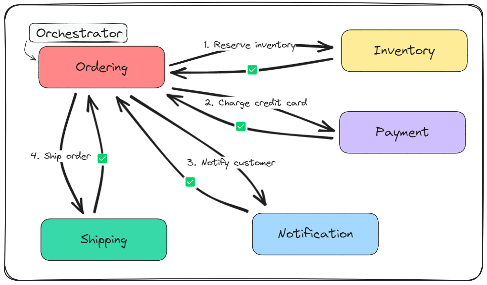
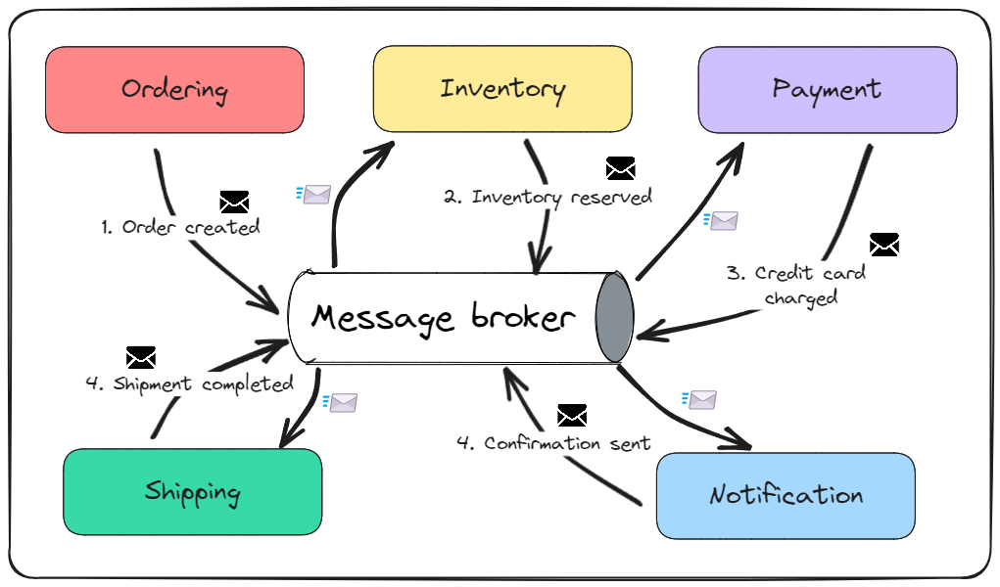

> 摘要
>
> Orchestration vs Choreography 这两个词在中文中没有一个固定的翻译。
> 在软件开发中，特别是在微服务架构的语境下，"orchestration" 和 "choreography" 这两个术语通常被翻译为：
>
> - **Orchestration**: 翻译为“编排”。在微服务编排中，通常有一个中心化的服务（如编排器）负责控制和管理多个服务的交互和工作流程。编排器定义了如何以及何时触发各个服务，以及它们之间的依赖关系。
> - **Choreography**: 翻译为“协同”或“协作”。在微服务协同中，没有中心化的控制者，各个服务相互独立，它们根据事件进行通信和响应。每个服务知道在接收到特定事件时需要执行的操作，并且能够独立发送事件到其他服务。
>
> 原文链接 [Orchestration vs Choreography](https://www.milanjovanovic.tech/blog/orchestration-vs-choreography?utm_source=Twitter&utm_medium=social&utm_campaign=08.04.2024)

在Dzone的一项调查中，超过63%的组织表示他们正在为部分或全部应用采用**微服务**。

随着越来越多的企业采用微服务架构，我们作为开发者必须在微服务通信方面变得更加熟练。

与**分布式系统**打交道既有趣又具挑战性。设计服务之间的**有效通信**是其中的一个挑战。

更多的集中化还是更少的集中化？更强的耦合还是更松的耦合？更多的控制还是更少的控制？

你需要回答的问题不止这些。

在本周的通讯中，我们将：

- 分析**编排与协同**
- 理解它们之间的关键差异和**权衡**
- 创建决定使用哪种方法的框架

让我们开始吧！

## 什么是微服务？

**微服务**是一种**软件架构**风格，其中应用程序由小型、自治的服务构建。每个微服务都有一个明确的目的，并且可以独立部署。

你可能已经知道这一点，所以这只是一个快速复习。

这里是微服务的关键原则：

- 独立开发
- 部署独立
- 技术自由
- 可伸缩性
- 弹性

一个重大挑战是在这个分布式环境内设计有效的服务间通信。

在单体系统内部，通信通过直接方法调用进行。这是一个直接的方法，在所有组件位于单一进程内时能很好地工作。然而，这对微服务来说并不适用。

## 编排 - 命令驱动的通信

**编排**是微服务通信的一种集中式方法。一个服务承担**编排器**的角色，协调服务之间的通信。

编排使用**命令驱动**通信。命令传达了动作的意图。发送者希望发生某事，而接收者不需要知道是谁发送的命令。

编排的一个例子可以是使用RabbitMQ实现的**Saga**。

它有一些不错的**优点**：

- 简单
- 集中化
- 容易排除故障
- 监控直接

**编排**通常比协同更**简单**地实施和维护。因为有一个中心协调器，你可以管理和监控服务交互。这反过来又改善了排除故障的过程，因为你知道在出问题时该看哪里。

编排的**弊端**包括：

- 紧密耦合
- 单点故障
- 添加、移除或替换微服务困难

## 协同 - 事件驱动的通信

**协同**是一种**去中心化**的通信方法。与使用命令的编排不同，协同使用**事件驱动**通信。

一个**事件**是过去发生的事情，是一个事实。发送者不知道谁会处理事件或者处理后会发生什么。

我在关于**发布领域事件**的通讯中深入讨论了事件。

协同最重要的**优点**是：

- 松耦合
- 易于维护
- 去中心化控制
- 异步通信

**协同**允许微服务**松散耦合**，这意味着它们可以独立且异步地操作。这使得系统更具可伸缩性和弹性。一个微服务的失败不一定会影响到微服务。

当然，协同也有**缺点**：

- 复杂性
- 监控困难
- 排故障困难

实施和维护比编排更加复杂。

从我的经验来看，有效的监控是最大的挑战。

## 两者的交汇点：你应该选择哪一个？

那么，你怎么知道该为你的系统选择哪一个呢？

我总是从我正在构建的系统的需求开始。然后，我看编排与协同的优缺点。这里有一个小框架帮助你决定。

**编排**在以下情况下表现突出：

- 你需要等待中间步骤的完成（如信用卡支付确认）
- 你需要对后续步骤做出条件选择
- 过程必须原子地进行（完全进行或完全不进行）
- 过程需要在一个地方集中监控

这也意味着你将需要一个中心数据库由编排器管理，来处理所有与工作流相关的状态。

**协同**在以下情况下表现最佳：

- 过程可以依赖于输入消息而无需额外上下文
- 步骤明确地一个接一个地跟随
- 进展朝一个方向进行

你可以从增加的灵活性中受益（例如对独立步骤进行修改）不幸的是，协同可能使得追踪、调试或监控由事件触发的过程变得困难。而且事件流越大，变得越挑战。

所以，在选择编排或协同之前要仔细思考。

这两种方法都带来了它们的优势但也有缺点。

## 结论

**编排**定义了每个微服务必须遵循的一系列步骤。这对于识别和解决复杂的服务相互依赖关系很有益处。另一个好处是，业务逻辑可以在一个地方管理和监控。

另一方面，**协同**是一种去中心化的微服务通信技术。每个服务可以独立操作，同时仍然是更大架构的一部分。

为了决定使用哪种方法，你应该观察你的系统并识别你将得到或失去什么。一切都是权衡。

我还想提到一个**替代方法**。

你可以选择一种**混合方法**，将编排和协同结合起来。

在**混合方法**中，你决定对特定的工作流使用哪种通信技术。有些工作流可以从编排中受益，而其他工作流可能更多地受益于协同。

---
