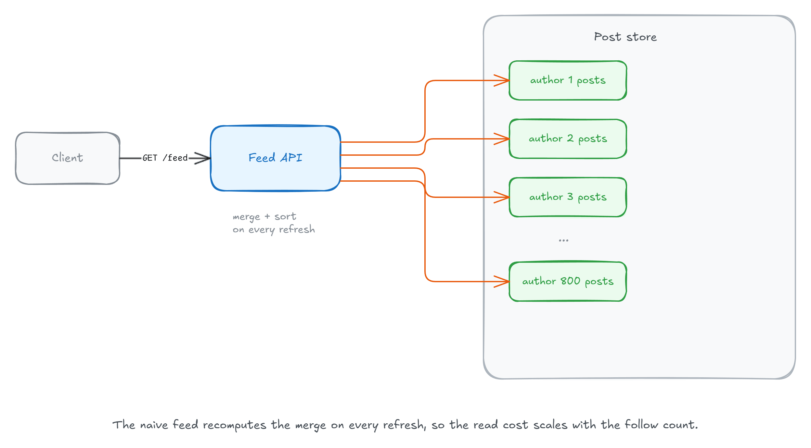
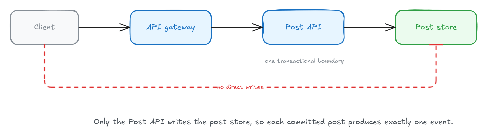
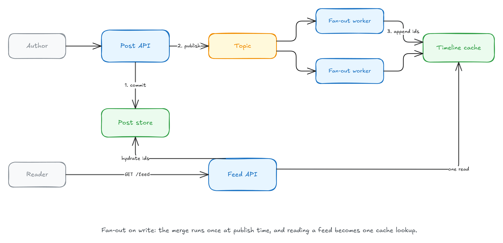
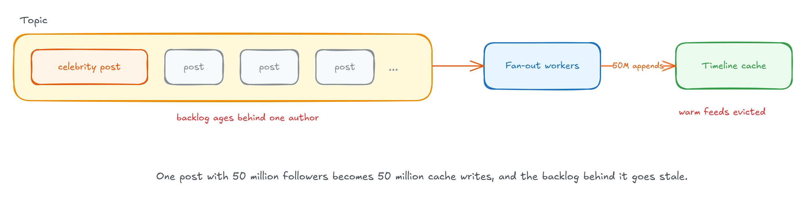
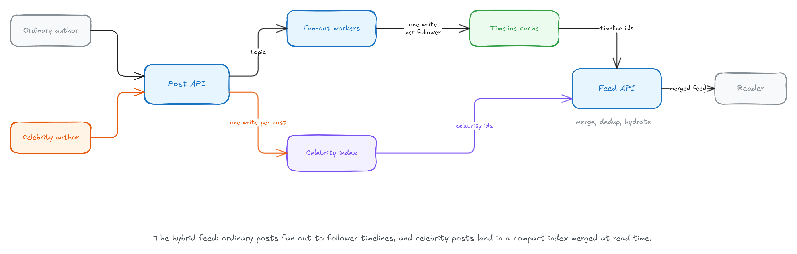
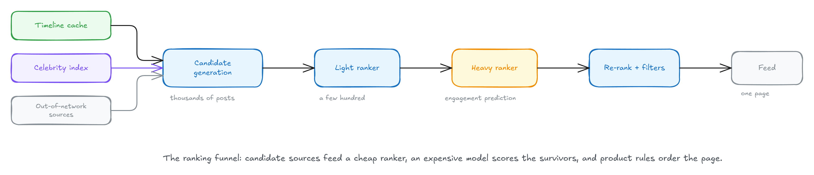
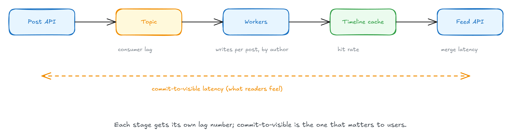

每个社交产品都有一个主页信息流，而且它看起来是产品里最简单的功能：把用户关注的每个账号最近的帖子拉出来，合并、按时间排序、返回第一页。一个下午就能上线。

但信息流是经典的系统设计题，原因在于：**明显能用的那个版本，把工作放在读时做；而在生产环境里活下来的那个版本，把工作放在写时做。** 两个版本的差别不是实现技巧，而是读和写之间的比例。这篇文章顺着这个思路，把从最天真的做法到混合架构的每一步推演一遍，每一步都说明它为什么坏、代价是什么。

适合做系统设计面试准备、正在设计或维护内容产品的后端开发者。读完你会得到一个可复述的演进链条，以及每一步背后的数字依据。

## 读时扇出：把信息流当成一条查询

最直接的做法在读取时算一切，这就是**读时扇出（fan-out on read）**。

信息流本质上是一条查询。用户打开 App 时，Feed API 对他关注的每一个账号的帖子现场执行合并。一个关注了 800 个账号的用户，一次页面浏览就变成一次 800 路的合并，而且要在任何内容渲染之前完成；下拉刷新又会把结果丢掉、重新跑一遍。

说句公道话，读时扇出并没有那么糟：如果 `(author_id, created_at)` 上有联合索引，这个合并就是一条在毫秒级返回的查询，而且它能撑到绝大多数产品一辈子都到不了的规模。如果你的用户只关注几百个账号、每秒只服务几百次信息流读取，**直接把查询发出去，然后继续干别的**。

问题出在比例上。Twitter 多年前公开过一组数字：每秒大约 30 万次主页时间线读取，对应每秒大约 5000 条新推文。**每 60 次读取才对应一次写入**——正是这个比例，才让把工作搬到写时这件事变得划算。

## 单一写入者：先修好写路径

在优化读取之前，写路径需要一个属性：**单一写入者（single writer）**。

公开流量进入 API 网关，而只有 Post API 写帖子存储，网关已经负责了鉴权。单一写入者买来的是一个事务边界：**提交一条帖子、记录它的事件，这两件事在同一个提交里按提交顺序原子地发生。**

如果把发布拆到两个服务里，你会得到两条没有共享顺序的事件流，一条删除可能抢在它要删的那条创建之前到达。单一写入者还给所有不变量一个唯一的家。

写时扇出依赖的就是这一点：**每一条已提交的帖子，恰好产生一个事件。**

## 写时扇出：把合并提前到发布那一刻

很多团队的第一个补救手段，是给每个用户缓存合并后的页面、设一个很短的 TTL。它确实能吸收重复刷新，但一条信息流缓存条目只服务一个用户，命中率取决于这个用户是否在窗口期内反复加载，而每次过期都会把完整的合并重新拉回来。

**写时扇出（fan-out on write）就是去掉了计时器的那个缓存：它靠写入保持正确，而不是靠过期重建，并且为每个粉丝预先生成，不管他后来有没有读过。**

当一个作者发布帖子时，流程是这样的：

1. Post API 把帖子提交到帖子存储。
2. 它把一个小的、不可变的事件发布到一个 topic：作者 id、帖子 id、时间戳。
3. 扇出 worker 消费事件，把作者展开成他的粉丝列表，把帖子 id 追加到每个粉丝的时间线——一条缓存里的、有上限的近期帖子 id 列表。
4. Feed API 用一次时间线查找 + 一次批量拉取，把 id 还原成帖子，就完成了一次信息流读取。

滚动超过上限之后，信息流回退到查询路径。几乎没人会滚到那里。

有五个决策让这个方案在生产里立得住：

- **存 id，不存帖子。** Twitter 把主页时间线限制在约 800 条，800 个 id 大约每个用户 10 KB：1 亿用户只占 1 TB 缓存。如果存完整的 2 KB 帖子文档，需要 160 TB。
- **在还原阶段执行策略。** 被删的帖子在还原时自然消失，屏蔽过滤在每次请求时执行，取关不需要清理——作者条目会随上限自然过期。
- **投影是可丢弃的。** 一条丢失的时间线可以靠读时那条查询从帖子存储重建，每个冷启动用户重建一次。隐患在于：一个缓存节点挂掉，会让它上面的所有用户同时冷启动，所以要限制重建并发，否则帖子存储会承接一次读风暴。
- **只有当帖子提交时才发布事件。** 提交之前发布，你会宣布不存在的帖子；提交之后发布，一次崩溃可能丢掉事件。Outbox 模式把两个缺口都堵上。
- **把扇出切块。** 竞争的消费者在帖子之间并行，而不是在一条帖子内部并行，于是一次大的展开被拆成粉丝区间的子任务，由多个 worker 分担。追加按帖子 id 幂等，所以重投递的块不会碰已经写好的东西。

代价是**最终一致性**。第一个注意到它的人是作者自己：他发布、刷新，自己的帖子还没出现。

修法是在信息流边缘做 read-your-own-writes：Feed API 在读取时把读者自己的近期帖子合并进来。至于粉丝晚几秒才看到帖子，那部分没人会注意到。

## 写放大：一条名人帖子变成五千万次写

写时扇出在第 3 步藏着一个乘数：**每一次发布，都要给每个粉丝写一次时间线。** 一个 300 粉丝的账号，一次发布就是 300 次小缓存追加，很便宜。

但粉丝数是幂律分布。一个 5000 万粉丝的账号发布一次，worker 现在欠缓存 5000 万次写入。

前面那个 60:1 的比例之所以让写时扇出划算，是因为写很少、每次追加也便宜。一条变成 5000 万次追加的帖子——其中大多数写进没人会打开的时间线——把这两个前提都打破了。连展开本身都很重：要从图存储里翻页出 5000 万行粉丝，才能知道往哪里写。

worker 在磨这些活的时候，其他所有人会遭遇两件事：

- **消费延迟。** 名人帖的切块把 worker 容量占住几分钟，积压变老，它后面的每一条信息流都在变旧。
- **缓存颠簸。** 为数千万大多不活跃的粉丝分配时间线条目，给缓存施压，热的时间线被逐出以腾位置。

在重新设计之前，有两个缓解手段。第一，只扇出给最近活跃的粉丝，休眠账号的时间线在下次访问时重建（那条可丢弃投影已经付过钱了）。第二，把最大的账号路由到专属队列，让普通帖子不必排在它们后面。

但这两种手段都没缩减工作量：最大的账号每发一条帖子仍欠下数百万次写入，缓存压力照样落下来。

## 混合扇出：两条路径各司其职

没有一种策略能同时服务幂律分布的两端。

普通作者保留写时扇出：粉丝集有界，写时的工作便宜，读取仍是一次查找。

名人作者切换到一种窄化的读时扇出：他们的帖子追加到一个紧凑的**名人索引**里，按作者为键，发布变成一次写入，与粉丝数无关。

读取时，Feed API 把用户已物化的时间线和其关注的名人索引里的近期候选合并，去重，再还原。用粉丝数阈值或成本模型决定一个作者走哪条路径。

Twitter 多年前公开描述过这套架构：主页时间线由扇出 worker 物化在 Redis 里，粉丝数最高的账号在读取时合并进来。

代价如下：

- **读取更复杂、更难预测。** 一个关注了很多名人账号的用户，每次翻页都要付出多次索引读取和更大的合并。
- **分页需要每个来源一个游标。** 时间线里合并停在哪，加上每个名人索引消费到的最后一个 id。每个来源从自己的位置恢复，才能让滚动到一半的帖子不重复、不消失。
- **阈值会抖动。** 涨粉可能让一条帖子同时出现在两个来源里，合并按帖子 id 去重。掉粉才是危险方向：只存在于索引里的帖子会从信息流里消失，除非你把它们回填进粉丝时间线，或者在一个宽限窗口内继续合并被降级的索引。

## 排序信息流：在管道上加一个漏斗

前面所有内容都假设**逆时间序**，也就是 Twitter 当年谈论的那种信息流。今天没有一个主流网络把它当默认。

排序信息流保留同一套管道，在读取路径上加一个漏斗：

- **候选生成。** 物化时间线和名人索引变成候选来源之一，再加入站外来源：你不关注的账号的帖子，靠嵌入相似度和图信号检索出来。
- **轻量排序。** 一个便宜模型把数千候选裁到几百，因为好模型太贵，不能跑在全部候选上。
- **重度排序。** 一个神经网络给每条候选打分，预测互动概率（点赞、回复、转发、停留时长），合成一个加权分数。
- **重排。** 产品规则最后上场：作者多样性、完整性过滤、屏蔽内容移除、广告位。

2023 年 Twitter 开源它的推荐算法时，就是这个形状：候选大约一半站内、一半站外，经过轻量排序器，漏斗进一个预测互动的神经网络「重度排序器」。

这些都不替代扇出机制。你物化的时间线还在，它只是变成若干候选来源之一，而合并变成打分的一个阶段。

## 运维这条管道：盯延迟，而不是错误率

这个系统大部分是异步的，所以运维它意味着盯**延迟**而不是错误率。

- **消费延迟。** 最老的未处理发布事件的年龄。这是第一个该报警的数字。
- **按作者统计的每条帖子的扇出写次数。** 按作者限流就作用在这个数字上。一个作者独占 worker 时间，说明名人阈值定错了。
- **提交到可见的延迟。** 从事务提交到帖子出现在粉丝时间线，按高百分位跟踪。第一个粉丝毫秒级看到，第 5000 万个才是关键数字。
- **信息流缓存命中率。** 命中率下降是缓存颠簸的早期症状。

## 总结

完整的演进链条：

- **读时扇出**：信息流是一条查询；直到读写比例把它变成产品里最贵的一条路径。
- **单一写入者**：一个事务边界，让每条已提交的帖子恰好产生一个事件。
- **写时扇出**：在发布时物化时间线；读取变成一次查找，投影保持可丢弃。
- **写放大**：一条名人帖子变成 5000 万次写入，其余所有人跟着买单。
- **混合扇出**：普通作者写时扇出，名人帖子放在紧凑索引里，由 Feed API 读取时合并进来。

这条链路的每一步都不是「正确答案」，而是对当时那个读写比例、粉丝分布和成本约束的回答。如果你在设计一个真实产品，先量出你的读写比和粉丝分布，再决定从哪一步开始——对绝大多数产品来说，读时扇出加一个联合索引，可能就已经够了。

---

关注 Aide Hub，我会持续分享 AI 助手、开发工具与软件工程实践。

## 参考

- [How Do You Build a Social Media Feed? (System Design) — Milan Jovanović](https://milanjovanovic.tech/blog/how-do-you-build-a-social-media-feed-system-design)
- [Twitter's Recommendation Algorithm](https://github.com/twitter/the-algorithm)
- [Redis](https://redis.io)
