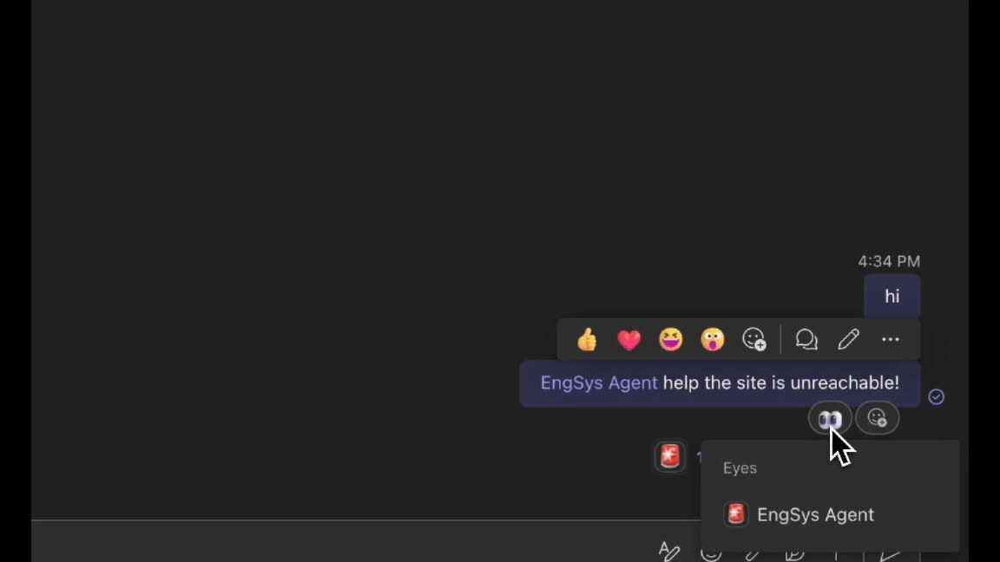
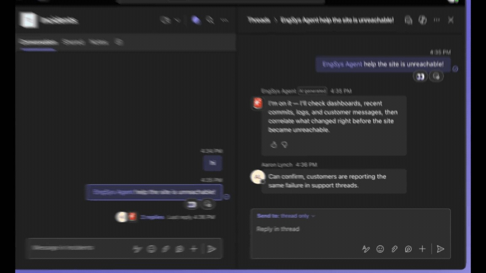
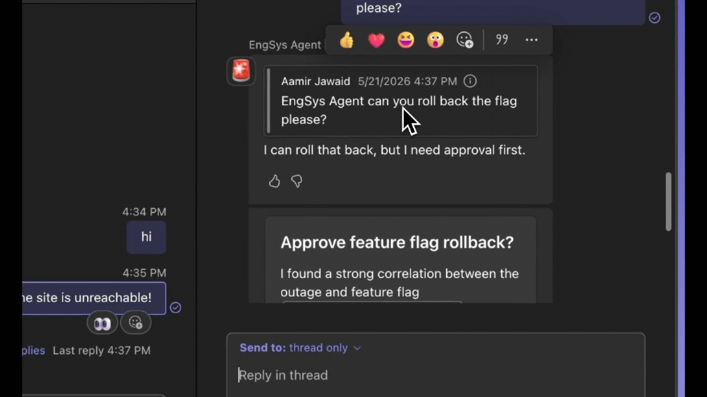

一对一地和一个 Agent 聊天，规则很简单：只有你和它，每一刻的意图都清楚。你可以追问、暂停、重来，不用考虑自己的每次交互会影响谁。

群聊协作是另一回事。每条消息都在争夺注意力，一条对某个人有帮助的回复，可能打断另外五个人的工作节奏。有效的协作建立在无数细小的社交判断上：什么时候说话、什么时候沉默、说多少、怎么用对话里的各种「装置」。Agent 加入这些空间后，光「理解并回应」不够——它必须参与，但不能让对话变得更难跟上。微软 365 开发者博客 2026 年 8 月的这篇文章给出了答案：emoji 反应（reactions）、线程回复（threaded replies）、引用回复（quoted replies），是 Teams 对话里 Agent 保持存在感又不添乱的三个关键能力。

适合：正在给 Teams 群聊或频道开发 Agent、关心协作体验的产品与工程同学。读完你会知道三种交互各自解决什么问题、什么时候用，以及用 Teams SDK 怎么写。

## 为什么 Agent 需要「轻」的交互方式

Agent 的默认交互模型只有一个：在对话里再发一条消息。但群协作经常需要更轻的东西——一次确认、一个被收拢的后续、一条锚定在原问题上的回应。

没有这三种能力时，Agent 只能用「说话」参与一切：每一次响应都变成主频道里的一条新消息。轻交互让 Agent 可以只确认、只跟进、只回答，而不假设每个动作都值得一条新消息。

## Emoji 反应：确认收到，不刷屏

很多时候一个 emoji 就够了。反应让 Agent 确认消息，而不用往对话里再塞一条回复。同事说「@Agent，拉一下最新的销售报告」，Agent 可以立刻回一个 👀 表示看到、开始处理；任务完成后再换成 ✅。状态清楚，对话保持安静。

```ts
app.on("message", async ({ api, activity }) => {
  // React to the user's incoming message with
  await api.conversations.addReaction(
    activity.conversation.id,
    activity.id,
    "like"
  );

  // ...and later remove it
  await api.conversations.deleteReaction(
    activity.conversation.id,
    activity.id,
    "like"
  );

  return;
});
```



「先 👀 后 ✅」是两个反应构成的最小状态机：收到、完成。它不需要文字，也不产生新的消息气泡。适合高频、短任务：拉报告、查状态、发起一个很快能回来的调用。

## 线程回复：把讨论收进侧边

频道里，线程往往是继续讨论的正确位置：把讨论收拢，而不是拖着整个频道走。有人在频道里发起一次代码评审，Agent 把发现回复在线程里，主频道保持干净。关心的人展开线程看细节，其余人直接滑过去。

```ts
app.on("message", async ({ reply }) => {
  // reply() sends a response to right thread automatically
  await reply("This is a threaded reply to your message.");
  return;
});
```



注意 `reply()` 的语义：它自动把响应发到正确线程。当对话预计会展开成多条往来（评审、讨论、排查）时，线程是比主频道更合适的地方。

## 引用回复：把回答锚回原来的问题

想让一条更早的消息回到焦点里，就引用它，让所有人都知道你在回应什么。Agent 也一样：有人十条消息之前问了个问题，Agent 引用那条消息直接回答，对话继续向前，没人需要问「你在回谁？」

引用对异步任务尤其有用。你让 Agent 跟进一个事故，然后就去忙别的，Agent 花几个小时完成任务。等它回来时，无论对话已经聊到哪，引用回复都能把答案系回原始消息。

```ts
app.on("message", async ({ quote, send }) => {
  const sent = await send("The meeting has been moved to 3 PM tomorrow.");
  await quote(
    sent.id,
    "Just to confirm — does the new time work for everyone?"
  );
  return;
});
```



跨时间的对话最难追踪。引用是给回答加上坐标：它回应的是哪一条、在哪个上下文里。

## 什么时候用哪种

三种交互的适用场景可以这么记：

- **emoji 反应**：只需要确认或更新状态，不需要内容。目标是把「我在处理」「我做完了」说清楚，同时保持安静。
- **线程回复**：需要多条往来，或者话题只对一部分人重要。把讨论收进线程，让主频道继续流动。
- **引用回复**：回应一条更早的消息，尤其是异步任务完成时。回答必须锚回问题，否则读者要自己翻历史。

反过来，如果回答本身就需要被所有人立刻看到——比如频道里的重要公告——那一条普通消息就是对的。轻交互不是越少说话越好，是让「说话」的分量变大。

## 好的协作 Agent 不是回应最多的那个

这些模式之所以重要，是因为它们给了 Agent 不只一种贡献方式，同时镜像我们每天都在用的对话习惯。设计共享空间里的 Agent，不只是让它更能干，而是帮它带着社交线索参与。

文章给了一句值得贴在墙上的判断：最好的协作 Agent，不是回应最多的，而是知道何时、如何回应的。你可以用 Teams SDK 和 coding agent skill 从今天开始把这些交互模式做进自己的 Agent；想看成套演示，可以看 Build 大会的 session「Build agents where work happens: chats, channels, and meetings in Microsoft Teams」。

Aide Hub 持续分享 AI 助手、开发工具与软件工程实践。如果你的 Agent 也正打算进入群聊，建议先从 emoji 反应做起——它实现最简单，对协作体验的改善却最直接。

## 参考

- [Building Agents for Teams: Managing the noise of collaboration（原文，Lily Du，Microsoft 365 Developer Blog）](https://devblogs.microsoft.com/microsoft365dev/building-agents-for-teams-managing-the-noise-of-collaboration/)
- [Teams SDK 欢迎页 | Microsoft Learn](https://learn.microsoft.com/microsoftteams/platform/teams-sdk/welcome)
- [Teams SDK coding agent skill | Microsoft Learn](https://learn.microsoft.com/microsoftteams/platform/teams-sdk/developer-tools/agent-skills)
- [ConversationClient class（addReaction / deleteReaction）| Teams SDK TypeScript API](https://learn.microsoft.com/en-us/javascript/api/teams-sdk-typescript/@microsoft/teams.api/conversationclient)
- [Build agents where work happens: chats, channels, and meetings in Microsoft Teams | Microsoft Build](https://build.microsoft.com/sessions/DEM334)
