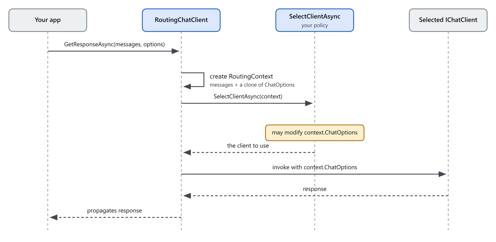
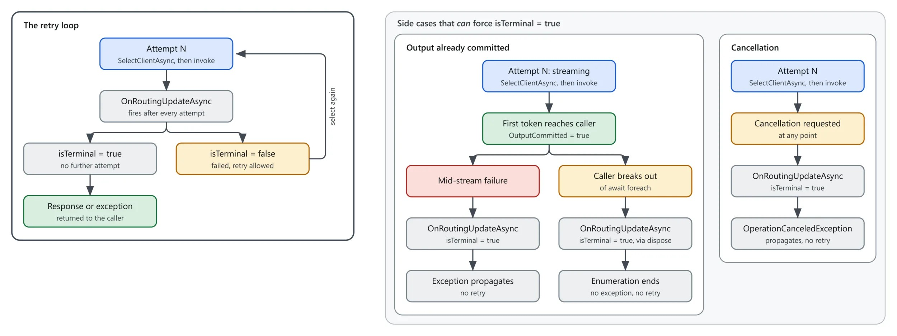

AI 应用一旦规模化，成本、可用性、延迟就变成架构层面的一等约束。在模型或供应商之间做路由，是同时调节这三者的一个杠杆：简单的请求走便宜模型，复杂的走强模型；一个供应商挂了，请求自动落到下一个。

Microsoft.Extensions.AI 10.9.0 把这套能力做成了四个新的实验性原语，全部是 `IChatClient` 实现，可以像普通中间件一样组合：按消息内容路由、供应商故障时转移，或者在这些抽象上实现你自己的策略。

- **RoutingChatClient**：基类，一个按请求选择客户端并转发的 `IChatClient`
- **SemanticRoutingChatClient**：按内容路由，用 embedding 相似度匹配应用提供的示例话语
- **FailoverChatClient**：抽象类，在输出提交之前失败时重新选择并重试
- **OrderedFailoverChatClient**：开箱即用的实现，按顺序走客户端列表

适合：用 .NET 写 AI 应用、想控制模型成本与可用性、或者打算做多供应商容灾的开发者。读完你会知道四个原语各自解决什么问题、关键选项怎么调、粘性路由的完整实现，以及它们不擅长什么。



## RoutingChatClient：每个请求选一次客户端

`RoutingChatClient` 是抽象类，每个请求调用 `SelectClientAsync` 选一个客户端，转发调用并回传响应。最简单的用法是 `RoutingChatClient.Create`，传一个回调：

```csharp
var router = RoutingChatClient.Create((context, ct) =>
    new(isComplexRequest(context) ? powerfulClient : cheapClient));
```

需要状态或更复杂的策略时，继承并重写 `SelectClientAsync`：

```csharp
class MyRouter : RoutingChatClient
{
    protected override ValueTask<IChatClient> SelectClientAsync(
        RoutingContext context, CancellationToken ct)
    {
        // ...
    }
}
```

每次 `GetResponseAsync` 或 `GetStreamingResponseAsync` 调用都会创建一个 `RoutingContext`，里面是请求消息和 `ChatOptions` 的一份克隆。调用者自己的 options 对象永远不会被直接交给客户端，调用开始后对它的修改也不会被观察到。

这把选项整形分成两层：

- **请求级选项**放在 `context.ChatOptions` 上。修改在整个请求期间生效，包括失败后的后续尝试。
- **路由级选项**属于客户端本身，通常用一个 `ConfigureOptionsChatClient` 包装器：克隆请求选项，再把自己的值盖上去。

## SemanticRoutingChatClient：按语义路由

灵感来自 Aurelio Labs 的 semantic router。每个客户端配一组示例话语，运行时把最后一条用户消息做 embedding，和这些话语比较相似度：得分最高且超过阈值的客户端胜出；都不够格，就用配置的 `defaultClient`。

```csharp
var router = new SemanticRoutingChatClient(
    embeddingGenerator,
    clientProfiles: new Dictionary<IChatClient, IReadOnlyList<string>>
    {
        [codingClient] = ["write code", "fix this bug", "refactor this function"],
        [creativeClient] = ["write a story", "brainstorm names", "generate a poem"],
    },
    defaultClient: generalClient,
    scoreThreshold: 0.3f);
```

Profile 的 embedding 惰性生成并缓存：第一次路由请求把所有示例话语一次性批量嵌入并保留向量，之后的请求只需嵌入新消息再比较。

关键选项：

- `scoreThreshold`：选中某个 profile 客户端的最低得分，达不到就去 `defaultClient`
- `topK`：每个请求聚合得分时考虑多少个最匹配的话语，默认 1
- `scoreAggregation`：对 top-K 匹配取 `Mean` 或 `Sum`，影响阈值取值的含义
- `leaveOpen`：默认该客户端拥有并释放所有 clients 和 embedding generator，传 `true` 退出

一个不错的起点是 `topK: 5` 配 `Mean` 聚合——Aurelio Labs 的默认。对多个匹配取平均比押注单个最近邻稳得多，单个匹配可能因为一次幸运的措辞而摇摆；`Mean` 也把得分保持在 -1 到 1 的同一尺度上，所以 `0.3` 的阈值无论 `topK` 是多少含义都一样。记得给每个客户端准备足够的话语，让 5 个匹配真的可用。

## 别在每一轮都独立路由

两个现实约束：

- 推理模型常常把 reasoning 作为 provider 专属的不透明产物返回：需要 provider 自己才能继续的加密内容，或绑定其会话的续接 token。对话中途换 provider，这些就断了。
- 换到新 provider（或同 provider 的新模型）意味着全新 prompt，没有热的缓存可用——每次切换都要重付前缀的全部计算成本。

如果一段对话会稳定留在同一个分类上，就一次性决定并保持（见下面的粘性选择），而不是每轮重新路由。

## FailoverChatClient：失败后重试

`FailoverChatClient` 在 `RoutingChatClient` 上加了一个重试循环：当被选中的客户端在**任何流式输出暴露给调用者之前**失败，就再次调用 `SelectClientAsync` 重试。输出一旦开始流向调用者，失败就是终态的——没有中途恢复。非流式响应更简单：没有半途提交的输出，一次尝试要么返回响应要么直接失败。

派生类实现 `SelectClientAsync` 提供下一个客户端，并重写 `OnRoutingUpdateAsync` 观察每次尝试。每次客户端调用之后（成功、失败或被放弃）都会触发一次更新，携带一个 `FailoverChatClientAttempt`：

- `Client`（IChatClient）：被调用的客户端
- `Duration`（TimeSpan）：实际调用客户端花的时间（流式下不含调用方处理时间）
- `Exception`（Exception?）：观察到的异常
- `ResponseCompleted`（bool）：响应是否成功完成
- `OutputCommitted`（bool）：是否有流式更新到达调用者
- `TimeToFirstUpdate`（TimeSpan?）：首次流式更新的耗时（如适用）

`Duration` 和 `TimeToFirstUpdate` 可以用于跟踪供应商表现：给慢供应商熔断、按历史延迟给候选打分、或喂给可观测性管道。这个钩子每次尝试都会触发，不只失败时，所以数据里也有成功样本。

伴随的 `isTerminal` 标志告诉你这次更新返回后基类是否还会再选：非终态更新意味着这次失败了、后面还有重试，你在重写里做的状态修改对下一次 `SelectClientAsync` 可见。

自己代码里的异常会直接终结请求且不报告：`SelectClientAsync` 抛异常，不会为它触发更新；`OnRoutingUpdateAsync` 在非终态更新里抛异常，不会再有重试、也不会再触发更新。两种情况都没有清理回调，所以抛异常前要释放掉所有 per-request 状态。

`MaximumAttemptsPerRequest` 限制每个请求的总调用次数；请求的取消令牌一旦取消，就不再重选。



## OrderedFailoverChatClient：按序转移

这是立即可用的 `FailoverChatClient` 实现。传一个排好序的客户端列表，它按顺序走：第一个失败试第二个，以此类推。全部失败时重抛最后一个异常。

```csharp
var failover = new OrderedFailoverChatClient([primaryClient, backupClient, lastResortClient]);
```

同一个客户端可以出现多次，每个位置都会被调用一次。`MaximumAttemptsPerRequest` 可以截断列表，不想每次失败都把所有选项耗光时有用。默认它拥有并释放这些客户端，传 `leaveOpen: true` 退出。

每次请求都会新建一个 `RoutingContext`，所以它可以当请求作用域的 key：在 `SelectClientAsync` 和 `OnRoutingUpdateAsync` 之间共享状态，不用自己发明请求 ID——不管是客户端下标、尝试计数，还是下面粘性选择里的路由名。

## 在基元之上构建

四个内置类型覆盖常见场景，但自定义 router 还可以管理应用状态，或把同一个模型的多种配置当作不同路由。

### 粘性选择：一个会话一个路由

你可能想用 `ChatOptions.ConversationId` 做粘性路由的 key——但它属于 provider 的有状态会话，可能无法转移到另一个客户端。应该用应用自有的 session ID。

给路由命名，通过 `ChatOptions.AdditionalProperties` 传 session ID，把选中的路由名存进 `IDistributedCache`（比如 Redis）：

```csharp
var routes = new Dictionary<string, IChatClient>
{
    ["fast"] = fastClient,
    ["deep"] = deepClient,
};

var options = new ChatOptions
{
    AdditionalProperties = new() { ["routing-session-id"] = sessionId },
};
```

```csharp
class StickyRouter : FailoverChatClient
{
    private readonly IReadOnlyDictionary<string, IChatClient> _routes;
    private readonly ConcurrentDictionary<RoutingContext, string> _pending = new();
    private readonly IDistributedCache _cache;

    public StickyRouter(IReadOnlyDictionary<string, IChatClient> routes, IDistributedCache cache)
    {
        _routes = routes.ToDictionary(r => r.Key, r => r.Value);
        _cache = cache;
        MaximumAttemptsPerRequest = 1;
    }

    protected override async ValueTask<IChatClient> SelectClientAsync(
        RoutingContext context, CancellationToken ct)
    {
        string route = await _cache.GetStringAsync(CacheKey(context), ct) ?? Classify(context);
        _pending[context] = route;
        return _routes[route];
    }

    protected override async ValueTask OnRoutingUpdateAsync(
        RoutingContext context, FailoverChatClientAttempt attempt, bool isTerminal, CancellationToken ct)
    {
        if (_pending.TryRemove(context, out string? route) && attempt.ResponseCompleted)
        {
            await _cache.SetStringAsync(CacheKey(context), route, ct);
        }
    }

    private static string CacheKey(RoutingContext context) =>
        context.ChatOptions?.AdditionalProperties?.TryGetValue("routing-session-id", out string? id) == true
            ? $"chat-route:{id}"
            : throw new InvalidOperationException("A routing session ID is required.");
}
```

几个设计细节值得注意：

- `Classify` 返回路由名而不是客户端，所以缓存、分类器、写入三方都用同一个字符串，`_routes` 只在出口转换一次。它只在会话的第一个请求运行——这就是 embedding 调用在首请求可承受的原因。
- 只有响应完成后才「钉住」路由：第一轮就失败的客户端永远不会粘到会话上。调用者提前跳出枚举也一样——`ResponseCompleted` 保持 false，什么都不写。
- 为了拿到完成跟踪，这个 router 继承 `FailoverChatClient` 再用 `MaximumAttemptsPerRequest = 1` 关掉重试。作者自己承认：观察尝试就必须继承重试机制再禁用，把两者拆开才能独立组合，是值得做的未来改进。

### 同一模型，多个推理档位

保持单一模型、变化推理强度，是既路由又保住 prompt 缓存的有效方式。一个模型支持多个推理档位时，按档位包一次，在包装之间路由：

```csharp
IChatClient lowEffort = baseClient.AsBuilder()
    .ConfigureOptions(options =>
        options.Reasoning = new ReasoningOptions { Effort = ReasoningEffort.Low })
    .Build();

IChatClient highEffort = baseClient.AsBuilder()
    .ConfigureOptions(options =>
        options.Reasoning = new ReasoningOptions { Effort = ReasoningEffort.High })
    .Build();

var router = RoutingChatClient.Create((context, ct) =>
    new(isComplexRequest(context) ? highEffort : lowEffort));
```

每个包装都是独立的 `IChatClient`，路由策略可以分别跟踪低档和高档的使用。

### 值得探索的其他模式

- **延迟与健康感知路由**：用 `Duration`、`TimeToFirstUpdate` 和失败记录给客户端按实测表现排序。新客户端在积累足够线上数据前需要种子估算或独立探针。
- **熔断与冷却**：反复失败后把不健康的客户端移出选择，延迟后再测恢复。恢复窗口取决于失败类型：超时可能几秒就好，认证失败可能需要人工介入。
- **成本感知路由**：常规请求优先便宜候选，把贵模型留给难活，或按会话/租户执行预算。
- **能力感知路由**：按需求（视觉、工具调用、结构化输出、上下文长度）在选择前过滤客户端。
- **区域路由**：就近部署降低网络延迟，或选择满足数据驻留要求的区域。
- **路由组合**：每个 router 都是 `IChatClient`，成本或能力感知的 router 可以放进故障转移链里，`OnRoutingUpdateAsync` 记录每次尝试。

## 边界：RoutingChatClient 不适合什么

它总是在调用任何东西之前完成选择：每个请求预先选一个客户端。这把几种路由范式排除在外——它们在 Microsoft.Extensions.AI 里不是做不到，只是不是 RoutingChatClient 的职责：

- **模型级联**：`FailoverChatClient` 只在失败时重选，不会因为成功响应达不到质量阈值而升级。
- **集成路由**：扇出到多个客户端再合并或投票，需要一个能调用多个客户端的实现。
- **Hedging**：并行竞速多个客户端取最快响应，用额外成本换更低尾延迟——同样需要扇出。

router 在管道里的位置也重要。选择每个请求只发生一次，所以包在 `FunctionInvokingChatClient` 外面的 router，会在工具调用循环的每一轮都保持同一个客户端。想让初始推理走强模型、工具结果轮走便宜模型，就要把 router 放在 `FunctionInvokingChatClient` **里面**，而不是外面。

## 开始使用

`RoutingChatClient`、`RoutingContext`、`FailoverChatClient`、`FailoverChatClientAttempt`、`OrderedFailoverChatClient` 和 `SemanticRoutingChatClient` 都随 Microsoft.Extensions.AI 10.9.0 发布，全部标记 `[Experimental]`，诊断 ID `MEAI001`。

```bash
dotnet add package Microsoft.Extensions.AI
```

团队正在征集反馈，重点是：故障转移的重试与次数限制行为、`OnRoutingUpdateAsync` 每次尝试报告什么、框架跟踪多少状态而留给应用多少、语义路由的打分默认值与聚合选项，以及每次尝试的选项整形是否应该在不换客户端的情况下也可表达。用上了就带着问题去 dotnet/extensions 提 issue 或开讨论。

## 小结

路由与故障转移把成本、可用性、延迟三件事压进了一个 `IChatClient` 抽象：选择一次、失败重选、按序降级，全部可以叠加组合。最值得记住的三个判断：会话级的决定要一次做好（粘性），不要每轮独立路由；输出一旦开始流式返回，失败就不可恢复；router 的位置决定工具循环里是同一个客户端还是可以换档。

这四个类型还是实验性的，API 形状可能变化。想先上手，从 `RoutingChatClient.Create` 加一个 `OrderedFailoverChatClient` 开始，再按需要换成语义路由或你自己的策略。原文作者还提供了一个 Routing CLI Sample 参考实现。

Aide Hub 持续分享 AI 助手、开发工具与软件工程实践。如果你正在给 .NET 应用接多模型或做容灾，建议先小范围验证语义路由的阈值，再推广到生产。

## 参考

- [Routing and Failover for Microsoft.Extensions.AI（原文，Joshua Yue，.NET Blog）](https://devblogs.microsoft.com/dotnet/routing-and-failover-for-microsoft-extensions-ai/)
- [dotnet/extensions#7662：引入这些类型的 PR](https://github.com/dotnet/extensions/pull/7662)
- [Microsoft.Extensions.AI 文档 | Microsoft Learn](https://learn.microsoft.com/dotnet/ai/microsoft-extensions-ai)
- [dotnet/extensions | GitHub](https://github.com/dotnet/extensions)
- [Routing CLI Sample | GitHub](https://github.com/joshuajyue/routing-cli-sample)
- [Aurelio Labs semantic router | GitHub](https://github.com/aurelio-labs/semantic-router)
