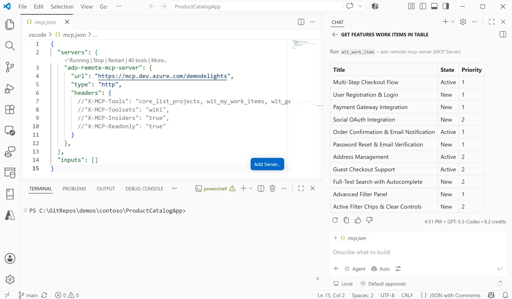
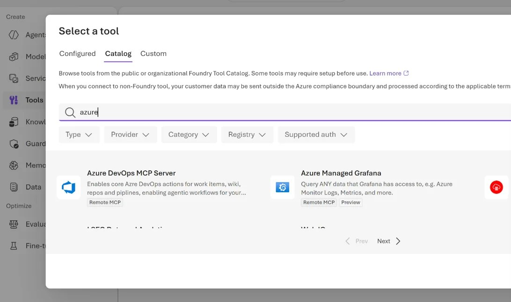
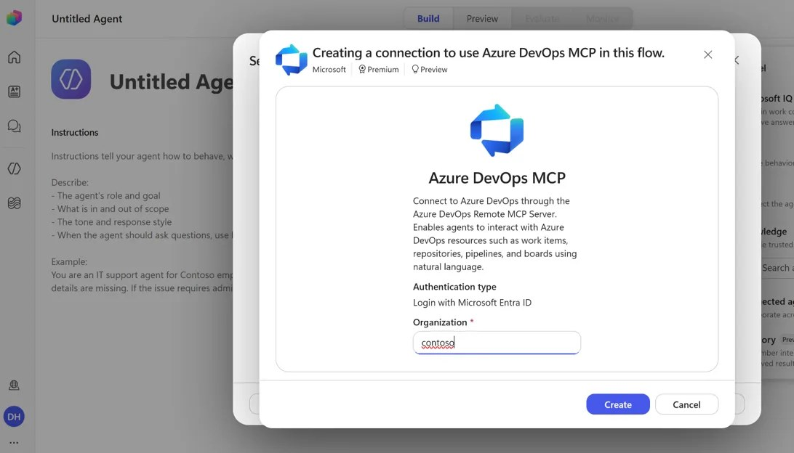

2026 年 8 月 6 日，Azure DevOps 团队宣布 Azure DevOps MCP Server 正式全面可用（GA）——这次是远程托管版本。

Azure DevOps MCP Server 让 AI 助手安全、带上下文地访问你的 Azure DevOps 项目，帮你规划、构建和交付软件。远程版的价值在于零部署：不用自己安装或托管任何东西，AI 助手通过 streamable HTTP 直接连接 Azure DevOps 托管的端点，几分钟内就能开始读写项目。

适合：正在用 Azure DevOps 管理研发、并希望 Copilot/Claude 等助手能直接查工作项、PR、仓库和流水线的团队。读完你会知道怎么配置、哪些客户端现在就能用、认证要求是什么，以及什么时候应该继续用本地版。

## 一分钟上手

配置很简单。根据你用的工具，在 `mcp.json` 里加上下面这段服务器信息即可：

```json
{
  "servers": {
    "ado-remote-mcp": {
      "url": "https://mcp.dev.azure.com/{organization}",
      "type": "http"
    }
  },
  "inputs": []
}
```

把 `{organization}` 换成你的组织名。更多配置选项见官方文档。

## 支持的客户端与服务

远程 MCP Server 由 Azure DevOps 服务托管，使用 Microsoft Entra 认证。正因为依赖 Entra，它遵循平台的认证要求：**你的 Azure DevOps 组织必须由 Microsoft Entra 租户支撑**，使用微软账户（MSA）的独立组织不受支持。

能否接入取决于客户端能否与 Microsoft Entra 完成认证。当前情况：

- **Claude Desktop、Claude Code、ChatGPT、Cursor 等客户端**：需要 Microsoft Entra 支持动态 OAuth 客户端注册或 client ID Metadata 文档，团队正在与 Microsoft Entra 团队合作推进。在那之前，这些客户端的用户请继续使用本地 Azure DevOps MCP Server。
- **今天无需任何额外配置即可使用的客户端**：

### Visual Studio Code + GitHub Copilot

在 VS Code 里用 GitHub Copilot 搭配 Azure DevOps MCP Server，Copilot 可以安全访问你的 Azure DevOps 项目，理解工作项、拉取请求、仓库和流水线。有了这些上下文，它能给出更相关的回答、自动完成常见任务，让你不用离开编辑器。



### Microsoft Foundry（AI Foundry）

Foundry 是微软面向构建、评估和管理 AI 应用与代理的端到端平台，支持基础模型、企业数据和集成开发工具。在 Foundry 里，你可以从工具目录连接到 Azure DevOps 的所有工具。



### Microsoft Copilot Studio

Copilot Studio 是微软的低代码平台，用于构建、定制和部署 AI 代理与 copilot。组织可以用它创建连接企业数据、自动化业务流程、集成 Microsoft 365 与外部服务的对话体验。现在可以把你的 AI 代理连接到 Azure DevOps。



### 其他

远程 MCP Server 还支持 Visual Studio、GitHub Copilot CLI 和 GitHub Copilot app 等客户端。

## 本地 MCP Server 仍然保留

虽然官方建议尽可能使用远程版，但使用尚未支持客户端的用户仍可继续使用本地 Azure DevOps MCP Server（开源，microsoft/azure-devops-mcp）。

团队承诺保持本地版与远程版的功能对齐——实际上他们刚刚完成了一次本地版工具集的整合，使其与远程版保持一致。在与 Entra 团队完成客户端注册能力之前，本地版会持续获得支持和维护。

## 怎么选：远程还是本地

- **用 VS Code + Copilot、Foundry、Copilot Studio、Visual Studio 或 Copilot CLI**：直接上远程版，零运维。
- **用 Claude Desktop / Claude Code / ChatGPT / Cursor**：暂时用本地版，等 Entra 动态 OAuth 客户端注册能力落地后再切换。
- **组织不是 Entra 背书（纯 MSA）**：远程版不可用，只能本地版。

一个值得注意的取舍：远程版的认证完全交给 Entra，这意味着安全策略（条件访问、MFA、设备合规）天然继承企业现有体系；本地版则把认证和网络暴露问题留在你自己这边。选择时把组织现有的身份治理体系当成决策因素，而不只是「哪个装起来快」。

## 小结

远程 MCP Server 的 GA 把 Azure DevOps 的接入成本压到了「一行配置」：不用装、不用托管、不用管 PAT 和构建会话令牌，认证直接复用 Entra。对已经在微软生态里做研发管理的团队，这是一个值得立刻尝试的入口——尤其是 VS Code + Copilot 和 Foundry 的用户。

接下来值得关注两件事：Entra 动态客户端注册落地后 Claude/ChatGPT/Cursor 的接入，以及远程版与本地版后续的功能演进。想先验证价值，在 mcp.json 里加上那一段配置，让 Copilot 帮你查一个工作项或 PR，就能感受到差别。

Aide Hub 持续分享 AI 助手、开发工具与软件工程实践。如果你所在团队已经用上远程 MCP Server，欢迎分享实际体验；还在观望的，可以从 VS Code + Copilot 的最小验证开始。

## 参考

- [Azure DevOps Remote MCP Server is generally available（原文，Azure DevOps Blog）](https://devblogs.microsoft.com/devops/azure-devops-remote-mcp-server-ga/)
- [Azure DevOps remote MCP Server 官方文档 | Microsoft Learn](https://learn.microsoft.com/en-us/azure/devops/mcp-server/remote-mcp-server)
- [microsoft/azure-devops-mcp（本地 MCP Server）| GitHub](https://github.com/microsoft/azure-devops-mcp)
