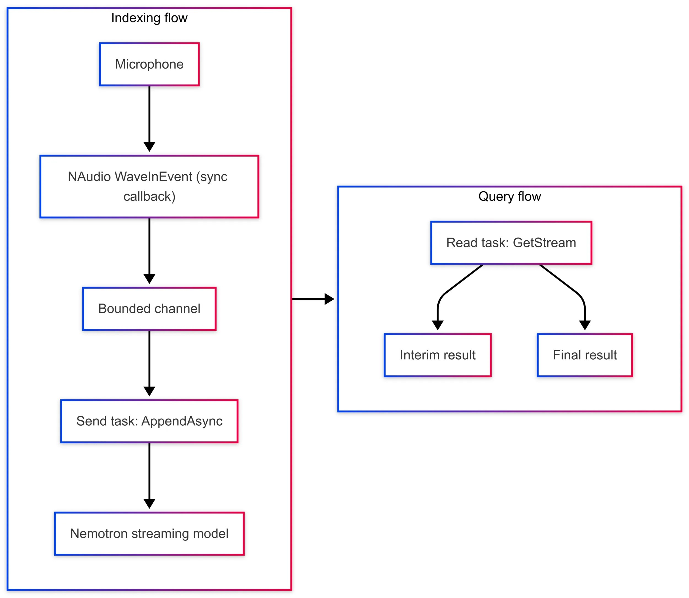

一年前，Bruno Capuano 在 .NET Blog 上写过一篇用 Ollama 在本地跑 GPT-OSS 的文章，用的是 Microsoft.Extensions.AI 的 `IChatClient`——本地 AI 最常见也最熟悉的场景：聊天。但本地 AI 不止于让一个小模型写诗或总结文档。

Foundry Local 同样能跑语音识别这类专用模型，而且它替你管理完整的模型生命周期：找合适的模型变体、需要时下载、放进本地缓存、加载推理、应用结束时卸载。这篇 2026 年 8 月的文章带我们构建一个 C# 控制台应用：用 NVIDIA 0.6B 的 Nemotron 语音模型实时转录麦克风音频。模型完全在本地运行，你说话的同时就能收到部分和最终转录结果。

适合：想在 Windows 上做本地语音识别、离线字幕、会议笔记或语音控制应用的 .NET 开发者。读完你会得到一个可运行的示例：模型解析与下载、直播转录会话、音频采集与异步结果流，全程不需要 API key。

## 抽象优先，原生能力兜底

上一篇 Ollama 示例里，`IChatClient` 抽象让聊天代码可以对接不同 AI 提供商而不改核心逻辑。实时音频流稍有不同：本示例用的 `AudioClient` 属于原生 `Microsoft.AI.Foundry.Local` SDK，不是 `Microsoft.Extensions.AI` 抽象——因为直播转录会话、原始 PCM 流和中间结果都是 Foundry Local 特有的能力。

这给 .NET AI 应用提供了一个有用的模式：

- 场景匹配时，用 `Microsoft.Extensions.AI` 抽象；
- 需要特定提供商能力时，直接用提供商 SDK。

两种方式互补，不是二选一。

## 我们要构建什么

应用的流程很直接：

- 初始化 Foundry Local，从目录中解析一个语音模型
- 下载并加载模型
- 创建直播转录会话
- 以 16 kHz、16 位、单声道 PCM 采集麦克风音频
- 把音频流送给模型，打印中间结果与最终结果



示例面向 .NET 10，使用：

- `Microsoft.AI.Foundry.Local.WinML`（Foundry Local 的 Windows ML 实现）
- `NAudio`（麦克风采集）
- `nemotron-speech-streaming-en-0.6b`（Foundry Local 目录里的英文流式 ASR 模型）

**重要：本示例仅限 Windows。** `Microsoft.AI.Foundry.Local.WinML` 依赖 Windows ML，`NAudio.WaveInEvent` 使用 Windows 音频 API。

完整可运行代码在 microsoft/Generative-AI-for-beginners-dotnet 仓库的 CoreSamples/11-foundrylocal-live-transcription。

## 让 Foundry Local 管理模型

第一个关键部分是让模型通过 Foundry Local 目录解析：

```csharp
using Microsoft.AI.Foundry.Local;
using Microsoft.Extensions.Logging.Abstractions;
using NAudio.Wave;
using System.Threading.Channels;

var config = new Configuration
{
    AppName = "dotnet-local-ai-live-transcription",
    LogLevel = LogLevel.Information
};

await FoundryLocalManager.CreateAsync(config, NullLogger.Instance);

using var manager = FoundryLocalManager.Instance;
await manager.DownloadAndRegisterEpsAsync(); // EPs: execution providers for the detected hardware

var catalog = await manager.GetCatalogAsync();
var model = await catalog.GetModelAsync(
    "nemotron-speech-streaming-en-0.6b")
    ?? throw new InvalidOperationException("Speech model not found.");

await model.DownloadAsync(progress =>
    Console.Write($"\rDownloading model: {progress:F2}%"));

await model.LoadAsync();
```

这是 Foundry Local 开发者体验里最讨喜的部分之一：应用按别名要模型，模型文件和硬件所需的执行提供程序（execution provider）都由 Foundry Local 处理。首次运行会下载模型和必要的执行提供程序；模型留在缓存里，之后运行直接复用，不用再下载。没有单独的下载脚本、没有手工管理的模型目录、没有 API key。

需要注意：模型应从目录获取、通过 `model.DownloadAsync()` 下载，而不是从 Hugging Face 单独下文件——Foundry Local 拥有目录专属的元数据和文件布局。它还能根据可用硬件选择模型变体和执行提供程序：不是每个本地 AI 负载都需要大模型，甚至不一定需要 GPU。

## 创建直播转录会话

模型加载后，拿到它的 `AudioClient` 并创建流式会话：

```csharp
var audioClient = await model.GetAudioClientAsync();
using var session = audioClient.CreateLiveTranscriptionSession();

session.Settings.SampleRate = 16000;
session.Settings.Channels = 1;
session.Settings.Language = "en"; // this Nemotron variant is English-only

await session.StartAsync();
```

这不是对完整音频文件做批量转录。会话保持打开，说话期间持续接收原始 PCM 音频。

示例用 `NAudio.WaveInEvent` 以 16 kHz、16 位、单声道采集麦克风。因为 NAudio 回调是同步的、`session.AppendAsync()` 是异步的，完整示例把音频块放进一个有界 channel，由专门的任务发送给会话——这样尊重背压，也不会制造无限多个 fire-and-forget 操作：

```csharp
var audioChannel = Channel.CreateBounded<byte[]>(new BoundedChannelOptions(50)
{
    FullMode = BoundedChannelFullMode.DropOldest
});

var appendTask = Task.Run(async () =>
{
    await foreach (var chunk in audioChannel.Reader.ReadAllAsync())
    {
        await session.AppendAsync(chunk);
    }
});
```

## 用异步流读取部分与最终结果

转录结果通过异步流到达。在调用 `AppendAsync()` 之外的任务里消费它，读取结果才不会阻塞音频采集：

```csharp
await foreach (var result in session.GetStream())
{
    var text = result.Content?[0]?.Text;

    if (result.IsFinal)
    {
        Console.WriteLine();
        Console.WriteLine($"[FINAL] {text}");
    }
    else if (!string.IsNullOrEmpty(text))
    {
        Console.Write(text);
    }
}
```

用户说话时，中间结果可以立即显示；模型完成一个语段后发出最终结果。这种 API 很适合实时字幕、会议笔记、语音控制桌面应用、无障碍工具，以及连接受限的边缘方案。

![应用运行截图：中间转录以青色显示，最终文本以白色带 [FINAL] 前缀显示](../../assets/1005/03-app-screenshot.jpg)

完整示例里，资源清理被保护起来，异常后也会执行。简化的生命周期长这样：

```csharp
await model.LoadAsync();
try
{
  using var session = audioClient.CreateLiveTranscriptionSession();
  await session.StartAsync();

  try
  {
    using var waveIn = new WaveInEvent();
    // Capture and stream microphone audio.
  }
  finally
  {
    await session.StopAsync();
  }
}
finally
{
  await model.UnloadAsync();
}
```

示例用 Enter 做优雅退出。生产环境支持 Ctrl+C 的命令行应用应该处理 `Console.CancelKeyPress`，取消进行中的工作，并让同一个 `finally` 路径走完。

示例还演示了 `RemoveFromCacheAsync()`：不想再保留模型时可以显式移除。正常应用里保留缓存更划算，下次运行不用再下载。

## 为什么在本地跑语音转文字

本地推理给这个场景带来一些实际好处：

- 麦克风音频留在设备上
- 不需要云 AI 资源或 API key
- 初始模型下载之后，推理不需要网络往返
- 流式模型可以走 Foundry Local 选中的 CPU 变体
- 应用仍然用熟悉的 C# 模式：`async`/`await`、异步流、channel、强类型 SDK 客户端

本地 AI 不会取代所有云端负载——更大的模型、集中管理、弹性扩展和其他云服务依然重要。但对隐私敏感的音频、离线体验、原型和需要设备端处理的应用，它给了 .NET 开发者另一个很有用的选项。

## 小结

聊天客户端通常是第一个本地 AI 演示，原因很充分：容易理解、做着有趣。但 Foundry Local 不只是本地聊天运行时。它能从 C# 应用直接管理和运行不同类型的模型，包括专用的流式语音模型。你专注要构建的体验，模型生命周期的大部分交给 Foundry Local。

文章结尾有句轻松的总结：让本地模型写诗依然允许——现在你的应用还能在你朗读时把这首诗转录出来。

想上手：先装 .NET 10 SDK 和 Windows 环境，跑通官方示例仓库，把麦克风权限交给应用，然后从「改模型别名」「换采样参数」开始做你自己的版本。参考文档里还有 Foundry Local 的实时转录官方教程与 .NET & AI Community Standup 的演示视频。

Aide Hub 持续分享 AI 助手、开发工具与软件工程实践。如果你在 Windows 上跑通了本地语音转文字，欢迎分享实际体验；遇到模型下载或执行提供程序的问题，优先查 Foundry Local 文档的排错章节。

## 参考

- [Beyond Chat: live Speech-to-Text with Foundry Local and C#（原文，Bruno Capuano，.NET Blog）](https://devblogs.microsoft.com/dotnet/foundry-local-live-speech-to-text-csharp/)
- [Foundry Local 文档 | Microsoft Learn](https://learn.microsoft.com/azure/foundry-local)
- [使用 Foundry Local 实时转录音频（C#）| Microsoft Learn](https://learn.microsoft.com/azure/foundry-local/how-to/how-to-live-transcribe-audio?tabs=windows&pivots=programming-language-csharp)
- [完整示例：11-foundrylocal-live-transcription | GitHub](https://github.com/microsoft/Generative-AI-for-beginners-dotnet/tree/main/samples/CoreSamples/11-foundrylocal-live-transcription)
- [.NET & AI Community Standup（演示视频）](https://www.youtube.com/watch?v=3RTipcC1sl8)
- [GPT-OSS, C#, and Ollama（前作）| .NET Blog](https://devblogs.microsoft.com/dotnet/gpt-oss-csharp-ollama/)
