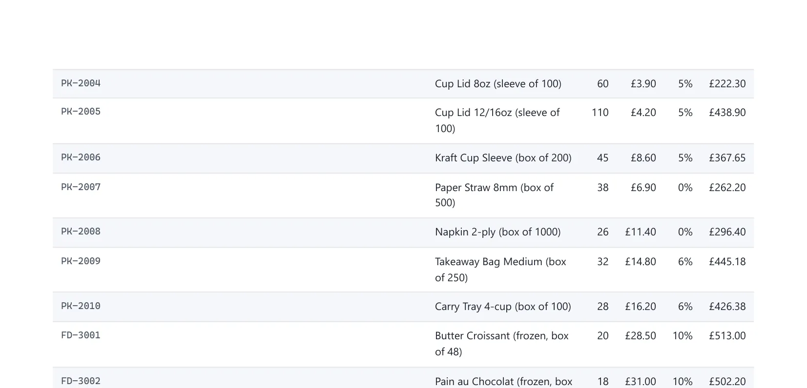
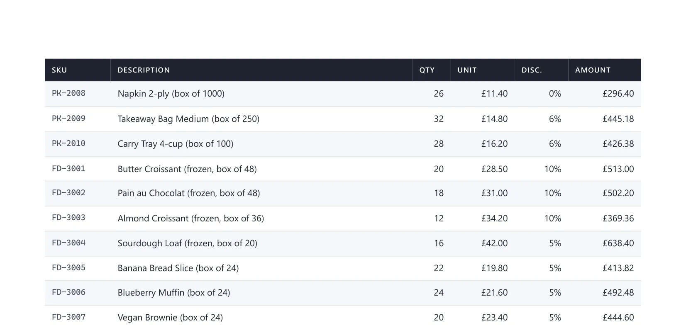
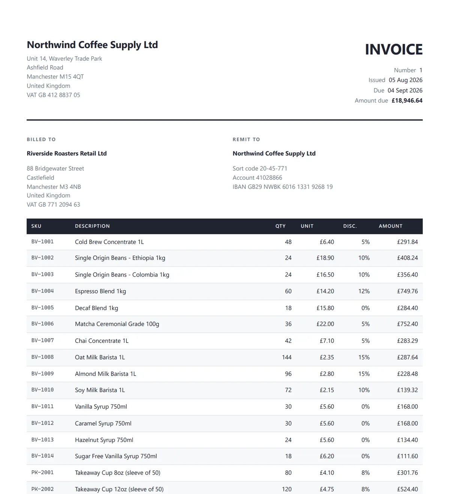

在 ASP.NET Core 里把 HTML 转成 PDF，核心工作只有一行：把标记交给 Chromium 渲染引擎，拿回字节写盘。难的不是转换本身，而是让这份 PDF 在翻到第二页时仍然成立。屏幕上的完美模板，遇到 46 行订单可能立刻原形毕露：表头消失、列宽塌陷、金额符号错位、页脚压住最后一行数字。

这篇文章依据 Mukesh Murugan 2026 年 8 月发布的 .NET 10 教程及其完整示例仓库整理，走通一条真实的发票生成链路。读完后，你可以照着实现一个带打印 CSS、按发票货币格式化、页码正确、且不阻塞请求线程的发票 PDF 端点；同时知道在哪些场景下 HTML 转 PDF 本身就是错误选择。

原文由 IronPDF 赞助，但作者在文中明确说明代码与方案取舍均出自本人判断；文中的关键结论我另外核对了 IronPDF、QuestPDF 和 wkhtmltopdf 的最新官方资料，均与原文一致。

## 前置条件

- .NET 10 SDK（原文在 SDK 10.0.302、runtime 10.0.10 上验证）；
- IronPDF 商用许可证（NuGet 上当前版本为 2026.8.1）。

许可证不是可选项。没有 key 时 IronPDF 只进入沙箱模式：仅在 Development 环境且挂着调试器时渲染，`dotnet run`、`dotnet test` 和 CI 统统抛 `LicensingException`，能渲染出来的页面也带每页水印。30 天试用 key 免费且没有任何限制，先领一个再开始。

安装包并存放 key：

```bash
dotnet add package IronPdf
```

```bash
cd InvoicePdf.Api
dotnet user-secrets set "IronPdf:LicenseKey" "YOUR-KEY-HERE"
```

Key 放在 user secrets 里，避免进入源码控制。然后在 `Program.cs` 启动时、任何渲染器创建之前应用一次：

```csharp
var licenseKey = builder.Configuration["IronPdf:LicenseKey"];
if (!string.IsNullOrWhiteSpace(licenseKey))
{
    IronPdf.License.LicenseKey = licenseKey;
}
```

这两行不能省。IronPDF 只在配置以扁平名 `IronPdf.LicenseKey` 存储时自动读取 key，嵌套配置段对它不可见；通过 `IConfiguration` 读出来手动赋值，还有一个附带好处：容器里用同名环境变量即可提供 key，代码零改动。如果渲染结果仍然不对，先检查 `IronPdf.License.IsLicensed`，别急着一头扎进 CSS。

## 三种喂 HTML 的方式

渲染引擎有三种输入，选错是 CSS 丢失最常见的原因：

```csharp
var renderer = new ChromePdfRenderer();

// 1. 从字符串渲染：快、自包含、不访问磁盘。
var fromString = await renderer.RenderHtmlAsPdfAsync("<h1>Invoice</h1>");

// 2. 从文件渲染：相对路径的  和 <link> 以文件所在目录解析。
var fromFile = await renderer.RenderHtmlFileAsPdfAsync("Invoices/Templates/invoice.html");

// 3. 从 URL 渲染：执行脚本、跟随重定向、等待网络。
var fromUrl = await renderer.RenderUrlAsPdfAsync("https://codewithmukesh.com/");

await File.WriteAllBytesAsync("invoice.pdf", fromString.BinaryData);
```

Web API 里应该用字符串重载，但有一个坑：字符串没有基准路径，`` 会安静地渲染成破图。传一个 base path、把资源内联成 data URI，或者改用文件重载。

URL 重载看起来方便，作者建议在 API 内避免使用。那等于在应用处理请求的同时，让它自己调自己的 HTTP 接口：认证 cookie 不随请求传递；线程池繁忙时，自调用可能永远等不到线程，形成死锁；页面慢，PDF 就慢。

## 真正重要的五个渲染设置

```csharp
var renderer = new ChromePdfRenderer();
var options = renderer.RenderingOptions;

options.CssMediaType = PdfCssMediaType.Print;
options.PaperSize = PdfPaperSize.A4;

// 不设这个，Chromium 剥掉所有背景色，深色表头变成白底黑字。
options.PrintHtmlBackgrounds = true;

// 模板自己声明了 @page 边距，默认情况下 RenderingOptions 上的值
// 会静默压过 CSS。
options.CssPageRulePolicy = CssPageRulePolicy.CssPageWin;

// 纯静态标记，没有脚本要执行，没必要付渲染延迟。
options.EnableJavaScript = false;
```

`CssPageRulePolicy` 最让人耗掉一下午。你精心写了 `@page { margin: 18mm 14mm 24mm 14mm; }`，输出却无视它，标记里没有任何线索说明原因——库的边距属性默认优先，除非你显式声明。

渲染器要建成单例。`ChromePdfRenderer` 对象本身便宜，背后的 Chromium 实例不便宜，每个请求建一个是让 PDF 端点变慢的最快方式：

```csharp
builder.Services.AddSingleton<InvoiceHtmlBuilder>();
builder.Services.AddSingleton<InvoicePdfRenderer>();
```

单例有一个生产环境必踩的坑：`RenderingOptions` 是共享可变状态。示例的页脚带发票号，两个渲染并发执行会把彼此的文档盖戳。作者在渲染外层套了 `SemaphoreSlim(1, 1)`，同一个渲染器实例一次只跑一个渲染：

```csharp
await _gate.WaitAsync(cancellationToken);
try
{
    _renderer.RenderingOptions.TextFooter =
        new TextHeaderFooter { /* ... */ };

    var pdf = await _renderer.RenderHtmlAsPdfAsync(html);
    return pdf.BinaryData;
}
finally
{
    _gate.Release();
}
```

损失比听起来小：一次渲染本来就是完整的 Chromium 布局，串行跑并不会让它们更快。这也是后文渲染队列存在的理由。

## 用 Claude 起草模板

让模型写模板确实值得，但只在设计阶段做一次。收到结果后人工审阅、修正，再作为静态文件提交进仓库，和普通资产一样对待。

原文给出了一个可直接使用的提示词：

```text
Write a single-file HTML invoice template for A4 print output.
CSS Grid for the masthead and the seller/buyer blocks. One <table> for
line items with columns: SKU, description, qty, unit price, discount,
amount. A totals block with subtotal, discount, tax, and grand total.
Neutral professional styling, no external assets, no JavaScript.
Use {{Token}} placeholders for every value.
```

最后两行出力最大。「No external assets, no JavaScript」保证输出是单一自包含文件，正好可以从字符串渲染；「{{Token}} placeholders for every value」让输出可以直接进入替换循环，不需要二次处理。

模型交回来的第一稿通常很强：Grid 排布、字号层级、明细表结构、数字列右对齐，屏幕上看很完整，渲染出的第一页也很完整。第二页才是分水岭。

## 模型总是漏掉什么

作者没有靠猜，而是把已提交的模板里每人都会被告知要加的打印规则全部剥掉，用同一个渲染器重渲染同一张 46 行发票。五条规则里，两条完全不起作用，而真正毁掉多页发票的那条，是一条有人多写出来的规则。

### 1. 没有真正的 @page 规则

这是最常中招的一条。生成的模板按屏幕尺寸设计：body 用像素 padding，字号按显示器选。渲染出来也正常，但边距是渲染器默认值，页脚没有任何预留空间。作者去掉这条规则后，边距移动、分页整整推进了一行：

```css
@page {
  size: A4;
  margin: 18mm 14mm 24mm 14mm;
}
```

底部边距刻意比其他三边大，那是页码的位置。不留空间，页脚就会画在最后一条明细行上。

### 2. 行和汇总块跨页撕裂

默认情况下渲染引擎在页面到底时随机断行，可能出现 SKU 和描述在第一页、价格在第二页。汇总块更糟：小计留在上页底部、总计在下页，收到发票的人会以为算错了：

```css
table.lines tbody tr {
  break-inside: avoid;
}
.summary {
  break-inside: avoid;
}
```

坦白说，在作者的 46 行样本里，分页恰好落在两行之间，去掉这条规则看不出任何变化。它是一行成本的低保，第一次出现两行描述时就把一张干净的文档和一张被切开的文档区分开。注意陷阱：`break-inside: avoid` 对高于一整页的元素无法生效，引擎照样断开，所以只应作用在行和小块上。

### 3. 金额列参差不齐

多数数字字体中，1 比 8 窄：

```css
.num {
  text-align: right;
  font-variant-numeric: tabular-nums;
  white-space: nowrap;
}
```

也要承认：右对齐后最后一位数字已经对齐，真正漂移的是行首的货币符号，打印尺寸下看长列才明显。`nowrap` 比看起来重要——金额折行会改变行高。

### 4. 两条无效规则，人人都在重复

把这两条剥掉，渲染结果毫无变化，作者逐条验证过。

`thead { display: table-header-group }` 本来就是浏览器默认值，写在 HTML 标准自己的样式表里，重复写一遍是空操作。作者的模板在去掉它之后，表头照样在第二页重复。wkhtmltopdf 默认也重复 thead，所以表头不重复并不是迁移的理由；它离开的理由是其 Qt WebKit 引擎是 2012 年代的分支，先于 CSS Grid 和 Flexbox，且仓库已在 2023 年 1 月 2 日被归档为只读。

`print-color-adjust: exact` 同样无效，因为渲染器选项已经覆盖了它——前面的 `PrintHtmlBackgrounds = true` 保证深色表头带存活，CSS 写不写都一样。如果同一模板还要在浏览器里直接打印，保留这条 CSS，因为浏览器里没有渲染器选项可设。

### 5. 真正破坏多页的是有人加了规则

响应式表格 CSS 常把 `thead` 改成 block 以便在小屏重排，模型见过大量这种代码，可能把它夹带进一份看似打印就绪的模板：

```css
/* 看起来无害。毁掉分页输出。 */
table.lines thead {
  display: block;
}
```

作者实际渲染验证：第二页以一行无标签的数字开场，列宽塌陷（block 化的 thead 不再参与表格布局），发票从两页变成三页。





同一张发票、同一个渲染器，只差一行 CSS。所以审阅方法不是「粘进这五条规则」，而是：渲染一个足够长、能跨页的文档，翻到第二页，检查样式表里有没有东西在和表格打架。五条里三条实至名归，两条本来就是默认值，而真正毁掉多页发票的那一条，是有人加出来的。

## AI 还能放在流程哪里

起草完模板，还有三个更具体的问题：如何让 agent 写出正确的 IronPDF 代码、模型该不该在运行时生成 PDF、模型能否直接调用渲染器。

### 让 agent 写对库 API

模板提示词不需要额外帮助，因为 HTML 和 CSS 是任何模型训练数据里覆盖最充分的东西。库 API 正好相反：版本相关的成员名正是模型用「貌似合理」填补空白的地方。

IronPDF 提供了两个文件：`https://ironpdf.com/llms.txt` 是指南索引，遵循 llms.txt 约定；`https://ironpdf.com/skill.md` 是实际内容，一份约两千字的 SKILL.md。Claude Code 安装只要一条命令：

```bash
mkdir -p .claude/skills/ironpdf
curl -o .claude/skills/ironpdf/SKILL.md https://ironpdf.com/skill.md
```

SKILL.md 是开放格式，Cursor 和 Copilot 从各自的 rules 目录读取同一个文件。它带来的是模型无法可靠知道的信息：Linux 需要 `IronPdf.Linux`、Apple Silicon 需要 `IronPdf.MacOs.ARM` 而不是每个 Windows 教程里的 `IronPdf`；许可证必须在首次渲染前设置；`IronPdf.Universal` 是 API 不兼容的独立产品线，绝不能混用。它还显式要求不编造成员，并把 NuGet 包内附的 XML 文档当作已安装版本的权威。

要诚实指出边界：这修复了 API 的一半，不修复本文的核心——第二页的 CSS Paged Media 问题不在 IronPDF 的 API 里，也不在那个文件里。渲染器从来不是出错的一方。

### 模型不该在运行时生成 PDF

这是作者明确反对 AI 演示常见做法的位置。布局会失去确定性，同一订单的两张发票可能不同，没人想向客户解释这个；每次渲染都付延迟和 token，而文档结构自提交后从未变过；客户半年后质疑总额时，「布局是模型生成的」不是能继续对话的答案。

模板受益于模型，因为设计是一次性的创作工作；填充模板只是遍历明细行，代码四十年前就擅长这件事。

### 把渲染器暴露成 MCP 工具

可以。渲染器是单一职责的服务，包一层接线即可。用官方 C# SDK 只要两个特性，以下为示意代码，不在示例仓库内：

```csharp
[McpServerToolType]
public class InvoiceTools(InvoicePdfRenderer renderer)
{
    [McpServerTool(Name = "render_invoice_pdf")]
    [Description("Renders an existing invoice to a PDF and returns the saved file path.")]
    public async Task<string> RenderAsync(
        [Description("Invoice number, for example INV-2026-0841.")] string number,
        CancellationToken cancellationToken)
    {
        var invoice = InvoiceStore.GetSample(number);
        var pdf = await renderer.RenderAsync(invoice, cancellationToken);
        var path = Path.Combine(Path.GetTempPath(), $"{invoice.Number}.pdf");

        await File.WriteAllBytesAsync(path, pdf, cancellationToken);
        return path;
    }
}
```

工具保持窄。「render_invoice_pdf」接收发票号，好过一个接收自由文本的「do_something_with_pdfs」——模型靠读描述选工具，模糊的描述会在错误时机被调用。

## 构建能打印的模板

布局用 CSS Grid 和 Flexbox，只有明细行用真正的 `<table>`。Chromium 在打印模式下处理现代 CSS 与屏幕无异，老式嵌套布局表格毫无收益。下面是已提交 `invoice.html` 里关键的样式片段：

```html
<style>
  @page {
    size: A4;
    margin: 18mm 14mm 24mm 14mm;
  }

  body {
    font-family: "Segoe UI", "Helvetica Neue", Arial, sans-serif;
    font-size: 10.5px;
    /* 与上面的 PrintHtmlBackgrounds 冗余，那是实际起作用的部分；
       保留是为了模板在浏览器里直接打印时也算正确。 */
    print-color-adjust: exact;
    -webkit-print-color-adjust: exact;
  }

  /* 用 Grid 布局，而不是嵌套表格。 */
  .masthead {
    display: grid;
    grid-template-columns: 1fr auto;
    gap: 24px;
    border-bottom: 2px solid #1f2430;
  }

  table.lines {
    width: 100%;
    border-collapse: collapse;
  }

  table.lines th {
    background: #1f2430;
    color: #ffffff;
    text-transform: uppercase;
    text-align: left;
    padding: 7px 8px;
  }

  .num {
    text-align: right;
    /* 数字按要求排列。金额文档的硬性要求。 */
    font-variant-numeric: tabular-nums;
  }
</style>
```

模板用纯 `{{Token}}` 替换填充，且每个值先经过 `WebUtility.HtmlEncode`。产品描述和客户名是进入 HTML 文档的用户数据：`Smith & Sons Ltd` 里一个未编码的 `&` 就破坏标记，产品描述里的 `<script>` 标签则是比一张坏发票严重得多的问题。

应用许可证后，模板渲染效果如下：



## 按发票货币格式化金额

货币格式化要跟发票的货币走，而不是跟服务器走。一个部署在美区的容器，会热情地把英式发票渲染成美元，而且没有单元测试能抓住它：

```csharp
private static readonly Dictionary<string, string> CurrencyCultures =
    new(StringComparer.OrdinalIgnoreCase)
{
    ["GBP"] = "en-GB",
    ["USD"] = "en-US",
    ["EUR"] = "de-DE",
    ["INR"] = "en-IN",
    ["JPY"] = "ja-JP",
};

private static CultureInfo ResolveCulture(string currencyCode) =>
    CurrencyCultures.TryGetValue(currencyCode, out var name)
        ? CultureInfo.GetCultureInfo(name)
        : CultureInfo.InvariantCulture;

// 然后在 Build(invoice) 内：
var culture = ResolveCulture(invoice.CurrencyCode);
string Money(decimal value) => value.ToString("C", culture);
```

`ToString("C", culture)` 对 en-GB 输出 £1,234.50，对 de-DE 输出 1.234,50 €：符号、分隔符、符号位置全对。字符串拼接能把第一个做对，第二个做错。

配套两条规则：金额用 `decimal`，绝不用 `double`——二进制浮点无法精确表示 0.1，一张差一美分的发票就是一张工单；逐行舍入而不是最后舍入一次：

```csharp
public decimal DiscountAmount =>
    decimal.Round(GrossAmount * DiscountRate, 2, MidpointRounding.AwayFromZero);
```

样本里的总额是明细行的计算属性而非存储字段，汇总块因此永远不会与上面各行脱节。

## 页码从哪里来

模板不知道自己会变成几页，页码不可能来自 HTML；只有引擎在排版完成后才知道总数。页脚配置在渲染器上：

```csharp
// 在 RenderAsync 内，按发票配置，页脚文本携带发票号。
_renderer.RenderingOptions.TextFooter = new TextHeaderFooter
{
    LeftText = $"Invoice {invoice.Number}",
    RightText = "Page {page} of {total-pages}",
    DrawDividerLine = true,
    FontSize = 8,
};

// 在 CreateRenderer 内，只配置一次，为页脚预留空间。
options.MarginBottom = 16;
options.UseMarginsOnHeaderAndFooter = UseMargins.All;
```

`{page}` 和 `{total-pages}` 是渲染器在分页完成后替换的占位符。`MarginBottom` 这一行与页脚本身同样重要：不预留空间，页脚就画在最后一行表格之上。

需要 logo 或真实样式化的页脚时，有接收标记的 `HtmlFooter` 选项，代价是每页多一次渲染。

## 从 Minimal API 返回 PDF

`Results.File` 配合 `application/pdf` 与文件名，仅此而已：

```csharp
invoices.MapGet("/{number}/pdf", async (
    string number,
    InvoicePdfRenderer renderer,
    CancellationToken cancellationToken) =>
{
    var invoice = InvoiceStore.GetSample(number);
    var pdf = await renderer.RenderAsync(invoice, cancellationToken);

    return Results.File(pdf, "application/pdf", $"{invoice.Number}.pdf");
})
.WithName("GetInvoicePdf")
.Produces(StatusCodes.Status200OK, contentType: "application/pdf");
```

传入文件名会设置 `Content-Disposition: attachment`，浏览器下载；去掉文件名则在浏览器 PDF 查看器内联打开，这是产品决策而非技术问题。优先用 `byte[]` 或 `Stream` 重载而不是临时文件——临时文件增加磁盘 I/O、需要清理，还会在并发请求之间产生竞争。

这个端点在每分钟几张发票的规模下完全正确，也是大多数教程停下的地方。它的问题是量一旦上来就暴露。

## 输出检查清单

示例把 `INV-2026-0841` 渲染成 62 KB、两页的 A4 PDF。以下四项全部要人工核验，因为它们都无声失败：

- 第二页以一行裸数字开场：样式表里有东西覆写了 thead，找 `display: block`；
- 页脚是 `Page 1 of 2` 和 `Page 2 of 2`：出现字面量 `{page}` 说明占位符从未被替换；
- 货币符号错误：格式化回退到了服务器文化，而不是发票货币；
- 对账：£15,788.87 加 20% 增值税 £3,157.77 等于 £18,946.64。

## 为什么渲染要搬离请求线程

一次渲染是一整趟 Chromium 布局，耗时几百毫秒到几秒，并占用一个本可以服务正常流量的线程。20 个并发发票下载会让服务器上所有其他请求一起变慢，因为线程池忙于渲染。

解法是接收请求后把工作放入有界 Channel，立即用任务 ID 应答：

```csharp
public PdfRenderQueue(int capacity = 100)
{
    _channel = Channel.CreateBounded<RenderJob>(new BoundedChannelOptions(capacity)
    {
        FullMode = BoundedChannelFullMode.Wait,
        SingleReader = false,
        SingleWriter = false,
    });
}

/// <summary>
/// 队列饱和时返回 null，端点据此应答 503。
/// </summary>
public Guid? TryEnqueue(Invoice invoice)
{
    var job = new RenderJob(Guid.CreateVersion7(), invoice);

    if (!_channel.Writer.TryWrite(job))
    {
        return null;
    }

    _results[job.Id] = new RenderResult(job.Id, RenderState.Queued, null, null);
    return job.Id;
}
```

有界是关键。无界队列把流量尖峰变成 OOM 杀死：请求到得比渲染快，进程最终带着几千张待处理发票死去。有界 Channel 提供反压，让 API 承认自己忙不过来，思路与限流一致。

`FullMode` 的选择最容易搞错。`BoundedChannelFullMode.Wait` 下，队列满时 `TryWrite` 返回 false，上面的 503 路径可达；换成 `DropWrite` 则返回 true 但静默丢弃任务，调用方会永远轮询一个根本不存在的状态。

`BackgroundService` 负责消费队列：

```csharp
protected override async Task ExecuteAsync(CancellationToken stoppingToken)
{
    await foreach (var job in queue.ReadAllAsync(stoppingToken))
    {
        queue.Update(new RenderResult(job.Id, RenderState.Running, null, null));

        try
        {
            var pdf = await renderer.RenderAsync(job.Invoice, stoppingToken);
            queue.Update(new RenderResult(job.Id, RenderState.Done, pdf, null));
        }
        catch (OperationCanceledException) when (stoppingToken.IsCancellationRequested)
        {
            // 正在关闭。保留任务排队，而不是标记失败。
            throw;
        }
        catch (Exception ex)
        {
            queue.Update(new RenderResult(job.Id, RenderState.Failed, null, ex.Message));
        }
    }
}
```

端点返回 202 Accepted，`Location` 头指向任务，客户端轮询。示例把结果放在 `ConcurrentDictionary` 里保持代码可读；真实项目应把字节写入对象存储，因为装满成品 PDF 的字典就是内存泄漏。

## 什么时候不该用 HTML 转 PDF

三种方案解决同一类问题，选哪个取决于你已经运行什么、以及是否要处理别人做的 PDF：

| 方案                                  | 适合                                                                 | 失效                                                                                 |
| ------------------------------------- | -------------------------------------------------------------------- | ------------------------------------------------------------------------------------ |
| 浏览器自动化（Playwright、Puppeteer） | 它已在测试栈里，或只需一次性导出、无人为此值班                       | 容器归你：要发布和修补完整浏览器；且只能创建 PDF，不能打开、合并、签名或填写已有文件 |
| PDF 库（IronPDF）                     | 文档是 HTML 和 CSS，需要编辑或合并已有 PDF，不想在镜像里加外部二进制 | 商业授权，许可证是真实预算项，动手前需要批准                                         |
| 编程式构建（QuestPDF）                | 想要全 C# 控制、布局的编译期安全，且 Community 许可覆盖你            | 文档已存在为 HTML：要用 C# DSL 重写设计稿，设计师再也碰不到它                        |

对文档从 HTML 模板出发的 .NET API，作者的默认选择是 PDF 库，因为模板保持为模板：前端工程师能改、代码评审里 diff 干净、镜像里没有浏览器。

两种情况下作者会真正改选 QuestPDF：文档完全由数据生成、没有设计输入；或批预算比写代码还难。它确实好，流式 C# API 比调试打印 CSS 好相处得多。但先查许可证：Community 许可在年收入 100 万美元以下免费（截至 2026 年 7 月 6 日生效的 v3.0 条款），在任何收入水平下都不覆盖上市公司和公共部门单位，这会排除大量企业 .NET 团队。

如果 Playwright 已经在跑端到端测试，而你需要内部工具的每周导出，就用现成的。

### 能让 AI 直接生成 PDF 吗

不能，而且这值得单独说，因为「让 AI 生成 PDF」经常被当作第四种方案展示。

没有模型会在内部运行 Chromium 布局。聊天工具看起来把你的 HTML 变成了 PDF，其实是它写了一段调用库的代码，并运行在你观察不到的沙箱里。库从未离开画面，只是搬到了一个你无法配置、无法固定版本、无法部署的地方。

成本形状也不匹配：渲染是每次文档的固定、可预测成本，同一模板 46 行明细今天与下季度一样；模型按 token 计价，账单随文档长度和返回内容浮动。为一份结构自提交后没变过的文档付变动价格，逻辑上说不通。

还有供应链问题：生成代码倾向拾取训练数据中出现最多的包，而「最常见」不等于「还在维护」。一个没人修补的废弃依赖，坐在生产财务文档的服务里，换来回二十分钟的节省并不划算。这正是技能文件的意义：把模型固定在目标平台的正确包上，而不是让它猜。

模型真正有优势的是相反方向。生成是确定性工作——你的数据、你的模板、一个正确输出；读取不是——供应商发来一张没见过版式的 PDF 发票，把总额抠出来需要解读，这是模型擅长的、库不擅长的。所以分界线画在两个方向：库做机械的一半，模型做需要判断的一半。让模型当渲染器，是把 token 花在库已按固定价格完成的工作上，还接手一个你没选的依赖。

## Docker 里的坑

Chromium 需要 `dotnet/aspnet` 基础镜像没有的字体和原生库。缺共享对象会在启动时报错，容易排查；缺字体则静默失败：渲染成功，默认集之外的每个字符都是空框，其余部分看起来完美无缺。

作者说这一主题是系列后续文章。现在能做的：安装文档需要的字体包，并在 CI 里渲染一份真实文档。

## 常见问题

- **空白 PDF 或缺区块**：示例中 JavaScript 是关闭的。如果模板用脚本构建内容，启用它并设置渲染延迟。
- **图片不显示**：从字符串渲染时相对路径无处解析。传 base path、把资源内联为 data URI，或改用文件重载。
- **页脚压住最后一行**：加大 `MarginBottom`，并设置 `UseMarginsOnHeaderAndFooter`。
- **负载下页脚发票号错误**：`RenderingOptions` 是单例渲染器上的共享状态，按实例串行渲染。
- **生产环境货币符号错误**：永远不要依赖 `CultureInfo.CurrentCulture`。
- **`break-inside: avoid` 被忽略**：元素比整页还高，引擎只能断开。只作用在行和小块上。
- **生成模板边距怪异**：没有 @page 规则，模型按屏幕像素设计了 body。补上带 `size` 和 `margin` 的真实 @page 块，底部留足页脚空间。
- **第二页表头消失**：不要加 `thead { display: table-header-group }`，它已是默认值。在样式表里搜覆写它的规则，通常是响应式表格 CSS 带来的 `thead { display: block }`。同一个覆写也会压塌列宽，那是更快的判别信号。

## 总结

把 HTML 转成 PDF 只要三行；交付一个发票端点，则是本文其余的全部：跨页存活的打印 CSS、重复的表头、按发票货币而非服务器格式化的金额、只有渲染器知道的页码，以及量起来之后离开请求线程的渲染队列。

工具选择比代码更重要。文档起始于一份需要别人编辑的 HTML 模板，HTML 转 PDF 库是正确选择；完全由数据生成，QuestPDF 可能更好；浏览器已在栈里且量小，用现成的。最后从课程仓库取走示例，把模板改到出问题为止——这些规则只有在文档足够长、真的需要分页时才有意义。

如果这类 AI 助手、开发工具和软件工程实践对你有帮助，欢迎关注 Aide Hub。这里会继续记录可验证的工具与工程经验。

## 参考

- [Mukesh Murugan：How to Convert HTML to PDF in C# (.NET 10 Guide)（原文）](https://codewithmukesh.com/blog/generate-pdf-invoices-aspnet-core-web-api/)
- [配套示例仓库（.NET 10，46 行订单）](https://github.com/codewithmukesh/dotnet-webapi-zero-to-hero-course/tree/main/modules/07-file-handling-storage/generate-pdf-invoices-aspnet-core-web-api)
- [IronPDF Agent Skill（skill.md）](https://ironpdf.com/skill.md)
- [IronPDF llms.txt 索引](https://ironpdf.com/llms.txt)
- [QuestPDF Community License v3.0](https://www.questpdf.com/license/community.html)
- [wkhtmltopdf 仓库（2023 年 1 月归档）](https://github.com/wkhtmltopdf/wkhtmltopdf)
- [Microsoft Learn：标准数字格式字符串（"C"）](https://learn.microsoft.com/en-us/dotnet/standard/base-types/standard-numeric-format-strings)
- [Microsoft Learn：.NET 中的 Channel](https://learn.microsoft.com/en-us/dotnet/core/extensions/channels)
