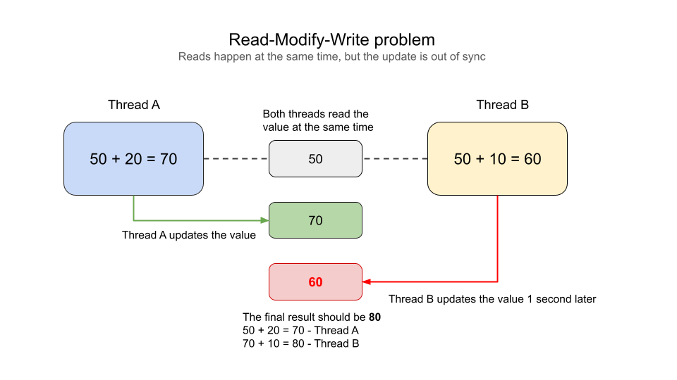
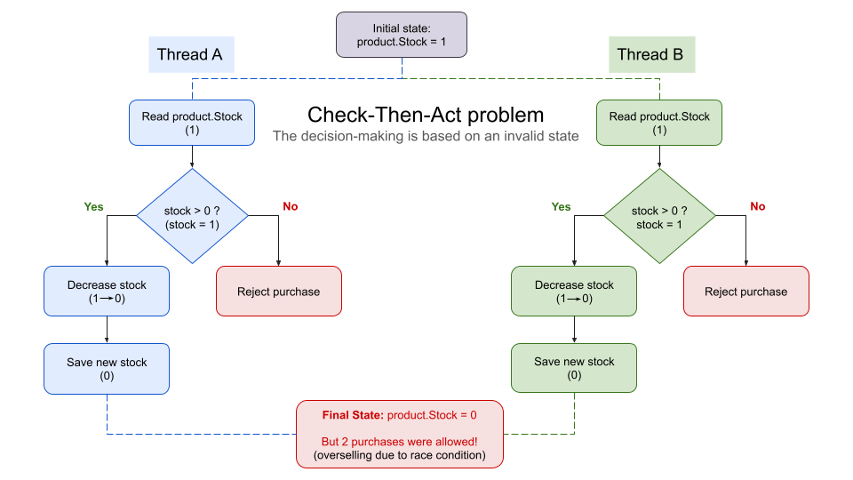
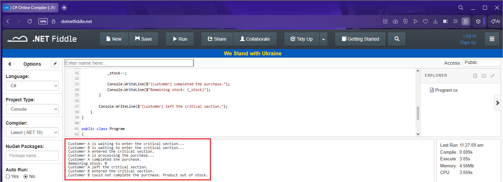
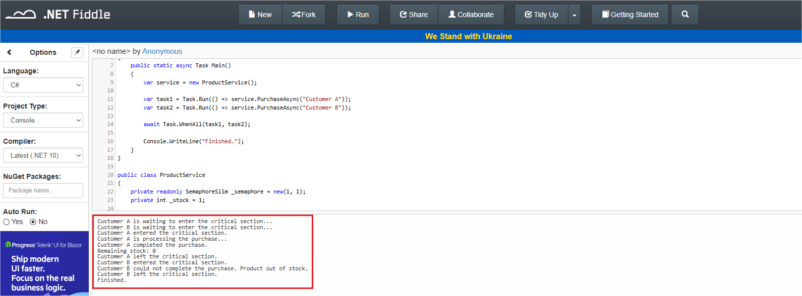
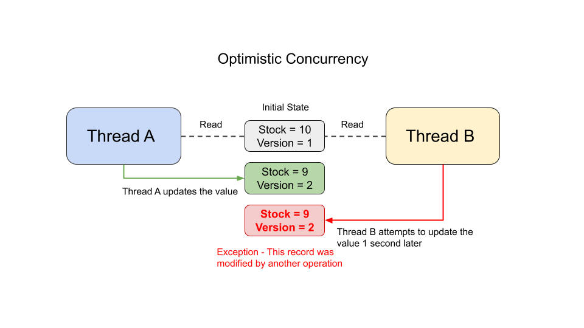
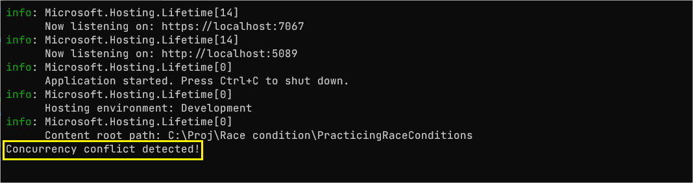

两个请求在同一瞬间到达。它们读取同一份数据，各自完成计算并写回，一切看起来正常。但其中一个更新悄悄覆盖了另一个。这是竞态条件最经典的形态：每个请求单独执行都完全正确，并发执行时结果却取决于谁最后写盘，而谁最后写盘完全不保证。

在毫秒级完成多次操作的中大型应用里，这并非遥远的场景。本文依据 Assis Zang 在 Telerik 博客发表的《Understanding Race Conditions in ASP.NET Core》整理成中文教程：先讲清竞态条件的定义与两种典型形态，再给出四种防护方案（lock、SemaphoreSlim、线程安全集合、EF Core 乐观并发）的可运行代码、输出结果与选型依据。读完后，你可以对自己应用里所有「读-改-写」和「先检查再执行」的代码做一次系统排查。

## 什么是竞态条件

微软文档给出定义：当两个线程同时访问并修改同一个共享资源时，就发生了竞态条件，最终结果取决于这些操作执行的顺序。问题在于这个顺序没有保证，每次执行都可能不同，于是出现数据不一致、丢更新或无效状态等不可预测的行为。

典型例子是账户余额更新：两个请求读到同一个初始值，分别计算，再各自保存。先保存的更新会被后保存的覆盖——即使两个请求单独执行时都完全正确。

## 两种典型形态

竞态条件不是凭空出现的，它通常来自一些很常见的代码与架构模式。原文重点讲了两种。

### Read-Modify-Write

思路很简单：读一个值，做修改，再写回。问题出在两个以上执行同时做这件事。



图中两个线程同时读到 50。线程 A 加 20 得到 70，线程 B 加 10 得到 60；先写回的是 70，一秒后线程 B 用 60 覆盖了它，完全无视线程 A 之前加上的部分。最终结果应为 80，实际却是 60。这个错误值在生产环境就是实打实的损失。

### Check-Then-Act

这个模式比上一种更隐蔽。问题不在于更新一个值，而在于基于一个「在做动作之前可能已经改变」的状态做决策。



两个线程同时检查商品库存，都查到数量为 1。尽管有检查这一步，两次购买都基于无效状态执行了：线程 A 完成购买后，库存已无货，线程 B 却照样成交。若发生在真实环境，线程 B 的客户将拿不到商品。

## 先明确线程安全

线程安全指代码或资源被多个线程同时访问时仍能正确工作的能力。线程安全的代码意味着：数据不被损坏、状态始终有效、行为不依赖线程的执行顺序。下面的四种防护手段，本质都是在这个定义上做文章。

## 方案一：lock

锁是一种让操作线程安全的机制，它保证同一时刻只有一个线程执行给定代码段。原文用库存为 1、两名客户同时下单的场景演示：

```csharp
public class ProductService
{
    private static readonly object _lock = new();

    // 模拟库存数量
    private int _stock = 1;

    public void Purchase(string customer)
    {
        Console.WriteLine($"{customer} is waiting to enter the critical section...");

        lock (_lock)
        {
            Console.WriteLine($"{customer} entered the critical section.");

            if (_stock <= 0)
            {
                Console.WriteLine($"{customer} could not complete the purchase. Product out of stock.");
                return;
            }

            Console.WriteLine($"{customer} is processing the purchase...");

            // 模拟慢操作
            Thread.Sleep(3000);

            _stock--;

            Console.WriteLine($"{customer} completed the purchase.");
            Console.WriteLine($"Remaining stock: {_stock}");
        }

        Console.WriteLine($"{customer} left the critical section.");
    }
}

public class Program
{
    public static async Task Main()
    {
        var service = new ProductService();

        var task1 = Task.Run(() => service.Purchase("Customer A"));
        var task2 = Task.Run(() => service.Purchase("Customer B"));

        await Task.WhenAll(task1, task2);
    }
}
```

`_lock` 声明为静态对象，充当临界区的看门人，检查库存与扣减库存的逻辑块同一时刻只允许一个线程进入。若不使用锁，两个任务可能同时读到「有货」，把唯一一件商品卖两次。

lock 指令强制了一个等待队列：第一个客户还在处理、系统 Sleep 等待期间，第二个客户被挡在临界区入口。只有第一个事务完成、库存扣到零、锁释放后，第二个客户才进入，此时逻辑检查发现库存已被上一位耗尽，放弃购买，不产生数据不一致。



最终得到一个可预测的执行流程，在并发高峰下保证数据完整性。

## 方案二：SemaphoreSlim

上面看到，lock 会阻塞当前线程直到临界区释放，这不一定总是好策略，某些情况下会降低应用的可扩展性。这时 SemaphoreSlim 是更合适的替代品。

SemaphoreSlim 是 ASP.NET Core 里的内置类，用于限制同时访问某个资源或代码段的线程数量。初始值和最大值设为 1 时，行为与 lock 相似，只允许一个执行进入。关键区别：它支持异步等待，不阻塞线程：

```csharp
public class ProductService
{
    private readonly SemaphoreSlim _semaphore = new(1, 1);

    private int _stock = 1;

    public async Task PurchaseAsync(string customer)
    {
        Console.WriteLine($"{customer} is waiting to enter the critical section...");

        await _semaphore.WaitAsync();

        try
        {
            Console.WriteLine($"{customer} entered the critical section.");

            if (_stock <= 0)
            {
                Console.WriteLine($"{customer} could not complete the purchase. Product out of stock.");
                return;
            }

            Console.WriteLine($"{customer} is processing the purchase...");

            // 模拟异步操作
            await Task.Delay(3000);

            _stock--;

            Console.WriteLine($"{customer} completed the purchase.");
            Console.WriteLine($"Remaining stock: {_stock}");
        }
        finally
        {
            _semaphore.Release();

            Console.WriteLine($"{customer} left the critical section.");
        }
    }
}
```

两个线程同时执行 `PurchaseAsync` 时，第一个进入信号量，第二个等待；第一个完成后信号量释放，第二个才继续。



与 lock 的示例一样，这阻止了两个操作同时改动库存。不同之处在于：线程是异步的（`Task.Delay` 期间不占用线程），并且可以通过初始值与最大值配置同时运行的线程数量——这意味着它不止能做互斥，还能做限流。

## 方案三：线程安全集合

另一类容易出问题的场景是多线程共享集合。`List<T>`、`Dictionary<TKey, TValue>`、`HashSet<T>` 都不是为并发访问设计的，多个线程同时读写会产生不一致数据与不可预测行为：

```csharp
private readonly Dictionary<Guid, Product> _products = new();

public void AddProduct(Product product)
{
    _products.Add(product.Id, product);
}
```

多个请求同时增删改时，应用可能抛异常，甚至损坏集合内部状态，因为普通 Dictionary 没有为同步做准备。

并发场景应使用 `System.Collections.Concurrent` 命名空间下的线程安全集合，最常用的是 `ConcurrentDictionary<TKey, TValue>`：

```csharp
private readonly ConcurrentDictionary<Guid, Product> _concurrentProducts = new();

public void AddConcurrentProduct(Product product)
{
    _concurrentProducts.TryAdd(product.Id, product);
}

public Product? GetProduct(Guid id)
{
    _concurrentProducts.TryGetValue(id, out var product);

    return product;
}
```

现在多个线程可以同时读取，并发操作由集合内部处理。

## 方案四：乐观并发

乐观并发是另一种避免竞态条件的思路，尤其适合现代应用。与前几种方案不同，它不试图阻止同时访问，而是假设冲突很少发生、只在发生时检测。

设想多个操作同时读取同一份数据：第一个更新正常完成，之后的数据若在过程中已被修改，后续更新就会失败。这样避免了静默覆盖，保证一致性。



两个线程同时读到 stock = 10、version 1。线程 A 更快，先更新为 stock = 9、version 2。线程 B 尝试更新时，因 version 2 已存在而抛异常——初始状态的一致性得到验证，库存没有被写入无效状态。

### 用 EF Core 实现乐观并发

Entity Framework Core 自带乐观并发机制。在实体类中定义一个 Version 列即可：

```csharp
using System.ComponentModel.DataAnnotations;

namespace PracticingRaceConditions.Models;

public class Product
{
    public Guid Id { get; internal set; }
    public string Name { get; set; } = string.Empty;
    public int Stock { get; set; }

    [Timestamp]
    public byte[] Version { get; set; } = default!;
}
```

这个 Version 列告诉 EF Core 使用乐观并发：当两个线程以相同版本更新同一条记录时，会抛出异常。用两个 DbContext 模拟两个并发请求：

```csharp
public async Task SimulatingPurchaseAsync()
{
    var options = new DbContextOptionsBuilder<ProductDbContext>()
        .UseSqlite("Data Source=productsDb")
        .Options;

    // Request A
    using var contextA = new ProductDbContext(options);

    // Request B
    using var contextB = new ProductDbContext(options);

    var productA = await contextA.Products.FirstOrDefaultAsync();
    var productB = await contextB.Products.FirstOrDefaultAsync();

    productA.Stock--;
    productB.Stock--;

    // Request A saves first
    await contextA.SaveChangesAsync();

    try
    {
        // Request B attempts to save using an outdated version
        await contextB.SaveChangesAsync();
    }
    catch (DbUpdateConcurrencyException)
    {
        Console.WriteLine("Concurrency conflict detected!");
    }
}
```

执行后，请求 A 的保存正常——此时还不存在 version 2；请求 B 保存时抛 `DbUpdateConcurrencyException`，因为 EF Core 检测到又有一次更新试图以旧版本修改记录：



原文有一处小笔误：读取产品 A 时误用了 `contextB`，本文按语义修正为 `contextA`，两个请求必须各用自己的上下文才能复现并发冲突。

## 怎么选

原文的结论很简单：任何涉及共享状态的并发操作都需要小心处理，最优策略取决于场景。

- **lock**：最简单直接，适合同步阻塞路径；它会占住当前线程，临界区越长，其他请求等待越久，所以临界区内的操作应尽量短。
- **SemaphoreSlim**：适合在 `async` 代码路径中做互斥或限流，等待不占线程；把并发上限调成 N（比如 3）即可限制同时执行的数量。
- **线程安全集合**：免费的内置方案，适合缓存、内存字典这类多线程共享状态，直接替换集合类型即可，不需要自己加锁。
- **乐观并发**：适用于数据库层面的行级冲突，假设冲突少、只在提交时检测；与「悲观锁」相反，不会因锁等待显著拖慢读取。

一个务实的前提：内存中的进程内同步（lock、SemaphoreSlim、ConcurrentDictionary）只能保护单进程实例。多实例部署后，库存、余额这类共享状态各自独立，需要把并发控制下沉到数据库或分布式协调层——这正是乐观并发（或数据库锁）的价值所在。

## 总结

竞态条件的本质，是多个线程在顺序不被保证的前提下访问并修改同一共享资源，结果可能取决于执行的先后。识别它的两种形态——Read-Modify-Write 与 Check-Then-Act——比记忆防御手段更重要，因为后者只有在前者被识别出来时才用得对。

对进程内共享状态，lock、SemaphoreSlim 与 ConcurrentDictionary 覆盖了绝大多数场景；对数据库里的记录，EF Core 的乐观并发用版本列把「静默覆盖」变成「可捕获的冲突」。下一步值得做的是：把你代码里所有「先读后写」和「先检查后执行」的路径列出来，逐个确认它是否在并发下依然成立。

如果这类 AI 助手、开发工具和软件工程实践对你有帮助，欢迎关注 Aide Hub。这里会继续记录可验证的工具与工程经验。

## 参考

- [Assis Zang：Understanding Race Conditions in ASP.NET Core（原文）](https://www.telerik.com/blogs/understanding-race-conditions-aspnet-core)
- [Microsoft Learn：竞态条件与死锁（定义依据）](https://learn.microsoft.com/en-us/troubleshoot/developer/visualstudio/visual-basic/language-compilers/race-conditions-deadlocks)
- [Microsoft Learn：ConcurrentDictionary API 文档](https://learn.microsoft.com/en-us/dotnet/api/system.collections.concurrent.concurrentdictionary-2)
- [Microsoft Learn：DbUpdateConcurrencyException API 文档](https://learn.microsoft.com/en-us/dotnet/api/microsoft.entityframeworkcore.dbupdateconcurrencyexception)
- [Microsoft Learn：EF Core 并发令牌](https://learn.microsoft.com/en-us/ef/core/saving/concurrency)
