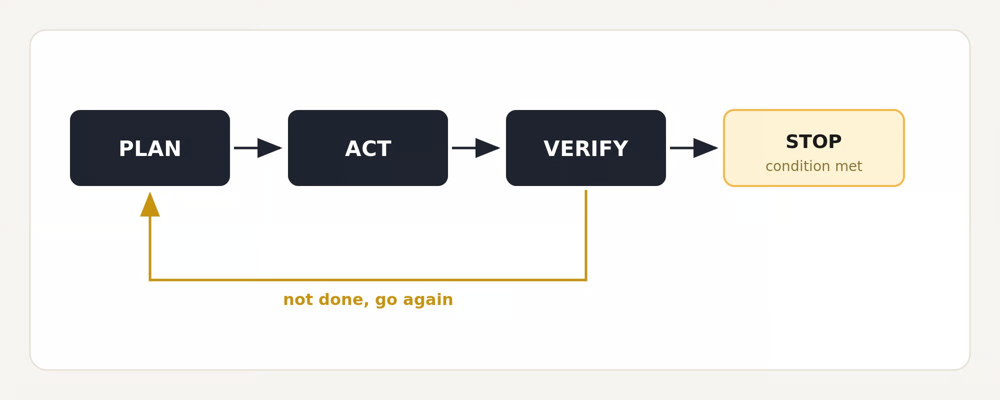
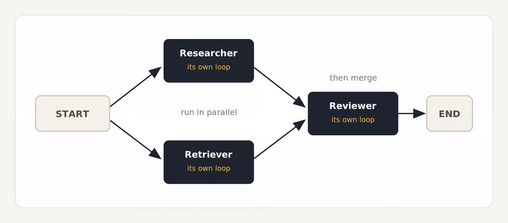
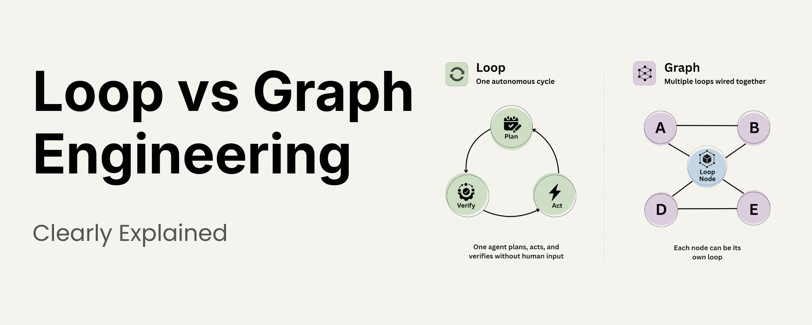
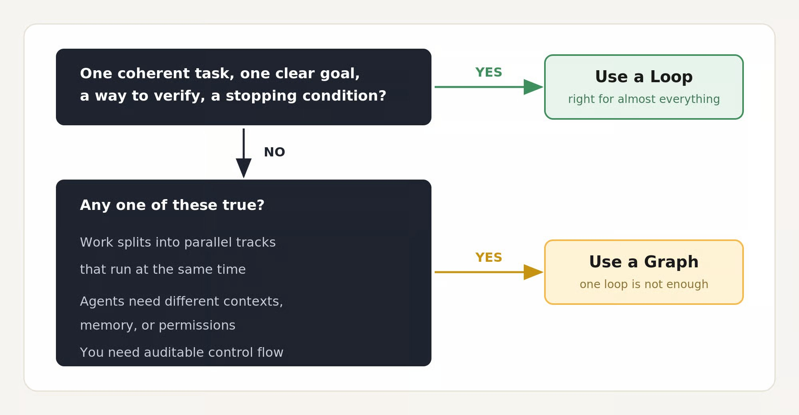

2026 年 7 月，OpenClaw 创造者 Peter Steinberger 在 X 上只发了一行字：「我们还在谈 loops，还是已经转向 graphs 了？」几小时内，机器学习工程师 Hamel Husain 顺势发布了一篇题为《Loop Engineering Is Dead. Enter Graph Engineering》的调侃文章。两人都在嘲讽业界不断给同一批概念改名的习惯，但玩笑落在了一处真实的东西上。

接下来 48 小时，围绕 Graph Engineering 的课程、路线图和工具栈出现了。热闹之下，真正的问题是：你要做的东西，用一个循环还是多个循环组织起来？本文依据 Sumanth 的 X 文章《Loop vs Graph Engineering Clearly Explained》整理，把两个概念的定义、选型条件和时间线摸清，并给出一个与「选边站」不同的结论。文中背景数据另行交叉核对了中文媒体与官方资料。

## 这句玩笑的背景

按中文媒体梳理，Steinberger 的提问到 7 月 28 日左右约获得 307 万次浏览；Hamel Husain 那篇正文只有一张「Stop it」动图的调侃文章，也获得约 68 万次浏览。这个现象本身说明问题：不是概念新，而是大家太渴望一个新词来描述已经在做的事。

Loop Engineering 本身也是一个月前才被 Addy Osmani 带火的；从 Prompt Engineering 到 Context Engineering、Harness Engineering、Loop Engineering，再到 Graph Engineering，命名链一直在延续。Sumanth 是这么描述这条链的：「主要都是同一份工作，只是每次换了个距离观察。」

## Loop 是什么

Loop 是一个自主循环：Agent 规划、行动、验证，反复执行，不需要人每一步重新提示。

这在当时是真实变化。在 loops 出现之前，人就是那个循环：手动审查每个输出，决定下一步。Loops 把这一圈交给了 Agent。

Linear 的 Loops 功能是最清晰的近期例子：2026 年 7 月 20 日发布的团队级循环工作流，用自然语言描述任务，再按计划或事件触发，覆盖缺陷分诊、创建后续工单、同步计划文档等场景——全程不需要有人再输入一条提示。



```text
PLAN ─► ACT ─► VERIFY ─► STOP
  ▲                  │
  └── not done, go again
```

## Graph 是什么

Graph 把这个想法往上推了一层。不是一个 Agent 跑一个循环，而是把多个 Loop 连接起来：节点是单个任务，边是任务之间的流向。如果 Loop 让单个 Agent 的行为可编程，Graph 就让 Agent 的组织方式可编程。

LangGraph、微软 AutoGen、Google ADK 都在这个术语走红之前就发布了这类模式。



```text
START ─┬► Researcher (its own loop) ─┬─► merge ─► Reviewer (its own loop) ─► END
       └► Retriever  (its own loop) ─┘
```

## 关键是两者不是对立关系

争论中缺失的部分是这层关系：Loop 不是 Graph 的对立面，而是 Graph 里的一个节点。就像一个人从头到尾做完整件事，相比一个各司其职、有明确交接的团队——团队不是人的替代品，是许多这样的人加上清晰的交接。

所以不存在「毕业」：你不会从 Loop 毕业到 Graph。你先写一个 Loop，当这个 Loop 不再兜得住工作时，再伸手拿 Graph。开头先给结论：选边是错的直觉。



## 实践中的选择

这个决策不会发生在最开始。没有人会以「选择哲学流派」的方式设计系统——选择是在工作成长中自己浮现出来的。

Loop 是几乎一切场景的正确起点。如果你的问题是一个单一连贯的任务：一个 Agent、清晰的目标、能验证输出的方式、一个停止条件——Loop 干净利落地接住它。这时加 Graph，是付两次钱的复杂度：更难调试，且并不会更有能力。

Graph 成为正确选择，是在以下任意一条成立时：

- 工作分裂成需要同时运行的并行轨道；
- 不同 Agent 需要不同的上下文、记忆或权限来完成各自部分；
- 需要显式、可审计的控制流，每个决策点都可见、可追溯。



## 是否只是重新包装

每个术语走红后，同样的质疑都会出现。怀疑者的观点值得认真对待：

LangGraph 于 2024 年 1 月发布（首次公开约 1 月中旬，1 月 23 日官方博客发布多 Agent 工作流介绍），微软 AutoGen 甚至更早，2023 年 9 月就开源，Google ADK 在 2025 年 4 月 Google Next '25 推出。用显式状态与控制流连接多个 Agent，早在这个词出现一年多前就可用、有文档。原文说「AutoGen 在 LangGraph 之后发布」，时间顺序其实略有出入，但这不改变论点。

在 Loop 坏掉的时候换 Graph，并不会修好 Loop。你只是得到了一个更复杂的系统，底层问题原封不动。

## 有没有真实变化

有。Graph Engineering 没有取代 Loop Engineering。早在术语存在之前，它就已经被问题超出单个 Loop 的团队悄悄建造了。所以选边从来不是重点：从一个 Loop 开始，往里推，直到发现它在哪里断裂，让失败告诉你下一步该拆出哪个节点。

作为补充视角，可以看另一组研究数据：国内媒体梳理过 2026 年 7 月发表于《自然机器智能》的一项研究——260 种配置、六类基准、五种架构、三个模型家族，结果并不支持「Agent 越多越好」：可拆分金融任务上多 Agent 最高提升 80.8%，顺序依赖强的任务上最高下降 70%，SWE-bench Verified 上四类多 Agent 架构均出现 1.3% 至 12.8% 的下降。关键变量不是抽象的复杂度，而是任务能否有效拆分、协调成本会不会超过任务本身。Graph 的目标不是召集尽可能多的 Agent，而是用尽可能少的节点稳定完成任务。

## 总结

这两轮热词争论留下了有用的东西：Loop 与 Graph 不是观点对立，而是量级关系。Loop 处理「一个 Agent 怎么自己多得干一会儿」，Graph 处理「这些执行单元怎么连接」。判断依据不是潮流，而是三条可验证的判据——并行轨道、上下文与权限隔离、可审计控制流。

对多数团队，实际操作路径非常短：先写好一个 Loop，把它推到断掉的地方，再拆节点。如果这个过程还没开始，就没有必要为「要不要上 Graph」争论；如果已经开始，你自然知道自己属于哪一边。

如果这类 AI 助手、开发工具和软件工程实践对你有帮助，欢迎关注 Aide Hub。这里会继续记录可验证的工具与工程经验。

## 参考

- [Sumanth：Loop vs Graph Engineering Clearly Explained（原文）](https://x.com/Sumanth_077/status/2089728772979544288)
- [Linear：Introducing Loops（2026-07-20）](https://linear.app/now/introducing-loops)
- [LangChain：LangGraph: Multi-Agent Workflows（2024-01-23）](https://www.langchain.com/blog/langgraph-multi-agent-workflows)
- [Google：Agent Development Kit（2025-04，Google Next '25）](https://developers.googleblog.com/en/agent-development-kit-easy-to-build-multi-agent-applications/)
- [微软 AutoGen 仓库（2023-09-25 公开）](https://github.com/microsoft/autogen)
- [澎湃·智讯智库：《Loop才火了六周，AI Coding为什么又开始谈Graph？》](https://www.thepaper.cn/newsDetail_forward_33694601)
