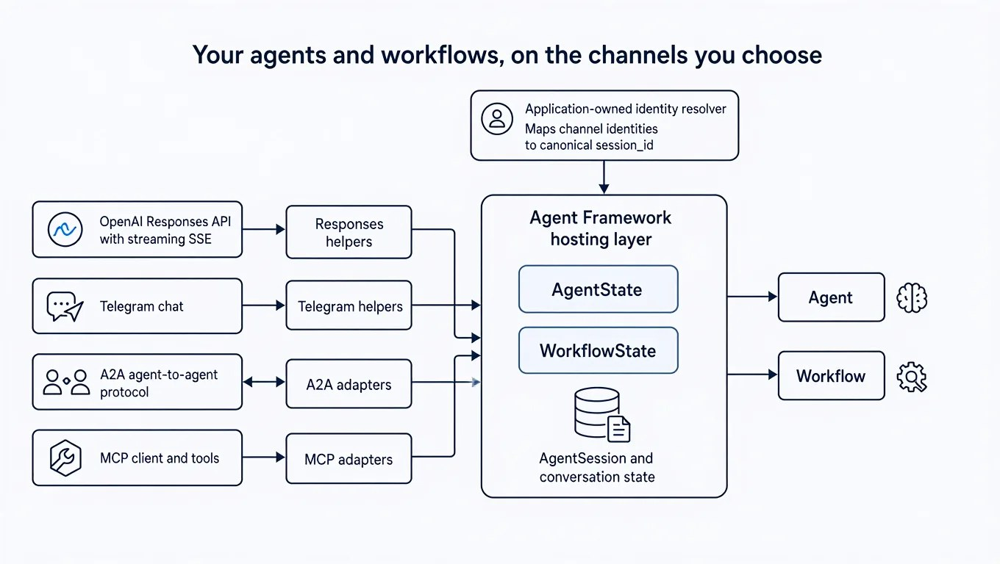

一个 Agent 做成以后，用户可能从 OpenAI Responses 客户端、Telegram 找到它，另一个 Agent 也可能通过 A2A 调用它，MCP 客户端则可能把它当成工具使用。若每增加一种入口就复制一套会话、转换和执行代码，协议细节很快会反过来牵着 Agent 走。

Microsoft Agent Framework 团队在 2026 年 8 月 26 日发布的文章，介绍了 Python 版的 channels：用共享的 hosting 层承载 Agent、Workflow 和会话状态，再用不同的适配包处理协议边界。核心判断可以先记住：适配器负责把协议转换成 Agent Framework 能理解的输入输出，应用负责身份、权限、存储、路由和部署。

## 先看结论：渠道增加，核心不复制

这次新增的包可以按下面的关系理解：

| 层次            | 包                                  | 作用                                                            |
| --------------- | ----------------------------------- | --------------------------------------------------------------- |
| 共享 hosting 层 | `agent-framework-hosting`           | 提供 Agent、Workflow 和会话状态的通用辅助能力                   |
| Responses       | `agent-framework-hosting-responses` | 在 OpenAI Responses 请求、结果与 Agent Framework run 之间转换   |
| Telegram        | `agent-framework-hosting-telegram`  | 在 Telegram update、发送操作与 Agent Framework 输入输出之间转换 |
| A2A             | `agent-framework-hosting-a2a`       | 连接原生 A2A SDK 类型，并生成 Agent Card 等协议对象             |
| MCP             | `agent-framework-hosting-mcp`       | 把 Agent 或 Workflow 暴露为原生 MCP 工具                        |

因此，一个 Agent 或 Workflow 可以接入一个渠道，也可以组合多个渠道。它仍然由应用选择使用的 Web 框架或原生 SDK，渠道包只处理自己的协议转换。



这张图的重点在中央层：左侧的四类入口经过各自的 helper 或 adapter，进入同一个 hosting 层；右侧的 Agent 和 Workflow 仍是被执行的目标。上方的身份解析器决定不同入口是否指向同一个会话。

## 共享状态模型：目标和会话分开处理

`agent-framework-hosting` 提供两个关键状态对象：

- `AgentState` 保存 Agent target 和会话存储，并负责按会话 ID 取得或创建 `AgentSession`。
- `WorkflowState` 从 Workflow 实例、工厂函数或 builder 解析 Workflow target，也可以通过 `cache_target` 决定是否复用解析结果。

两者都允许应用直接传入目标，也允许通过同步或异步初始化逻辑创建目标。目标可以缓存，也可以按请求重新创建。这个设计把「如何找到要执行的 Agent 或 Workflow」从每个协议 handler 里抽出来。

最小的状态初始化大致是这样：

```python
from agent_framework_hosting import AgentState, WorkflowState

agent_state = AgentState(agent)
workflow_state = WorkflowState(workflow_builder, cache_target=False)

# 这是应用代码，用于把身份映射到自己的规范会话 ID。
session_id = resolve_session_id(authenticated_user, channel_identity)
session = await agent_state.get_or_create_session(session_id)
```

这里的 `resolve_session_id` 只是示意，Agent Framework 不会替应用决定 Telegram 用户、Responses 调用方或 A2A context 怎样对应会话。应用需要自行处理身份认证、授权和并发控制。

这也解释了跨渠道连续对话为什么有条件：如果同一个用户从 Responses 和 Telegram 得到相同的 canonical `session_id`，两个入口就会加载并更新同一个 `AgentSession`；如果应用为它们生成不同的 ID，历史记录就会自然分开。Workflow 使用相同的目标解析思路，但渠道续接 ID 到 checkpoint 的映射仍由应用保存。

## Responses：把协议转换集中到 helper

Responses channel 负责处理请求和结果的格式转换，应用仍然决定会话键、可开放的选项、是否流式返回，以及怎样验证续接 ID。下面的代码只保留这条边界，路由、鉴权和异常处理需要由应用补齐：

```python
from agent_framework_hosting_responses import (
    create_response_id,
    responses_from_run,
    responses_session_id,
    responses_to_run,
)

run = responses_to_run(body)
session_id, is_conversation = responses_session_id(body)
response_id = create_response_id()
session_key = session_id if is_conversation else response_id
session = await agent_state.get_or_create_session(session_key)

result = await (await agent_state.get_target()).run(
    run["messages"],
    session=session,
    options=run["options"],
)
await agent_state.set_session(session_key, session)

response = responses_from_run(
    result,
    response_id=response_id,
    conversation_id=session_id if is_conversation else None,
)
```

这里有一个容易被忽略的选择：没有 conversation ID 的请求可以用新建的 response ID 作为临时会话键；有 conversation ID 时，应用才把它当成可续接的会话。这个 ID 必须经过应用自己的权限检查，不能只因为客户端把它发回来就直接读取历史。

官方的 Responses agent 示例使用 FastAPI，展示了原生路由、流式响应和会话续接；Workflow 也可以复用同一接口，只需把会话存储替换成应用维护的 Workflow checkpoint 映射。

## Telegram：转换层不承担 Bot 生命周期

Telegram helper 把原生 update 转成 Agent Framework 的输入，也把流式运行结果转成 Telegram 操作。真正执行这些操作的仍是应用，可以直接调用 Telegram HTTP API，也可以使用 `aiogram` 或 `python-telegram-bot`。

Telegram 相关的运行策略需要放在应用中：

- `/new` 等命令如何处理；
- webhook 鉴权和 polling 的启动方式；
- 图片、文件等媒体怎样转换；
- 流式编辑的频率限制；
- 同一个聊天的消息顺序；
- 发送失败后的重试和交付策略。

这让 Telegram 入口可以有自己的呈现指令。例如，应用可以要求它把长答案拆成短消息，或者通过 context provider 加入适合聊天窗口的格式约束，同时继续复用同一个 Agent。

## A2A 与 MCP：连接原生协议出口

A2A 适配器包括 `AgentA2AAdapter` 和 `WorkflowA2AAdapter`。它们可以生成原生 Agent Card，并让卡片里声明的输入输出模式与转换 helper 保持一致。A2A server 的 executor、任务生命周期、事件队列、路由和 task store 仍由应用控制。

MCP 侧提供 `AgentMCPTool` 和 `WorkflowMCPTool`，可以从 Agent Framework target 派生原生 MCP tool。需要更细控制时，也可以使用底层转换函数，把它们接到 FastMCP 或自己注册的 MCP handler 上。

两类协议的使用场景不同：

| 入口 | 适合解决的问题                                                        | 应用仍需负责的部分                               |
| ---- | --------------------------------------------------------------------- | ------------------------------------------------ |
| A2A  | 让另一个 Agent 按 Agent-to-Agent 协议发现并调用当前 Agent 或 Workflow | Agent Card 之外的 executor、任务状态、事件和存储 |
| MCP  | 让 MCP 客户端以工具方式发现并调用 Agent 或 Workflow                   | server、handler、权限、工具呈现和错误处理        |

所以，接入协议并不会自动生成完整的生产服务。它提供的是协议边界上的转换能力，服务如何运行仍然属于应用设计。

## 多渠道最难的部分是身份映射

同一个 Agent 同时接入多个入口时，真正影响体验的通常是会话 ID 设计。可以先把需求分成两种：

1. **希望连续对话。** 同一个已认证用户从 Responses 转到 Telegram，仍然看到同一段上下文。此时不同渠道的身份需要归一到一个稳定的会话键。
2. **希望隔离对话。** 例如公共 Telegram 聊天与内部 API 使用不同权限和历史。此时可以把渠道命名空间纳入会话键，让历史、权限和保留策略分开。

一个只用于说明思路的 resolver 如下：

```python
def resolve_session_id(user_id: str, channel: str, shared: bool) -> str:
    if shared:
        return f"user:{user_id}:assistant:default"
    return f"user:{user_id}:channel:{channel}"
```

实际系统还要考虑租户、代理身份、会话过期、并发写入和敏感信息隔离。共享会话给用户带来连续体验，也扩大了权限错误和上下文串线的影响范围；隔离会话更容易控制边界，但用户换入口后需要重新开始。这个取舍应当由应用明确记录和测试。

## 一套可复用的职责边界

可以用四层来检查自己的实现是否放对了位置：

| 层                         | 主要内容                                                | 典型负责人                               |
| -------------------------- | ------------------------------------------------------- | ---------------------------------------- |
| Agent / Workflow           | 指令、工具、业务步骤和执行目标                          | Agent Framework 核心代码                 |
| Hosting state              | target 解析、AgentSession 或 Workflow checkpoint 的访问 | `agent-framework-hosting` 加应用存储     |
| Protocol adapter           | 请求、事件、结果和原生协议对象的转换                    | Responses、Telegram、A2A、MCP channel 包 |
| Application infrastructure | 路由、鉴权、授权、数据库、后台任务、部署和监控          | 你的应用                                 |

这个分层带来一个实际好处：更换入口时，通常只需增加对应的 channel 包和协议 handler；更换 Web 框架时，Agent 和 Workflow 的定义也可以保持不变。前提是应用没有把某个渠道的身份、消息格式或生命周期逻辑直接写进 Agent 本身。

## 如何开始选择渠道

如果现在要把一个 Python Agent 接出去，可以按下面的顺序推进：

1. 先选一个真实入口，使用对应的 channel package 和官方 sample 跑通单渠道请求。
2. 把 `resolve_session_id` 写成显式的应用函数，并先覆盖「同一身份」「不同身份」「无权续接」三类测试。
3. 再增加第二个渠道，确认它只负责自己的协议转换，身份和存储策略仍由应用统一管理。
4. 需要 Agent-to-Agent 互调时查看 A2A sample；需要被 MCP 客户端当作工具发现时查看 MCP samples。
5. 对流式输出、重复事件、并发请求和失败重试分别做验证，尤其关注 Telegram 的消息顺序以及 A2A 的任务状态。

当前 HTTP 示例主要使用 FastAPI，但这些 helper 工作在协议转换和执行状态的边界上，也可以接入 Django、Flask、其他 Python Web 框架或原生协议 SDK。官方 hosting 文档和示例仓库适合用来确认当前 API 细节；发布文章还邀请开发者通过 [Channels issue #6265](https://github.com/microsoft/agent-framework/issues/6265) 反馈缺少的渠道与端到端场景。

Microsoft Agent Framework 后续计划继续扩展渠道和辅助能力。对使用者来说，眼下更重要的是先把渠道组合、会话键和应用责任写清楚，再决定是否共享会话，以及哪些状态需要持久化。

如果你在设计 AI 助手、协议接入或多 Agent 工作流，欢迎关注 Aide Hub。这里会继续记录可验证的开发工具与软件工程实践。

## 参考

- [Microsoft Agent Framework Channels：原文](https://devblogs.microsoft.com/agent-framework/introducing-agent-and-workflow-channels)
- [Microsoft Learn：Step 7: Host Your Agent](https://learn.microsoft.com/en-us/agent-framework/get-started/hosting)
- [Agent Framework：Responses agent sample](https://github.com/microsoft/agent-framework/tree/main/python/samples/04-hosting/af-hosting/local_responses)
- [Agent Framework：Responses workflow sample](https://github.com/microsoft/agent-framework/tree/main/python/samples/04-hosting/af-hosting/local_responses_workflow)
- [Agent Framework：Telegram sample](https://github.com/microsoft/agent-framework/tree/main/python/samples/04-hosting/af-hosting/local_telegram)
- [Agent Framework：A2A hosting sample](https://github.com/microsoft/agent-framework/blob/main/python/samples/04-hosting/a2a/agent_framework_to_a2a.py)
- [Agent Framework：MCP hosting samples](https://github.com/microsoft/agent-framework/tree/main/python/samples/04-hosting/mcp)
- [Agent Framework：Channels issue #6265](https://github.com/microsoft/agent-framework/issues/6265)
