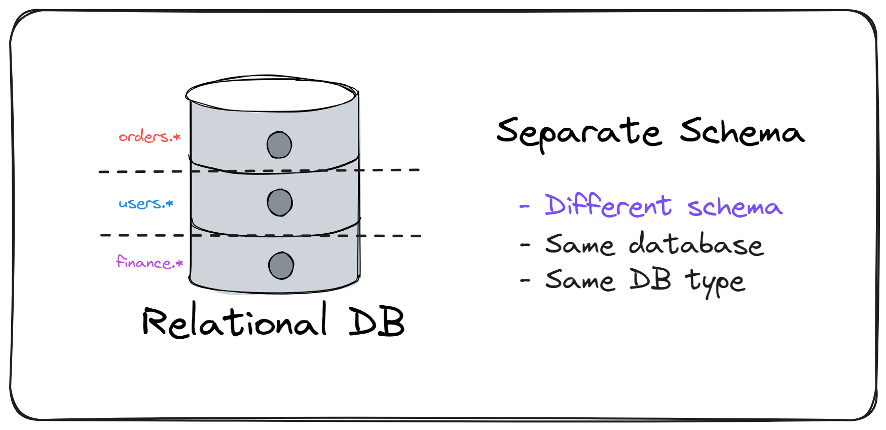

> ## 摘要
>
> 模块化单体应用是一种越来越受欢迎的架构方法。它们结合了模块性和单体设计的优势。数据隔离确保模块是独立且松耦合的。今天，我将向你展示四种模块化单体应用的数据隔离方法。
>
> 原文 [Modular Monolith Data Isolation](https://www.milanjovanovic.tech/blog/modular-monolith-data-isolation?utm_source=Twitter&utm_medium=social&utm_campaign=08.04.2024)

---

模块化单体应用是一种越来越受欢迎的架构方法。它们结合了模块性和单体设计的优势。

模块化单体应用试图解决单体架构和微服务架构的局限性。

我经常看到的一个问题是单体架构中组件间的紧密耦合。

这导致系统不同部分之间的依赖性。

模块化单体应用通过定义明确的模块边界和[**通信模式**](https://www.milanjovanovic.tech/blog/modular-monolith-communication-patterns)来强制执行更好的架构实践。

但是，不能忽视的一个方面是模块间的数据隔离。

数据隔离确保模块是独立且松耦合的。

今天，我将向你展示四种模块化单体应用的数据隔离方法：

- 独立表格
- 独立模式
- 独立数据库
- 不同的持久化方式

为什么数据隔离很重要？

首先，让我们理解为什么在模块化单体架构中数据隔离很重要。

模块化单体有严格的数据完整性规则：

- 每个模块只能访问其自己的表格
- 不允许模块之间共享表格或对象
- 只允许同一模块的表格之间的连接

模块化单体应用中的模块应该是自包含的。每个模块处理自己的数据。其他模块可以使用该模块的公共API访问数据。

这种设计有什么好处？

使模块彼此隔离促进了模块化和松耦合。当组件松耦合时，引入系统新变化变得更容易。出现意外副作用的可能性更小。

如果你使用的是关系数据库，你仍然可以维护参考完整性。提取表格时移除外键不是问题。

级别 1 - 独立表格

最简单的解决方案是在数据库层面没有隔离。所有模块的表格都在一个数据库内。不容易确定哪些表格属于哪个模块。

我只是为了完整性而提及这种方法。

但是，这种方法在特定的应用大小范围内工作得很好。

然而，你拥有的表格越多，将它们在模块间保持隔离就越难。

通过在表格之间添加逻辑隔离可以改善这一点。

级别 2 - 独立模式

在数据库中对相关表格进行分组是引入逻辑隔离的一种方式。你可以使用数据库模式来实现。每个模块都有一个包含模块表格的唯一模式。

现在，很容易区分哪个模块包含哪些表格。

使用[**多个EF Core数据库上下文**](https://www.milanjovanovic.tech/blog/using-multiple-ef-core-dbcontext-in-single-application)是实现这一点的简单方法。

你还可以引入规则来防止查询其他模块的数据。例如，你可以使用[**架构测试**](https://www.milanjovanovic.tech/blog/enforcing-software-architecture-with-architecture-tests)来实现这一点。

当构建模块化单体时，我总是从逻辑数据隔离开始。

但如果这还不够怎么办？

级别 3 - 独立数据库

下一个数据隔离级别是将每个模块的数据移动到独立的数据库中。这种方法比使用模式的数据隔离有更多的限制。

如果你需要模块之间严格的数据隔离规则，这是一种方法。但，缺点是操作复杂性更高。你必须管理多个数据库的基础设施。

然而，这是[**提取模块**](https://www.milanjovanovic.tech/blog/monolith-to-microservices-how-a-modular-monolith-helps)的一个很好的步骤。

首先，你将要提取的模块的表格移动到一个独立数据库。这也迫使你解决模块之间任何数据库耦合问题。一旦你将表格移动到一个独立数据库，你就准备好提取模块了。

我们能进一步加强模块数据隔离吗？

级别 4 - 不同的持久化方式

谁说所有模块必须使用相同的数据库类型？

我大部分时间都在使用关系（SQL）数据库。关系数据库很惊人，可以解决广泛的问题。但有时，文档或图形数据库是一个更好的解决方案。

这里的想法类似：你通过使用独立的数据库进行数据隔离。

然而，你可以引入不同的数据库类型来解决特定问题。例如，你可以对一个模块使用关系数据库。而对另一个模块使用图形或列存储数据库。你还必须在应用程序中维护不同的持久化模型。

这对你的用例来说可能是一个值得的权衡。但这需要仔细规划。

总结

如果你不立即需要微服务，模块化单体是一个绝佳的选择。你以系统内有明确边界的单体形式开发应用程序。你仍然有灵活性来[**提取模块并转移到微服务**](https://www.milanjovanovic.tech/blog/monolith-to-microservices-how-a-modular-monolith-helps)。但与模块化单体相比，你有更快的开发速度。

模块必须遵守一些规则。它们只能访问自己的表格。它们不能与其他模块共享表格。它们不能直接查询其他模块的表格。这些规则有助于在模块之间强制实施数据隔离。

但是，你仍然必须在数据库级别实施数据隔离。

你可以选择四个选项：

- 独立表格
- 独立模式
- 独立数据库
- 不同的持久化方式

我总是选择使用模式的逻辑隔离。它易于实施并帮助我更好地理解我的边界。根据需求，我可以稍后引入独立的数据库。

希望这对你有所帮助。

下周见。

---
