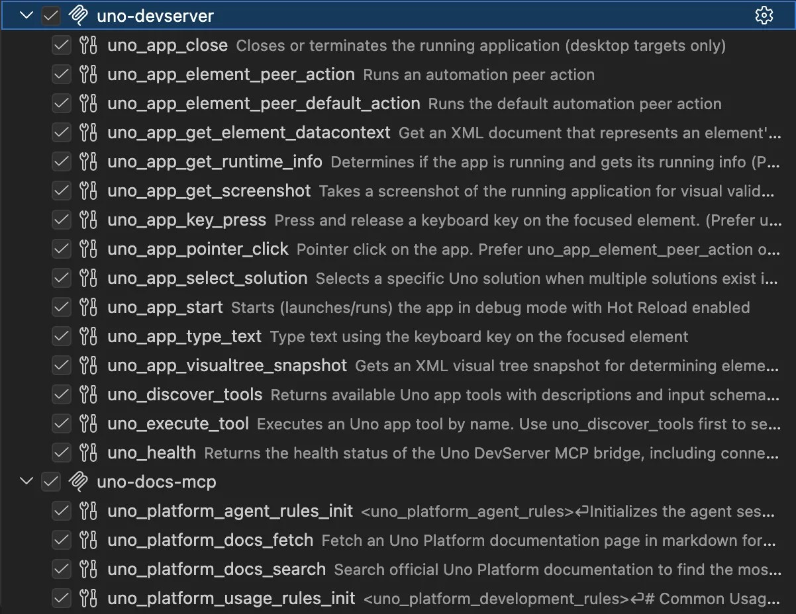
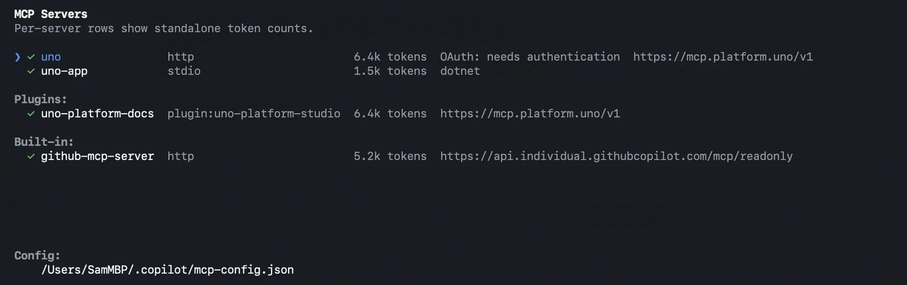
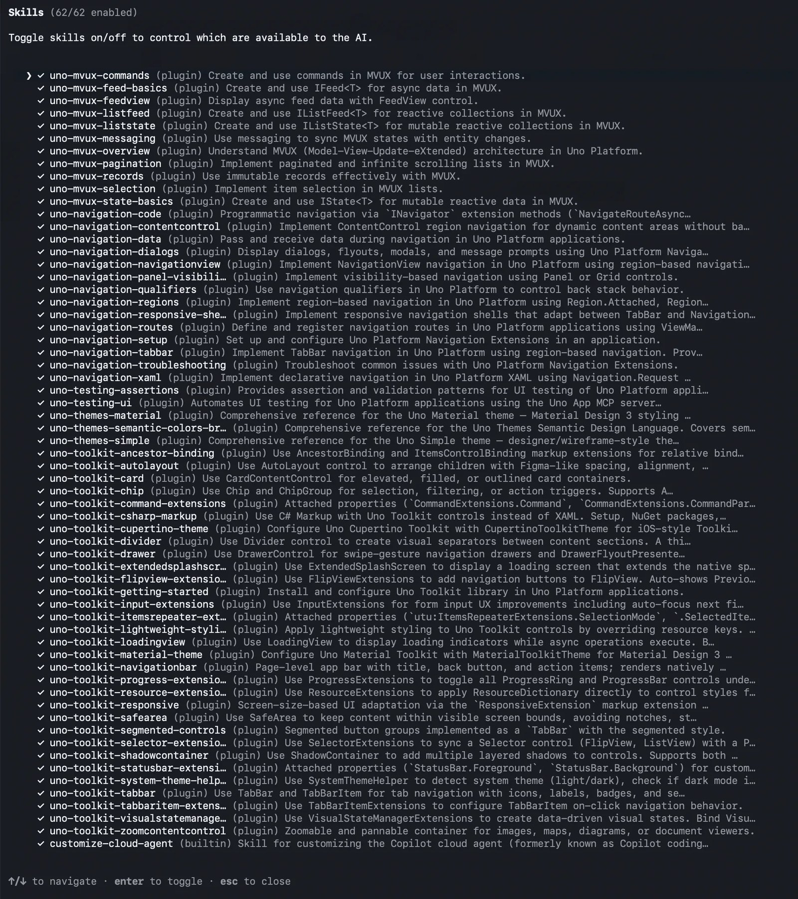
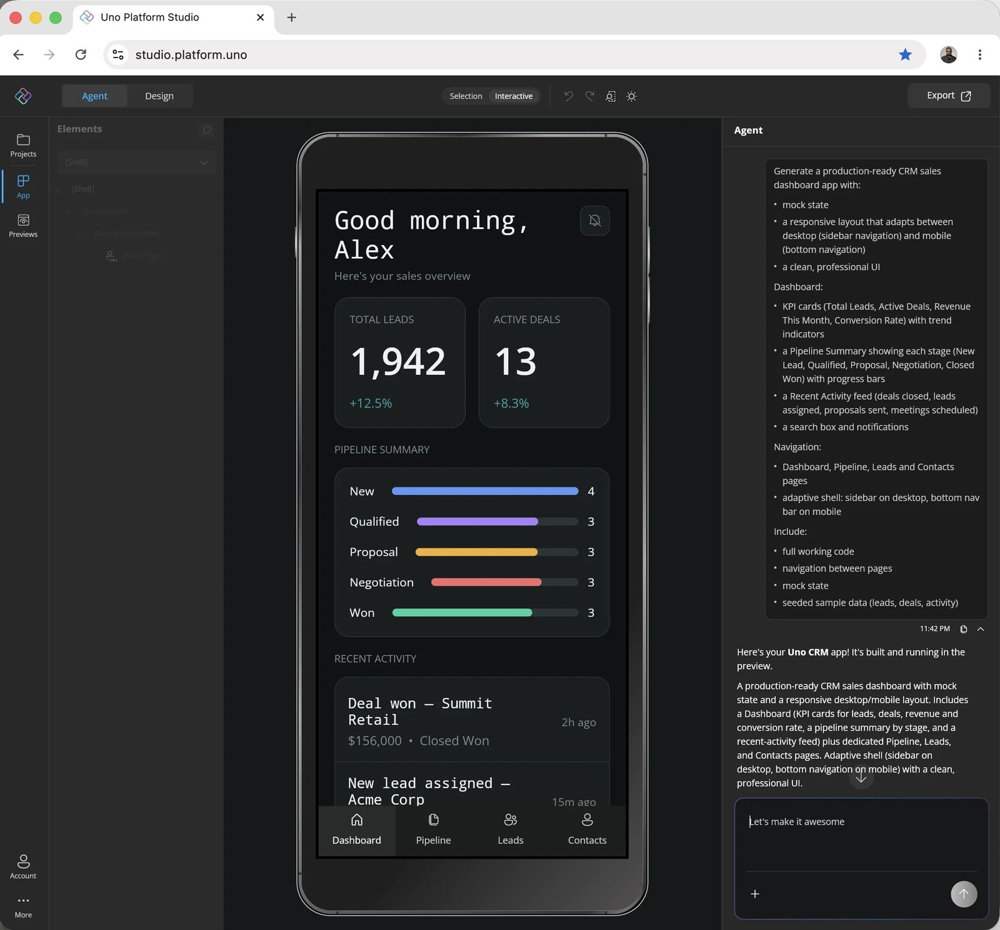
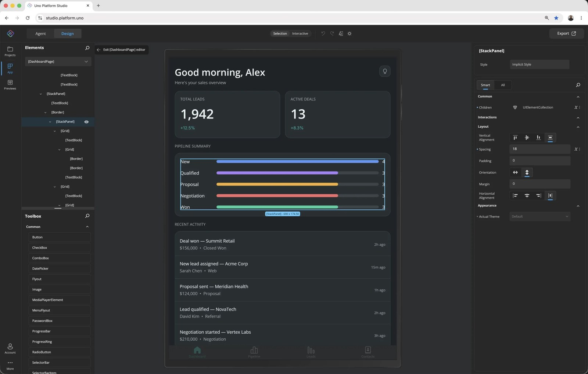

让一个 AI agent 给跨平台 .NET 应用写一个设置页面，会发生什么？

它写得出来，能编译，如果你只读代码，它甚至能通过审查。但错误往往藏在运行时：某个布局在目标平台上根本不成立，某个交互点击落不到正确控件上，某个平台特有的行为让页面行为和你预期的不一样。Uno Platform 的开发者倡导者 Sam Basu 在 [.NET Blog 的客座文章](https://devblogs.microsoft.com/dotnet/how-uno-platform-uses-dotnet-mcp-ai-to-build-high-quality-apps/)里把这件事总结得很直接：生成变便宜了，验证没有。

他在这篇文章里公开了 Uno Platform 的答案：**两个 MCP 服务器，按生命周期拆分**。一个回答「框架现在什么是对的」，一个回答「正在运行的应用现在发生了什么」。前者给 AI 接地，后者给它眼睛和手，让它能检查自己的产出。

## 先看结论：为什么不是一个服务器

最容易想到的做法是把官方文档塞进 prompt，再附一份长的 instructions 文件。它失败的原因在事后看很清楚：文档体量大、有用的切片小且随查询变化，再大的 prompt 也替代不了 agent 在提问的那一刻去查资料。

[Model Context Protocol](https://modelcontextprotocol.io/) 解决了「查找」问题，但没有解决「验证」问题。知道一个 API 应该是什么，并不等于知道刚写出来的布局真的渲染了没有。这是两件事，生命周期也完全不同：

| 维度       | 文档服务器               | 应用服务器                |
| ---------- | ------------------------ | ------------------------- |
| 回答的问题 | 框架现在什么是对的       | 应用现在实际发生了什么    |
| 变化时机   | 发版时（发布新文档）     | 运行时（应用状态在变）    |
| 传输方式   | HTTP（托管的多租户服务） | stdio（个人开发机子进程） |
| 状态       | 无状态                   | 有状态，属于一次会话      |

对应的就是两个服务器，而不是一个服务器里塞两类工具。

## 文档服务器：负责「接地」

文档服务器托管在 `https://mcp.platform.uno/v1`，走 HTTP，无状态，回答「关于这个框架，现在什么是真的」——这个问题的答案在发布时变化，而不是在应用运行时变化。

它提供四个工具：

- `uno_platform_docs_search`：搜索官方文档并返回最相关的结果；
- `uno_platform_docs_fetch`：把整篇文档页以 Markdown 形式取回；
- `uno_platform_agent_rules_init`：初始化 agent 会话，加载针对运行中应用的工作规则；
- `uno_platform_usage_rules_init`：加载常用 API 使用规则。

另外还有两个内置 prompt：`/new` 用当前最佳实践创建一个新应用，`/init` 在给既有代码库加功能前初始化一个已有会话。

这个服务器最关键的设计属性是：**它和文档一起版本化，而不是和开发者的 SDK 一起版本化**。修正一页文档，全世界的 agent 下一次调用就会拿到修正。把指导内容放进 NuGet 包再分发，是另一种维护口径——这正是 Uno Platform 选择托管而不是分发的原因。

## 应用服务器：给 agent 装眼睛和手

应用服务器在另一个维度上完全相反：它作为 .NET 工具通过 stdio 启动，运行在开发者机器上，作为 Uno DevServer 的桥接，有状态，且严格属于一个会话。它回答「现在实际发生了什么」。

它的能力可以分成四类：

| 能力 | 工具                                                              | 作用                                                                         |
| ---- | ----------------------------------------------------------------- | ---------------------------------------------------------------------------- |
| 跑   | `uno_app_start`                                                   | 以调试模式启动应用并启用 Hot Reload，agent 接管整个生命周期，而不是等人按 F5 |
| 看   | `uno_app_get_screenshot`                                          | 拿像素截图                                                                   |
| 看   | `uno_app_visualtree_snapshot`                                     | 拿可视化树的 XML 快照                                                        |
| 动   | `uno_app_pointer_click`、`uno_app_key_press`、`uno_app_type_text` | 模拟点击、按键、输入                                                         |
| 动   | `uno_app_element_peer_action`                                     | 直接调用自动化 peer 操作元素                                                 |
| 自查 | `uno_health`                                                      | 报告桥接与连接状态，区分「应用坏了」和「连接断了」                           |

其中真正值回票价的是可视化树工具。截图告诉模型「看起来不对」，XML 树告诉它「哪个元素有问题、属性是什么」。像素用于检测，结构用于诊断，agent 两者都需要。

工具列表里还藏着一个值得单独拎出来的细节：`uno_app_pointer_click` 的描述里写着「优先使用 `uno_app_element_peer_action`」。这个偏好写在工具描述本身，而不是写进没人会读的文档，因为坐标点击在不同窗口尺寸和 DPI 下很脆弱，而自动化 peer 是稳定的。后面会看到为什么这一点很关键。

## 实现中的两条经验

两个服务器都用官方 [MCP C# SDK](https://github.com/modelcontextprotocol/csharp-sdk) 编写（由微软与社区协作维护）。Sam Basu 给要开始做同类工作的 .NET 团队两条建议。

**第一，用拓扑决定传输。** 文档服务器用 HTTP，因为它是托管的多租户服务、需要 OAuth；应用服务器用 stdio，因为它是开发机上的子进程、只和运行中的一个应用通信。把约束写下来之后，传输方式基本没有可纠结的余地。

**第二，工具定义是上下文窗口的常驻税。** 每个工具的名称、描述和输入 schema 都会在模型开始工作之前加载。Uno Platform 的实测成本是：文档服务器约 6.4k token，应用服务器约 1.5k，而同一个会话里内置的 GitHub MCP 服务器约 5.2k。这是在回答第一个问题之前就花掉的预算。

这两点合起来有个推论：**工具描述是 prompt，不是文档**。模型从不选用的工具等于不存在，而你能影响的唯一杠杆就是措辞。这不是文案偏好，而是一次在决策发生时刻的引导。

## 生成与验证是两个不同的问题

把话题拉回到开头那句「生成变便宜了，验证没有」：AI 写 UI 代码比任何人类团队都快，但它无法判断自己写的是否正确。当 agent 工作流成为常态，这个不对称就是瓶颈所在。

Web 开发者早就解决了自己的一半：Playwright 驱动真实浏览器，agent 可以检查自己的工作。原生跨平台 .NET 应用（Windows、macOS、Linux、iOS、Android、WebAssembly）一直没有等价物——应用一旦启动就是黑盒。

应用服务器就是 Uno Platform 给出的答案：[Playwright 式的 .NET UI 自动化](https://platform.uno/blog/playwright-for-dotnet-apps/)。闭环流程是：agent 写改动，应用热重载，agent 截图、读可视化树、点击走一遍流程，然后自己判断改动是否达到了目的；没有达到，就自己修完再交回。正如原文那句总结：代码是便宜的，软件不是。

## Skills：告诉 agent「怎么做」

MCP 工具给 agent 的是「what」——每件事做什么。它们不回答：什么时候用哪个、按什么顺序、什么样子算「做完」。这些是 [Skills](https://github.com/unoplatform/studio/tree/main/skills) 的职责。

原文用了一个很贴的类比：**MCP 工具是食材**，原子化、各做一件事；**Skills 是菜谱卡**，把食材组合成值得端上桌的东西的可复用说明；**agent 是厨师**，选菜谱并根据厨房里实际有的东西调整。

Skills 库按「你正在做的事」组织：MVUX 状态与 feeds、导航、主题、Uno Toolkit 控件、测试。其中收尾闭环的是 `uno-testing-ui`——它把通过应用服务器驱动 UI 测试的完整顺序固化成技能，agent 不用每次会话都从头推导怎么用那些工具。

Skills 以插件形式安装，任何 MCP 兼容的 agent 都能用。接地文档、可以检查的活应用、为关键工作流精选的操作流程，这三者的组合就是原文所说的「contextual AI」。

## 合起来：在浏览器里跑着一个编译器

这套基础设施最终指向的东西，是 [Uno Platform Studio 3.0](https://platform.uno/blog/introducing-uno-platform-studio-3-0-ai-native-productivity-platform-for-enterprise-net-applications/)：完全在浏览器里生成一个完整的跨平台 .NET 应用。

提示框背后，由 [Microsoft Agent Framework](https://learn.microsoft.com/agent-framework/overview/) 编排的专用 agent 在并行步骤和多轮对话中规划并执行工作；然后一个完整的 [Roslyn](https://github.com/dotnet/roslyn) workspace 编译 agent 写出的代码，加载生成的程序集，解析 NuGet 变更，把结果热重载进正在运行的应用——全程在浏览器里，而你就在旁边看着。

在这个闭环里，三个角色分工明确：文档服务器保持 agent 的知识最新，应用服务器让它能检查自己的工作，Skills 让它在轨道上跑。原文描述这个场景时说得很有张力：这是编译器在一个编译器没有正当理由出现的地方运行。

对团队来说，实际后果是 agent 不再是「快速打字员」。它知道你的设计系统，它针对运行中的应用验证自己的产出，它遵循你选的流程——这和「更快的写代码」是两回事。

生成的 .NET 应用在浏览器里完全可交互，支持页面导航和 Previews，可以单独隔离编辑 UI。开发者可以用 agent 迭代，也可以在浏览器里手动用 Hot Design 调整，改动通过 Hot Reload 即时可见。想下线时，带着同一套工具落到本地 IDE 或 CLI 即可，没有进入门槛。

## 为什么他们坚持往上游做

这样一套东西，如果地基不受自己影响是造不出来的——这是 Uno Platform 向上游投入的真实原因。

他们与 Microsoft .NET 团队联合维护 [SkiaSharp](https://github.com/mono/SkiaSharp)：它是大量 .NET 图表、自定义控件和数据可视化底下的 2D 图形 API，基于 Google 的 Skia（Chrome 和 Android 用的同一个引擎），也是 Uno Platform 的渲染基础。[联合维护身份](https://platform.uno/blog/skiasharp-4-co-maintainer-announcement/)在 SkiaSharp 4.0——该项目多年来的最大一次发布——之前正式化，是把多年的投入落成制度。

他们还在微软 .NET 团队的[正式协作](https://platform.uno/blog/announcing-unoplatform-microsoft-dotnet-collaboration/)里直接参与 .NET 运行时工作，包括 .NET for Android 与 .NET for iOS 的绑定，以及 .NET 10 的 AOT 贡献。

模式和他们整篇文章描述的相同：**越往上游修，越多人永远不用再想这件事**。

## 给想搭 MCP 服务器的你

如果你准备为自己的 .NET 栈构建 MCP 服务器，可以带走两条实践，再加一张自评清单。

两条核心建议来自原文：

1. **按生命周期拆服务器，而不是按功能拆**。发版时才变化的知识，不该和运行时变化的状态共处同一进程。
2. **在工具描述上花真时间**。它们是 prompt，是从不被选中的工具就等于不存在的那个杠杆。

结合文章内容，可以进一步自问：

- 你栈里「查找」的失真在哪里？agent 正在被过期或错位的知识误导吗？能不能像 Uno Platform 那样，把文档知识做成一个随文档版本化、随时可查的服务器？
- 你栈里「运行」的黑盒在哪里？agent 写完 UI 之后，除了人工看截图，它有没有能力自己读结构、点流程、判断结果？
- 你的工具描述是在「文档化」，还是在「引导选择」？一条「优先使用 XX」写在描述里，比写在文档里有效得多。

还要看到这套方案的边界：验证能力依赖应用本身可编程——Uno DevServer 提供了热重载、可视化树和自动化 peer，如果你家的框架没有这些检查面，一个接地用的文档服务器仍然是低成本、可先落地的第一步。

从 MCP C# SDK 到 Roslyn 再到 Agent Framework，整套栈都是 .NET。想直接试的读者，可以从 [aka.platform.uno/mcp](https://aka.platform.uno/mcp) 开始。

Aide Hub 会继续分享 AI 助手、开发工具与软件工程实践，想一起跟进 .NET 生态与 agent 工作流的朋友，可以留意后续推送。

## 参考

- [How Uno Platform uses .NET, MCP, and AI to build high quality apps . .NET Blog](https://devblogs.microsoft.com/dotnet/how-uno-platform-uses-dotnet-mcp-ai-to-build-high-quality-apps/)
- [Model Context Protocol](https://modelcontextprotocol.io/)
- [Model Context Protocol C# SDK](https://github.com/modelcontextprotocol/csharp-sdk)
- [Uno Platform MCP 服务器入口](https://aka.platform.uno/mcp)
- [Playwright 式的 .NET UI 自动化](https://platform.uno/blog/playwright-for-dotnet-apps/)
- [Uno Platform Studio Skills 库](https://github.com/unoplatform/studio/tree/main/skills)
- [Introducing Uno Platform Studio 3.0](https://platform.uno/blog/introducing-uno-platform-studio-3-0-ai-native-productivity-platform-for-enterprise-net-applications/)
- [Microsoft Agent Framework](https://learn.microsoft.com/agent-framework/overview/)
- [SkiaSharp co-maintainer 公告](https://platform.uno/blog/skiasharp-4-co-maintainer-announcement/)
- [Uno Platform 与 Microsoft .NET 团队协作公告](https://platform.uno/blog/announcing-unoplatform-microsoft-dotnet-collaboration/)
