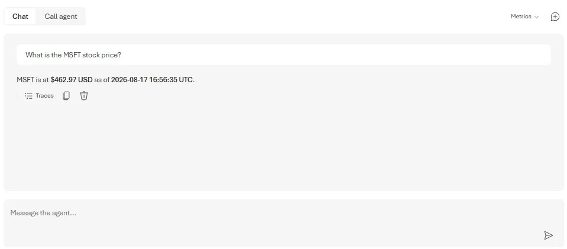

一个能规划、读持仓、下单前先确认、记住重要信息、按需加载技能、用 shell 整理文件、用 CodeAct 算数、把研究派发给后台 agent 的个人财务助手——这是 [Microsoft Agent Framework](https://learn.microsoft.com/agent-framework/overview/) 系列前三部分的成果。它在你机器上工作得很好。

但「在我机器上能用」不等于「能给别人用」。Wes Steyn（Principal Software Engineer）在系列[第四部分](https://devblogs.microsoft.com/agent-framework/agent-harness-making-your-claw-production-ready/)里要补的正是这个缺口，按四条线展开：

- **可观测**：用 OpenTelemetry 看清 agent 在干什么（trace、token 用量、工具调用）；
- **治理**：用 Microsoft Purview 对提示词与响应做合规筛查，让数据访问可发现、可分类、可审计；
- **部署**：以 Foundry Hosted Agent 的形式托管；
- **评估**：用本地财务检查与 Foundry 托管评测量化质量，再据此调 prompt、工具与技能。

这四件事有一个共同的前提：生产环境里的 agent 通常不止一种跑法——开发时交互式运行、上线后云端托管、CI 里塞进评测框架。所以正文先做一个结构性改动，再逐条展开。

## 先改结构：定义一次，三个宿主

前三部分里每一步都是单个程序。现在把 claw 拆成一个**共享 agent 工厂（shared agent factory）**加三个薄宿主：`console`（本机交互）、`hosted`（云端托管服务）、`evals`（评测运行器）。agent 只定义一次，变的只有外面的壳。

工厂里放着所有让这个 agent 成为「我们的」的东西：instructions、文件访问、估值与风险技能、memory、审批、shell、CodeAct、后台研究 agent。.NET 里工厂返回构建好的 agent 以及宿主需要释放的资源：

```csharp
await using ClawAgentBuild build = await ClawAgentFactory.CreateAsync(
    new ClawAgentFactoryOptions
    {
        Log = Console.WriteLine,
    });
// build.Agent 就是 Part 3 里的同一个 claw：skills、shell、CodeAct、后台 agents、approvals。
```

Python 里是返回 async context manager 的工厂，shell 和 MCP skills 会话可以被干净地拆除：

```python
agent = await build_claw_agent(credential=AzureCliCredential())

async with agent:
    # ... run the agent ...
```

一个定义供应所有宿主，意味着可观测、治理、部署、评估都作用在**同一个 agent**上——而不是三份微妙不同的拷贝。

## 可观测：harness 生产遥测，你只选去向

会读文件、跑代码、调工具的 agent 本质上是个小型分布式系统。出问题时——技能误触发、工具死循环、一次响应花了 10 倍于预期的成本——你需要能「看见」。harness 已经为模型调用、工具调用和 token 用量生成了 OpenTelemetry spans、metrics 和 logs，你只需要接上 exporter。

agent 带一个固定的 OpenTelemetry source name，宿主可以只订阅它的信号。.NET 端这是 harness 选项里的一项：

```csharp
AIAgent agent = chatClient.AsHarnessAgent(
    new HarnessAgentOptions
    {
        OpenTelemetrySourceName = ClawAgentFactory.OpenTelemetrySourceName,
        // ... file access, skills, shell, CodeAct, background agents ...
    });
```

当设置 `OTEL_EXPORTER_OTLP_ENDPOINT` 时，console 宿主会建立指向该 source 的 trace 和 metric provider，并把遥测发到配置的 OTLP collector：

```csharp
var otlpEndpoint = Environment.GetEnvironmentVariable("OTEL_EXPORTER_OTLP_ENDPOINT");
var telemetryEnabled = !string.IsNullOrWhiteSpace(otlpEndpoint);

using var tracerProvider = telemetryEnabled
    ? Sdk.CreateTracerProviderBuilder()
        .AddSource(ClawAgentFactory.OpenTelemetrySourceName)
        .AddOtlpExporter(options => options.Endpoint = new Uri(otlpEndpoint!))
        .Build()
    : null;
```

Python 端默认即插桩，一个调用就从环境变量接好 provider（OTLP 端点、console exporter、敏感数据捕获）：

```python
from agent_framework.observability import configure_otel_providers, get_tracer

configure_otel_providers()
with get_tracer().start_as_current_span("Claw Console Session"):
    agent = await build_claw_agent(credential=AzureCliCredential())
    async with agent:
        # ... run the agent; spans, metrics, and logs flow to your collector ...
```

这里要分清分工：harness 负责**生产**遥测（每次工具调用、每轮模型的 span，token 用量指标，结构化日志）；你负责选择**去向**——OTLP collector、console，或 [Azure Monitor / Application Insights](https://learn.microsoft.com/azure/azure-monitor/)。本机自己接 exporter；托管在 Foundry 上时**什么都不用接**，托管运行时注册好 exporter 管线，Foundry 还会自动注入 `APPLICATIONINSIGHTS_CONNECTION_STRING`，trace、metrics、logs 零配置落进 Application Insights。

想在 trace 里带提示词和响应内容（默认关闭）时，.NET 设 `OTEL_INSTRUMENTATION_GENAI_CAPTURE_MESSAGE_CONTENT=true`，Python 设 `ENABLE_SENSITIVE_DATA=true`。

## 治理：Purview 中间件，一行接入

财务助手碰的是敏感材料。受监管的场合要求提示词和响应在到达模型/用户前对照组织策略筛查——信用卡号、保密持仓、违规内容——并留下审计轨迹。[Microsoft Purview](https://learn.microsoft.com/purview/purview) 干的就是这件事，而集成方式只是 chat client 外面的一层薄包装，可以和 claw 的其他能力任意组合。

实现是 opt-in 的：设置 `PURVIEW_CLIENT_APP_ID` 时工厂才加 Purview，否则原样运行。.NET 里是 chat client 上的一步 builder：

```csharp
if (!string.IsNullOrWhiteSpace(purviewClientAppId))
{
    chatClient = chatClient
        .AsBuilder()
        .WithPurview(browserCredential, new PurviewSettings("Claw"))
        .Build();
}
```

Python 里是交给 `FoundryChatClient` 的 chat middleware：

```python
from agent_framework.microsoft import PurviewChatPolicyMiddleware, PurviewSettings

middleware = []
if client_app_id := os.environ.get("PURVIEW_CLIENT_APP_ID"):
    credential = InteractiveBrowserCredential(client_id=client_app_id)
    middleware = [PurviewChatPolicyMiddleware(credential, PurviewSettings(app_name="Claw"))]

client = FoundryChatClient(credential=..., middleware=middleware)
```

之后每个提示词在到达模型前、每个响应在到达用户前都会被检查；被拦截的内容替换成一条策略提示，交互记录进审计日志。前提是 Microsoft 365 E5 租户配上相应的 Graph 权限——完整配置见官方的 [AgentWithPurview](https://github.com/microsoft/agent-framework/tree/main/dotnet/samples/05-end-to-end/AgentWithPurview)（.NET）与 [purview_agent](https://github.com/microsoft/agent-framework/tree/main/python/samples/05-end-to-end/purview_agent)（Python）示例。

## 部署：Responses 协议的薄壳

因为 agent 只定义一次，托管基本是接线而非重写。`hosted` 宿主拿到同一个 `build.Agent`，用 Responses 协议暴露给 Foundry。.NET 端整个宿主就是一个很薄的 ASP.NET 应用：

```csharp
using Azure.Core;
using Azure.Identity;
using ClawAgent;
using Microsoft.Agents.AI.Foundry.Hosting;

// 生产上最好用具体凭据（如 ManagedIdentityCredential）；下面的链式凭据先试 dev token（本地 Docker 调试），再走 DefaultAzureCredential。
TokenCredential credential = new ChainedTokenCredential(
    new DevTemporaryTokenCredential(),
    new DefaultAzureCredential());

await using ClawAgentBuild build = await ClawAgentFactory.CreateAsync(
    new ClawAgentFactoryOptions
    {
        ProjectEndpoint = Environment.GetEnvironmentVariable("FOUNDRY_PROJECT_ENDPOINT"),
        DeploymentName = Environment.GetEnvironmentVariable("FOUNDRY_MODEL"),
        Credential = credential,

        // 托管容器里关掉文件系统与 shell 访问（见下文风险说明）
        EnableFileAccess = false,
        EnableShell = false,
    });

var builder = WebApplication.CreateBuilder(args);

// 注册 Responses API 宿主，并且自动应用 OpenTelemetry。
builder.Services.AddFoundryResponses(build.Agent);

var app = builder.Build();

// 线上 Foundry 调用的端点。
app.MapFoundryResponses();

app.Run();
```

Python 端对应的是 responses host server：

```python
from agent_framework_foundry_hosting import ResponsesHostServer

agent = await build_claw_agent(
    credential=DefaultAzureCredential(),
    enable_file_access=False,   # 托管容器上关闭
    enable_shell=False,         # 托管容器上关闭
)
await ResponsesHostServer(agent).run_async()
```

托管时的核心遥测收集与导出自动配置，两种语言都**没有 exporter 要配**：.NET 里 `AddFoundryResponses` 自动把 agent 包进 `OpenTelemetryAgent`，Foundry 托管运行时注册 OTLP exporter 管线；Python 端 Agent Framework 原生插桩（默认开启），托管运行时收集并导出 spans——所以 hosted 宿主完全不调 `configure_otel_providers()`（和本地 console 不同）。

### 刻意分歧一：托管时关掉文件访问与 shell

这是在托管环境里唯一一处**故意**和 console 不一致的地方。共享托管环境里，让模型任意读写容器文件系统、或者让它执行 shell 命令，是严重的安全风险——数据外泄、篡改、持久化——即使有 deny-list 也不能完全挡住。所以 hosted 构建设置 `EnableFileAccess = false` 和 `EnableShell = false`，后台 agent 保持开启。如果你确实要在托管容器里启用文件访问或 shell，把它当生产安全决策对待，并且严格限定范围。

如果托管时真的需要文件访问，别碰容器磁盘——换成外部 `AgentFileStore`，比如用 Azure Blob Storage 实现。.NET：

```csharp
await using ClawAgentBuild build = await ClawAgentFactory.CreateAsync(
    new ClawAgentFactoryOptions
    {
        // ...
        EnableFileAccess = true,
        FileStore = new MyBlobAgentFileStore(blobContainerClient),
    });
```

Python 对应 `file_access_store` 参数（`enable_file_access=True` 时传入）。claw 通过这个 store 的抽象读写文件，文件落在 blob 存储里——有治理、可持久、可共享——而不是临时的容器磁盘上。

### 刻意分歧二：容器里的 CodeAct

本地 CodeAct 跑在 Hyperlight 上，用 VM 支撑的微沙箱隔离 guest 代码。托管构建里换成一个 `CodeActProvider` 支撑的 `LocalCodeAct`——它在子进程里运行生成的 Python，把托管容器本身当沙箱，这和官方的 `Hosted-LocalCodeAct` 示例一致（容器镜像安装 `python3` 供它使用）。.NET：

```csharp
await using ClawAgentBuild build = await ClawAgentFactory.CreateAsync(
    new ClawAgentFactoryOptions
    {
        // ...
        CodeActProvider = new LocalCodeActProvider(
            Environment.GetEnvironmentVariable("LOCAL_CODEACT_PYTHON") ?? "python3"),
    });
```

注意原文的警告：`LocalCodeAct` 本身**不是**沙箱——它执行模型生成的 Python，所以只应该放在外部受沙箱保护的环境里跑，比如 hosted-agent 的容器。想彻底去掉 CodeAct，设 `EnableCodeAct = false`。

### 构建与部署：manifest 与 agent 定义分工

两个宿主都带 `agent.manifest.yaml` 和 `agent.yaml`，但职责不同：**manifest** 是传给 `azd ai agent init` 的模板，含 agent 名称、元数据、协议与可配置参数；**agent 定义**描述 Foundry 实际跑什么——Responses 协议、CPU 与内存、容器需要的环境变量。示例文件直接看仓库里的 [.NET manifest](https://github.com/microsoft/agent-framework/blob/main/dotnet/samples/02-agents/Harness/BuildYourOwnClaw/Claw_Step04_ProductionReady/ClawAgent.Hosted/agent.manifest.yaml)、[.NET agent definition](https://github.com/microsoft/agent-framework/blob/main/dotnet/samples/02-agents/Harness/BuildYourOwnClaw/Claw_Step04_ProductionReady/ClawAgent.Hosted/agent.yaml)、[Python manifest](https://github.com/microsoft/agent-framework/blob/main/python/samples/02-agents/harness/build_your_own_claw/claw_step04_production_ready/agent.manifest.yaml) 和 [Python agent definition](https://github.com/microsoft/agent-framework/blob/main/python/samples/02-agents/harness/build_your_own_claw/claw_step04_production_ready/agent.yaml)（链接为原文）。

部署路径按语言不同。Python 用 Foundry 默认的代码（ZIP）部署：`azd` 上传自包含的示例文件夹、安装 `requirements.txt`、启动 `hosted.py`，初始化时把入口传进去：

```bash
cd python/samples/02-agents/harness/build_your_own_claw/claw_step04_production_ready
azd ai agent init -m agent.manifest.yaml --entry-point hosted.py
azd up      # 后续推送改用 azd deploy
```

.NET 示例部署为容器镜像，因为它以 `ProjectReference` 方式引用 Agent Framework 仓库源码，并使用仓库级的 Central Package Management（`Directory.Packages.props`）。ZIP 部署只上传项目文件夹，服务端还原无法解析这些仓库外引用——所以先本地 publish，再让 `azd` 构建并推送镜像：

```bash
# 在 ClawAgent.Hosted 目录：
dotnet publish -c Release -f net10.0 -r linux-x64 --self-contained false -o out

# 仅首次：
azd ai agent init -m agent.manifest.yaml --deploy-mode container
azd up      # 后续重新 publish 后改用 azd deploy
```

.NET 的 Dockerfile 把已发布的 `out/` 复制进一个启用 `python3` 的 `aspnet:10.0` 镜像。完整前置条件和身份分配见 [.NET 部署指南](https://github.com/microsoft/agent-framework/tree/main/dotnet/samples/02-agents/Harness/BuildYourOwnClaw/Claw_Step04_ProductionReady/ClawAgent.Hosted#deploy-to-foundry-container-path) 或 [Python 部署指南](https://github.com/microsoft/agent-framework/tree/main/python/samples/02-agents/harness/build_your_own_claw/claw_step04_production_ready#deploy-to-foundry)。

## 评估：本地检查 + 模型评分，两层兜底

上线前后你都需要知道 claw 是不是**真的够好**，也要确认改动没有引入回归，或对比不同 prompt 找最优版本。`evals` 宿主构建 agent 后跑一小撮财务查询，用两层检查。

**本地检查**是普通函数——快、免费、能进 CI。.NET：

```csharp
LocalEvaluator localEvaluator = new(
    FunctionEvaluator.Create("numeric_valuation", item =>
        !item.Query.Contains("Value MSFT", StringComparison.OrdinalIgnoreCase)
        || Regex.IsMatch(item.Response, @"\d")));

AgentEvaluationResults results = await build.Agent.EvaluateAsync(queries, localEvaluator);
Console.WriteLine($"Passed: {results.Passed}/{results.Total}");
```

Python 用 `@evaluator` 装饰器表达同样的想法：

```python
@evaluator(name="numeric_valuation_answer")
def numeric_valuation_answer(query: str, response: str) -> bool:
    return "msft" not in query.lower() or any(c.isdigit() for c in response)

local = LocalEvaluator(numeric_valuation_answer)
results = await evaluate_agent(agent=agent, queries=queries, evaluators=local)
print(f"{results[0].passed}/{results[0].total}")
```

**Hosted Foundry evals** 增加模型评分（relevance、coherence）和可分享的报告，用 `FOUNDRY_PROJECT_ENDPOINT` 控制开关，保证本地检查永远先跑：

```csharp
// .NET
FoundryEvals foundryEvals = new(projectClient, deploymentName, FoundryEvals.Relevance, FoundryEvals.Coherence);
AgentEvaluationResults quality = await build.Agent.EvaluateAsync(queries, foundryEvals);
```

```python
# Python
from agent_framework.foundry import FoundryChatClient, FoundryEvals

foundry = FoundryEvals(
    client=FoundryChatClient(credential=credential),
    evaluators=[FoundryEvals.RELEVANCE, FoundryEvals.COHERENCE],
)
quality = await evaluate_agent(agent=agent, queries=queries, evaluators=foundry)
```

每次变更都跑，分数会告诉你一条新指令、新工具或新技能是帮忙还是帮倒忙——这就是让线上 agent 保持诚实的调优回路。

## 跑起来：三个入口和一些开关

.NET 分别运行 console、evals 或 hosted 服务：

```bash
cd dotnet
dotnet run --project samples/02-agents/Harness/BuildYourOwnClaw/Claw_Step04_ProductionReady/ClawAgent.Console
dotnet run --project samples/02-agents/Harness/BuildYourOwnClaw/Claw_Step04_ProductionReady/ClawAgent.Evals
dotnet run --project samples/02-agents/Harness/BuildYourOwnClaw/Claw_Step04_ProductionReady/ClawAgent.Hosted
```

Python 对应三个脚本（用 `uv run`）：

```bash
uv run python/samples/02-agents/harness/build_your_own_claw/claw_step04_production_ready/console.py
uv run python/samples/02-agents/harness/build_your_own_claw/claw_step04_production_ready/evals.py
uv run python/samples/02-agents/harness/build_your_own_claw/claw_step04_production_ready/hosted.py
```

console 行为和 Part 3 完全一致，只是现在遥测会流向你的 collector。本机看 trace：把 `OTEL_EXPORTER_OTLP_ENDPOINT` 指向一个 collector（Python 还可以设 `ENABLE_CONSOLE_EXPORTERS=true`）。开治理：设 `PURVIEW_CLIENT_APP_ID`。托管后发遥测到 Application Insights：设 `APPLICATIONINSIGHTS_CONNECTION_STRING`。也可以直接在 Foundry Agent Playground 里调用已部署的 agent：



## 每块积木都能单独拿走

这一套东西没有锁死在 harness 里，四个能力各自独立可用：

| 能力   | .NET                                                                                                                  | Python                                                               |
| ------ | --------------------------------------------------------------------------------------------------------------------- | -------------------------------------------------------------------- |
| 可观测 | `agent.AsBuilder().UseOpenTelemetry(sourceName).Build()`；chat-backed agent 也可在 `clientFactory` 里插桩 chat client | `from agent_framework.observability import configure_otel_providers` |
| 治理   | chat client 扩展：`chatClient.AsBuilder().WithPurview(credential, settings).Build()`                                  | `PurviewChatPolicyMiddleware` 加到 chat client 上                    |
| 托管   | `builder.Services.AddFoundryResponses(agent)` + `app.MapFoundryResponses()`                                           | `ResponsesHostServer(agent).run_async()`                             |
| 评估   | `LocalEvaluator` / `FunctionEvaluator`、`FoundryEvals`                                                                | `LocalEvaluator`、`evaluate_agent`、`@evaluator`、`FoundryEvals`     |

把这些串起来的模式就是**共享 agent 工厂**：定义一次，按需包上任意宿主。可观测性可以装饰 agent 和它底层的 chat client；治理是 chat client 的中间件；托管和评估直接作用于成品 agent。

## 给你自己的 Agent 的四条检查清单

原文的样例是财务助手，但四条线是通用的。把「claw」换成你自己的领域——客服、运维、研究——迁移时逐项对照：

1. **结构**：你的 agent 有没有「一个定义、多个宿主」？如果只有本地一个入口，先拆出工厂，再补 console / hosted / evals 三个壳——这是后面三条线的落点。
2. **可观测**：harness 的 telemetry 是否已经被导出？本机先接 OTLP collector 或 console exporter；托管时确认 Foundry 注入的 `APPLICATIONINSIGHTS_CONNECTION_STRING` 生效，并按需开启敏感内容捕获——记住这个开关会让提示词进入 trace，合规上要慎重。
3. **治理**：触及敏感数据的场景，Purview 中间件是否是 opt-in 开关？没有 E5 租户时至少先想清楚：哪些数据不该进模型、被拦截后的策略提示长什么样、审计日志落哪里。
4. **评估**：有没有一组可进 CI 的本地检查？模型评分（relevance / coherence）在什么条件下可以开？每次改 prompt、工具、技能后是否都会重跑？

安全边界同样要记住：托管容器里的文件系统与 shell 默认关闭；需要文件访问时用外部 store（如 Blob）；`LocalCodeAct` 不是沙箱，只能放在外部受沙箱保护的环境里；没有充分理由别在托管环境开这几个能力。

四部分连载从这里收官：从单一工具，到有治理、可观测、可部署、持续评估的 agent，全程只用 Microsoft Agent Framework 积木——而这次改动没有改变 agent「是什么」，只改变了它周围的东西。

Aide Hub 会继续分享 AI 助手、开发工具与软件工程实践，想跟进 Agent Framework 与生产化实践的朋友可以留意后续推送。

## 参考

- [Agent Harness: Making your claw production-ready（Part 4，原文）](https://devblogs.microsoft.com/agent-framework/agent-harness-making-your-claw-production-ready/)
- [Build your own claw and agent harness with Microsoft Agent Framework（系列总览）](https://devblogs.microsoft.com/agent-framework/build-your-own-claw-and-agent-harness-with-microsoft-agent-framework/)
- [Part 3 – Scaling its capabilities](https://devblogs.microsoft.com/agent-framework/agent-harness-scaling-the-claw-or-harness-capabilities/)
- [.NET 可运行样例（Claw_Step04_ProductionReady）](https://github.com/microsoft/agent-framework/tree/main/dotnet/samples/02-agents/Harness/BuildYourOwnClaw/Claw_Step04_ProductionReady)
- [Python 可运行样例（claw_step04_production_ready）](https://github.com/microsoft/agent-framework/tree/main/python/samples/02-agents/harness/build_your_own_claw/claw_step04_production_ready)
- [.NET 部署指南（Foundry Container 路径）](https://github.com/microsoft/agent-framework/tree/main/dotnet/samples/02-agents/Harness/BuildYourOwnClaw/Claw_Step04_ProductionReady/ClawAgent.Hosted#deploy-to-foundry-container-path)
- [Python 部署指南](https://github.com/microsoft/agent-framework/tree/main/python/samples/02-agents/harness/build_your_own_claw/claw_step04_production_ready#deploy-to-foundry)
- [AgentWithPurview 示例（.NET）](https://github.com/microsoft/agent-framework/tree/main/dotnet/samples/05-end-to-end/AgentWithPurview)
- [purview_agent 示例（Python）](https://github.com/microsoft/agent-framework/tree/main/python/samples/05-end-to-end/purview_agent)
- [Microsoft Agent Framework 官方文档](https://learn.microsoft.com/agent-framework/overview/)
