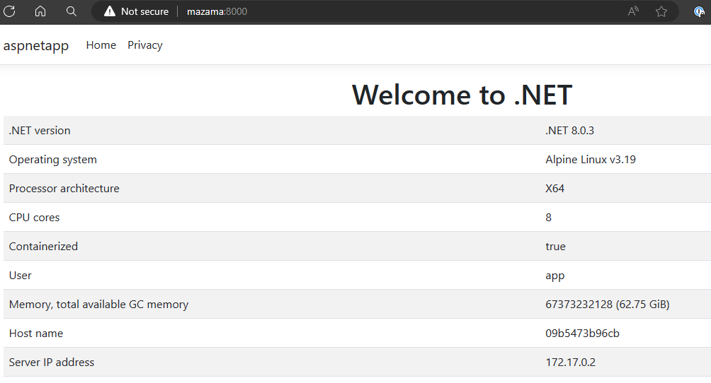

> ## 摘要
>
> .NET 8 在构建和使用容器方面是一个巨大的进步，改进了性能、安全性和可用性。让我们看看 .NET CLI 在构建和发布容器方面的一些增强功能。
>
> 原文 [Streamline your container build and publish with .NET 8 - .NET Blog](https://devblogs.microsoft.com/dotnet/streamline-container-build-dotnet-8/)

---

2024年4月15日

.NET 8 在构建和使用容器方面是一个巨大的进步，改进了性能、安全性和可用性。经过几次发布的努力，我们使 .NET 成为默认体验中最简单、最安全的容器平台之一。这些努力在 .NET 8 中以一种集成的方式汇集在一起。我们实现了最常见的请求：[非根镜像](https://devblogs.microsoft.com/dotnet/securing-containers-with-rootless/)、[更小的镜像尺寸](https://devblogs.microsoft.com/dotnet/announcing-dotnet-chiseled-containers/)和[内置的镜像发布功能](https://learn.microsoft.com/dotnet/core/docker/publish-as-container)。我们还交付了一些高级工作流程所需的关键功能。

我们已经将 [`dotnet publish`](https://devblogs.microsoft.com/dotnet/announcing-builtin-container-support-for-the-dotnet-sdk/) 定为推荐的容器发布方法。它使得生产镜像变得非常容易。这一切都是由 [MSBuild](https://github.com/dotnet/msbuild/) 驱动的（它支持 `dotnet publish`）。它可以推断意图并代表您做出决策，例如，使用最佳的基础镜像。随着我们添加和扩展功能，例如 [Native AOT](https://learn.microsoft.com/dotnet/core/deploying/native-aot/)，我们教会了 `dotnet publish` 在该场景下最佳的默认容器发布选择。这使容器发布成为开发过程的直接扩展。

Dockerfile 仍然非常流行，我们继续为它们提供[大量的示例](https://github.com/dotnet/dotnet-docker/blob/main/samples/README.md)，包括如何[启用像非根这样的新场景](https://github.com/dotnet/dotnet-docker/blob/e5e8164460037e77902cd269c788eccbdeea5edd/samples/dotnetapp/Dockerfile#L20)。事实上，当我们在原型设计想法或重现客户问题时，我们经常使用 Dockerfile。

我们最近与 Docker 团队合作，改进了 [`docker` CLI .NET 开发者体验](https://docs.docker.com/language/dotnet/containerize/)。现在可以在 .NET 项目目录中运行 `docker init` 来生成一个可工作的 Dockerfile。这些 Dockerfile 使用了一些[非常有用的缓存功能](https://docs.docker.com/build/guide/mounts/#add-a-cache-mount)，我们开始在我们的示例中采用这些功能。

我们建议查看我们在 [.NET Conf 2023 容器演讲](https://www.youtube.com/watch?v=scIAwLrruMY) 中分享的 [.NET 8 容器工作坊](https://github.com/richlander/container-workshop)，这是学习所有新的 .NET 8 功能的好方法。

在这篇文章中，您将学习如何：

- 使用 dotnet publish 发布一个容器镜像
- 使用 SDK 为特定的发行版产生一个镜像
- 构建一个全球化友好的凿制镜像
- 检查一个容器镜像以理解凿制镜像包含了什么
- 了解基于 SDK 发布的容器镜像和基于 Dockerfile 的镜像之间的重要区别

该文章将展示一些快速演示（带有可重用的有用语法）。我们将在后续文章中详细讨论。如果你不太喜欢命令行体验，你会发现 [Visual Studio Code 的工作方式几乎相同](https://devblogs.microsoft.com/dotnet/debugging-dotnet-containers-with-visual-studio-code-docker-tools/)。

## 发布一个 “Hello world” 容器镜像

让我们从使用控制台应用模板的最基本体验开始。

```bash
$ dotnet new console -o myapp
$ cd myapp
$ dotnet publish -t:PublishContainer -p:EnableSdkContainerSupport=true
  使用基础镜像 'mcr.microsoft.com/dotnet/runtime:8.0' 构建带有 'latest' 标签的镜像 'myapp'。
  通过 'docker' 将镜像 'myapp:latest' 推送到本地注册表。
$ docker run --rm myapp
Hello, World!
```

`PublishContainer` 任务产生了一个容器镜像，并将其推送到本地 Docker 守护进程。它知道对于控制台应用应该使用 `runtime` 基础镜像，并且对于 .NET 8 应用应该使用 `8.0` 标签。结果镜像可以通过 `docker run` 运行，这需要安装 [Docker Desktop](https://www.docker.com/products/docker-desktop/)（或等效软件）。

对于将控制台项目发布为容器镜像，需要 `EnableSdkContainerSupport` 属性。默认情况下不会为控制台应用（或使用 `Microsoft.NET.Sdk` SDK 的任何其他应用）设置此属性，而 ASP.NET Core 应用则隐式设置了它。这个属性可以包含在项目文件中，这是推荐的做法，或者通过 CLI 设置（如上所示）。

## 检查镜像

使用更好的演示更容易理解正在发生的事情。

以下是两行 `Program.cs`，它将打印运行时信息。

```csharp
using System.Runtime.InteropServices;
Console.WriteLine($"Hello {Environment.UserName}, using {RuntimeInformation.OSDescription} on {RuntimeInformation.OSArchitecture}");
```

项目文件已更新，包括 `EnableSdkContainerSupport` 属性，因此不需要与 `dotnet publish` 命令一起提供。

```xml
<Project Sdk="Microsoft.NET.Sdk">

  <PropertyGroup>
    <OutputType>Exe</OutputType>
    <TargetFramework>net8.0</TargetFramework>
    <RootNamespace>hello_dotnet</RootNamespace>
    <ImplicitUsings>enable</ImplicitUsings>
    <Nullable>enable</Nullable>
    <!-- `Microsoft.NET.Sdk` 项目需要此属性 -->
    <EnableSdkContainerSupport>true</EnableSdkContainerSupport>
  </PropertyGroup>

</Project>
```

让我们重新构建并再次运行容器镜像。

```bash
$ dotnet publish -t:PublishContainer
  Building image 'myapp' with tags 'latest' on top of base image 'mcr.microsoft.com/dotnet/runtime:8.0'.
  Pushed image 'myapp:latest' to local registry via 'docker'.
$ docker run --rm myapp
Hello app, using Debian GNU/Linux 12 (bookworm) on X64
```

.NET 镜像默认使用 Debian，这从输出中可以看出。我们还可以看到 `app` 是运行进程的用户。我们将在后续文章中更深入地讨论 `app` 用户。

```bash
$ docker run --rm --entrypoint bash myapp -c "cat /etc/os-release | head -n 1"
PRETTY_NAME="Debian GNU/Linux 12 (bookworm)"
```

镜像确实是 Debian，如镜像中的 `os-release` 文件所示。事实上，`RuntimeInformation` API 从这个相同的文件中获取数据，这就是为什么字符串匹配。

## 为特定的发行版制作镜像

可以使用 SDK 为特定发行版构建镜像。我们将从为 Alpine 发布 [aspnetapp](https://github.com/dotnet/dotnet-docker/tree/main/samples/aspnetapp/aspnetapp) 开始。

```bash
$ dotnet publish --os linux-musl -t:PublishContainer
  Building image 'aspnetapp' with tags 'latest' on top of base image 'mcr.microsoft.com/dotnet/aspnet:8.0-alpine'.
  Pushed image 'aspnetapp:latest' to local registry via 'docker'.
$ docker run --rm -it -p 8000:8080 aspnetapp
info: Microsoft.Hosting.Lifetime[14]
      Now listening on: http://[::]:8080
info: Microsoft.Hosting.Lifetime[0]
      Application started. Press Ctrl+C to shut down.
```

SDK 知道当构建针对 `linux-musl` 时应该使用 Alpine 镜像。这个功能是 .NET SDK 8.0.200 的新功能。以前，必须使用 `ContainerFamily=alpine` 来获得相同的结果。

以下镜像显示了浏览器中的 Web 应用程序。



需要 `ContainerFamily=jammy` 来生成 Ubuntu 镜像，而 `ContainerFamily=jammy-chiseled` 则用于生成 Ubuntu 凿制容器。

```bash
$ dotnet publish -t:PublishContainer -p:ContainerFamily=jammy-chiseled
  aspnetapp -> /home/rich/git/dotnet-docker/samples/aspnetapp/aspnetapp/bin/Release/net8.0/aspnetapp.dll
  aspnetapp -> /home/rich/git/dotnet-docker/samples/aspnetapp/aspnetapp/bin/Release/net8.0/publish/
  Building image 'aspnetapp' with tags 'latest' on top of base image 'mcr.microsoft.com/dotnet/aspnet:8.0-jammy-chiseled'.
  Pushed image 'aspnetapp:latest' to local registry via 'docker'.
```

您可以看到使用了 Ubuntu 凿制镜像。您还可以看到，[`publish` 与 .NET 8 默认为 `Release`](https://learn.microsoft.com/dotnet/core/whats-new/dotnet-8/sdk#dotnet-publish-and-dotnet-pack-assets)。

Alpine 支持无疑更简单。Alpine 是我们支持的唯一发行版，用于 [`linux-musl` 配置](https://musl.libc.org/)，而我们为 `linux` 产生 Debian 和 Ubuntu 容器镜像，Debian 是默认值（我们无意更改）。

## 准备好全球使用的凿制镜像

当我们首次宣布凿制镜像时，我们听到了很多关于凿制镜像的兴奋声，然而，一些用户告诉我们，他们需要 [全球化友好的凿制镜像](https://github.com/dotnet/dotnet-docker/issues/5014)。我们生产了这些作为 [`额外`](https://github.com/dotnet/dotnet-docker/discussions/5092) 镜像，它们包括 `icu` 和 `tzdata` 库。

让我们从 `ContainerFamily=jammy-chiseled` 开始，看看如何使用 [`globalapp` 示例](https://github.com/dotnet/dotnet-docker/blob/main/samples/globalapp/README.md) 工作。

```bash
$ dotnet publish -t:PublishContainer -p:EnableSdkContainerSupport=true -p:ContainerFamily=jammy-chiseled
  Building image 'globalapp' with tags 'latest' on top of base image 'mcr.microsoft.com/dotnet/runtime:8.0-jammy-chiseled'.
  Pushed image 'globalapp:latest' to local registry via 'docker'.
$ docker run --rm globalapp
Hello, World!

****Print baseline timezones**
Utc: (UTC) Coordinated Universal Time; 04/01/2024 23:41:20
Local: (UTC) Coordinated Universal Time; 04/01/2024 23:41:20

****Print specific timezone**
Unhandled exception. System.TimeZoneNotFoundException: The time zone ID 'America/Los_Angeles' was not found on the local computer.
 ---> System.IO.DirectoryNotFoundException: Could not find a part of the path '/usr/share/zoneinfo/America/Los_Angeles'.
   at Interop.ThrowExceptionForIoErrno(ErrorInfo errorInfo, String path, Boolean isDirError)
   at Microsoft.Win32.SafeHandles.SafeFileHandle.Open(String path, OpenFlags flags, Int32 mode, Boolean failForSymlink, Boolean& wasSymlink, Func`4 createOpenException)
   at Microsoft.Win32.SafeHandles.SafeFileHandle.Open(String fullPath, FileMode mode, FileAccess access, FileShare share, FileOptions options, Int64 preallocationSize, UnixFileMode openPermissions, Int64& fileLength, UnixFileMode& filePermissions, Boolean failForSymlink, Boolean& wasSymlink, Func`4 createOpenException)
   at System.IO.Strategies.OSFileStreamStrategy..ctor(String path, FileMode mode, FileAccess access, FileShare share, FileOptions options, Int64 preallocationSize, Nullable`1 unixCreateMode)
   at System.TimeZoneInfo.ReadAllBytesFromSeekableNonZeroSizeFile(String path, Int32 maxFileSize)
   at System.TimeZoneInfo.TryGetTimeZoneFromLocalMachineCore(String id, TimeZoneInfo& value, Exception& e)
   --- End of inner exception stack trace ---
   at System.TimeZoneInfo.FindSystemTimeZoneById(String id)
   at Program.<Main>$(String[] args) in /home/rich/git/dotnet-docker/samples/globalapp/Program.cs:line 24
```

这当然不好！这个应用程序没有 `tzdata` 就无法正常工作，这正是错误告诉我们的内容。这也是我们收到的导致 `额外` 镜像功能请求的问题。请注意，异常是由于 `tzdata`，但如果程序进行得更远，我们也会看到与 ICU 相关的异常。

让我们使用 `额外` 镜像再试一次。这次我还会使用 `TZ` 环境变量传入一个特定的时区。

```bash
$ dotnet publish -t:PublishContainer -p:EnableSdkContainerSupport=true -p:ContainerFamily=jammy-chiseled-extra
  Building image 'globalapp' with tags 'latest' on top of base image 'mcr.microsoft.com/dotnet/runtime:8.0-jammy-chiseled-extra'.
  Pushed image 'globalapp:latest' to local registry via 'docker'.
$ docker run --rm -e TZ="Pacific/Auckland" globalapp
Hello, World!

****Print baseline timezones**
Utc: (UTC) Coordinated Universal Time; 04/02/2024 00:48:41
Local: (UTC+12:00) New Zealand Time; 04/02/2024 13:48:41

****Print specific timezone**
Home timezone: America/Los_Angeles
DateTime at home: 04/01/2024 16:44:02

****Culture-specific dates**
Current: 04/01/2024
English (United States) -- en-US:
4/1/2024 11:44:02 PM
4/1/2024
11:44 PM
English (Canada) -- en-CA:
2024-04-01 11:44:02 p.m.
2024-04-01
11:44 p.m.
French (Canada) -- fr-CA:
2024-04-01 23 h 44 min 02 s
2024-04-01
23 h 44
Croatian (Croatia) -- hr-HR:
01. 04. 2024. 23:44:02
01. 04. 2024.
23:44
jp (Japan) -- jp-JP:
4/1/2024 23:44:02
4/1/2024
23:44
Korean (South Korea) -- ko-KR:
2024. 4. 1. 오후 11:44:02
2024. 4. 1.
오후 11:44
Portuguese (Brazil) -- pt-BR:
01/04/2024 23:44:02
01/04/2024
23:44
Chinese (China) -- zh-CN:
2024/4/1 23:44:02
2024/4/1
23:44

****Culture-specific currency:**
Current: ¤1,337.00
en-US: $1,337.00
en-CA: $1,337.00
fr-CA: 1 337,00 $
hr-HR: 1.337,00 kn
jp-JP: ¥ 1337
ko-KR: ₩1,337
pt-BR: R$ 1.337,00
zh-CN: ¥1,337.00

****Japanese calendar**
08/18/2019
01/08/18
平成元年8月18日
平成元年8月18日

****String comparison**
Comparison results: `0` mean equal, `-1` is less than and `1` is greater
Test: compare i to (Turkish) İ; first test should be equal and second not
0
-1
Test: compare Å Å; should be equal
0
```

这确实好多了。让我们进行一个大小比较以便更直观地对比。

```bash
$ dotnet publish -t:PublishContainer -p:EnableSdkContainerSupport=true
  Building image 'globalapp' with tags 'latest' on top of base image 'mcr.microsoft.com/dotnet/runtime:8.0'.
  Pushed image 'globalapp:latest' to local registry via 'docker'.
$ dotnet publish -t:PublishContainer -p:EnableSdkContainerSupport=true -p:ContainerFamily=jammy-chiseled-extra -p:ContainerRepository=globalapp-jammy-chiseled-extra
  Building image 'globalapp-jammy-chiseled-extra' with tags 'latest' on top of base image 'mcr.microsoft.com/dotnet/runtime:8.0-jammy-chiseled-extra'.
  Pushed image 'globalapp-jammy-chiseled-extra:latest' to local registry via 'docker'.
$ docker images globalapp
REPOSITORY   TAG       IMAGE ID       CREATED          SIZE
globalapp    latest    91422e1c0b0e   17 seconds ago   193MB
$ docker images globalapp-jammy-chiseled-extra
REPOSITORY                       TAG       IMAGE ID       CREATED          SIZE
globalapp-jammy-chiseled-extra   latest    da9621e19cad   59 seconds ago   123MB
```

这些命令首先为默认的 Debian 镜像构建示例，然后为 Ubuntu Chiseled `extra` 镜像构建。差异为70MB（未压缩）。这是一个相当不错的优势。您可以类似地使用 Alpine，并遵循[以下模式](https://github.com/dotnet/dotnet-docker/blob/main/samples/dotnetapp/Dockerfile.alpine-icu)。

## 常见问题

> 这是如何工作的？

`PublishContainer` 使用的机制比人们猜想的更为直接。容器镜像是压缩文件的集合，组成了[压缩文件的层](https://github.com/richlander/container-registry-api)。`PublishContainer` MSBuild 目标构建应用，以正确的格式（包括元数据）压缩它，从仓库下载基础镜像（也是压缩文件），然后将层包装在一起（再次）以正确的压缩格式。这很大程度上借助了（相对较新的）[`TarFile` 类](https://learn.microsoft.com/dotnet/api/system.formats.tar)实现。事实上，所有这些容器功能只是在添加了 `TarFile` 之后实现的。

> “`Dockerfile` 在哪里？”

有时人们会问是否可以看到我们使用的 `Dockerfile`，或者是否可以修改它。在这种情况下，我们没有使用 `Dockerfile`。`docker build` 和 `Dockerfile` 假定了 Linux 操作系统，特别是执行 `RUN` 命令（比如运行 `apt`, `curl` 或 `tar`）。我们没有也不支持类似的东西。`PublishContainer` 仅仅是下载基础镜像层，然后将一个容器层复制到另一个上并将它们打包为 [OCI 镜像](https://github.com/opencontainers/image-spec)。

> “这是一个很好的‘无 Docker’解决方案！”

这并非意图，也并非实际情况。`PublishContainer` 支持可以被认为是一个“无 Dockerfile”解决方案，然而 [Docker](https://www.docker.com/) 非常有用，你可以看到这个帖子大量依赖它。我们还看到用户使用 [podman](https://podman.io/)。如果你真的很大胆，你可以直接使用 [containerd](https://containerd.io/)。

确实有一种情况这个说法是正确的。`dotnet publish` 支持[将镜像推送到仓库](https://github.com/richlander/container-workshop/blob/main/push-to-registry.md)。它支持多个仓库。这个功能对于 GitHub Actions 和类似的 CI 环境非常有用。我们会在后续文章中介绍这一点。

> “如果没有 `Dockerfile`，我如何使用 `apt` 安装软件包？”

你不直接这么做。`dotnet publish` 可以下载任何基础镜像。你可以制作自己的基础镜像，例如，安装额外的软件包，将其推送到仓库，然后[引用该镜像](https://github.com/richlander/container-workshop/blob/main/publish-oci-reference.md)。它可以基于微软的镜像，也可以不基于。`dotnet publish` 很乐意下载它。

## 总结

容器已经与云计算对很多工作负载风格成为同义词。虽然我们已经这么说了好几年，但现在比以往任何时候都更加成立。团队几年来一直专注于提供一流的容器支持，并且我们仍然致力于这一点。

随着 .NET 8 的发布，我们已经提供了：[非 root 镜像](https://devblogs.microsoft.com/dotnet/securing-containers-with-rootless/)（为了安全性和可用性），[轻量化镜像](https://devblogs.microsoft.com/dotnet/announcing-dotnet-chiseled-containers/)（为了性能和安全性），以及[使用 `dotnet publish` 构建容器镜像](https://learn.microsoft.com/shows/containers-with-dotnet-and-docker-for-beginners/)（为了可用性）。

我们在 .NET 8 中交付的内容还有很多，我们将在未来的帖子中描述和展示。
