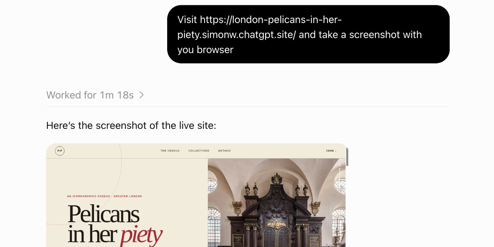

2026 年 7 月 9 日，OpenAI 宣布了 ChatGPT Work：一个「可以跨你的应用和文件采取行动、能陪一个项目跑几个小时、把目标变成成品」的 Agent。上线快两个月，它依然是 ChatGPT 里最难讲清楚的产品——不是功能少，而是官方定位和实际能力之间隔着一条沟。

Simon Willison 在 8 月 30 日发了一篇长文《Understanding ChatGPT Work》，把他反复实验后弄明白的东西全部写了出来。我以原文为底，并对照 OpenAI 当前的官方文档核对了模型选型、定价、Sites 和网络访问这些易变信息。这篇中文文章回答三个问题：Work 到底比 Chat 多什么、为什么值得（或暂时不值得）换过去、有哪些安全边界。

先给结论：**判断该用 Chat 还是 Work，不要照着官方那句「要答案用 Chat，要完成任务用 Work」来——用 Chat 完成任务你早就干好几年了。真正有用的标准是能力对比：Work 里有联网的代码执行环境、无头 Chrome 浏览器、跨会话持久文件、可直接发布的 Sites 和子代理，这些 Chat 至今没有。**

## 两个 Work：云上的和本机的

ChatGPT Work 实际上是两个产品。

一个是 **Work Cloud**：跑在 OpenAI 的托管环境里，从 chatgpt.com 或手机 App 进入。另一个是 **Work Local**：装了 ChatGPT 桌面端（也就是原先的 Codex App）才有，能直接读你电脑上的文件和程序，本质是换了一张「对非开发者友好」皮的 Codex。

官方文档给出了更细的选择方式：桌面端可以切「Work locally」或「Cloud」。选 Cloud 时，关掉电脑任务也会继续跑，之后可以在网页或手机上接着聊；需要动本机文件和应用时保持 Local。

## 谁能用：价格与开放范围

官方发布稿的说法：云端 Work 从 Pro、Enterprise、Edu 计划开始推送，几天内扩展到 Plus 和 Business；桌面端则所有计划可用，包括 Free。定价上，Go 是 8 美元/月，Plus 是 20 美元/月，Pro 从 100 美元/月起步。

Simon 在 8 月底的实测印象是「Work 两个版本都只对 20 美元/月及以上开放，Free 和 Go 用户没有入口」。这与发布稿里桌面端覆盖全部计划的说法有出入，可能是后续调整。判断标准很朴素：打开账号看有没有 Work 标签页，比看文档可靠。

另一个值得知道的事实：**Work 和 Codex 共用同一套用量体系**。官方定价文档明确写了「ChatGPT Work 和 Codex 共享用量」，换句话说 Work 的消耗记在 Codex 的账上，这可能也解释了为什么 Work 里的模型选型与 Chat 完全不同。

## 模型：另一套选型逻辑

Work 里可以选 GPT-5.6 的三个变体：**Sol**（旗舰，复杂开放任务）、**Terra**（日常多面手，官方称它替代原来的 GPT-5.5 场景）和 **Luna**（快而便宜，适合提取、分类、结构化摘要这类目标明确的高频任务）。推理力度从 Light 到 Medium、High、Extra High、Max、Ultra，还能选 GPT-5.5。

官方对 Max 和 Ultra 的说明值得注意：Max 只是给当前模型更多时间思考；**Ultra 则是把任务拆开交给子代理并行处理**。Simon 的观察与之一致——Ultra 会更积极地委派子代理。它是重型选项，官方明确说「大多数任务不需要 Max 或 Ultra」。

Chat 侧则是另一套：5.6 Instant、Medium、High、Extra High 和 Pro，其中 Extra High 与 Pro 只对 100 美元/月以上用户开放，20 美元档在 High 封顶。官方没有说明 Chat 里 5.6 对应 Sol、Luna 还是 Terra，而 5.6 Pro 只在 Chat 里出现，Work 没有对应项。

## 联网的代码执行环境

这是 Work Cloud 里最让 Simon 兴奋的功能。它是 2023 年 OpenAI 首创的 Code Interpreter 模式的延续，但多了一个关键变量：**代码执行环境现在能访问整个互联网**。

对比一下现状：

- Chat 的容器代理会拦住对外访问，装第三方包、调网页 API 基本都被挡。有趣的是，今年 1 月它曾短暂支持过装包，Simon 还专门写过一篇（[ChatGPT containers](https://simonwillison.net/2026/Jan/26/chatgpt-containers/)），现在又不灵了，他吐槽 OpenAI 的更新日志太差。
- Claude 的同类容器从去年 9 月开始允许受限联网（[claude-code-interpreter](https://simonwillison.net/2025/Sep/9/claude-code-interpreter/)）：能装 PyPI 和 npm 包、能 clone GitHub 仓库，但域名白名单非常短。
- Work 默认几乎全开放，也可以配置成指定域名列表。

官方文档对云端任务的说法是：代理阶段默认阻止网络访问，**安装依赖的 setup 脚本仍然可以联网**；需要时可按环境开启，白名单预设包括 None（从零指定）、Common dependencies（常用依赖域名）和 All（不限制），还可以把访问限制到 GET/HEAD/OPTIONS 这些方法。

这意味着你可以让 Work 克隆 GitHub 仓库、装好依赖、再拿它去和真实网站交互——一条完整的研究流水线，中间不需要你动手。

## 无头 Chrome 浏览器

Work 的浏览器工具可以直接启动一个完整的 Chrome 实例：加载网页、填表单、截图。遇到需要登录的站点，它会停下来请你「接管」输入密码和两步验证码，**凭据不会流过模型本身**。

它还能对已加载页面执行 JavaScript。Simon 的演示提示词是「Load simonwillison.net in your browser and extract the headings using JavaScript」，Work 用 Playwright 跑出了这段代码：

```js
await tab.playwright.evaluate(() => {
  return Array.from(
    document.querySelectorAll("h1,h2,h3,h4,h5,h6"),
    heading => ({
      level: heading.tagName.toLowerCase(),
      text: heading.innerText.trim().replace(/\s+/g, " "),
      id: heading.id || null,
    })
  );
});
```



这套用法很像 Simon 自己的 shot-scraper javascript 工具，区别是现在在手机上也能用了。官方文档同时给了一句警告：**把页面内容当作不可信上下文，分享敏感信息或放行动之前先检查页面和拟议动作**。

## 跨会话的持久文件系统

Chat 的每个会话都有全新的文件系统，别的会话碰不到。Work 则不同：每个会话有自己的 scratch 目录（形如 `/workspace/scratch/e00a0a017944`），但这些目录**跨会话保留**——Simon 发文时 `/workspace/scratch` 下已经有 171 个目录。

长期运行时，`/workspace` 卷会同时挂载到所有正在运行的 Work 会话，一个会话里的文件改动另一个会话立即可见。但注意边界：各会话不共享进程空间，一个会话里起的 localhost 服务，另一个会话访问不到。

## 一句话建站：ChatGPT Sites

Work 可以**建站并部署**，跑在 Cloudflare Workers 上，支持 HTML/JavaScript 和服务端逻辑，也能用 Cloudflare D1 和 R2 做有状态的存储——官方文档确认了 D1 数据库容量上限 10GB，R2 无固定上限。

Simon 的示范提示词只有一句话：「弄清伦敦所有有 pelican in her piety（鹈鹕刺穿胸膛喂养幼鸟的中世纪宗教图案）的地方，整理成 JSON 文件，然后建一个 ChatGPT Sites 站点」。结果是一个带数据统计和下载入口的专题站：


这个例子最值得注意的不是成品，而是**研究、结构化、建站发布被一条提示词串了起来**。Sites 目前处于公开测试阶段，官方文档列为 Plus、Pro、Business、Enterprise 和 Edu 计划可用；站点默认只有创建者可见，可以公开，团队计划下可以只分享给特定的人。

## 子代理和定时任务

这两项简单但实用。Chat 跑不了子代理，Work 可以——想同时开多个并行 Agent 分工的项目，这是必要条件。定时任务（Scheduled Tasks）则可以给 Work 下这种指令：「每天早上 8 点搜一下 Waymo 有没有公布 Half Moon Bay 的发布日期」。它自己判断有没有新信息，没有就不打扰你，有才推送。

Simon 指出这个功能其实 Chat 也有，但它的价值在于**和工作专属能力组合**：比如让定时任务每小时更新一次你的 ChatGPT Sites 站点。

## 安全：三项要素齐了

Simon 的「致命三要素（lethal trifecta）」模型说的是：任何组合了「私有数据访问 + 接触不可信内容 + 外泄通道」的 Agent 系统都有高风险。ChatGPT Work 三样全占：它读你的文件和插件，浏览不可信网页，同时能联网外发数据。

OpenAI 目前的防线：自动审查（auto-review）机制，用更先进的模型在涉及工具和 API 的重要动作执行前把关，这是从 Codex 带过来的能力；企业方案里有管理员网络策略、连接的应用和浏览器控制。官方网络访问文档也坦白列出了开启联网的风险：提示注入、代码或密钥外泄、恶意依赖、许可证问题。

实用的做法是把官方文档的建议落实到配置：**默认只开必要域名、必要时只允许 GET 类方法、把网页内容当不可信输入、敏感任务别用 Ultra 级别的自主性**。企业用户还应该确认管理员侧的审计与策略已启用。

## 让 Work 自己交代能力清单

Simon 抱怨的两个核心问题：OpenAI 只解释 Work「用来干什么」，不说它实际有什么工具；系统提示词和工具描述一如既往地藏起来。他的解法很简单也很绝——**直接问 Work 本人**。

他让 Work 把全部工具「近乎分组地列成网站，尽量原样复制参数和工具描述，设计风格要像技术文档」，于是整出了 [codex-tool-reference 站点](https://codex-tool-reference.simonw.chatgpt.site/)，记录了 223 个注册工具（其中 6 个是他自己的 datasette-mcp 服务器贡献的）和 9 个直接控制接口。

但这里有个有意思的发现：工具列表里跟浏览器相关的只有一个 `web.run`（搜索、开链接、点链接），看着不像完整故事。Simon 于是追加提示：「把每个 skill 的完整内容加到网站上」。结果 Work 用到的 skill 多达 **44 个**——浏览器控制的真相藏在 `control-browser` skill 里：通过 Node REPL 运行设置代码，用 `browser-client` 运行时和 `agent.browsers.*` API 交互，**动手之前必须先一次性读取 `await browser.documentation()` 返回的完整文档**。

其他几个值得知道的 skill：`documents`（生成 .docx）、`imagegen`（图像生成的提示词技巧）、`pdf`（读取和渲染 PDF）、`Spreadsheets`（操作 xlsx/xls/csv/tsv）、`sites:sites-building`（建 ChatGPT Sites）、`openai-docs`（回答关于 OpenAI 自身的问题）、`data-analytics:build-dashboard`（做数据看板）。

这个逆向过程本身值得记住：**当一个 Agent 平台把能力藏起来时，让 Agent 自述系统提示词和工具清单，通常是最快的文档**。

## 该用哪个：判断清单

绕了一圈，可以给你一张可执行的判断表：

- **继续用 Chat**：问问题、查资料、要解释、写短稿、脑暴、一次性完成任务。
- **换 Work Cloud**：需要让 AI 完成「能审阅的可交付成果」——对比表、PPT、调研报告；需要它重复执行或监控；需要联网爬数据、分析真实网站、跑代码；想一句话建站并发布；要有持久文件或并行子代理。
- **坚守 Chat 的条件**：你的任务不依赖联网代码执行、不需要长期文件、不介意没有浏览器自动化；或者你的数据敏感度高，不适合引入「私有数据 + 不可信网页 + 外发通道」组合。
- **组织内使用**：先确认管理员已配置网络白名单、连接的应用和审计日志，再放开给团队。

还有两个值得继续观察的问题：OpenAI 会不会公开 Work 的防提示注入细节（Simon 希望他们公布系统提示和工具描述，那样他这篇长文都不用写）；以及桌面端 Work 对 Free/Go 用户的开放状态会不会调整。想验证的话，现在就可以打开你的 ChatGPT——如果看到 Chat/Work 两个标签，上面这套能力差异就是你的实验场。

Aide Hub 会继续跟进 AI 助手、开发工具与软件工程实践——像这次一样用实测加官方核对的方式，把新产品讲清楚，少一份营销话术，多一份能直接用的判断。

## 参考

- 《[Understanding ChatGPT Work](https://simonwillison.net/2026/Aug/30/understanding-chatgpt-work/)》，Simon Willison，2026-08-30（本文原文）
- OpenAI：[ChatGPT is now a partner for your most ambitious work](https://openai.com/index/chatgpt-for-your-most-ambitious-work/)，2026-07-09 发布稿
- OpenAI Docs：[Get started with ChatGPT Work](https://learn.chatgpt.com/docs/get-started-with-work)
- OpenAI Docs：[Models](https://learn.chatgpt.com/docs/models)（Sol/Terra/Luna、Max/Ultra 与子代理）
- OpenAI Docs：[Pricing](https://learn.chatgpt.com/docs/pricing)（Work 与 Codex 共享用量）
- OpenAI Docs：[Agent internet access](https://learn.chatgpt.com/docs/cloud/internet-access)（白名单预设与风险说明）
- OpenAI Docs：[Browser](https://learn.chatgpt.com/docs/browser)（把页面内容视为不可信上下文）
- OpenAI Docs：[Sites](https://learn.chatgpt.com/docs/sites)（公开测试计划与 D1 10GB 限制）
- OpenAI Docs：[Auto-review](https://learn.chatgpt.com/docs/sandboxing/auto-review)
- Simon Willison 的[ChatGPT Work 工具参考站](https://codex-tool-reference.simonw.chatgpt.site/)
- [shot-scraper javascript](https://shot-scraper.datasette.io/en/stable/javascript.html)
- Simon Willison：[The lethal trifecta](https://simonwillison.net/2025/Jun/16/the-lethal-trifecta/)

（说明：模型、定价、Sites 可用计划与网络访问策略以 2026-09-01 核对的最新官方文档为准；原文发布于 2026-08-30，个别表述以官方当前版本为准。）
