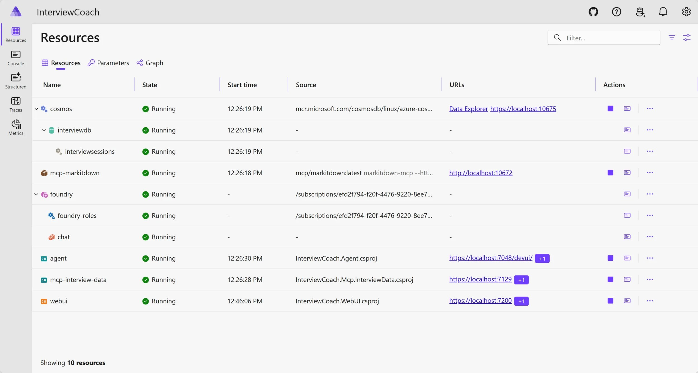
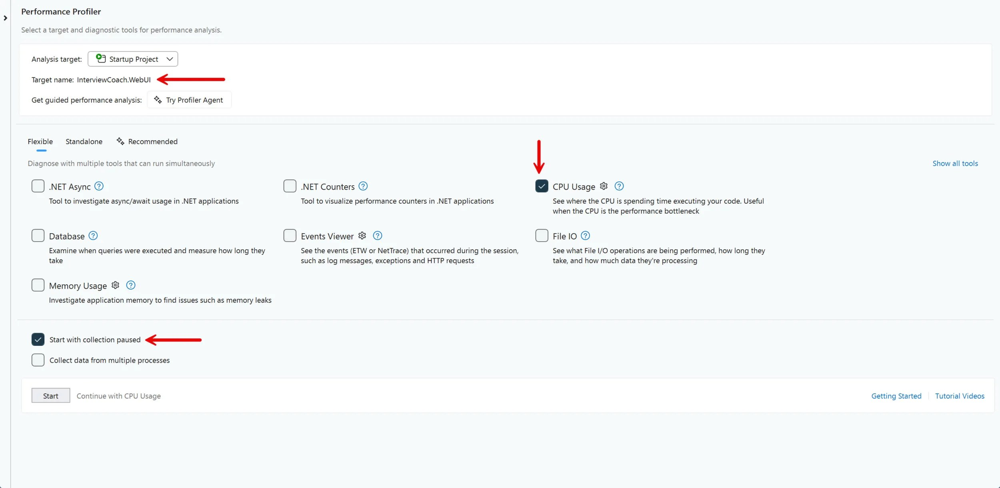
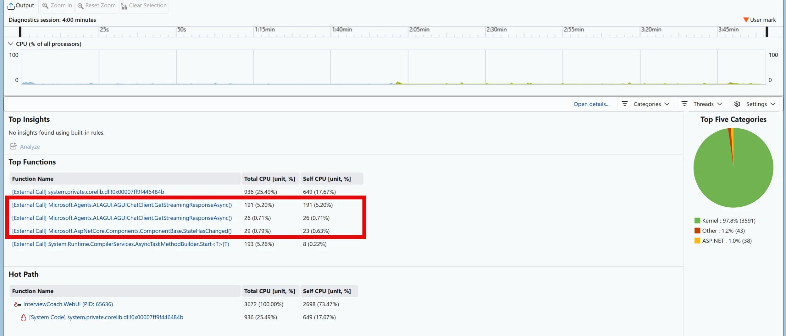
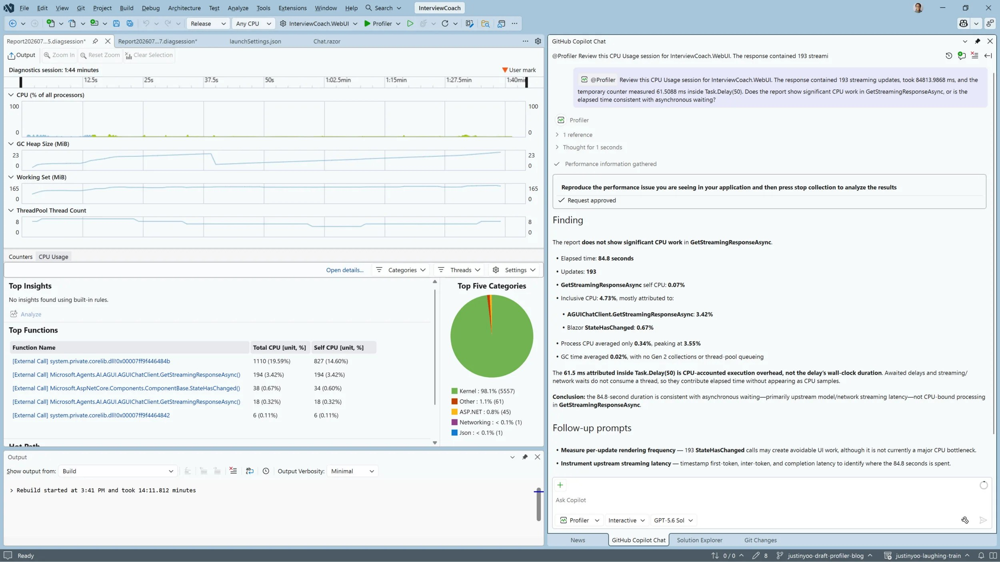

一次用户操作跨了 Blazor 前端、后端 agent、MCP 服务器、Cosmos DB 和一个托管模型，第一次响应花了一分半。你打开 CPU 剖析器，报告说这段时间只有 6.7% 的 CPU 占用，没有任何热点函数——然后呢？

这个结果的正确读法不是「没问题」，而是「这段时间不是在算」。Visual Studio 团队的 Justin Yoo 在 [Today I will… find hidden latency across a distributed .NET application](https://devblogs.microsoft.com/visualstudio/today-i-will-find-hidden-latency-across-a-distributed-net-application/) 里完整走了一遍这个排查，最后定位到流式循环里的一行 `await Task.Delay(50)`：它本身只有 50 毫秒，但在一次响应里被重复了两百次左右，累计成 9 到 12 秒的应用侧等待。

本文按「定位进程 → 排除计算 → 量化等待 → 验证 → 改算法」重述这次排查，并补上原文没解释的一件事：**为什么测出来是 61 毫秒而不是 50 毫秒**。

## 第一步是确定哪个进程在干活

AppHost 把 Web UI、agent、MCP 服务器和数据服务启动成多个进程。直接剖析 `InterviewCoach.AppHost` 得到的是编排器的数据，它不包含 `InterviewCoach.WebUI` 里的 Blazor 代码。所以先把要分析的那个进程单独拿出来。

做法是：把 `InterviewCoach.AppHost` 设为启动项目，选 HTTPS 启动配置，用**开始执行（不调试）**运行——这样后面切换启动项目时 AppHost 不会被一起停掉。等 Aspire 面板里的资源都就绪后，只停掉由 Aspire 管理的 `webui` 这一项，agent 和它的依赖继续运行。



然后给 Web UI 加一个独立的启动配置，让它用自己的端口，同时把服务发现指向还在运行的 agent：

```json
"Profiler": {
  "commandName": "Project",
  "dotnetRunMessages": true,
  "launchBrowser": true,
  "applicationUrl": "https://localhost:7201;http://localhost:5088",
  "environmentVariables": {
    "ASPNETCORE_ENVIRONMENT": "Development",
    "Services__agent__https__0": "localhost:7048"
  }
}
```

这里的两个细节值得单独说清楚，因为它们是照抄时最容易错的地方。

Web UI 里写的是逻辑服务名：

```csharp
client.BaseAddress = new Uri("https+http://agent");
```

`https+http` 是[服务发现支持的优先级写法](https://learn.microsoft.com/en-us/dotnet/core/extensions/service-discovery)：先找 `agent` 的 HTTPS 端点，找不到再退回 HTTP；只要找到了 HTTPS，就不会再包含 HTTP 端点。

而 `Services__agent__https__0` 换成配置路径是 `Services:agent:https:0`——双下划线是环境变量里表示层级分隔符的规定写法。它的值只写 `localhost:7048`（主机加端口），**不带 `https://` 前缀**。端口号必须用 Aspire 面板上显示的那个；重启之后 Aspire 可能分配不同的端口。

## 第二步用 CPU 报告排除「计算」

在 Visual Studio 里把 `InterviewCoach.WebUI` 设为启动项目，选刚加的 Profiler 配置，构建配置切到 Release，然后用 **调试 > 性能探查器**（Alt+F2）打开探查器面板：确认目标是 `InterviewCoach.WebUI`，勾选 CPU 使用率，再勾上**以暂停状态启动收集**。



「以暂停状态启动收集」这一步很关键：应用启动、Aspire 连接、页面初始化这些活动和你要测的那次请求无关，先暂停收集可以让报告里只剩下有意义的那段。等 Web UI 就绪后再恢复收集，提交测试提示词，响应结束后停止收集。

拿到报告后，先只选「提交提示词」到「收到最后一个更新」这段时间。然后打开调用树并启用「仅我的代码」，看两列：`Total CPU` 是某个方法及其调用的一切，`Self CPU` 是直接算在该方法上的采样。用 **Expand Hot Path** 顺着最耗 CPU 的分支走，再搜 `GetStreamingResponseAsync` 找流式路径。



这次的结果是：选中时间段 6.7% 的 CPU 占用，调用树里找不到任何能解释这一分半的应用热点，Top Five Categories 里内核占 97.8%。

这个结论要读得精确：**它只能证明 Web UI 在这段时间不是 CPU 瓶颈**，不能证明延迟的原因。CPU 使用率采样的是活跃的处理器工作；等 I/O、等定时器、等锁、等其他服务，都会让用户等，但都不会表现为 CPU 热点。排除掉计算之后，下一步就是去流式路径的代码里找一个显式的等待。

## 第三步量化 CPU 报告看不见的等待

`Chat.razor` 的响应循环里就有一行：

```csharp
await foreach (var update in ChatClient.GetStreamingResponseAsync(
    outboundMessages,
    chatOptions,
    cancellationToken))
{
    await Task.Delay(50);

    messages.AddMessages(update, filter: c => c is not TextContent);
    // ...
    StateHasChanged();
}
```

如果一次响应有 200 个更新，名义上的累计延迟就是 10 秒：

```text
200 updates x 50 ms = 10,000 ms
```

CPU 报告量不出 `await Task.Delay` 花掉的墙上时间，所以要在代码里量：

```csharp
var responseTimer = Stopwatch.StartNew();
var measuredDelay = TimeSpan.Zero;
var updateCount = 0;

await foreach (var update in ChatClient.GetStreamingResponseAsync(
    outboundMessages,
    chatOptions,
    cancellationToken))
{
    updateCount++;

    var delayStarted = Stopwatch.GetTimestamp();
    await Task.Delay(50);
    measuredDelay += Stopwatch.GetElapsedTime(delayStarted);

    // 原有的更新处理逻辑
}

Logger.LogInformation(
    "Stream completed in {ElapsedMs} ms across {UpdateCount} updates; "
    + "artificial delay consumed {DelayMs} ms",
    responseTimer.Elapsed.TotalMilliseconds,
    updateCount,
    measuredDelay.TotalMilliseconds);
```

`Stopwatch.GetTimestamp()` 配上单参数的 `Stopwatch.GetElapsedTime(long)` 是 .NET 7 之后推荐的计时代替写法，比为了量一小段代码再 `StartNew` 一个 `Stopwatch` 更省分配。

同一个提示词跑五次的结果：

| 运行   | 总耗时 (ms) | 更新数 | 名义延迟 (ms) | 实测延迟 (ms) | 每次更新 (ms) |
| ------ | ----------- | ------ | ------------- | ------------- | ------------- |
| 1      | 92,386.35   | 168    | 8,400         | 10,299.81     | 61.31         |
| 2      | 84,772.66   | 188    | 9,400         | 11,549.60     | 61.43         |
| 3      | 90,705.55   | 153    | 7,650         | 9,376.84      | 61.29         |
| 4      | 79,027.43   | 147    | 7,350         | 9,028.32      | 61.42         |
| 5      | 69,061.61   | 190    | 9,500         | 11,714.10     | 61.65         |
| 中位数 | 84,772.66   | 168    | 8,400         | 10,299.81     | 61.42         |

五次里落在人工延迟里的是 9.03 到 11.71 秒，中位数 10.30 秒。

**实测每次 61.42 毫秒，比名义的 50 毫秒多了约 11 毫秒，这不是实现有问题。** [`Task.Delay` 的文档](https://learn.microsoft.com/en-us/dotnet/api/system.threading.tasks.task.delay)写得很直接：这个方法依赖系统时钟，当延迟参数小于系统时钟分辨率时，实际延迟会大致等于时钟分辨率，而**在 Windows 上这个分辨率约为 15 毫秒**；文档还特别注明它用的是 `GetTickCount` 那个时钟，不受 `timeBeginPeriod` 影响。所以「50 毫秒的要求」被四舍五入到最近的可调度时刻，多出十几毫秒是预期内的。原文有一句判断是对的：真正的问题不是 50 和 61 的差，而是这 10 秒的累计等待。

顺便一个容易混淆的点：这里统计的是**流式更新的次数**，不是模型 token 数，一次更新不一定对应一个 token。

## 第四步移除那一行再测

作为对比，去掉 `await Task.Delay(50)` 后用同一个提示词再跑五次，保留计时调用以便输出同样的日志：

| 运行   | 总耗时 (ms) | 更新数 | 实测计时开销 (ms) | 每次更新 (ms) |
| ------ | ----------- | ------ | ----------------- | ------------- |
| 1      | 98,450.75   | 226    | 0.0262            | 0.0001        |
| 2      | 69,886.97   | 174    | 0.0155            | 0.0001        |
| 3      | 77,264.48   | 289    | 0.0256            | 0.0001        |
| 4      | 58,254.13   | 163    | 0.0171            | 0.0001        |
| 5      | 86,431.56   | 164    | 0.0257            | 0.0002        |
| 中位数 | 77,264.48   | 174    | 0.0256            | 0.0001        |

总耗时的中位数从 84.77 秒降到 77.26 秒，差了约 7.51 秒。这个对比**不是受控基准**：模型每次返回的内容和更新次数都不一样，这部分波动混在总耗时里。可以直接下的结论只有一条：删掉那一行，就删掉了基线里实测出来的 9 到 12 秒应用侧等待。

表里那个万分之几毫秒的数字是取时间戳本身的开销，不代表模型、网络或渲染的处理时间。

## 第五步用 Profiler Agent 交叉验证

拿到报告和计时数据之后，可以用 GitHub Copilot 的 [Profiler Agent](https://learn.microsoft.com/en-us/visualstudio/profiling/profile-with-copilot-agent) 复核自己的解读。关键是问题要问得窄，把它当成解释报告的工具，而不是当成证据来源：

```text
@Profiler Review this CPU Usage session for InterviewCoach.WebUI. The response
contained 193 streaming updates, took 84,813.9868 ms, and accumulated
approximately 11,871 ms inside Task.Delay(50), or 61.5088 ms per update. Does the
report show significant CPU work in GetStreamingResponseAsync, or is the elapsed
time consistent with asynchronous waiting?
```



它给出的结论与人工判断一致：这段时间里没有明显的 CPU 工作——`GetStreamingResponseAsync` 自身 CPU 0.07%、包含 CPU 4.73%（其中大部分归到 `AGUIChatClient.GetStreamingResponseAsync` 的 3.42%），进程 CPU 平均 0.84%、峰值 3.35%，GC 平均 0.82% 且没有 Gen 2 回收。它还点明了一件事：`Task.Delay` 里那 61.5 毫秒是 CPU 记账的执行开销，不是延迟本身的墙上时间——**等待不占线程，所以不会出现在 CPU 采样里**。

这里要注意：上面这次 agent 会话的捕获（193 个更新、84.81 秒）与前面五轮基线不是同一批数据。把两者当成一组数字来对比会失真，真正支撑结论的仍然是那个直接计时器。

## 改的是渲染节奏，不是流式本身

移除延迟之后响应依然是流式返回的，所以没有必要为了节奏感去砍掉流式。如果确实需要控制 UI 刷新频率，正确的位置是在**渲染**这一侧合并，而不是在每个更新之间暂停消费：

```csharp
// 把 UI 刷新限制为每 50 毫秒最多一次，但不延迟流的消费
var renderInterval = TimeSpan.FromMilliseconds(50);
var lastRenderAt = Stopwatch.GetTimestamp();
var renderPending = false;
var textChanged = false;

try
{
    await foreach (var update in ChatClient.GetStreamingResponseAsync(
        outboundMessages,
        chatOptions,
        cancellationToken))
    {
        messages.AddMessages(update, filter: c => c is not TextContent);
        renderPending = true;

        if (update.Role == ChatRole.Assistant &&
            !string.IsNullOrEmpty(update.Text))
        {
            responseText.Text += update.Text;
            textChanged = true;
        }

        if (Stopwatch.GetElapsedTime(lastRenderAt) < renderInterval)
        {
            continue;
        }

        FlushRender();
        lastRenderAt = Stopwatch.GetTimestamp();
    }
}
finally
{
    FlushRender();
}

void FlushRender()
{
    if (!renderPending)
    {
        return;
    }

    if (textChanged)
    {
        ChatMessageItem.NotifyChanged(responseMessage);
    }

    StateHasChanged();
    renderPending = false;
    textChanged = false;
}
```

和 `Task.Delay(50)` 的区别在于：更新一到就立刻被消费和累积，只是**渲染**被合并到最多每 50 毫秒一次；突发的多个更新合并成一次渲染，而间隔较久的更新仍然会及时出现。`finally` 里的 `FlushRender()` 是必需的，否则最后一个更新可能永远不显示。

两个边界要说清楚：50 毫秒是**起点而不是结论**，应该按实际的流式速率去剖析，并按响应速度和渲染成本调整；另外这段合并渲染的代码**不在**原文那两组测量之内，它是建议方案，需要自己跑一次前后对比。

## 可以照着用的排查顺序

1. 先分清哪个进程在干活。分布式应用里，剖析编排器进程得到的是编排器的数据；把要测的那个进程单独作为剖析目标。
2. 用 CPU 报告**排除**计算，而不是用它找答案。没有热点只说明不是 CPU 瓶颈——等 I/O、等定时器、等锁、等其他服务都不会留下 CPU 采样。
3. 沿着日志里慢的那个操作去读代码，找显式的等待：`Task.Delay`、轮询、`Thread.Sleep`、串行的多次远程调用。
4. 只要涉及等待，就自己加计时器。CPU 剖析器量不出墙上时间，`Stopwatch` 能。
5. 量的是**累计值**而不是单次值。单次 50 毫秒看起来无害，乘以更新次数就是十秒。
6. 改的时候动算法，别动功能。要限流就合并渲染，而不是在消费路径上暂停。
7. 重测并承认变量。模型响应和更新次数都会变，能下的结论只有「应用侧新增的等待被移除了」这一条。

## 参考

- [Today I will… find hidden latency across a distributed .NET application](https://devblogs.microsoft.com/visualstudio/today-i-will-find-hidden-latency-across-a-distributed-net-application/)（原文，Justin Yoo）
- [Interview Coach 示例仓库](https://github.com/Azure-Samples/interview-coach-agent-framework)
- [在 .NET 中使用服务发现](https://learn.microsoft.com/en-us/dotnet/core/extensions/service-discovery)
- [使用 CPU 剖析分析性能](https://learn.microsoft.com/en-us/visualstudio/profiling/cpu-usage)
- [用 GitHub Copilot Profiler Agent 剖析应用](https://learn.microsoft.com/en-us/visualstudio/profiling/profile-with-copilot-agent)
- [Task.Delay 的文档（含系统时钟分辨率说明）](https://learn.microsoft.com/en-us/dotnet/api/system.threading.tasks.task.delay)
- [Stopwatch.GetElapsedTime](https://learn.microsoft.com/en-us/dotnet/api/system.diagnostics.stopwatch.getelapsedtime)
