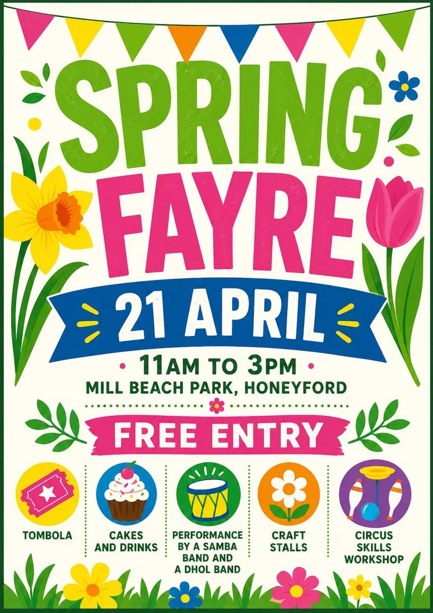
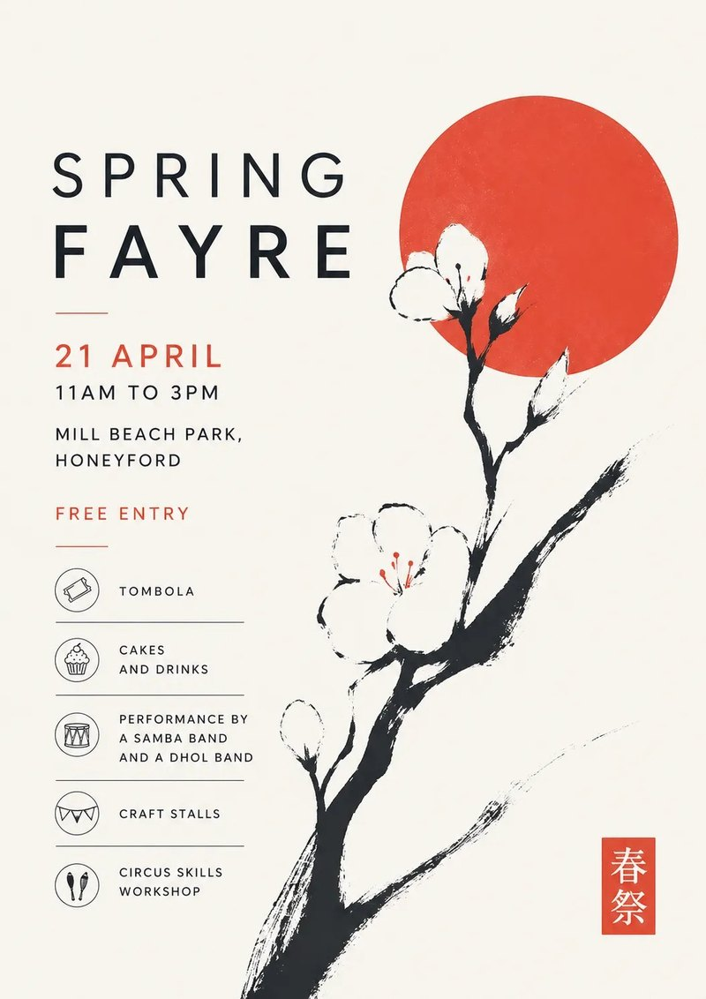
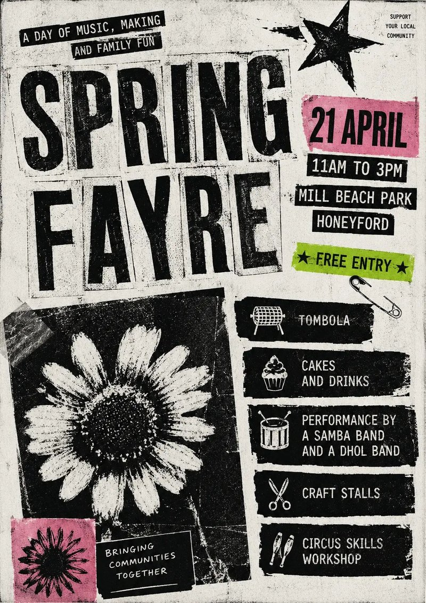
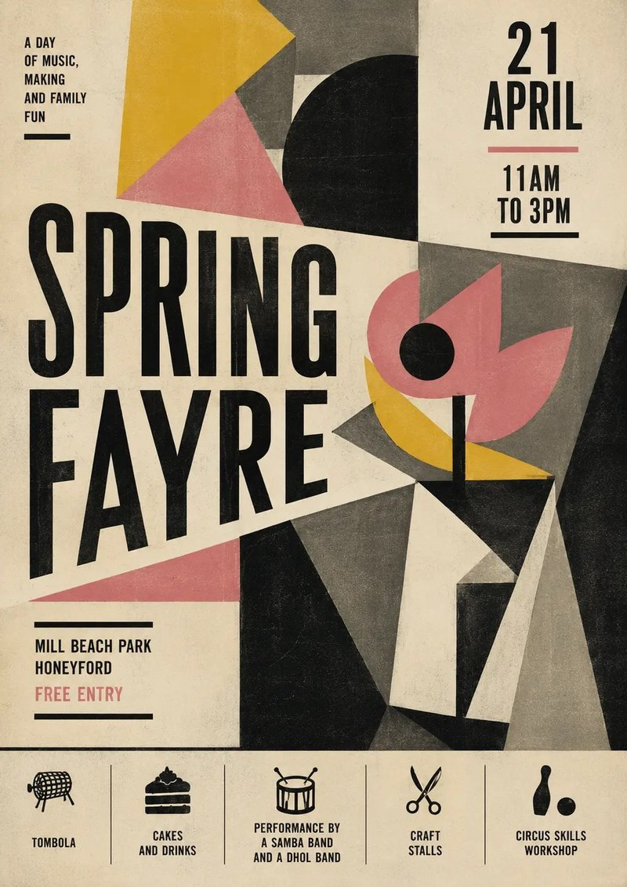

下次你在小镇集市、酒吧门口或者社区公告栏上看到一张 AI 做的活动海报，先别急着说它难看。多数情况下它并不难看——它只是和过去半年里你看过的另外二十张一模一样：彩旗、手绘花、粉彩配色、圆润的衬线字。

John Hartnup 在 [AI-generated posters don't have to be horrible](https://john.hartnup.uk/2026/06/07/ai-event-posters.html) 里给出的判断是：**问题不在质量，在重复**。他自己的原话是「它们还行，我不讨厌。但同一个风格看过二十遍之后，光凭这份重复就足够让人烦躁」。于是他做了一次实验：同一份虚构活动信息，点名十几种不同的设计风格，看模型能不能给出不一样的东西。结论是能——而且顺手做出了一份[一百种海报风格的提示词目录](https://john.hartnup.uk/poster-prompts/)。

## 问题不是丑，是默认

事情起因是一张在社交媒体上被广泛转发的[同款海报合集](https://www.facebook.com/photo.php?fbid=1530303992439434&set=pb.100063795433962.-2207520000&type=3)，英国[《独立报》也报道过这股 AI 海报风潮](https://www.independent.co.uk/life-style/ai-poster-slop-local-events-flyer-b2989792.html)。作者在现实里又遇到一张——2026 年 Leamington 啤酒节的海报，并且先声明「不是针对他们，他们绝不是个例」。

关键在于这类海报的来源机制。如果活动主办方只是给模型一句「帮我做张春季集市的海报」，模型就会退回训练数据里最高频的那套视觉方案。这不是模型能力不足，而是**没有约束时它会选择最安全的默认答案**，而这个默认答案是全局共享的：所有主办方拿到的都是同一套彩旗与粉彩。

这个观察和[我们之前写过的 GPT-5.4 前端设计问题](https://celery94.github.io/posts/gpt54-frontend-right-way)是同一个机制：模糊的输入换来通用布局。区别只是这次的产物是印在纸上的。

## 一次实验：同一份信息，点名风格

作者的初始提示词包含了完整的活动信息，还特意加了两条负面约束：

```text
Produce a poster for a spring fayre.
21 April - 11am to 3pm
Mill Beach Park, Honeyford
Free entry
Tombola
Cakes and drinks
Performance by a samba band and a dhol band.
Craft stalls
Circus Skills workshop

Go for a clean, unfussy, bright layout with a bold striking
spring-themed graphic. Avoid pastel/airbrush/oil style art or
images of people.
```

第一版仍然是他想避开的那种手感。「干净、不繁琐、明快」这类形容词，并不能把模型从默认审美里拽出来。



_第一版：即便加了「避免粉彩、不要人物」的约束，出来的仍是那套默认集市模板。图源：[john.hartnup.uk](https://john.hartnup.uk/2026/06/07/ai-event-posters.html)_

第二版他换了个说法，不再描述感觉，而是明确要求换一套设计美学：

```text
Make another one using a completely different design aesthetic of
your choice. Treat the current one as a "what not to do" – not
that there is anything wrong with it, but we want ours to stand
out from other posters that look similar.
```

这次的产出明显不同。接着他问了模型一个关键问题：**这个风格叫什么名字？** 模型回答是「 modernist / Bauhaus-influenced graphic style 」，并给出了更具体的说法：Bauhaus / Modernist Poster Design、Geometric Minimalism、Swiss Style influence，还给了一个可以直接使用的短标签「Bauhaus-inspired geometric minimalist poster」。

获得名字这一步很重要。一旦风格有了名字，它就从「这次运气不错」变成了可以重复调用的指令。

## 把风格名变成可复用指令

作者随即让模型列出可选的风格清单，模型给了 15 项，覆盖几个方向：

- **干净但有性格**：Bauhaus / Modernist、Swiss Style、Contemporary Editorial
- **图形与插画但不甜腻**：Risograph Print Style、Cut Paper / Collage（Matisse 风格）、Botanical Scientific Illustration
- **大胆或非常规**：Brutalist Graphic Design、90s Rave Flyer / Acid Graphics、Memphis Design
- **安静克制**：Japanese Minimal Poster、Monochrome + Single Accent、Wayfinding / Signage Style
- **轻快但干净**：Modern Icon System、Stamp / Letterpress Style、Festival Poster

此后他逐个点名生成：印章与凸版印刷风、日式极简、孟菲斯设计、Designers Republic 风格、儿童水彩加专业排版、1980 年代朋克同人志、90 年代 drum and bass 传单、1940 年代立体主义展览海报。同一份活动信息，视觉结果差异巨大。



_点名的风格之一：日式极简（Japanese Minimal）。图源：[john.hartnup.uk](https://john.hartnup.uk/2026/06/07/ai-event-posters.html)_



_点名的风格之一：1980 年代朋克同人志（Punk Fanzine）。图源：[john.hartnup.uk](https://john.hartnup.uk/2026/06/07/ai-event-posters.html)_

这里有一个作者自己都承认的坦白：这些海报仍然看得出是 AI 生成的。他的目标不是消除 AI 痕迹，而是避开那个「所有人都看腻了的默认样貌」。

## 一个真实的坑：风格会连带把内容带进来

实验过程中出现了一个值得单独记住的问题。生成到 Designers Republic 那一版时，海报上多出了一句话：「A day of music making and family fun」。作者没有要求过这句话，是模型认为这个设计机构会往海报里塞这类文案，于是自己写了一句。

麻烦在于：**这句话进入了对话上下文，之后每一版海报都会带上它。**

作者的结论很直接——如果你是从零开始做一张真实活动的海报，就应该在第一句里直接点名你想要的风格，而不是一轮一轮试。多轮迭代会把中间产物的残余（不管是文案、配色还是构图习惯）一路带下去。

这条经验比「提示词要具体」这种泛泛建议有用得多，因为它描述的是一个具体的污染路径。



_同一份活动信息的另一个风格：1940 年代立体主义展览海报（Cubist Exhibition Poster）。图源：[john.hartnup.uk](https://john.hartnup.uk/2026/06/07/ai-event-posters.html)_

## 提示词之外，另一半工作

作者后来把这件事扩展成了一个[一百种风格的提示词目录](https://john.hartnup.uk/poster-prompts/)，每种风格配一份可直接粘贴的提示词，以及集市和音乐演出两种示例海报。他的评价也很克制：有些在他看来很好，有些仍然像「slop」，但稍作调整就能用；合在一起，它们证明了这个空间比默认选项大得多。

目录里那份[使用说明](https://john.hartnup.uk/poster-prompts/how-to-use/)包含了不少和风格无关、但决定成品能不能用的内容：

**历史风格会触发「做旧」本能。** Art Nouveau、Art Deco、Constructivist 这类风格会让模型把画面处理成分色、褪色、像翻拍自一百年前的原件。如果不想要这个效果，要显式写进提示词：色彩鲜明饱和、不是褪色或分色；干净的复刻质量，像是新印出来的；高对比，没有做旧或磨损。

**模型会自己编细节。** 提示词里出现乐队名、城镇名或场地名，模型就会**发明**它们的样子——不存在的人的照片、不存在的地方的地图。应对方式有四条：让提示词更抽象（明确要求不要人物照片、不要写实场景，只要图形元素）；让提示词更具体（指定配色、意象、氛围，把它发明的空间填掉）；上传参考图（乐队照片、场地照片、城镇照片）；或者干脆后期处理——把 AI 生成的部分只当作风格层，用 Canva 或 Photoshop 把真实照片、真实文字叠上去。

**要检查内容是否诚实。** 作者这段提醒值得完整保留：如果集市没有带条纹的大帐篷和彩旗，海报上就不该出现；如果海报上有人在吃棉花糖，活动就得真的卖棉花糖；如果活动在摆着现代家具的社区图书馆里办，海报上不该出现哈利·波特式的橡木镶板图书馆。**模型会替你编出这些假承诺**，需要人主动收紧。

**印前检查不能省。** 放大看文字是否清晰正确，检查有没有多出来的手、从手肘长出来的琴弓、数量对不上的手指。作者点明了原因：这些是 AI 图像生成的典型失效模式，扫一眼很容易漏掉。宁可重新生成，也不要指望没人发现。作者还建议直接把成品丢回给模型问一句「这张图现在能印出来贴在图书馆或便利店吗」，它会指出文字不可读、日期错乱、放大到 A3 会散架之类的明显问题。

**配额是真实约束。** 免费账号每天能生成的图片数量很少。如果是给真实活动做海报，不要留到活动前一晚——多留几天，以防需要比每日额度更多的尝试次数。付费档位上限更高但也不是无限，一次会话里大量生成时要自己控制节奏。

## 最实用的一条建议：先问缺什么

在所有这些技巧里，作者给出的最有价值的一条反而和风格无关：

> 让你的活动信息先过一遍检查——这条描述是否包含了读者需要的全部信息？有没有缺失或含糊的地方？

他说模型很擅长抓这类遗漏：少了的星期几、含糊的场地名、暗示了却没写出来的时间。这一步不消耗任何图像配额，却能避免海报印出来之后才发现信息不全。

## 最后一步不是更好的提示词

原文结尾给了一个不常见的转向。作者说，一张手工做的海报，哪怕朴素，几乎总比 AI 生成的更有辨识度——**AI 擅长做出「可信的」，不擅长做出「你的」**。如果你对 Canva、Affinity 甚至 PowerPoint 有一点兴趣，值得花一个下午自己做一张：可以用真实的照片、真实的字体、真实的配色，可以反复挪动直到位置对了，而不必寄希望于下一次生成。

这篇文章的正题是「AI 海报不必难看」，但作者自己给出了更彻底的答案：不必难看的最终理由，是你完全可以自己做一张。

## 可以照着做的清单

如果你确实要用 AI 做一张真实活动的海报：

1. **先整理活动信息**，然后让模型检查一遍是否完整、有没有含糊之处——这一步免费。
2. **在第一句里就点名风格**。不要先说「帮我做张海报」再逐轮调整，中途产生的文案和配色会一路跟到后面每一版。
3. **要一个风格名**。如果某一版效果不错，问清楚这个风格叫什么、有没有更准确的短标签，把它变成可复用的指令。
4. **历史风格加防做旧约束**，明确写「色彩鲜明、干净复刻、无做旧」。
5. **堵住模型发明的空间**：要么抽象化并禁止写实人物场景，要么把配色与图形元素写死，要么上传参考图。
6. **核对内容诚实性**，海报上的每个视觉承诺都要能在现场兑现。
7. **放大做印前检查**，然后让模型也帮你看一遍能不能直接印。
8. **留出配额余量**，免费额度下尤其如此。

原文那张默认模板的对比、以及后来的风格变体，都放在了他的[风格目录](https://john.hartnup.uk/poster-prompts/)里。如果你只是想给自己社区的活动做一张不那么一样的海报，那份目录加上这份清单基本够用了。

Aide Hub 会继续整理这类「把提示词变成可复用流程」的实践，覆盖 AI 助手、内容创作与软件工程。

## 参考

- [AI-generated posters don't have to be horrible](https://john.hartnup.uk/2026/06/07/ai-event-posters.html)（原文，John Hartnup）
- [Poster Prompts：一百种海报风格的提示词目录](https://john.hartnup.uk/poster-prompts/)
- [How to use these prompts](https://john.hartnup.uk/poster-prompts/how-to-use/)
- [Soulless summer fairs: AI poster slop is taking over a pub near you（The Independent）](https://www.independent.co.uk/life-style/ai-poster-slop-local-events-flyer-b2989792.html)
- [用 GPT-5.4 做前端开发，大多数人的姿势不对（本站）](https://celery94.github.io/posts/gpt54-frontend-right-way)
