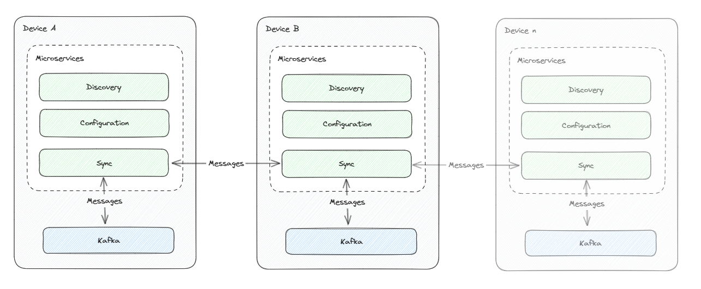

> ## 摘要
>
> Crew Clark 如何使用 Visual Studio 并在 Docker Compose 环境中进行性能分析的简要总结。
>
> 原文 [Profiling Docker Compose services through Visual Studio](https://devblogs.microsoft.com/ise/profiling-docker-compose-services-through-visual-studio/) 由 Andrew Cardy 撰写。

---

2024年4月19日

## 通过 Visual Studio 对 Docker Compose 服务进行性能分析

在项目的某个阶段，几乎每位开发者都会遇到需要提升代码性能的情况。通常情况下，针对 .NET 项目，首选的工具会是 Visual Studio 内置的性能分析器。如果你的服务在本地机器上运行，这套工具表现优异，但遗憾的是，我们的情况稍有复杂。

在我们的项目中，我们正在开发一个解决方案，以创建设备的网络并在它们之间共享数据和应用。该解决方案包括了一个 Kafka 实例用于内部消息传递，以及多个微服务。其中包括了用于配置、发现的服务，以及一个用于同步设备间 Kafka 主题的服务。我们希望对同步服务进行性能分析，以找到性能提升点从而增加吞吐量。

我们设计的简化视图看起来像这样：



同步服务依赖于运行中的 Kafka 实例，毕竟它的目的是同步 Kafka 主题！对于我们的内部开发循环，我们使用 Docker Compose 来协调依赖关系。这对于一般开发来说是个不错的解决方案，因为 Visual Studio 允许我们通过单击就可以同时运行同步服务和 Kafka 实例。我们也可以像它们在本地运行一样同时调试它们。

当涉及到性能分析时，我们遇到了一个问题，因为标准的 Visual Studio 性能分析工具不支持这个设置。我们需要找到一个替代方案。

## Docker Compose 基础知识

在深入研究在 Docker Compose 中分析工作负载之前，让我们先回顾一下 Docker Compose 是什么，以及如何在 Visual Studio 中使用它。

如果你已经熟悉 Docker Compose，请随意跳到下一部分。

Docker Compose 是一个用于定义和运行多容器 Docker 应用的工具。它允许你在一个 `docker-compose.yml` 文件中定义组成你的应用的服务，然后一起运行它们。这对于开发很有好处，因为它允许你在单个文件中定义整个应用堆栈，然后用单个命令运行它。

Visual Studio 对 Docker Compose 的支持更进一步。它允许你在 Visual Studio 项目中定义你的 `docker-compose.yml` 文件，这可以作为一个启动配置文件。这意味着你可以从 Visual Studio 运行整个应用堆栈，并且还可以将 Visual Studio 调试器附加到任何正在运行的服务上。

如果你想在自己的项目中试试这些，有一个关于如何在 Visual Studio 中开始使用 Docker Compose 的教程，在 [Visual Studio 文档](https://docs.microsoft.com/en-us/visualstudio/containers/tutorial-multicontainer?view=vs-2022)中。

## 在 Docker Compose 中进行性能分析

那么，我们如何对运行在 Docker Compose 中的应用进行性能分析呢？

理想情况下，我们会使用内置在 Visual Studio 中的诊断工具，但不幸的是，某些场景尚未受支持。在我们的案例中，我们希望对 Docker Compose 项目中的单个同步服务进行性能分析。

幸运的是，有一个相对简单的方法可以帮助我们实现性能分析。步骤如下：

1.  更新 Dockerfile。
2.  运行 compose 项目
3.  在目标容器中运行性能分析工具
4.  在 Visual Studio 中分析性能分析数据

### 更新 Dockerfile

第一步是更新你想进行性能分析的服务的Dockerfile，使用 .NET SDK 而不是运行时。这将允许我们安装和运行性能分析工具。

如果你使用的是 Visual Studio 创建的标准 Dockerfile，最简单的方法是临时更改基础镜像为 .NET SDK，例如 `mcr.microsoft.com/dotnet/sdk:8.0`。虽然这对一次性的性能分析很方便，但你不会希望在生产中使用它。

如果你想让性能分析成为你的开发循环的一部分，你可能会考虑创建一个专门用于性能分析的单独 Dockerfile，或者在现有的 Dockerfile 中添加一个特定于性能分析的阶段。对于后者，有关 [多阶段构建](https://docs.docker.com/develop/develop-images/multistage-build/) 的更多文档。

### 运行 compose 项目

一旦你更新了 Dockerfile，你就可以像往常一样运行 compose 项目。这将构建并运行 compose 文件中定义的服务，包括你想要进行性能分析的服务。

### 在目标容器中运行性能分析工具

一旦 compose 项目运行起来，我们可以使用 Visual Studio 容器工具进入目标容器并安装并运行性能分析工具。

进入容器后，你可以使用 .NET CLI 安装性能分析工具。例如，安装 `dotnet-trace` 工具，你可以运行：

```bash
dotnet tool install --global dotnet-trace export PATH="$PATH:/home/app/.dotnet/tools"
```

然后你可以使用 `dotnet-trace` 工具收集运行应用程序的跟踪。例如，要收集 `dotnet run` 命令的跟踪，你可以运行：

```bash
dotnet-trace collect --process-id <dotnet process ID> --providers Microsoft-DotNETCore-SampleProfiler
```

进程 ID 可以用 `ps` 命令找到，或者使用 `dotnet-trace ps` 命令。如果使用后者，寻找引用目标服务 dll 的进程。

将它全部集成在一个名为 ‘MessageProcessing’ 的项目中，过程看起来像这样：


当运行 dotnet-trace 时，它将自动开始采样正在运行的服务。一旦你收集了足够的数据，你可以使用 `Ctrl+C` 停止跟踪。这将把跟踪保存到一个文件中。

由于我们通过 Docker Compose 和 Visual Studio 运行服务，项目目录自动挂载到容器中。这意味着跟踪文件将被保存到源代码树中，并在解决方案资源管理器窗口的项目下可见。


### 在 Visual Studio 中分析性能分析数据

一旦你收集了跟踪，你可以在 Visual Studio 中打开它。只需在解决方案资源管理器中双击跟踪文件即可。

这将在 Visual Studio 中打开完整的跟踪，你可以使用内置的性能分析工具来分析跟踪。这将允许你看到代码中的瓶颈在哪里，并针对性地进行改进以提升你的服务性能。


## 结论

使用这种方法，我们能够对在 Docker Compose 中定义的服务进行性能分析，并识别我们代码中的瓶颈。在我们的案例中，我们发现了一些增加处理时间的外部调用，我们可以针对性地进行改进！

## 致谢

我要感谢 Crew Clarke 团队，我们都为开发我们对 Docker Compose 的使用和知识贡献了自己的部分，感谢所有参与 Docker Compose 和 Visual Studio 工具开发的人，以及那些通过分享他们的知识和经验，为我们的社区做出贡献的优秀开发者。
