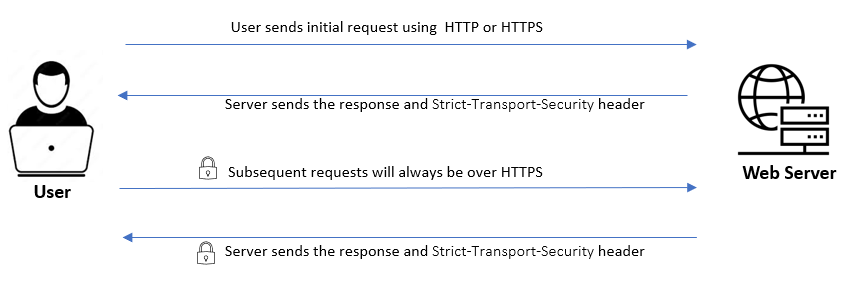
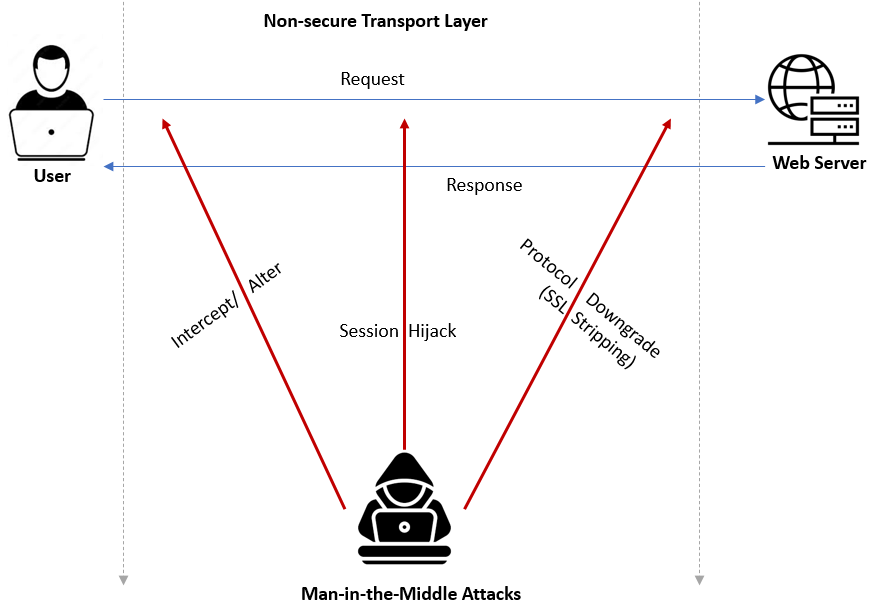
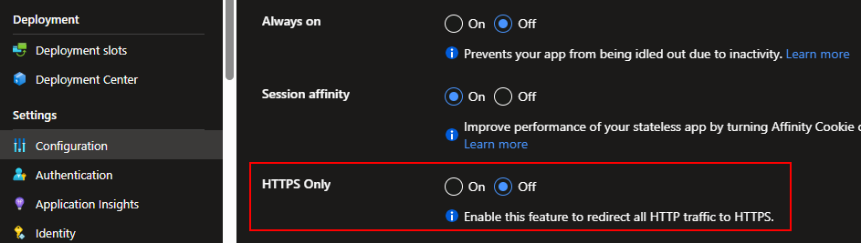
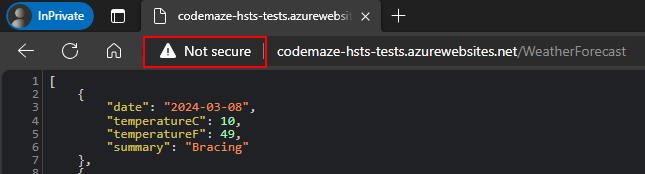
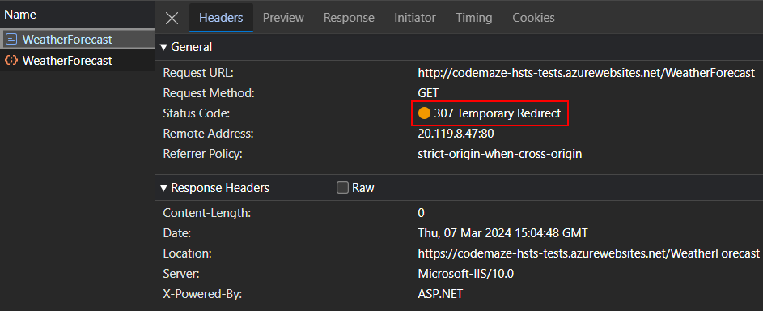
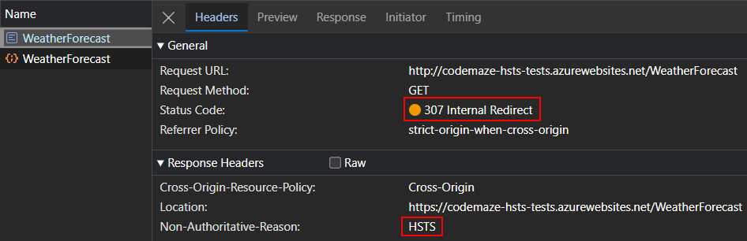

> ## 摘录
>
> HSTS 是一个网页安全标准，要求客户端或浏览器仅使用安全的 HTTPS 连接进行交互。
>
> 原文链接：[HSTS Header Implementation in ASP.NET Core](https://code-maze.com/aspnetcore-hsts-header-implementation/)

---

在这篇文章中，我们将学习如何在 ASP.NET Core 应用程序中实现 HSTS 头。

要下载本文的源代码，您可以访问我们的 [GitHub 仓库](https://github.com/CodeMazeBlog/CodeMazeGuides/tree/main/aspnetcore-features/HSTS)。

## 什么是 HSTS

**HTTP 严格传输安全（HSTS）是一种网络安全机制，强制浏览器仅使用安全的 HTTPS 连接访问网站**。启用后，浏览器会自动将任何 HTTP 连接升级为 HTTPS，对用户和 Web 服务器之间传输的数据进行加密。

我们可以通过添加 `Strict-Transport-Security` 响应头来实现 HSTS。**一旦浏览器识别到此头，它将确保对该网站的后续请求都是通过 HTTPS 进行的，并拒绝建立不安全的连接**。

为网站启用 HSTS 遵循特定模式：



最初，用户使用 HTTP 或 HTTPS 连接到网站。服务器发送回一个包含 `Strict-Transport-Security` 头的响应。此头将包含一个 `max-age` 指令，指示浏览器应记住多长时间仅通过 HTTPS 访问该网站。因此，在这个特定的持续时间内，浏览器将自动默认使用 HTTPS 进行所有未来的请求，即使用户输入了 HTTP URL。

然而，**即使启用了 HSTS，第一次请求仍可能通过 HTTP 进行，从而存在安全漏洞。**我们稍后将通过使用 HSTS 预加载来防止这种情况。

## 为什么需要 HSTS

HTTP 严格传输安全（HSTS）是保护网站免受多种攻击类型的关键安全措施。让我们看看为什么实现这一点很重要。

### **强制使用安全连接**

**HSTS 确保网站只通过安全的 HTTPS 连接访问。**一旦网站实现了 HSTS 策略，浏览器将拒绝与该网站的所有不安全连接。这很重要，因为 HTTPS 在传输过程中加密所有数据，将其免受拦截和篡改。

### **防止中间人攻击**

**HSTS 防止了几种类型的中间人攻击。**这些是安全攻击的一种，攻击者在用户和 Web 服务器之间截获并可能更改通信，而双方并不知情。这里两方认为他们互相通信，然而，实际上是攻击者控制并操纵消息。一旦我们实施了 HSTS，攻击者就无法读取或更改通信。

### **防护会话劫持**

**会话劫持是一种中间人攻击类型，其中攻击者通过截获与服务器的通信来接管用户的会话。**接管会话后，攻击者可以盗取个人数据，冒充经过身份验证的用户，或者利用系统，而不需要知道用户的凭证。

### **避免协议降级攻击**

**协议降级攻击是另一种类型的中间人攻击，攻击者截获用户和 Web 服务器之间的通信**，强迫它们使用较不安全的通信协议版本。SSL 剥离攻击或 SSL 降级攻击是常见的示例，攻击者将连接从安全的 HTTPS 降级到未加密的 HTTP：



通过实施 HSTS，我们可以防止这些类型的中间人攻击。

## 在 ASP.NET Core 中实现 HSTS

我们已经解释了[如何在传输中加密所有数据](https://code-maze.com/owasp-top-10-sensitive-data-exposure/#preventionsteps)作为讨论如何防止敏感数据暴露漏洞的一部分，这是[OWASP前10大漏洞](https://code-maze.com/owasp-top-10-vulnerabilities/)之一。

为了更好地理解这一点，让我们首先使用 `dotnet new webapi` 命令或 Visual Studio WebAPI 模板创建一个 ASP.NET Core Web API 应用程序，并将其配置为不使用 HSTS 和 HTTPS 重定向。对于这个示例，让我们保留模板中默认附带的 `WeatherForecast` 控制器。但是，让我们确保从 `Program` 类中删除默认包含的 HTTPS 重定向中间件：

app.UseHttpsRedirection();

此时，我们的应用程序没有启用 HSTS 或 HTTPS 重定向。然而，浏览器忽略来自 localhost 的请求的 HSTS 设置，所以让我们[将应用程序部署到 Azure Web App](https://code-maze.com/deploying-aspnet-core-web-api-azure-api-apps/)以测试功能。

**默认情况下，Azure Web 应用程序将具有“仅 HTTPS”功能，此功能会强制所有网络流量使用安全的 HTTPS 协议**。为了测试目的，让我们通过在 Azure 门户中的 Web 应用的**设置**部分下的**配置**中导航，并在**常规设置**选项卡中关闭**仅 HTTPS**设置来禁用它：



现在让我们尝试使用 HTTP 协议打开 API URL。我们可以看到浏览器将使用 HTTP 加载 API 并警告我们该网站的安全性：



仅出于示例目的禁用此功能。像这样创建和配置我们的应用程序将是非常糟糕的做法。攻击者可以轻松截获请求和响应并执行不同类型的攻击。

现在让我们看看通过添加不同的安全中间件来保护我们的网站。我们可以看看如何在 ASP.NET Core 应用程序中启用 HSTS。为此，我们需要配置 2 个中间件 - **HTTPS 重定向中间件**和 **HSTS 中间件**。

### HTTPS 重定向中间件

首先，让我们通过将其重新添加到 `Program` 类中来配置 HTTPS 重定向中间件：

```csharp
app.UseHttpsRedirection();
```

通过启用此功能，我们可以强制对我们的网站进行安全通信。即使用户尝试使用 HTTP 访问我们的网站，服务器也会自动将他们重定向到使用 HTTPS。

现在，让我们通过将最新更改部署到 Azure Web 应用程序来看看这个实际操作。之后，让我们再次尝试使用 HTTP 协议访问 API：



这次，我们可以看到服务器对 HTTP 请求返回了一个 `307 Temporary Redirect` 响应，将位置设置为 HTTPS URL。这将触发对 HTTPS URL 的新请求，网站现在将在 HTTPS 下加载。

默认情况下，中间件会将所有重定向发送 `307 Temporary Redirect`。然而，如果我们需要在生产中发送永久重定向状态代码，我们可以在添加中间件时配置它：

```csharp
builder.Services.AddHttpsRedirection(options =>
{
    options.RedirectStatusCode = StatusCodes.Status308PermanentRedirect;
    options.HttpsPort = 443;
});
```

请注意，还有一个设置 HTTPS 端口的选项。

### HSTS 中间件

现在让我们通过从 `Program` 类中删除 `UseHttpsRedirection()` 方法来移除 HTTPS 重定向中间件。

然后我们将 HSTS 中间件添加到 `Program` 类中，看看它是如何工作的：

```csharp
app.UseHsts();
```

让我们再次将这些更改部署到 Azure Web 应用程序，并尝试使用 HTTP 协议访问 API：



这次，服务器以将位置设置为 HTTPS URL 的 `307 Internal Redirect` 响应。这触发了对 HTTPS URL 的新请求，网站现在将在 HTTPS 下加载。

请注意，有一个 `Non-Authoritative-Reason` 头，值为 `HSTS`，表明重定向是由于 HSTS。这证明，如果一个网站配置了 HSTS 并且用户尝试通过不安全的 HTTP 连接访问它，它将以 `307 Internal Redirect` 状态代码响应并自动将连接升级到安全的 HTTPS 连接。这确保了浏览器和网站之间的所有通信都通过 HTTPS 安全加密。

此外，对于新的 HTTPS 请求，服务器发送回一个对应于 HSTS 的响应头：

```plaintext
Strict-Transport-Security: max-age=2592000
```

这进一步确保浏览器将使用 HTTPS 发起与此网站的所有未来通信。

### HSTS 参数

在使用 HSTS 时，我们可以配置一些参数：

- `MaxAge` – 一个 [TimeSpan](https://code-maze.com/csharp-timespan/) 值，表示浏览器应该使用仅 HTTPS 访问服务器的持续时间
- `IncludeSubDomains` – 当设置为 true 时，将 HSTS 策略应用于主机域和其所有子域
- `Preload` – 当设置为 true 时，此参数表示我们希望将站点包含在浏览器的 HSTS 预加载列表中。

我们可以通过设置选项并调用 `AddHsts()` 方法来设置这些参数：

```csharp
builder.Services.AddHsts(options =>
{
    options.MaxAge = TimeSpan.FromDays(365);
    options.IncludeSubDomains = true;
    options.Preload = true;
});
```

一旦我们设置了这些值，服务器将在响应中包含带有这些值的 `Strict-Transport-Security` 头：

```plaintext
Strict-Transport-Security: max-age=31536000; includeSubDomains; preload
```

这指示浏览器在接下来的一年内仅通过 HTTPS 访问该站点，将此规则应用于所有子域，并授权在浏览器的 HSTS 预加载列表中包含域。

在生产中首次实施 HSTS 时，将 `MaxAge` 的值设置为较短的时间段是一个好习惯，比如几个小时。这样做，我们可以在它不符合预期时轻松地恢复。一旦我们对 HSTS 配置有信心，我们可以将其增加到更大的值。一年是大多数应用程序在生产中使用的理想时期。

### 本地测试 UseHsts

**默认情况下，浏览器会忽略来自 `localhost` 的 HSTS 头**。因此，对于本地测试，我们将不得不对系统主机文件进行一些更改，然后修改启动设置。

然而，**请记住，不建议在开发过程中使用** `UseHsts()` **方法**，因为浏览器高度可缓存 HSTS 设置。当浏览器从网站接收到 HSTS 头时，它会记住头中提到的 `max-age` 属性指定的期间。如果在发生错误的情况下（如 SSL 证书到期）使用了带有 HSTS 的 `localhost`，浏览器将继续强制对 `localhost` 应用 HSTS，直到指定的 `max-age` 过去为止。这将使得在此期间本地调试和运行应用程序变得非常困难。

话虽如此，如果我们需要在 `localhost` 上测试 HSTS，我们可以使用一个解决方法。我们必须在操作系统的主机文件中添加一个条目，这是一个小文件，将主机名映射到 IP 地址。它就像一个本地 DNS，将域名转换为 IP 地址。

对于基于 Unix 的系统，可以在 `/etc/hosts` 访问主机文件。对于基于 Windows 的系统，主机文件可在 `C:\Windows\System32\drivers\etc\hosts` 中找到。在主机文件中，我们可以将一个假域名映射到 `localhost`。例如，我们可以将 `myweb.local` 域映射到 `localhost`：

> 127.0.0.1 myweb.local

之后，我们可以使用 `myweb.local` 而不是 `localhost` 通过 HTTPS 测试我们的网站：

> https://myweb.local:7154/WeatherForecast

这次，我们可以看到浏览器将发送 HSTS 响应头：

> Strict-Transport-Security: max-age=2592000

太好了！我们现在可以在本地测试 HSTS 的实现。

## HSTS 预加载

**HSTS 预加载是一种机制，通过该机制浏览器预加载希望在其站点上强制使用 SSL/TLS 的网站列表**。这个预加载的网站列表被称为 HSTS 预加载列表。当支持 HSTS 预加载的浏览器（例如 Chrome、Firefox、Safari、Edge 等）遇到包含在预加载列表中的网站时，浏览器会自动使用安全的 HTTPS 连接进行所有通信，而不是使用不安全的 HTTP 连接。

最大的优势是 **HSTS 预加载允许网站在第一次连接之前就请求安全连接**。请记住，尽管启用了 HSTS，但仍然可以发送第一次请求通过 HTTP。通过使用 HSTS 预加载，我们可以防止攻击者利用用户首次请求和网站重定向响应之间的短暂时间窗口 - HTTPS 降级攻击或 SSL 剥离的漏洞。

话虽如此，如果我们需要将网站包含在 HSTS 预加载列表中，它需要满足某些标准：

- 拥有有效的SSL证书
- 将所有HTTP流量重定向到HTTPS，包括子域也是如此
- 对HTTPS请求的基域返回HSTS头
- 通过`includeSubDomains`指令指定所有子域
- 指定`preload`指令
- 被提交到[HSTS预加载列表](https://hstspreload.org/)。

记住，一旦网站被列入HSTS预加载列表，将很复杂去除，因此，决定进行预加载应该非常谨慎。

## HSTS最佳实践

回顾一下，我们可以追求几种最佳实践，以确保最佳的安全性。

**第一道防线是在应用程序级别强制执行HTTPS重定向**。我们可以配置web应用程序，将HTTP流量重定向到HTTPS，以防止通过不安全的连接发送数据。**在托管级别强制执行HTTPS重定向也会很有益处**。一些托管服务提供服务器配置或控制，用于强制HTTP重定向到HTTPS。在托管级别上有这种重定向补充应用程序级别的重定向，增加了一个额外的安全层。

**另一个重要步骤是在我们的web应用程序中启用HSTS**。这指示浏览器总是使用HTTPS而非HTTP进行通信，并减少中间人攻击的风险。建议开始时在`Strict-Transport-Security`头中使用低`max-age`指令。当我们确认一切通过HTTPS正确工作后，我们可以逐渐增加这个值，期间如一年。在考虑`includeSubDomains`选项时，我们必须小心。我们应该只在确定所有网站子域也将支持HTTPS时使用它，因为它将HSTS政策应用于所有子域。

**此外，我们可能会考虑HSTS预加载**。一旦正确设置HSTS并进行测试，我们可以考虑向其添加`preload`指令，并将我们的域名提交给HSTS预加载列表。但请记住，这实际上将我们的域名硬编码到浏览器为仅HTTPS，并且很难还原。所以我们应该只在完全自信时才这么做。

实施HSTS是迈向web应用程序安全的重要一步，遵循这些最佳实践将确保我们添加了多层防御。一旦正确实施，我们的应用程序的所有通信都将通过HTTPS安全进行。

## 结论

在本文中，我们学习了如何在ASP.NET Core应用程序中实现HTTP严格传输安全（HSTS）头。我们还讨论了HTTPS重定向中间件，HSTS中间件，如何在本地测试HSTS，并以HSTS预加载的概念结束。
