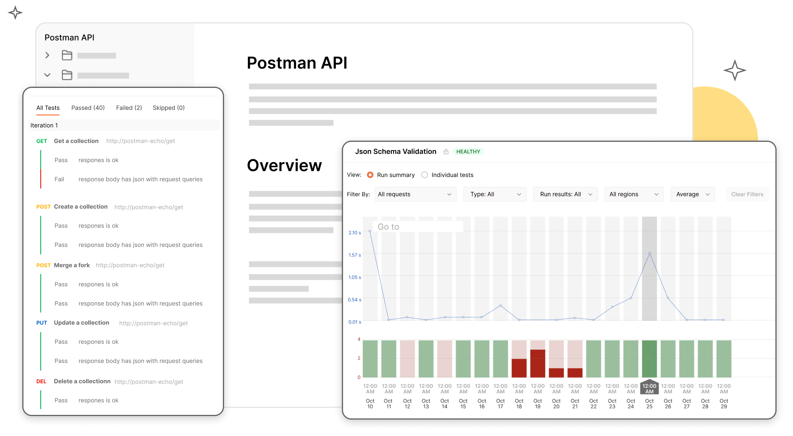

> ## 摘录
>
> 了解什么是API监控，以及它如何帮助团队发现API相关问题——比如错误、延迟和安全漏洞——在问题升级前。
>
> 原文 [What is API Monitoring? Use Cases, Tools & Best Practices | Postman](https://www.postman.com/api-platform/api-monitoring/)

---

## 什么是API监控？

API监控是收集、可视化和警告API遥测数据的过程，以确保API请求按预期处理。

APIs是现代应用程序重要的基础设施组件；它们连接内部微服务，驱动重要的用户旅程，并向第三方消费者暴露数据和功能。因此，API监控在帮助团队及时发现API相关问题（如错误、延迟和安全漏洞）方面发挥着重要作用，避免这些问题升级和对依赖服务、合作伙伴和客户产生负面影响。API测试旨在支持开发阶段的快速迭代，而API监控的主要目标是减少面向消费者的问题的平均解决时间(MTTR)。

这里，我们将讨论在[API优先世界](https://api-first-world.com/)中API监控的作用，API监控最常见的用例，关键的API性能指标，以及Postman如何帮助你实现全面的API监控策略。

## 在API优先的世界中，为什么API监控至关重要？

近年来，许多组织已将其单体应用分解为独立管理的微服务，这些微服务通常在基于云的基础设施上运行，并通过内部APIs相互通信。基于微服务的应用程序比其单体对应项更具可扩展性和成本效率，但它们的依赖关系也引入了大量的复杂性。例如，对一个微服务的API的看似微小改动可能对它支持的微服务产生意想不到的后果。

除了使用API连接内部微服务外，一些组织开始向第三方消费者提供API作为可计费产品。在这种模型中，被称为“API作为产品”，API生产者负责维持可用性、性能和安全的服务级别协议(SLAs)，一个问题可能会侵蚀客户信心并导致流失。

这些行业范围的变化伴随着[API优先开发模型](https://www.postman.com/api-first/)的普及，团队在开发依赖它们的应用程序和集成之前开发API。这种策略是为了应对拙劣设计和执行的API的担忧，这些API通常无法满足它们支持的服务的需求。API监控提供了一种系统化的方法来维持API质量，使其成为API优先方法的关键支柱。结果产生的API具有韧性，易于使用，并且能够应对基于微服务的架构和API作为产品模型的固有挑战。

## API监控的主要应用场景是什么？

每个组织都不同，需要实施满足其特定需求的API监控策略。尽管如此，对任何团队来说，API监控的几个用例都是广泛相关的：

### 确认个别请求随时间保持健康

API监控的主要用例是确认对API的请求随时间保持预期的性能。这对于敏捷开发团队尤其重要，这些团队可能每天部署几次代码变更。API监控可以帮助这些团队尽早发现错误和性能下降，以便在问题影响其消费者和客户前部署修复。

### 验证多步用户旅程

一些最重要的业务工作流将请求连接在一起，有时涉及多个API。因此，有效的API监控策略使团队能够系统地触发这些复杂的工作流并监控沿途的结果。

### 了解第三方API中的问题

如果一个团队无法识别问题的来源，第三方API可能是罪魁祸首。这些团队可以为他们使用的第三方端点配置监视器，这将使他们免于排查他们无法控制的问题。

### 发现安全漏洞

不安全的API可能为攻击者提供进入点，因此对团队来说，持续监控他们的API以查找漏洞很重要。这个过程涉及在开发、CI/CD管道和生产中配置和运行安全检查。

## 监控API的关键指标是什么？

APIs发出的信号范围可以提供关于其健康和性能的重要见解。然而，选择一个监控工具很重要，它不仅提供这些性能数据的高级概览，还能让您按关键方面过滤——比如请求名称、地区和环境——以理解问题的范围。最重要的指标是：

- **错误：**有许多类型的API错误和它们发生的原因，但错误数量或百分比的突然增加表明API对其用户广泛不可用。
- **延迟：**这个指标指的是请求返回响应所需的时间，是API性能的主要指标。团队应该监控个别请求的延迟，以及工作流中所有请求的总延迟。如果您注意到某个经常返回相同响应的特定请求的延迟升高，实施缓存或优化数据库查询可能会有所帮助。如果工作流的总延迟增加了——但没有异常请求——您可能需要重新分配服务器或数据库实例。
- **测试结果：**API测试首先在API生命周期的开发阶段编写并加入，但它们经常在生产级监控运行中执行。测试验证API行为和事务，测试结果失败数量的增加可能表明最近的部署不兼容旧版本。

## 一些API监控最佳实践是什么？

如果根据它所支持的业务的独特需求定制API监控策略，则该策略将最成功。尽管如此，以下最佳实践将在任何组织推动持续可用、高性能的API：

- **监控支持基础设施：**虽然监控API端点的健康和可用性至关重要，但一些与API相关的问题源于技术堆栈的其他地方。例如，一个配置不足的数据库或网络中断可能导致API延迟或错误的意外增加。因此，您应该扩展覆盖范围，超出API的直接周边，以确保面向消费者的问题能够迅速解决。
- **查看监控数据的历史趋势：**除了帮助团队识别需要立即关注的问题，API监控数据还可以揭示长期趋势，这可以帮助领导者做出数据驱动的决策。
- **向通信工具发送自动化警报：**如果您的团队必须手动检查监控器的状态，您的API监控策略将不会有效。因此，团队应该利用警报功能和与通信工具的集成，以确保他们的团队自动获得令人担忧的活动通知。
- **重新审视和修订您的监控策略：**业务需求不断变化，支持它们的技术也是如此。因此，定期审查您的监控策略，以确保它保持有效和最新至关重要。

## 为什么使用Postman进行API监控？

在实施API监控策略时，选择一个直观、全面且易于整合到团队现有工作流程中的工具很重要。通过[Postman API平台](https://www.postman.com/)，您可以：

- **创建基于集合的监控器：**Postman使您能够使用[基于集合的监控器](https://learning.postman.com/docs/monitoring-your-api/intro-monitors/#collection-based-monitors)监控个别请求和整个工作流的健康和性能。这些监控器可以手动运行、按计划运行，并在不同区域运行，它们还支持自定义重试逻辑。
- **将API性能数据转发到其他可观测性工具：**Postman与几个第三方可观测性工具集成，如[Datadog](https://learning.postman.com/docs/integrations/available-integrations/datadog/)和[New Relic](https://learning.postman.com/docs/integrations/available-integrations/new-relic/)，这允许您将Postman监控器中的数据与环境中其他遥测数据相关联。这些集成还使您能够轻松将API监控数据纳入您的待命和事故响应工作流程。
- **在运行失败和错误时获得通知：**[Postman监控器](https://learning.postman.com/docs/monitoring-your-api/intro-monitors/)可配置为在请求失败时自动给您发送电子邮件，因此您不必担心错过计划运行浮现的问题。
- **在可筛选的仪表板上可视化性能数据：**Postman在[内置仪表板](https://learning.postman.com/docs/monitoring-your-api/viewing-monitor-results/#viewing-monitors-in-postman)上展示每次监控运行的结果，因此您可以一目了然地发现性能趋势。仪表板可以针对个别请求、运行类型、结果和地区进行定位，因此您可以更高效地进行故障排除。
- **运行自动化安全检查：**[Postman API安全](https://blog.postman.com/introducing-api-security-in-postman-v10/)使您能够在[API定义](https://learning.postman.com/docs/api-governance/configurable-rules/configuring-api-security-rules/#configuring-rules-for-api-definitions)和[请求](https://learning.postman.com/docs/api-governance/configurable-rules/configuring-api-security-rules/#configuring-rules-for-requests)中运行常见漏洞的安全检查。这些检查是可定制的，并且可以轻松集成到CI/CD管道中。
