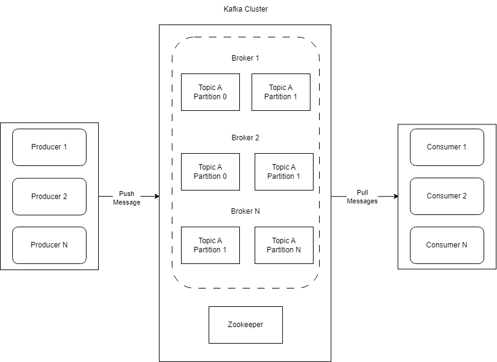
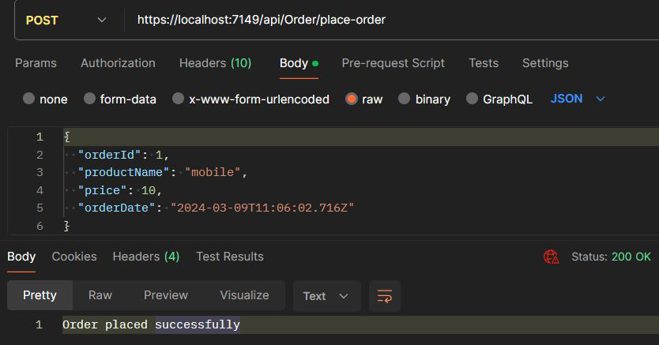

> ## 摘要
>
> 在本文中，我们将学习如何使用自定义 Docker Compose 设置和 Confluent Kafka 将 Kafka 与 ASP.NET Core Web API 集成。
>
> 原文 [Using Kafka in an ASP.NET Core Web API](https://code-maze.com/aspnetcore-using-kafka-in-a-web-api/) 由 Karthikeyan N S 撰写。

---

Kafka 的核心是一个**分布式流媒体平台**，旨在实时处理大量数据。其卓越的性能、容错能力和可扩展性使其成为事件驱动架构中的关键组件。

要下载本文的源代码，可以访问我们的 [GitHub仓库](https://github.com/CodeMazeBlog/CodeMazeGuides/tree/main/aspnetcore-webapi/Kafka)。

在本文中，我们将学习如何使用自定义 Docker Compose 设置和 Confluent Kafka Nuget 包将 Kafka 与 ASP.NET Core Web API 集成。

## **了解 Kafka 和** 事件驱动 **架构**

**Kafka 使用发布-订阅模型。**在此模型中，生产者向主题发布消息，消费者订阅这些主题以接收消息。这种模型允许不同系统组件之间的无缝通信，并促进了可扩展和响应式应用程序的创建。

Kafka 包括几个协同工作以提供可靠和可扩展消息系统的组件：

[](https://code-maze.com/wp-content/uploads/2024/04/Kafka-flow-1-2.png)

在这个图中，我们有**生产者**创建新的事件或数据消息，并将它们发布到 Kafka 中的特定**主题**。

中心组件是**Kafka 集群**，包括多个**代理**来实现高可用性、容错能力和负载平衡。集群接收这些消息并存储它们。这个流媒体数据平台的 Kafka 集群作为中心，生产者发送数据，而消费者接收此类信息。每个主题被不同的**分区**划分，并且 Kafka 将它们分布在集群中的多个代理上，以确保**复制和并行处理**。

[**Zookeeper**](https://zookeeper.apache.org/doc/r3.9.1/zookeeperOver.html) 扮演着管理和协调 Kafka Broker 的重要角色。它有助于维护代理列表，跟踪节点状态，并且最重要的是，为分区进行领导者选举。

图中表示的最后一个元素是**消费者**。消费者订阅 Kafka 集群中的一个或多个主题，消费数据源，并处理数据。我们可以将**消费者分组到消费者群组中**来优化这个过程，从而实现系统负载的平衡。消费者充当流媒体通道的最终接收者。

### 事件驱动架构

[事件驱动](https://code-maze.com/csharp-event-driven-architecture/) 是一种架构模式，它将系统组织为**松散耦合的组件** **通过事件进行通信和协调**。

人们经常将 Kafka 与微服务联系在一起，因为它帮助服务之间进行通信，而不会过于依赖。

然而，Kafka不仅仅适用于微服务。它适应于各种设置，即使是开始采用事件驱动方法的大型应用程序。

Kafka 在事件驱动应用程序中的重要性来自于其**高吞吐量、容错能力和事件序列化能力**。由于事件是这种架构的基础，Kafka 的有效事件管理对于构建可靠、可扩展的系统至关重要。

让我们看看如何设置 Kafka。

## 应用描述

让我们在电子商务应用程序中模拟一个基本场景：

[](https://code-maze.com/wp-content/uploads/2024/04/Kafka-flow-1.png)

在这里，客户呼叫 Web API，它向 Kafka 主题发布一个“OrderPlaced”事件，一个订单确认服务订阅这个主题。

我们在 Web API 项目中实现负责发布事件的生产者，而消费者组件由控制台应用程序表示，该程序消费和处理事件。

在这里，Kafka 主题充当消息发布的逻辑通道，实现分类、组织和并行处理。

## **设置 Kafka**

为了利用 Kafka 构建可扩展和事件驱动的应用程序内的 ASP.NET Core Web API，我们需要在我们的 Web API 项目和 Kafka 代理之间建立连接。相应地，我们在项目中使用 [Docker Compose](https://github.com/CodeMazeBlog/CodeMazeGuides/blob/main/aspnetcore-webapi/Kafka/docker-compose.yml) 文件来编排 Kafka 和 Zookeeper 容器的部署。

作为完整参考，随时查看 [官方 Confluent GitHub 仓库](https://github.com/confluentinc/cp-all-in-one/blob/7.5.0-post/cp-all-in-one/docker-compose.yml)，它为设置整个 Kafka 生态系统提供了一个全面的 Docker Compose 文件。

接下来，让我们启动容器：

```bash
docker-compose up -d
```

我们在 Visual Studio 的 Developer PowerShell 中运行这个命令，从包含我们的 `docker-compose.yml` 文件的目录中运行。

现在，让我们检查输出：

```bash
[+] Running 15/2
    broker 11 layers Pulled
    zookeeper 2 layers Pulled
[+] Running 2/3
    Network kafka default Created
    Container zookeeper Started
    Container broker Started
```

正如我们所看到的，Zookeeper 和 Kafka broker 都在成功运行。

接下来，让我们创建一个主题：

```bash
docker exec -it broker kafka-topics --create --topic order-events --bootstrap-server localhost:9092 --partitions 1 --replication-factor 1
```

我们创建一个名为“order-events”的主题，指定其**分区**和**复制因子**。分区指定 Kafka 可以处理的并行数据流，根据特定要求调整它们可以优化性能。复制因子为“1”表示简单的单份副本，尽管我们可以在生产环境中增加它以实现容错和高可用性。

我们遵循一致且描述性的命名约定，如“order-events”，这有助于我们理解每个组件在基于 Kafka 的系统中的功能和目的。

## 将 Kafka 与 ASP.NET Core Web API 集成

首先，让我们创建一个 Web API 项目并向其安装 `Confluent.Kafka` 包：

```bash
dotnet add package Confluent.Kafka --version 2.3.0
```

[Confluent Kafka](https://www.confluent.io/) 是 Apache Kafka 的一个强大且广泛采用的分发版，是领先的开源**事件流媒体平台**。它通过额外的功能、工具和组件扩展了 Kafka 的功能，简化了 Kafka-based 应用程序的开发、部署和管理。

### 配置 Kafka 生产者

现在，让我们开始配置生产者并将其添加到 `Program.cs` 文件中的我们的服务：

```csharp
var producerConfig = new ProducerConfig
{
    BootstrapServers = $"localhost:{Helper.GetKafkaBrokerPort(
        Directory.GetParent(Environment.CurrentDirectory)?.FullName!)}",
    ClientId = "order-producer"
};
builder.Services.AddSingleton(
    new ProducerBuilder<string, string>(producerConfig).Build());
```

在这里，我们初始化 `ProducerConfig` 对象，指定 Kafka broker 的地址，并为生产者分配一个唯一标识符 (`ClientId`)。Apache Kafka 使用默认端口“9092”进行客户端和代理之间的通信。Kafka 代理会监听来自生产者和消费者的传入连接。

我们使用 `GetKafkaBrokerPort()` 实用方法检索 Kafka broker 地址，该方法我们在 `Shared` 库中创建。为了简洁，我们已经从文章中排除了实现。请参考 [GitHub 仓库](https://github.com/CodeMazeBlog/CodeMazeGuides/blob/main/aspnetcore-webapi/Kafka/Shared/Helper.cs) 查看实现。

`ClientId` 是生产者在 Kafka 生态系统中的独特标识符。这允许 Kafka 跟踪并区分来自不同生产者的消息。它还使 Kafka 能够维护有关生产者的状态信息，促进有效的负载分配，并在代理分区中均匀分配消息。

之后，我们在 ASP.NET Core 依赖注入容器中将 Kafka 生产者注册为单例服务。我们使用 `ProducerBuilder` 类构建和配置生产者，并利用 `Build()` 方法完成其创建。

### 配置 Kafka 消费者

让我们创建一个控制台应用以在 `Program.cs` 类中配置消费者：

```csharp
var consumerConfig = new ConsumerConfig
{
    BootstrapServers = $"localhost:{Helper.GetKafkaBrokerPort(
        Directory.GetParent(Environment.CurrentDirectory)?.Parent?.Parent?.Parent?.FullName!)}",
    GroupId = "order-consumer",
    AutoOffsetReset = AutoOffsetReset.Earliest
};
```

我们首先初始化 `ConsumerConfig` 类来配置 Kafka 消费者。同样，我们获取 Kafka broker 的地址。然后，我们为消费者组标识符 (`GroupId`) 分配值为“order-consumer”的标识符，并将 `AutoOffsetReset` 设置为 `Earliest`。

我们选择 `AutoOffsetReset.Earliest` 是为了使消费者从最早的可用消息开始，确保我们处理了所有消息并保持了整个消息历史**。** 这对于新消费者或在不活动后重新启动以赶上错过的消息很有用。

`AutoOffsetReset.Latest` 是自动偏移重置配置的另一个可用选项。设置为 `Latest` 时，消费者从最新偏移量开始消费消息，意味着它从主题上发布的最新消息开始。

接下来，让我们在 `consumerConfig` 初始化下方注册 Kafka 消费者：

```csharp
var builder = Host.CreateDefaultBuilder(args)
    .ConfigureServices((hostContext, services) =>
    {
        services.AddSingleton(
            new ConsumerBuilder<string, string>(consumerConfig).Build());
    });
```

我们使用 `CreateDefaultBuilder()` 方法配置主机，并使用指定的 `consumerConfig` 在依赖注入容器中注册 Kafka 消费者为单例服务。

## 在 ASP.NET Core 中使用 Kafka **发布消息**

从 ASP.NET Core Web API 发布消息到 Kafka 涉及配置 Kafka 生产者并向特定主题发送消息。

首先，让我们在 `Shared` 库内创建一个 `OrderDetails` 类：

```csharp
public class OrderDetails
{
    public int OrderId { get; set; }
    public string? ProductName { get; set; }
    public decimal Price { get; set; }
    public DateTime OrderDate { get; set; }
}
```

为了简单起见，我们将实体 `OrderDetails` 类和实用方法合并到单个项目 `Shared` 库中。虽然这种方法可能足以演示目的，但在生产环境中最好将实体和实用程序分离到不同的项目中，因为它们通常处理不同的数据并服务于不同的目的。

接下来，让我们在 Web API 中创建一个 `OrderController` 类：

```csharp
[ApiController]
[Route("api/[controller]")]
public class OrderController(IProducer<string, string> producer) : ControllerBase
{
    private readonly IProducer<string, string> _producer = producer;
    private const string Topic = "order-events";
    [HttpPost("place-order")]
    public async Task<IActionResult> PlaceOrder(OrderDetails orderDetails)
    {
        try
        {
            var kafkaMessage = new Message<string, string>
            {
                Value = JsonConvert.SerializeObject(orderDetails)
            };
            await _producer.ProduceAsync(Topic, kafkaMessage);
            return Ok("Order placed successfully");
        }
        catch (ProduceException<string, string> ex)
        {
            return BadRequest($"Error publishing message: {ex.Error.Reason}");
        }
    }
}
```

首先，我们通过[依赖注入](https://code-maze.com/dependency-injection-aspnet/)在[主构造函数](https://code-maze.com/csharp-primary-constructors-for-classes-and-structs/)中注入 Kafka 生产者并将 Kafka 主题设置为“order-events”。接下来，我们创建一个 `POST` 端点，它接受 `orderDetails` 作为输入参数。

在将消息发布到 Kafka 时，将像 `orderDetails` 对象这样的复杂数据结构序列化为 Kafka 可以处理的格式是至关重要的。

在这种情况下，我们使用 JSON 序列化将 `orderDetails` 对象转换为字符串表示形式。虽然 Kafka 消息通常由键值对组成，这些键值对表示为字节数组，但这里使用的 `Message` 类允许我们直接封装序列化值。

值得注意的是，虽然 Kafka 消息可以包括键和值，但在这种情况下，我们只处理值，该值设置为 `orderDetails` 对象的序列化 JSON 字符串。如果我们不指定键，默认为 `null`，这对我们的用例是可以接受的。

最后，我们调用 `ProduceAsync()` 方法以异步将消息发送到“order-events”主题。

## **在 ASP.NET Core 中消费** Kafka **消息**

要处理我们的 ASP.NET Core Web API 发布的消息，我们必须在我们的控制台应用程序中创建一个 Kafka 消费者。

现在，让我们在控制台应用中创建 `ConsumerService` 类：

```csharp
public class ConsumerService(IConsumer<string, string> consumer) : IHostedService
{
    private readonly IConsumer<string, string> _consumer = consumer;
    public Task StartAsync(CancellationToken cancellationToken)
    {
        _consumer.Subscribe("order-events");
        Task.Run(() =>
        {
            while (!cancellationToken.IsCancellationRequested)
            {
                var consumeResult = _consumer.Consume(cancellationToken);
                if (consumeResult is null)
                {
                    return;
                }
                var orderDetails = JsonConvert.DeserializeObject<OrderDetails>(consumeResult.Message.Value);
                Console.WriteLine($"Received message: " +
                    $"Order Id: {orderDetails?.OrderId}, Product name: {orderDetails?.ProductName}, " +
                    $"Price: {orderDetails?.Price}, Order date: {orderDetails?.OrderDate}");
            }
        }, cancellationToken);
        return Task.CompletedTask;
    }
}
```

立即地，我们定义了一个 `ConsumerService` 类，该类实现了 `IHostedService` 接口，作为后台服务负责从 Kafka 主题消费消息。

之后，我们执行 `StartAsync()` 方法，该方法在**托管服务启动时**初始化。Kafka 消费者在该方法内订阅“order-events”主题。然后，我们使用 `Task.Run()` 方法启动后台任务，创建一个循环，只要取消令牌没有被通知，就持续监听 Kafka 的传入消息。

我们在尝试访问其属性之前检查 `consumeResult` 是否为 `null`，以避免 `NullReferenceException`。

最后，我们将 JSON 字符串表示形式反序列化为 `OrderDetails` 类的实例。

现在，让我们在 `Program` 类中注册 `ConsumerService` 类并调用消费者：

```csharp
var builder = Host.CreateDefaultBuilder(args)
        .ConfigureServices((hostContext, services) =>
        {
            services.AddSingleton(
                new ConsumerBuilder<string, string>(consumerConfig).Build());
            services.AddHostedService<ConsumerService>();
        });
var host = builder.Build();
var kafkaConsumerService = host.Services.GetRequiredService<IHostedService>();
await kafkaConsumerService.StartAsync(default);
await Task.Delay(Timeout.Infinite);
```

在这里，我们添加了一个 `ConsumerService` 类作为托管服务来管理 Kafka 消费者的生命周期。

然后，我们构建主机并检索 Kafka 消费者服务。之后，我们对 Kafka 消费者服务调用 `StartAsync()` 方法，启动 Kafka 消息的消费。

最后，我们调用 `Task.Delay(Timeout.Infinite)` 方法让应用程序无限期运行。通过向 `Task.Delay()` 方法传递 `Timeout.Infinite` 值，我们创建了一个无限延迟，允许应用程序保持活跃并响应事件或消息，直到我们手动终止它。

## 测试 Kafka 集成

现在，是时候测试我们的实现了。首先，让我们通过将它们设置为多个启动项目来同时运行 Web API 和控制台应用程序。

现在，让我们调用端点：



这里，我们成功地将消息发布到 Kafka 主题上。

现在，让我们检查消费者：

```bash
Received message: Order Id: 1, Product name: Mobile, Price: 100.0, Order date: 30-03-2024 16:28:00
```

我们可以看到，消费者接收到了我们发布的消息。

## 优化 Kafka 使用

我们可以通过实施几个实用技巧来优化我们的 ASP.NET Core Web API 中 Kafka 的使用，以提高性能和效率。

首先，我们应该考虑**将多个消息批量成一个请求**来减少开销并提高吞吐量。我们在 `ProducerConfig` 类中配置 `BatchSize` 属性来指定包含在批次中的最大消息数量。默认情况下，Kafka 将此属性设置为 1000000 字节的值，但我们可以根据应用程序的要求对其进行调整。

然后我们需要**分区 Kafka 主题以实现并行处理**，确保资源的有效利用。实施监视解决方案对于跟踪 Kafka 指标和性能至关重要，以便及时发现问题并解决它们。

最后，我们应该**优化消息序列化/反序列化过程**，选择高效的序列化格式。通过整合这些策略，我们可以确保在我们的 ASP.NET Core Web API 中 Kafka 的最佳性能。

## **ASP.NET Core 中 Kafka 集成的最佳实践**

最后，让我们探讨在我们的 ASP.NET Core 应用程序中无缝集成 Kafka 的最佳实践。

首先，我们应该实施全面的**错误处理机制**，管理如连接错误或消息处理失败等问题。通过这样做，我们确保了一个弹性和可靠的系统。

接下来，我们建议配置我们的 Kafka 生产者为**幂等性**的。这样我们在重试期间防止了消息重复，并确保了我们的应用程序的一致行为。这是我们 Kafka 集成稳健性的一个战略举措。

我们可以使用 `ProducerConfig` 中的 `EnableIdempotence` 属性来完成这一点，它在重试期间防止了**消息重复**。这确保了消息的唯一标识符，并且即使在短暂故障期间也防止了消息重复生产。

现在，我们将注意力转向可扩展性。

因此，我们应该利用消费者群组实现**负载平衡和并行消息处理**。这使我们的应用程序能够有效扩展，满足增加工作负载的需求。

我们为消费者组分配**唯一组标识符**，以便 Kafka 能够跟踪进度并均匀分配消息。部署具有相同组 ID 的多个消费者应用实例，使 Kafka 能够使分区实现高效的自动处理。

## 结论

在本文中，我们探讨了 Confluent Kafka 对 ASP.NET Core Web API 应用程序的变革性影响，强调其在使规模化、弹性和响应式的事件驱动架构成为可能方面的关键作用。

因此，通过集成 Kafka，我们可以利用其强大的特性构建动态和高效的系统，以满足现代软件开发的需求。
