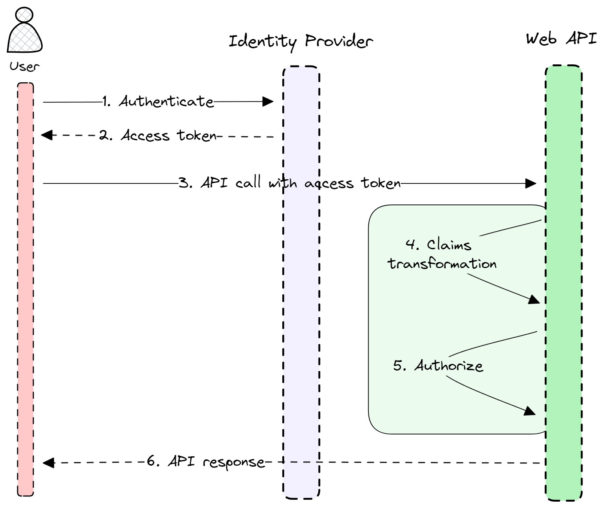

# 掌握 ASP.NET Core 的灵活授权的声明变换

> ## 摘录
>
> 声明基授权机制是 ASP.NET Core 中现代授权的核心。但是，你的身份提供者 (IDP) 发出的访问令牌可能并不总是完全符合你的应用程序的内部授权需求。解决方案是什么？声明变换。
>
> 原文 [Master Claims Transformation for Flexible ASP.NET Core Authorization](https://www.milanjovanovic.tech/blog/master-claims-transformation-for-flexible-aspnetcore-authorization?utm_source=LinkedIn&utm_medium=social&utm_campaign=29.04.2024) 由 [Milan Jovanović](https://www.milanjovanovic.tech/) 发表。

---

[声明基授权](https://learn.microsoft.com/en-us/aspnet/core/security/authorization/claims)机制是 ASP.NET Core 中现代授权的核心。但是，你的身份提供者 (IDP) 发出的访问令牌可能并不总是完全符合你的应用程序的内部授权需求。

像 [Microsoft Entra ID](https://www.microsoft.com/en-us/security/business/identity-access/microsoft-entra-id)（之前的 Azure AD）或 [Auth0](https://auth0.com/) 这样的外部 IDP 可能有它们自己的声明架构，或者可能不直接发出你的应用程序对其授权逻辑所需的所有声明。

解决方案是什么？声明变换。

声明变换允许你在应用程序使用它们进行授权之前修改声明。

在今天的问题中，我们将：

- 探索 ASP.NET Core 中声明变换的概念
- 使用实际示例探索 `IClaimsTransformation` 接口
- 讨论安全性和基于角色的访问控制（RBAC）的考虑事项

## 声明变换是如何工作的？

人们说一张图片胜过千言万语。在软件工程中，我们有称为 [UML](https://en.wikipedia.org/wiki/Unified_Modeling_Language) 图的东西可以用来画出一个图景。

这里有一个展示声明变换流程的 [序列图](https://en.wikipedia.org/wiki/Sequence_diagram)：

1. 用户使用身份提供者进行身份验证
2. 用户调用后端 API 并提供访问令牌
3. 后端 API 执行声明变换和授权
4. 如果用户被正确授权，后端 API 返回响应



让我们看看如何在 ASP.NET Core 中实现这一点。

## 简单的声明变换

声明可以从受信任的身份提供者发出的任何用户或身份数据中创建。声明是一个表示主题身份的名称-值对，而不是主题可以执行的操作。

在 ASP.NET Core 中 [声明变换](https://learn.microsoft.com/en-us/aspnet/core/security/authentication/claims#extend-or-add-custom-claims-using-iclaimstransformation)的核心是 [`IClaimsTransformation`](https://learn.microsoft.com/en-us/dotnet/api/microsoft.aspnetcore.authentication.iclaimstransformation) 接口。

它暴露了一个用于变换声明的方法：

```csharp
public interface IClaimsTransformation
{
    Task<ClaimsPrincipal> TransformAsync(ClaimsPrincipal principal);
}
```

这里是使用 `IClaimsTransformation` 添加自定义声明的简单示例：

```csharp
internal static class CustomClaims
{
    internal const string CardType = "card_type";
}

internal sealed class CustomClaimsTransformation : IClaimsTransformation
{
    public Task<ClaimsPrincipal> TransformAsync(ClaimsPrincipal principal)
    {
        if (principal.HasClaim(claim => claim.Type == CustomClaims.CardType))
        {
            return Task.FromResult(principal);
        }

        ClaimsIdentity claimsIdentity = new ClaimsIdentity();

        claimsIdentity.AddClaim(new Claim(CustomClaims.CardType, "platinum"));

        principal.AddIdentity(claimsIdentity);

        return Task.FromResult(principal);
    }
}
```

`CustomClaimsTransformation` 类应该注册为服务：

```csharp
builder.Services.AddTransient<IClaimsTransformation, CustomClaimsTransformation>();
```

最后，你可以定义一个使用此声明的自定义授权策略：

```csharp
builder.Services.AddAuthorization(options =>
{
    options.AddPolicy(
        "HasPlatinumCard",
        builder => builder
            .RequireAuthenticatedUser()
            .RequireClaim(CustomClaims.CardType, "platinum"));
});
```

使用 `IClaimsTransformation` 时你应该知道几个问题：

- **可能会执行多次**：`TransformAsync` 方法可能会被多次调用。声明变换应该是幂等的，以避免将相同的声明多次添加到 `ClaimsPrincipal` 中。
- **潜在的性能影响**：由于它在身份验证请求上执行，要注意你的变换逻辑的性能，特别是如果它涉及到外部调用（数据库、API）。在适当的情况下考虑缓存。

## 使用声明变换实现 RBAC

[基于角色的访问控制 (RBAC)](https://auth0.com/docs/manage-users/access-control/rbac) 是一种授权模型，其中权限被分配给角色，角色被授予用户。声明变换有助于平滑地实现 RBAC。通过添加角色声明和可能的权限声明，可以简化你应用程序中的授权逻辑。另一个好处是你可以保持访问令牌更小并且不包含任何角色或权限声明。

让我们考虑一个场景，你的应用程序在细粒度级别上管理资源，但你的身份提供者只提供了如 `Registered` 或 `Member` 这样的粗粒度角色。你可以使用声明变换将 `Member` 角色映射到特定的细粒度权限，如 `SubmitOrder` 和 `PurchaseTicket`。

这里是一个更复杂的 `CustomClaimsTransformation` 实现。我们发送一个 `GetUserPermissionsQuery` 数据库查询并获得 `PermissionsResponse` 返回。`PermissionsResponse` 包含用户的权限，这些权限被添加为自定义声明。

```csharp
internal sealed class CustomClaimsTransformation(
    IServiceProvider serviceProvider)
    : IClaimsTransformation
{
    public async Task<ClaimsPrincipal> TransformAsync(
        ClaimsPrincipal principal)
    {
        if (principal.HasClaim(c => c.Type == CustomClaims.Sub ||
                                    c.Type == CustomClaims.Permission))
        {
            return principal;
        }

        using IServiceScope scope = serviceProvider.CreateScope();

        ISender sender = scope.ServiceProvider.GetRequiredService<ISender>();

        string identityId = principal.GetIdentityId();

        Result<PermissionsResponse> result = await sender.Send(
            new GetUserPermissionsQuery(identityId));

        if (result.IsFailure)
        {
            throw new ClaimsAuthorizationException(
                nameof(GetUserPermissionsQuery), result.Error);
        }

        var claimsIdentity = new ClaimsIdentity();

        claimsIdentity.AddClaim(
            new Claim(CustomClaims.Sub, result.Value.UserId.ToString()));

        foreach (string permission in result.Value.Permissions)
        {
            claimsIdentity.AddClaim(
                new Claim(CustomClaims.Permission, permission));
        }

        principal.AddIdentity(claimsIdentity);

        return principal;
    }
}
```

既然 `ClaimsPrincipal` 包含作为自定义声明的权限，你可以做一些有趣的事情。例如，你可以实现一个基于权限的 `AuthorizationHandler`：

```csharp
internal sealed class PermissionAuthorizationHandler
    : AuthorizationHandler<PermissionRequirement>
{
    protected override Task HandleRequirementAsync(
        AuthorizationHandlerContext context,
        PermissionRequirement requirement)
    {
        HashSet<string> permissions = context.User.GetPermissions();

        if (permissions.Contains(requirement.Permission))
        {
            context.Succeed(requirement);
        }

        return Task.CompletedTask;
    }
}
```

## 要点

声明变换是一种优雅的方式，可以弥补身份提供者提供的声明和你的 ASP.NET Core 应用程序需求之间的差距。`IClaimsTransformation` 接口使你能够自定义当前 `ClaimsPrincipal` 的声明。无论你需要添加角色、映射外部组到内部权限，还是从用户档案中提取额外信息，声明变换都提供了这样做的灵活性。

然而，使用声明变换时要考虑几个关键点：

- 声明变换在每个请求上执行。
- `IClaimsTransformation` 应该是幂等的。如果多次执行，它不应该将现有的声明添加到 `ClaimsPrincipal` 中。
- 高效设计你的变换，并考虑如果你正在获取外部数据以丰富你的声明，就缓存结果。

如果你想看到 ASP.NET Core 中的 RBAC 完整实现，请查看这个[身份验证和授权播放列表](https://www.youtube.com/playlist?list=PLYpjLpq5ZDGtJOHUbv7KHuxtYLk1nJPw5)。
