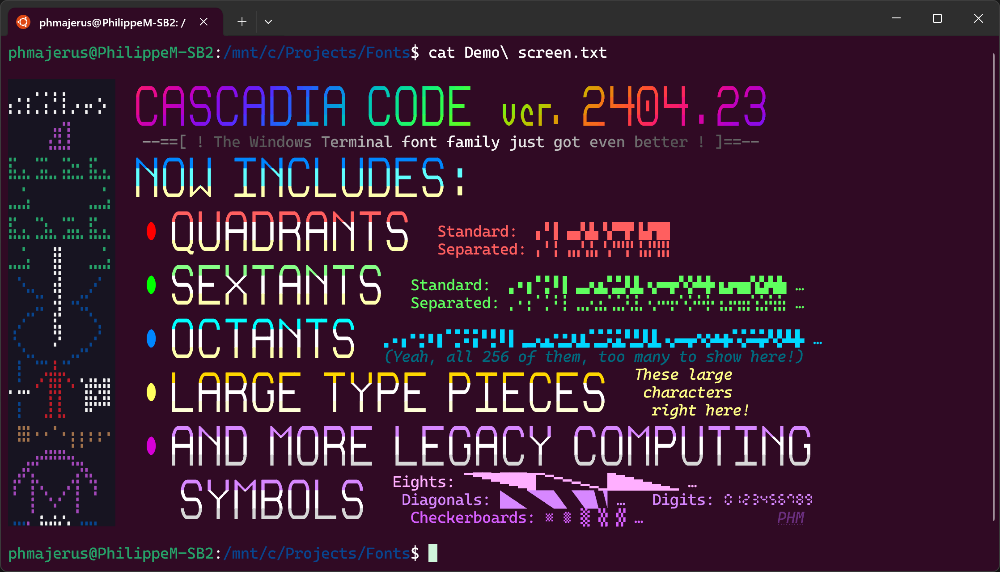
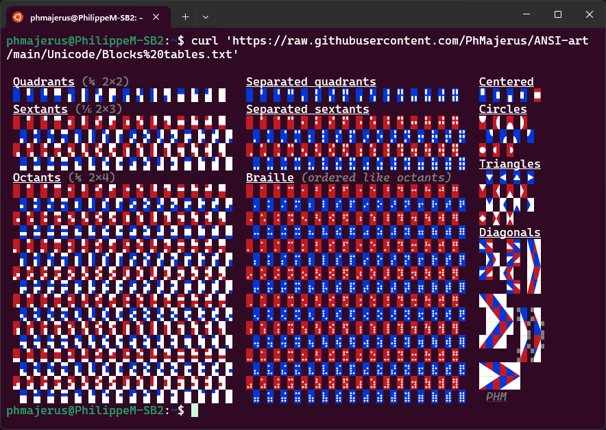
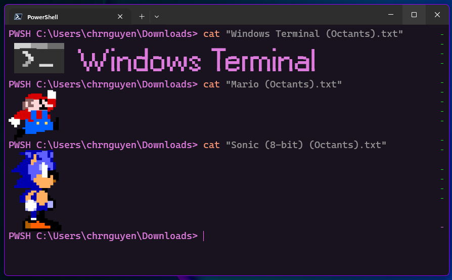
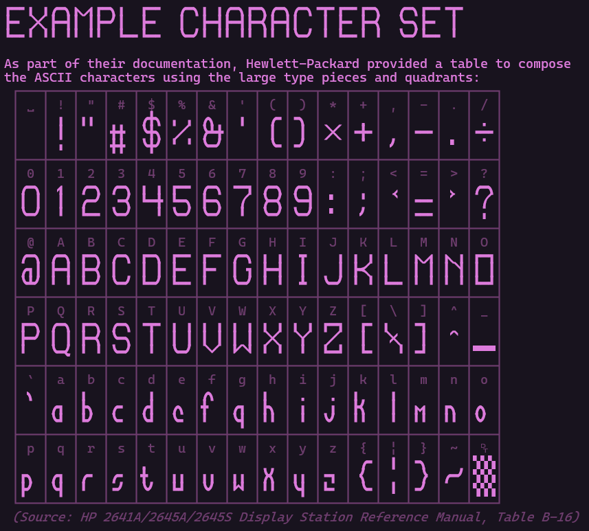
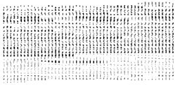
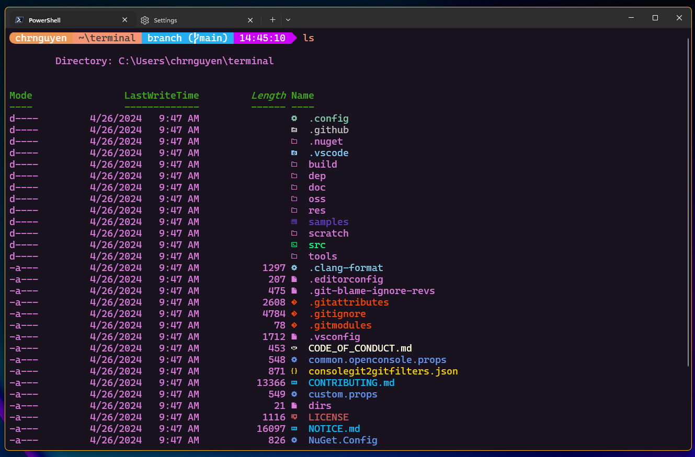
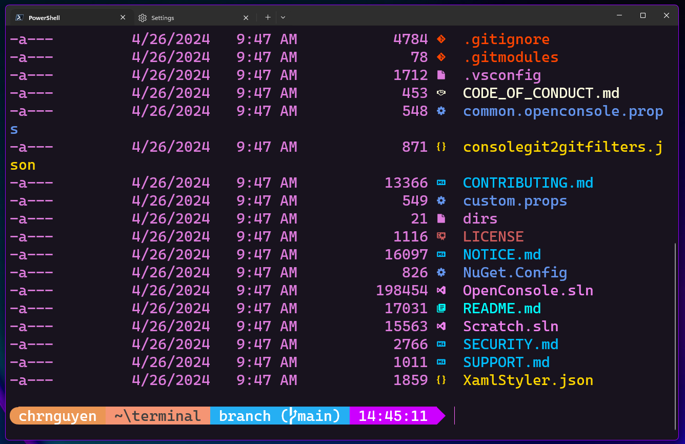

# Cascadia Code 2404.23 - Windows 命令行

> ## 摘要
>
> 你好，世界！我们很兴奋地宣布自三年前的 2111.01 版本发布以来，Cascadia Code 的第一个重大版本更新！（哇，时间过得真快！）在这个全新的 2404.03 版本中，我们为 Cascadia Code 添加了对四分区、六分区、八分区、大型文本片段的支持，
>
> 原文发布于 [Cascadia Code 2404.23](https://devblogs.microsoft.com/commandline/cascadia-code-2404-23/)

---

2024年4月30日

你好，世界！我们很兴奋地宣布自三年前的 2111.01 版本发布以来，Cascadia Code 的第一个重大版本更新！（哇，时间过得真快！）

在这个全新的 2404.03 版本中，我们为 Cascadia Code 添加了对四分区、六分区、八分区、大型文本片段、更多的传统计算符号和 Nerd Fonts 的支持。特别感谢 Philippe Majerus ([@PhMajerus](https://github.com/PhMajerus))，Aaron Bell ([@aaronbell](https://github.com/aaronbell)) 和 Fini ([@Finii](https://github.com/Finii)) 对这次发布的贡献！

您可以从 [GitHub 发布页面](https://github.com/microsoft/cascadia-code/releases) 下载最新版本的字体，并且它将被包含在最新的 Windows Terminal 更新中。

## 四分区和六分区

四分区是被划分为四个部分的块状马赛克。六分区是被划分为六个部分的块状马赛克。Cascadia Code 更新增加了来自传统计算符号块的新四分区和六分区字符。

## 八分区

Cascadia Code 现在支持全部 256 个八分区！八分区是被划分为八个部分的块状马赛克。

许多现代命令行应用使用布莱叶字符作为伪像素在终端中渲染图形。然而，布莱叶并非最佳解决方案，因为符号使用的是离散点，这使得开与关的伪像素不平衡。它们之间的符号和线条总是会有空间，所以当一组单元用于渲染图形时，伪像素的网格并非是规则网格。一些终端修改布莱叶字符以使点均匀分布，避免字符和线条之间的空隙，但这破坏了它们原本的预期用途。

八分区将提供目前在不使用诸如 Sixels 或 ReGIS 之类的图形扩展的情况下可以达到的最高分辨率。八分区还可以与 VT 控制序列结合使用，生成彩色图像 😉

特别感谢 Philippe ([@PhMajerus](https://github.com/PhMajerus)) 在他的 [ANSI-art](https://github.com/PhMajerus/ANSI-art/tree/main/Unicode) 仓库中提供这些八分区 ANSI 艺术示例！

## 大型文本片段

大型文本片段是设计用于组合创建大型文本的 55 个字符。因为这些是字符而不是终端效果（如 [DECDHL](https://vt100.net/docs/vt510-rm/DECDHL.html) 和 [DECDWL](https://vt100.net/docs/vt510-rm/DECDWL.html)），它们不仅限于终端。相同的大型文本可以在 Unicode 纯文本文件中使用。唯一的要求是使用包含那些字符的字体（比如 Cascadia Code 版本 2404.03！）

## 更多的传统计算符号！

我们在 Cascadia Code 中添加了更多的传统计算符号。这包括八分位、棋盘、对角线和数字！ 

## Nerd Fonts

我们正在向 Cascadia Code 字体家族中添加 “Cascadia Code NF” 和 “Cascadia Mono NF”。Cascadia Code NF 和 Cascadia Mono NF 是 Cascadia Code 的原生 “[Nerd Font](https://www.nerdfonts.com/)” 变体，包含了最新的 Nerd Font 符号（截至 2024 年 4 月）。每个符号都与 Cascadia Code 的其他部分兼容。特别感谢 Aaron ([@aaronbell](https://github.com/aaronbell)) 和 Fini ([@Finii](https://github.com/Finii)) 对 Nerd Fonts 发布的帮助！

您可以将 Cascadia Code 的 Nerd Font 变体与 [Oh My Posh](https://ohmyposh.dev/) 结合使用，创建您自己的炫酷提示符！看看所有这些符号！（Nerd Fonts 有 9209 个！）

## 感谢您的阅读！

如果您对 Cascadia Code 的任何更新感兴趣，请随时关注 [Cascadia Code 仓库](https://github.com/microsoft/cascadia-code) 或在 X 上关注 Christopher Nguyen ([@nguyen_dows](https://twitter.com/nguyen_dows))，Dustin Howett ([@DHowett](https://twitter.com/DHowett))，和 Aaron Bell ([@aaronbell](https://twitter.com/aaronbell))。

再次，我们要特别感谢 Philippe Majerus ([@PhMajerus](https://github.com/PhMajerus)) 对四分区、六分区、八分区、大型文本片段和更多传统计算符号的贡献给予深深的感谢。我们还要再次特别感谢 Aaron Bell ([@aaronbell](https://github.com/aaronbell)) 和 Fini ([@Finii](https://github.com/Finii)) 对 Nerd Fonts 项目的工作。

我们希望大家喜欢 Cascadia Code 的这个新更新。如果您发现了一个 bug，想要提交一个功能请求，甚至想要贡献（我们是开源的！），那请在 [Cascadia Code 仓库](https://github.com/microsoft/cascadia-code) 上这样做！我们今年还有更多关于 Cascadia Code 的内容，敬请期待！😊
