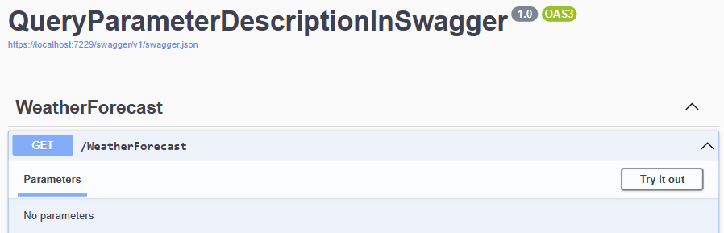
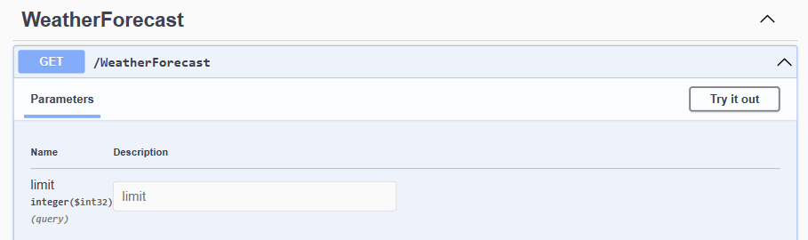
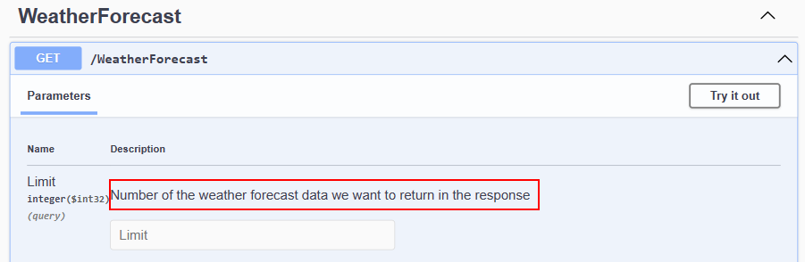

# 如何在ASP.NET Core中的Swagger显示查询参数

> ## 摘要
>
> 在本文中，我们将探索如何使用XML注释在Swagger中添加查询参数，并在.NET项目中设置XML文档。
>
> 原文 [How to Show Query Parameters in Swagger in ASP.NET Core](https://code-maze.com/aspnetcore-show-query-parameters-in-swagger/)

---

在.NET生态系统中，Swagger是定义和记录我们API的常用方式。在本文中，我们将查看如何在Swagger中显示查询参数。

要下载本文的源代码，您可以访问我们的[GitHub仓库](https://github.com/CodeMazeBlog/CodeMazeGuides/tree/main/aspnetcore-webapi/QueryParameterDescriptionInSwagger)。

让我们开始吧。

**Swagger是一个用于设计、记录和使用RESTful Web API的框架。**它为我们提供了描述API结构和行为的工具，这使得开发、文档、测试和共享变得更加容易。

现在要添加查询参数，我们需要注意，它们是请求URL中包含的可选键值对。它们添加到问号`(?）`的右侧。我们主要在`GET`路由中使用它们来传递额外的过滤信息。要了解更多，请查看[如何在ASP.NET Core中通过GET请求传递参数。](https://code-maze.com/aspnetcore-pass-parameters-to-http-get-action/)

让我们直接进入项目设置！

## 向Swagger添加查询参数

开始，让我们创建一个ASP.NET Core Web API项目。我们可以通过在Visual Studio中使用ASP.NET Core Web API模版或使用.NET CLI来创建项目：

```bash
dotnet new webapi
```

我们将使用`WeatherForecastController`类中默认的`GET()`方法：

```csharp
[HttpGet(Name = "GetWeatherForecast")]
public IEnumerable<WeatherForecast> Get()
{
    return Enumerable.Range(1, 5).Select(index => new WeatherForecast
    {
        Date = DateOnly.FromDateTime(DateTime.Now.AddDays(index)),
        TemperatureC = Random.Shared.Next(-20, 55),
        Summary = Summaries[Random.Shared.Next(Summaries.Length)]
    })
    .ToArray();
}
```

这里，`GetWeatherForecast()`端点随机创建并返回五个`WeatherForecast`对象。我们也可以注意到，该方法不接受任何参数。

让我们运行我们的项目，看看Swagger UI，它默认添加到我们的项目中：



我们的`GetWeatherForecast()`端点是唯一显示在Swagger UI上的端点，因为它不接受任何参数，我们看不到任何参数显示。

让我们向`GetWeatherForecast()`路由添加一些查询参数，这样我们就可以深入描述并在Swagger UI上显示它们。

假设我们想指定我们的路由应该返回多少天气数据：

```csharp
[HttpGet(Name = "GetWeatherForecast")]
public IEnumerable<WeatherForecast> Get([FromQuery] int limit)
{
    return Enumerable.Range(1, limit).Select(index => new WeatherForecast
    {
        Date = DateOnly.FromDateTime(DateTime.Now.AddDays(index)),
        TemperatureC = Random.Shared.Next(-20, 55),
        Summary = Summaries[Random.Shared.Next(Summaries.Length)]
    })
    .ToArray();
}
```

我们包括一个整数参数`limit`，用`[FromQuery]`属性修饰。然后，我们使用从请求中接收到的`limit`参数替换指定的硬编码数字，作为创建的`WeatherForecast`数据的范围。

让我们再次运行我们的应用程序，看看我们的查询参数：



我们添加的参数`limit`是可见的，除了参数名称外，我们还可以看到参数的类型整数及其在查询中的包含。但是描述属性是空的。

在此基础上，现在让我们添加查询参数的描述，并在Swagger定义中显示它。

## 查询参数描述

**要添加查询参数描述，我们将使用XML注释，**这是一种在源文件中直接记录代码的常用方式。

要向我们想要记录的对象添加XML注释，我们在它上面输入`///`并按回车。这将生成解释对象的默认模板，我们可以修改。在我们的例子中，我们想对`WeatherForecastController`类的`GetWeatherForecast()`方法进行评论：

```csharp
/// <summary>
///
/// </summary>
/// <param name="limit"></param>
/// <returns></returns>
[HttpGet(Name = "GetWeatherForecast")]
public IEnumerable<WeatherForecast> Get([FromQuery] int limit)
{
    return Enumerable.Range(1, limit).Select(index => new WeatherForecast
    {
        Date = DateOnly.FromDateTime(DateTime.Now.AddDays(index)),
        TemperatureC = Random.Shared.Next(-20, 55),
        Summary = Summaries[Random.Shared.Next(Summaries.Length)]
    })
    .ToArray();
}
```

在默认的XML注释模板中，我们有几个标签。首先，有一个方法`摘要`的标签，然后，有一个定义和描述参数`param`的标签，最后一个是`返回`标签。

为了描述查询参数`limit`，让我们在`<param>`标签之间添加描述：

```csharp
/// <param name="limit">Number of the weather forecast data we want to return in the response</param>
```

让我们注意到，我们只有一个参数，但如果我们有更多，每个参数都会获得其`param`标签和对应于其名称的`name`属性。

现在，让我们运行我们的应用程序：


我们的Swagger UI看起来还是一样的。它没有显示我们刚刚添加到`limit`参数的描述。这是因为Swagger默认不包括XML注释。

要显示评论，我们还有一些额外的设置要完成。让我们开始工作。

### 添加XML注释

首先，让我们配置我们的项目文件来生成一个XML文档文件：

```xml
<PropertyGroup>
  <GenerateDocumentationFile>true</GenerateDocumentationFile>
</PropertyGroup>
```

在`PropertyGroup`标签内，我们添加`<GenerateDocumentationFile>true</GenerateDocumentationFile>`。这行告诉.NET编译器从源代码中找到的XML注释生成XML文档文件。

让我们构建我们的解决方案，使我们的文档文件可用。

接下来，让我们在`Program`类中配置Swagger以使用这个XML文件：

```csharp
builder.Services.AddSwaggerGen(c =>
{
    var xmlFile = $"{Assembly.GetExecutingAssembly().GetName().Name}.xml";
    var xmlPath = Path.Combine(AppContext.BaseDirectory, xmlFile);
    c.IncludeXmlComments(xmlPath);
});
```

首先，我们从执行程序集的名称获取XML文档文件的名称，并将其分配给`xmlFile`变量。

然后，我们将文件名和应用程序的基本目录在`xmlPath`变量中组合以获取完整路径。最后，我们告诉Swagger使用`IncludeXmlComments()`方法在我们生成的API文档中包括来自`xmlPath`变量的XML注释。

设置好后，现在让我们运行我们的应用程序：



**太好了！Swagger UI现在显示了我们的查询参数及其描述。**

我们几乎完成了，但在我们结束之前，让我们看看如何向作为对象一部分定义的查询参数添加描述。

### 查询参数对象描述

与我们之前讨论的在路由中直接指定参数的方法不同，是创建一个独立的对象来封装所有查询参数：

```csharp
/// <summary>
///
/// </summary>
/// <param name="parameters"></param>
/// <returns></returns>
[HttpGet(Name = "GetWeatherForecast")]
public IEnumerable<WeatherForecast> Get([FromQuery] Parameters parameters)
{
    return Enumerable.Range(1, parameters.Limit).Select(index => new WeatherForecast
    {
        Date = DateOnly.FromDateTime(DateTime.Now.AddDays(index)),
        TemperatureC = Random.Shared.Next(-20, 55),
        Summary = Summaries[Random.Shared.Next(Summaries.Length)]
    })
    .ToArray();
}
public record Parameters
{
    public int Limit { get; set; }
}
```

这里，我们创建一个新的记录`Parameters`，带有属性`Limit`，并在`GetWeatherForecast()`路由中接受它作为参数。另外，我们为`GetWeatherForecast()`方法重新生成了XML注释。

现在，让我们描述`Limit`属性：

```csharp
public record Parameters
{
    /// <summary>
    /// Number of the weather forecast data we want to return in the response
    /// </summary>
    public int Limit { get; set; }
}
```

由于`Limit`是记录的一个属性，在这个实例中，我们在`summary`标签中解释它。

最后，让我们运行我们的应用程序：


值得注意的是，如果记录对象包含多个属性，我们需要为每个我们想描述的属性编写摘要描述。

## 结论

在本文中，我们查看了如何添加查询参数描述并在Swagger UI中显示它们。我们最初讨论了如何使用路由中的查询参数来实现这一点。另外，我们还查看了如何描述包含在对象中的查询参数。
