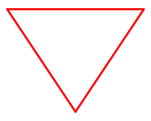

# 使用ImageSharp在C#中生成图像

> ## 摘要
>
> 本文中，我们将学习如何使用ImageSharp在C#中生成图像，并提供创建和操作图像的示例。

---

在本文中，我们将学习如何使用ImageSharp在C#中生成图像。

要下载本文的源代码，您可以访问我们的 [GitHub 仓库](https://github.com/CodeMazeBlog/CodeMazeGuides/tree/main/csharp-images/GenerateImagesInCSharpUsingImageSharp)。

让我们开始吧。

## 什么是ImageSharp？

ImageSharp是一个免费和开源的跨平台库，适用于.NET生态系统。它旨在通过提供一个强大而简单的API简化图像处理。`ImageSharp`是完全托管的，可以用于设备、云和嵌入式/IoT场景。它不依赖于`System.Drawing`命名空间或特定于窗口的函数，如`System.Drawing.Common`的情况。

ImageSharp提供了各种操作的功能，如调整大小、裁剪、翻转、旋转以及调整图像的亮度、对比度和伽马值。

我们将使用这个库生成一个图像，然后在其上绘制一个多边形（三角形）。首先，我们需要将其导入到我们的项目中：

```bash
dotnet add package SixLabors.ImageSharp
```

## 图像生成

接下来，让我们创建一个`ImageService`静态类，在其中定义一些静态方法，首先是用于创建空白图像的方法：

```csharp
public static Image<Rgba32> CreateBlankImage(int width, int height)
{
    return new Image<Rgba32>(width, height);
}
```

这里我们看到了我们的`CreateBlankImage()`方法，该方法创建并返回一个指定`宽度`和`高度`的新空白图像。`Image`的类型为`Rgba32`，这意味着**每个像素由四个8位值表示：红色、绿色、蓝色和Alpha（透明度）**。

## 图像操作

接下来，让我们创建一个静态方法在图像上绘制一个三角形：

```csharp
public static void DrawTriangleOnImage(Image<Rgba32> image, PointF point1, PointF point2, PointF point3)
{
    ValidatePoint(point1);
    ValidatePoint(point2);
    ValidatePoint(point3);
    var pen = Pens.Solid(Color.Red, 3);
    image.Mutate(ctx => ctx.DrawPolygon(pen, [point1, point2, point3, point1]));
}
public static void ValidatePoint(PointF point)
{
    if (point.X <= 0 || point.Y <= 0)
    {
        throw new ArgumentException("点坐标不能小于或等于零。");
    }
}
```

我们的`DrawTriangleOnImage()`方法接受4个参数：要绘制的`image`以及定义我们三角形顶点的三个`PointF`值。`PointF`是一个结构体，代表了2D平面上定义一个点的单精度浮点X和Y坐标的有序对。

首先，我们调用我们的`ValidatePoint()`辅助方法以确保所有顶点都是有效的正坐标。

接下来，我们创建一个厚度为3像素的红色实心笔。在ImageSharp库中，`Pens`是一个静态类，它维护了常见笔风格的集合。`Solid()`方法创建了一个`SolidPen`，即一个没有任何绘制图案的笔。

最后，我们使用`Mutate()`方法对我们的图像进行修改。它的唯一参数是一个`Action<IImageProcessingContext>`。在我们的案例中，我们传入一个lambda来调用`IImageProcessingContext`的`DrawPolygon()`方法，提供我们的`pen`和一个顶点数组。`DrawPolygon()`像人们猜测的那样，使用提供的笔和坐标数组在图像上下文中渲染一个多边形。

**注意，我们在数组中重复`point1`，因为它定义了我们的三角形的闭合点**。因此，我们从最后一个点`point3`画一个线条回到第一个点`point1`以完成我们的多边形。`ctx`代表图像的上下文，即我们对`image`进行更改的工作区域。

## 保存图像

现在，让我们定义一个方法来保存图像：

```csharp
public static void SaveImage(Image<Rgba32> image, string outputPath)
{
    image.SaveAsPng(outputPath);
}
```

在这里，我们看到了我们的`SaveImage()`方法，它接受两个参数：我们希望保存的`image`和定义在哪里保存它的`outputPath`。

然后，我们通过调用`SaveAsPng()`方法保存我们的图像，传入我们的`outputPath`作为目的地。

## 生成示例图像

现在，让我们将之前创建的方法引入到我们的`Program`类中，以完成我们的图像生成：

```csharp
string outputPath = @"outputImage.png";
using var image = ImageService.CreateBlankImage(width: 350, height: 280);
var point1 = new PointF(50, 50);
var point2 = new PointF(250, 50);
var point3 = new PointF(150, 200);
ImageService.DrawTriangleOnImage(image, point1, point2, point3);
ImageService.SaveImage(image, outputPath);
Console.WriteLine("图像成功生成并保存。");
```

首先，我们将输出路径定义为当前工作目录中的一个`.png`文件。

接下来，我们通过我们的`CreateBlankImage()`方法创建一个宽350像素、高280像素的空白图像。**注意，由于**`Image`**对象是可处置的，我们需要添加一个using声明。**

接下来，我们定义我们的三角形的顶点（`point1`，`point2`，`point3`），为它们的（x，y）坐标提供值。然后我们调用我们的`DrawTriangleOnImage()`方法用这些点来在我们的空白`image`上渲染一个三角形。

最后，我们将我们修改后的`image`保存到我们指定的`outputPath`，并在控制台上打印一个确认信息：

```bash
图像成功生成并保存。
```

让我们来看看我们新保存的图像：



## 结论

在本文中，我们已经探讨了使用ImageSharp库在C#中生成图像的方法。
