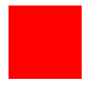

# 使用 SkiaSharp 在 C# 中生成图像

> ## 摘要
>
> 在本文中，我们将学习如何使用 SkiaSharp 库在 C# 中生成图像，包括图像创建和修改的示例。

---

在本文中，我们将学习如何使用 SkiaSharp 在 C# 中生成图像。

要下载本文的源代码，您可以访问我们的 [GitHub 仓库](https://github.com/CodeMazeBlog/CodeMazeGuides/tree/main/csharp-images/GenerateImagesInCSharpUsingSkiaSharp)。

让我们开始吧。

## 什么是 SkiaSharp？

SkiaSharp 库是基于 Google 的 Skia 图形库的、适用于 .NET 平台的跨平台 2D 图形 API，它是一个用于绘制文本、几何图形和图像的全面库。这个库是 Google 产品如 Google Chrome、ChromeOS、Android 和 Flutter 中使用的图形引擎。

在本文中，我们将探索使用 SkiaSharp 创建一个空白图像，然后在创建的图像中间绘制一个正方形。

首先，让我们在终端上导航到项目目录，以便导入 NuGet 包：

```bash
dotnet add package SkiaSharp
```

## 创建图像

接下来，让我们创建一个 `ImageService` 静态类，在其中定义一些辅助方法，从创建一个空白图像开始：

```csharp
public static SKBitmap CreateBlankImage(int width, int height)
{
    var bitmap = new SKBitmap(width, height);
    using var canvas = new SKCanvas(bitmap);
    canvas.Clear(SKColors.White);
    return bitmap;
}
```

这里我们看到了我们的 `CreateBlankImage()` 静态方法的定义，它接受 `width` 和 `height` 作为参数，并返回类型为 `SKBitmap` 的 `bitmap`，在 SkiaSharp 中代表一个图像。

我们开始时创建一个给定 `width` 和 `height` 的 `SKBitmap` 对象。接下来，我们使用我们的 `SKBitmap` 初始化一个新的 `SKCanvas` 对象。通过这个操作，我们将画布与位图连接起来。`SKCanvas` 类在 SkiaSharp 中表示画布或绘图面。它提供用于绘制图形、文本和图像的方法。

当我们最初创建一个位图时，其像素数据由未定义的随机值组成。通过使用 `SKCanvas()` 构造函数将位图附加到一个画布上，我们创建了一种操纵图像像素数据的手段。没有画布，位图将保持未初始化的随机值。

**注意** `SKCanvas` **对象是可释放的，因此添加了 using 声明以确保适当的清理。**

接下来，我们使用 `SKCanvas.Clear(SKColor)` 方法清除整个画布。`Clear()` 方法将画布中的所有像素设置为单一颜色，在我们的案例中是 `SKColors.White`。如果我们调用 `Clear()` 的无参数重载，所有像素将被设置为 `SKColor.Empty` (#00000000)。

## 操作图像

现在，让我们创建一个方法在我们的图像中心绘制一个正方形：

```csharp
public static void DrawSquareOnImage(SKBitmap bitmap, int squareSize, int startX, int startY)
{
    if (squareSize <= 0 || startX <= 0 || startY <= 0)
    {
        throw new ArgumentException("正方形的大小和坐标必须大于零。");
    }
    using var canvas = new SKCanvas(bitmap);
    using var paint = new SKPaint();
    paint.Color = SKColors.Red;
    var square = new SKRect(startX, startY, startX + squareSize, startY + squareSize);
    canvas.DrawRect(square, paint);
}
```

这里我们定义了我们的 `DrawSquareOnImage()` 方法，它将在提供的图像上绘制一个正方形。它接受四个参数，即我们将要绘制的 `SKBitmap` 对象、`squareSize`、`startX` 和 `startY`。`squareSize` 代表我们将要绘制的正方形的大小，而 `startX` 和 `startY` 代表正方形起始点的 X 和 Y 坐标。

首先，我们验证所有的 `int` 参数值都大于零。

接下来，我们为在位图上绘制而创建一个新的 `SKCanvas` 对象。之后，我们实例化一个新的 `SKPaint` 对象并将其 `Color` 设置为 `SKColors.Red`。我们使用 `SKPaint` 来定义图形、几何形状和位图的样式和颜色信息。

接下来，我们创建了一个 `SKRect` 实例，这是一个包含矩形四个坐标的结构，在我们的案例中是一个正方形。然后最后，我们使用 `DrawRect()` 方法在画布上绘制正方形，该方法接受一个 `SKRect` 参数（`square`）和一个 `SKPaint`（`paint`）参数。

## 保存图像

现在，让我们创建一个方法来保存图像：

```csharp
public static void SaveImage(SKBitmap bitmap, string outputPath)
{
    using var stream = new FileStream(outputPath, FileMode.Create, FileAccess.Write);
    using var image = SKImage.FromBitmap(bitmap);
    using var encodedImage = image.Encode();
    encodedImage.SaveTo(stream);
}
```

这里我们定义了我们的 `SaveImage()` 静态方法，它接受两个参数：`bitmap`和`outputPath`。

我们首先实例化一个 `FileStream` 对象用于文件创建，将 `FileMode` 设置为 `FileMode.Create` 来创建或覆盖一个文件，如果它已经存在，并且将 `FileAccess` 设置为 `FileAccess.Write`。

接下来，我们将我们的位图转换为 `SKImage`，然后调用无参数的 `Encode()` 方法，默认将我们的 `SKImage` 编码为 `PNG` 格式。然后我们最终将其保存到 `FileStream`。

`using` 声明确保在使用完每个可释放对象后调用 [Dispose()](https://code-maze.com/csharp-manage-idisposable-objects/) 方法，以确保适当的资源管理。

## 生成样本图像

现在，让我们将我们之前创建的方法带到我们的 `Program` 类中，并创建一个新图像：

```csharp
string outputPath = @"outputImage.png";
int imageWidth = 400;
int imageHeight = 300;
int squareSize = 120;
int startX = (imageWidth - squareSize) / 2;
int startY = (imageHeight - squareSize) / 2;
var bitmap = ImageService.CreateBlankImage(imageWidth, imageHeight);
ImageService.DrawSquareOnImage(bitmap, squareSize, startX, startY);
ImageService.SaveImage(bitmap, outputPath);
Console.WriteLine("图像成功生成并保存。");
```

我们指定一个目录路径，我们生成的图像 `outputImage.png` 将被保存在这个目录。我们想要的目录是包含我们的 `.exe` 文件的文件夹，即我们的 “net8.0” 文件夹。

我们将 `imageWidth`、`imageHeight` 和 `squareSize` 设置为分别为 400px、300px 和 120px。

接下来，我们通过提供 `imageWidth` 和 `squareSize` 来计算我们的正方形相对于 x 轴的起始点。同样，我们提供 `imageHeight` 和 `squareSize` 来计算我们正方形的 y 轴起始点。

之后，我们从我们的 `ImageService` 类中调用 `CreateBlankImage()` 方法，提供 `imageWidth` 和 `imageHeight`，来创建我们的 `bitmap`。

有了我们的图像之后，我们然后调用我们的 `DrawSquareOnImage()` 方法，提供我们的 `bitmap` 和我们之前计算的值：`squareSize`、`startX`、`startY`。通过这种方式，**正方形被绘制在我们的 `bitmap` 上**。

最后，我们将我们修改后的 `bitmap` 保存到我们之前定义的 `outputPath`，控制台上打印出确认消息。

让我们测试一下：

```bash
图像成功生成并保存。
```

如预期，我们得到了成功消息。现在让我们检查我们的图像：



## 结论

在本文中，我们通过操作一些示例图像，查看了如何使用 SkiaSharp 库在 C# 中生成和操作图像。
