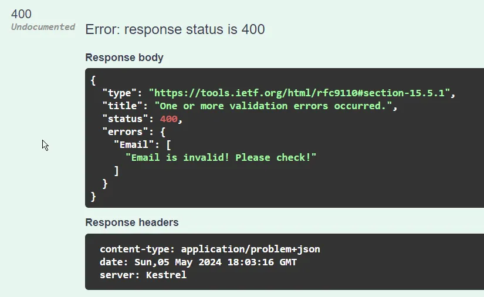

# 如何在ASP.NET Core中使用 FluentValidation - 超强大的验证

> ## 摘要
>
> 学习如何在您的ASP.NET Core应用程序中使用FluentValidation进行强大的验证。当涉及到验证模型和传入的HTTP请求时，我们不都倾向于使用数据注解吗？尽管在模型上设置数据注解可以快速进行，但这种方法有一些缺点。
>
> 原文 [How to use FluentValidation in ASP.NET Core - Super Powerful Validations](https://codewithmukesh.com/blog/fluentvalidation-in-aspnet-core/)

---

当谈论验证模型和传入的HTTP请求时，我们不都倾向于使用数据注解吗？虽然在您的模型上快速设置数据注解看起来很方便，但这种方法存在一些缺点。

在本文中，我们将尝试理解在大型项目中使用数据注解遇到的问题，并在我们的ASP.NET Core应用程序中使用一种替代方案，FluentValidation。它可以将验证提升到一个全新的水平，让您完全控制并编写更干净的代码。

## 验证的需求

数据验证是开发健壮和安全的Web应用程序的关键方面。它确保用户输入的数据准确、可靠并且适合处理。如果没有适当的验证，应用程序易受各种问题影响，包括：

- 数据完整性：验证确保数据符合预期的格式和规则，防止错误或不完整的数据保存在数据库中。这有助于维护数据的完整性并确保其一致性。
- 安全性：适当的验证有助于防止安全漏洞，如SQL注入、跨站脚本(XSS)和跨站请求伪造(CSRF)，通过确保用户输入经过净化并安全处理。
- 用户体验：验证通过对用户输入的正确性提供即时反馈，提高用户体验。这有助于用户迅速纠正任何错误，减少挫折感并提高可用性。
- 业务逻辑：验证强制执行业务规则和逻辑，确保数据满足应用程序的要求。

## 为什么数据注解并不总是适合？

在任何.NET应用程序中，Model验证的常用方法是数据注解，您需要在相应类的属性上声明属性。之前用过吗？

```csharp
public class UserRegistrationRequest
{
    [Required(ErrorMessage = "名字是必须的。")]
    public string? FirstName { get; set; }

    [Required(ErrorMessage = "姓氏是必须的。")]
    public string? LastName { get; set; }

    [Required(ErrorMessage = "邮箱是必须的。")]
    [EmailAddress(ErrorMessage = "无效的邮箱地址。")]
    public string? Email { get; set; }

    [Required(ErrorMessage = "密码是必须的。")]
    [MinLength(6, ErrorMessage = "密码至少需要6个字符。")]
    public string? Password { get; set; }

    [Required(ErrorMessage = "请确认您的密码。")]
    [Compare("Password", ErrorMessage = "密码不匹配。")]
    public string? ConfirmPassword { get; set; }
}
```

在上面的示例中，我们有一个`UserRegistrationRequest`，包括Email, Name和Password字段。为了确保客户端给我们提供了有效的输入，我们引入了`数据注解`来验证请求。例如，FirstName字段是必需的属性，ComparePassword字段应与Password字段匹配，等等。

对于小型项目和POCs来说，这很好。但是一旦您开始学习干净的代码，或开始了解应用程序设计的SOLID原则，您就再也不会像以前那样对数据注解感到满意了。将模型和验证逻辑结合在一起并不是一种好的做法。

使用数据注解将您的验证规则与模型类绑定在一起。这可能违反了关注点分离原则，因为验证逻辑与您的域逻辑混合在一起。

那么，解决方案是什么呢？

## 介绍 FluentValidation - 解决方案

[FluentValidation](https://fluentvalidation.net/) 是一个强大的开源.NET验证库，可帮助您使验证变得简洁、易于创建以及维护。它帮助您构建强类型的验证规则。它甚至适用于您无法访问的外部模型。有了这个库，您可以像应有的那样将模型类与验证逻辑分开。它不像数据注解那样使您的类变得杂乱。此外，更好的验证控制使开发人员更喜欢FluentValidation。

> FluentValidation为定义验证规则提供了一个流畅的界面，使您能够清楚而简洁地表达复杂的验证逻辑。这使得创建自定义验证规则和处理复杂的验证场景变得容易。

对于小型项目，我建议只使用数据注解，因为它们设置起来非常简单。对于更大、更复杂的系统，由于上述提到的好处，FluentValidation是前进的道路。

## 在ASP.NET Core应用程序中使用 FluentValidation

在此演示中，我将使用ASP.NET Core 8 Web API项目，我的IDE为Visual Studio 2022社区版。我们将使用Swagger来测试API。

打开Visual Studio并创建一个新的.NET 8 Web API项目。确保您已启用Swagger，因为我们将使用它来测试我们的API。

## 安装 FluentValidation 包

现在，让我们通过包管控制台向您的项目安装所需的FluentValidation NuGet包。

```bash
Install-Package FluentValidation
Install-Package FluentValidation.DependencyInjectionExtensions
```

> 请注意，`FluentValidation.AspNetCore`包现已弃用。

## 用户注册请求

对于演示，我们将采用我们的API负责通过公开POST API端点将新用户注册到系统中的情况。下面是C#类的样子。

```csharp
public class UserRegistrationRequest
{
    public string? FirstName { get; set; }
    public string? LastName { get; set; }
    public string? Email { get; set; }
    public string? Password { get; set; }
    public string? ConfirmPassword { get; set; }
}
```

我们的最终目标是在每次触发注册API时验证这个请求类。例如，我们需要确保用户输入了有效的`FirstName`、`Email`等。我们将通过引入FluentValidation提供的各种功能来构建这一点。

## 添加验证规则

在这一步中，我们将定义我们的`UserRegistrationRequest`的验证规则。创建一个名为Validators的新文件夹，并添加一个名为`UserRegistrationValidator`的新类

首先，我们将添加一个验证规则，验证传入的Email属性是否为电子邮件地址。

```csharp
public class UserRegistrationValidator : AbstractValidator<UserRegistrationRequest>
{
    public UserRegistrationValidator()
    {
        RuleFor(x => x.Email).EmailAddress();
    }
}
```

注意，`UserRegistrationValidator`继承自`AbstractValidator<T>`，其中T是要验证的实际类。

## 在ASP.NET Core中注册验证器

我们将需要将FluentValidation添加到我们的应用程序中。打开`Program.cs`。

现在有几种方法可以将`UserRegistrationValidator`注册到应用程序的DI容器中。

如果您想要注册只有一个验证器，您可以使用以下方法。

```csharp
builder.Services.AddScoped<IValidator<UserRegistrationRequest>, UserRegistrationValidator>();
```

这确保您可以在构造函数中注入`IValidator<UserRegistrationRequest>`并根据需要进行验证。

如果您的项目有多个验证器，并且您不想一一手动注册它们，您可以使用以下方法。

```csharp
builder.Services.AddValidatorsFromAssemblyContaining<UserRegistrationValidator>();
```

在上面的代码中，FluentValidation注册了包含`UserRegistrationValidator`的程序集中找到的所有验证器实例。

## 验证的方法

`FluentValidation`通过不同的方式验证传入的模型，比如

- 手动验证 - 这是推荐的方法。
- 使用ASP.NET Core管道的自动验证 - 在FluentValidation的最新版本`11.9.1`中已弃用且不再支持。从这个[讨论](https://github.com/FluentValidation/FluentValidation/issues/1959)中阅读更多关于破坏性变更的信息。
- 使用过滤器进行验证 - 需要外部包。

在这个演示中，我们将学习使用FluentValidation包进行手动验证。

## API端点

现在，我们将创建一个最小化API端点，允许将新用户注册到系统中。这将是一个POST端点，并将接受类型为`UserRegistrationRequest`的请求体。

```csharp
app.MapPost("/register", async (UserRegistrationRequest request, IValidator<UserRegistrationRequest> validator) =>
{
    var validationResult = await validator.ValidateAsync(request);
    if (!validationResult.IsValid)
    {
        return Results.ValidationProblem(validationResult.ToDictionary());
    }
    // 执行实际的服务调用，将用户注册到系统中
    // _service.RegisterUser(request);
    return Results.Accepted();
});
```

请注意，我们已将`IValidator<UserRegistrationRequest>`的实例注入到端点中，我们将使用它来验证传入的对象。

我们首先使用验证器对象异步验证`UserRegistrationRequest`对象。如果结果有效，端点返回一个接受的状态码。否则，返回类型为验证的问题详情。让我们看看这在实践中的效果。

构建并运行您的.NET 8 Web API，并打开Swagger。

```json
{
  "firstName": "string",
  "lastName": "string",
  "email": "string",
  "password": "string",
  "confirmPassword": "string"
}
```

我将通过传递上述默认值来调用API。如您所见，我们指定了一个无效的电子邮件ID。如果您执行请求，您将能够看到以下响应。

```json
{
  "type": "https://tools.ietf.org/html/rfc9110#section-15.5.1",
  "title": "发生了一个或多个验证错误。",
  "status": 400,
  "errors": {
    "Email": ["'Email' 不是一个有效的电子邮件地址。"]
  }
}
```

如您所见，我们收到了包含验证错误的400 Bad Request响应，该错误包括`'Email' 不是一个有效的电子邮件地址。`错误消息。如果您向请求传递有效的电子邮件地址，您将能够看到此验证错误消失。请注意，这能够返回错误数组（如果需要）。

## 扩展验证规则

在接下来的步骤中，我们将进一步探索`FluentValidation`的功能以及它如何帮助我们在系统中构建强大的验证。

### 自定义验证消息

根据属性显示自定义验证消息是非常实用的。通过FluentValidation这非常简单。前往我们创建的验证器并向与Email属性相关联的规则添加`WithMessage()`扩展。

```csharp
RuleFor(x => x.Email).EmailAddress().WithMessage("{PropertyName} 无效！请检查！");
```

> 使用`{PropertyName}`来获取对应的属性名称。这些是FluentValidation库的占位符变量。在[这里](https://docs.fluentvalidation.net/en/latest/built-in-validators.html)阅读更多关于它们的信息。

让我们现在看看响应。



### 内置验证器

FluentValidation默认提供了几种验证器。我们将使用其中的一些来对类的其他属性编写额外的验证。

```csharp
public class UserRegistrationValidator : AbstractValidator<UserRegistrationRequest>
{
    public UserRegistrationValidator()
    {
        RuleFor(x => x.FirstName).NotEmpty().MinimumLength(4);
        RuleFor(x => x.LastName).NotEmpty().MaximumLength(10);
        RuleFor(x => x.Email).EmailAddress().WithMessage("{PropertyName} 无效！请检查！");
        RuleFor(x => x.Password).Equal(z => z.ConfirmPassword).WithMessage("密码不匹配！");
    }
}
```

让我解释一下每条规则验证的内容。

1. `FirstName`不应为空，并且最小字符串长度为4。
2. `LastName`同样不应为空，并且长度最多为10个字符。
3. 如我们之前看到的邮箱验证。
4. 这确保传入请求中的`Password`和`ConfirmPassword`字段匹配。

### 覆盖属性名称

您还可以更改返回到验证消息中的属性名称。例如，如果您想将`Email`属性的名称更改为`MailID`，您可以简单地添加`WithName`扩展。

```csharp
RuleFor(x => x.Email).EmailAddress().WithName("MailID").WithMessage("{PropertyName} 无效！请检查！");
```

这是我们的ASP.NET Core Web API的响应：

```json
{
  "type": "https://tools.ietf.org/html/rfc9110#section-15.5.1",
  "title": "发生了一个或多个验证错误。",
  "status": 400,
  "errors": {
    "Email": ["MailID 无效！请检查！"]
  }
}
```

### 链式验证器

在某些情况下，您可能想要对特定属性添加不止一个验证。下面的规则对`FirstName`属性有2个这样的验证。它不应该是空的，同时该属性的最小长度必须至少为4个字符。

```csharp
RuleFor(x => x.FirstName).NotEmpty().MinimumLength(4);
```

### 停止在首次失败

您还可以定制FluentValidation如何执行验证检查。例如，如果您考虑上面的代码，我们在同一规则中绑定了2个验证，如果您为`FirstName`传递一个空字符串，您将在响应中看到2个验证消息。

```json
{
  "type": "https://tools.ietf.org/html/rfc9110#section-15.5.1",
  "title": "发生了一个或多个验证错误。",
  "status": 400,
  "errors": {
    "FirstName": [
      "'First Name' 必须不为空。",
      "'First Name' 的长度必须至少为4个字符。您输入了0个字符。"
    ]
  }
}
```

在某些情况下，您希望一旦某个属性的第一个验证失败，就停止执行该属性的验证检查。在我们的例子中，我们可能需要在`NotEmpty`验证器处立即停止验证检查。

为此，我们有级联(Cascade)属性，允许2种模式，

- Continue - 这是默认行为，即使前一个验证失败，也继续调用验证。
- Stop - 一旦第一个验证失败，就停止执行验证检查。

您可以按如下修改代码，

```csharp
RuleFor(x => x.FirstName).Cascade(CascadeMode.Stop).NotEmpty().MinimumLength(4);
```

## 自定义验证

作为一个例子，理论上，你可以将一个数字作为名字传递给接口，而API会表示“很好，这是可以的”。让我们看看如何用Fluent Validation为这种场景构建一个验证规则。

首先，创建一个简单的辅助函数，这个函数会接收我们的`FirstName`属性并根据其内容返回一个布尔值。我们将这个方法放在`UserRegistrationValidator`类中。

```csharp
private bool IsValidName(string name)
{
    return name.All(Char.IsLetter);
}
```

现在，让我们将这个要求添加到规则中，并将其与我们的辅助方法连接起来。

```csharp
RuleFor(x => x.FirstName)
    .Cascade(CascadeMode.Stop)
    .NotEmpty()
    .MinimumLength(4)
    .Must(IsValidName).WithMessage("{PropertyName} 应该全部是字母。");
```

第5行表明当属性传递给我们的辅助函数时将返回true。

现在，如果我将一个数字作为请求的一部分传递给`FirstName`属性，我将从我的API得到以下响应。

```json
{
  "type": "https://tools.ietf.org/html/rfc9110#section-15.5.1",
  "title": "发生了一个或多个验证错误。",
  "status": 400,
  "errors": {
    "FirstName": ["名字应该全部是字母。"]
  }
}
```

所以，这也被妥善处理了。

## 总结

我希望你喜欢这个关于在ASP.NET Core中使用FluentValidation的简单指南。我确信你从今天开始就会转向这个强大的库了！你对这个库有什么看法呢？一些开发者仍然更喜欢使用数据注解而不是这个。你呢？请在下面的评论中让我知道。
