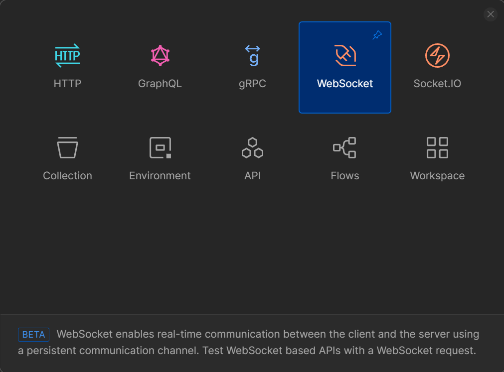
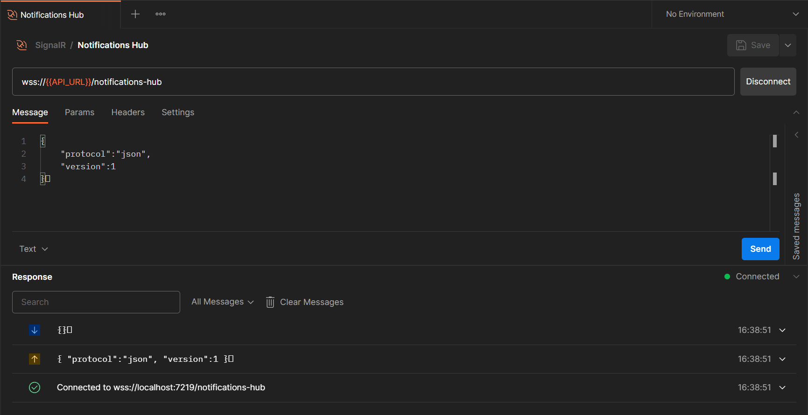
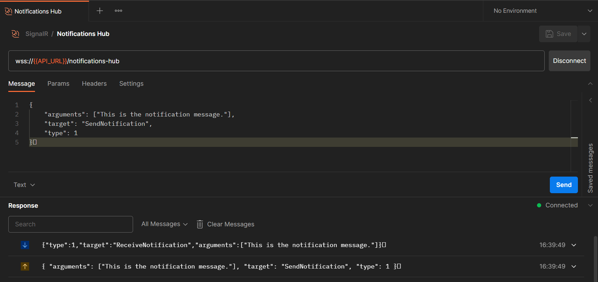

# 为 .NET 应用添加实时功能使用SignalR

> 原文链接：[Adding Real-Time Functionality To .NET Applications With SignalR](https://www.milanjovanovic.tech/blog/adding-real-time-functionality-to-dotnet-applications-with-signalr?utm_source=Twitter&utm_medium=social&utm_campaign=06.05.2024)

---

当今的现代应用程序必须在不刷新用户界面的情况下提供最新信息。

如果您需要在 .NET 应用程序中引入**实时**功能，那么您最有可能会选择的库就是 **SignalR**。

**SignalR** 允许您实时将服务器端代码的内容推送给任何已连接的客户端，随着更改的发生。

在本周的通讯中，我将教你以下内容：

- 创建你的第一个 **SignalR** `Hub`
- 从 **Postman** 测试 **SignalR**
- 创建强类型的 hubs
- 发送消息给特定的用户

让我们看看 **SignalR** 为什么如此强大以及如何简单地构建**实时**应用程序。

## 安装和配置 SignalR

要开始使用 **SignalR**，您需要：

- 安装 NuGet 包
- 创建 `Hub` 类
- 注册 SignalR 服务
- 映射并暴露 hub 端点使客户端可以连接

首先安装 `Microsoft.AspNetCore.SignalR.Client` NuGet 包：

```powershell
Install-Package Microsoft.AspNetCore.SignalR.Client
```

然后你需要一个 SignalR `Hub`，这是您应用程序中的中心组件，负责管理客户端和发送消息。

让我们创建一个 `NotificationsHub` 通过继承基础 `Hub` 类：

```csharp
public sealed class NotificationsHub : Hub
{
    public async Task SendNotification(string content)
    {
        await Clients.All.SendAsync("ReceiveNotification", content);
    }
}
```

SignalR `Hub` 暴露了一些有用的属性：

- `Clients` - 用于调用连接到此 hub 的客户端上的方法
- `Groups` - 将连接添加和移除群组的抽象
- `Context` - 用于访问关于 hub 呼叫者连接的信息

你可以在[这里](https://learn.microsoft.com/en-us/dotnet/api/microsoft.aspnetcore.signalr.hub?view=aspnetcore-7.0)了解更多关于 `Hub` 类的信息。

最后，你需要通过调用 `AddSignalR` 方法注册 SignalR 服务。您还需要调用 `MapHub<T>` 方法，在此指明 `NotificationsHub` 类和客户端用来连接 hub 的路径。

```csharp
var builder = WebApplication.CreateBuilder(args);

builder.Services.AddSignalR();

var app = builder.Build();

app.MapHub<NotificationsHub>("notifications-hub");

app.Run();
```

现在让我们看看如何测试 `NotificationsHub`。

## 从 Postman 连接到 SignalR Hub

要测试 SignalR，您需要一个客户端来连接到 `Hub` 实例。您可以创建一个简单的 Blazor 或 JavaScript 应用程序，但我将向您展示另一种方法。

我们将使用 Postman 的 **WebSocket Request** 来连接到 `NotificationsHub`。



以下是我们需要做的：

- 连接到 `NotificationsHub`
- 设置通信协议为 JSON
- 发送消息调用 `NotificationsHub` 方法

所有消息需要以空终止字符结束，这只是 ASCII 字符 `0x1E`。

让我们开始发送这个消息来设置通信协议为 JSON：

```json
{
  "protocol": "json",
  "version": 1
}?
```

您将从 hub 收到此响应。



我们需要 slightly different message 格式来调用 `Hub` 上的消息。关键是指定 `arguments` 和 `target`，这是我们想要调用的实际 hub 方法。

假设我们想要调用 `NotificationsHub` 上的 `SendNotification` 方法：

```json
{
  "arguments": ["This is the notification message."],
  "target": "SendNotification",
  "type": 1
}?
```

这将是我们从 `NotificationsHub` 收到的响应：



## 强类型的 Hubs

基础 `Hub` 类使用 `SendAsync` 方法发送消息给已连接的客户端。不幸的是，我们必须使用字符串来指定调用客户端方法，并且容易犯错误。还没有什么可以强制使用哪些参数。

SignalR 支持旨在解决此问题的**强类型 hubs**。

首先，你需要定义一个客户端接口，让我们创建一个简单的 `INotificationsClient` 抽象：

```csharp
public interface INotificationsClient
{
    Task ReceiveNotification(string content);
}
```

参数不必是原始类型，也可以是对象。SignalR 将负责在客户端序列化。

之后，您需要更新 `NotificationsHub` 类继承 `Hub<T>` 类使其成为强类型：

```csharp
public sealed class NotificationsHub : Hub<INotificationsClient>
{
    public async Task SendNotification(string content)
    {
        await Clients.All.ReceiveNotification(content);
    }
}
```

您将失去访问 `SendAsync` 方法的能力，只有您客户端接口中定义的方法将可用。

## 使用 `HubContext` 发送服务器端消息

如果我们不能从后端向已连接的客户端发送通知，那么 `NotificationsHub` 有什么用呢？
不多。

您可以使用 `IHubContext<THub>` 接口访问 `Hub` 实例在您的后端代码中。

同样，您可以使用 `IHubContext<THub, TClient>` 对于一个强类型的 hub。

这是一个简单的 Minimal API 端点，它注入了 `IHubContext<NotificationsHub, INotificationsClient>` 对我们的强类型 hub 使用它向所有已连接的客户端发送通知：

```csharp
app.MapPost("notifications/all", async (
    string content,
    IHubContext<NotificationsHub, INotificationsClient> context) =>
{
    await context.Clients.All.ReceiveNotification(content);

    return Results.NoContent();
});
```

## 向特定用户发送消息

SignalR 的真正价值在于能够**发送消息**，或在此例中的通知，给一个**特定用户**。

我见过一些复杂的实现，它们管理一个用户标识符的字典和活动连接的映射。当 SignalR 已经支持此功能时，您为什么还要这么做呢

您可以调用 `User` 方法并传递 `userId` 使 `ReceiveNotification` 消息专门针对那个特定用户。

```csharp
app.MapPost("notifications/user", async (
    string userId,
    string content,
    IHubContext<NotificationsHub, INotificationsClient> context) =>
{
    await context.Clients.User(userId).ReceiveNotification(content);

    return Results.NoContent();
});
```

**SignalR** 如何知道将消息发送给哪个用户？

它内部使用 `DefaultUserIdProvider` 来从声明中提取用户标识符。具体来说，它使用 `ClaimTypes.NameIdentifier` 声明。这也意味着您在连接到 `Hub` 时应该通过认证，例如，通过传递 JWT。

```csharp
public class DefaultUserIdProvider : IUserIdProvider
{
    public virtual string? GetUserId(HubConnectionContext connection)
    {
        return connection.User?.FindFirst(ClaimTypes.NameIdentifier)?.Value;
    }
}
```

默认情况下，所有在 hub 中的方法可以由未认证的用户调用。因此，你需要用 `Authorize` 属性装饰它，以仅允许认证的客户端访问 hub。

```csharp
[Authorize]
public sealed class NotificationsHub : Hub<INotificationsClient>
{
    public async Task SendNotification(string content)
    {
        await Clients.All.ReceiveNotification(content);
    }
}
```

## 总结

为您的应用程序添加**实时功能**，为创新创造空间并为您的用户增加价值。

有了 **SignalR**，您可以在几分钟内开始构建 .NET 中的实时应用。

您需要掌握一个概念 - `Hub` 类。SignalR 抽象了消息传输机制，所以您不必担心它。

确保向 **SignalR** hubs 发送认证的请求，并开启 `Hub` 上的认证。SignalR 将在内部跟踪连接到您 hubs 的用户，允许您基于用户标识符向他们发送消息。
