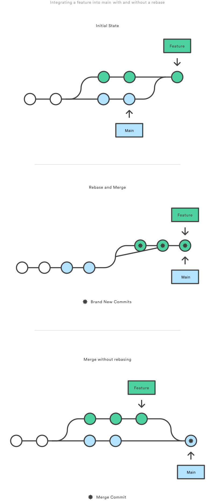

# 合并 vs 变基 | Atlassian Git 教程

> ## 摘要
>
> 比较 git rebase 和相关的 git merge 命令，并识别在典型的 Git 工作流中纳入变基的所有潜在机会
>
> 原文 [Merging vs. Rebasing | Atlassian Git Tutorial](https://www.atlassian.com/git/tutorials/merging-vs-rebasing)

---

### 合并选项

最简单的选项是使用类似以下命令将 `main` 分支合并到功能分支中：

```css
git checkout feature git merge main
```

或者，你可以将其压缩为一个命令行：

这在 `feature` 分支中创建了一个新的“合并提交”，将两个分支的历史绑定在一起，使你的分支结构看起来像这样：


合并很好，因为它是一个*非破坏性*操作。现有的分支不会以任何方式改变。这避免了所有变基的潜在缺陷（下面将讨论）。

另一方面，这也意味着每当你需要合并上游更改时，`feature` 分支都会有一个额外的合并提交。如果 `main` 非常活跃，这可能会在你的功能分支的历史中造成相当多的污染。虽然可以通过高级 `git log` 选项来减轻这个问题，但这可能使其他开发者难以理解项目的历史。

### 变基选项

作为合并的替代方案，你可以使用以下命令将 `feature` 分支变基到 `main` 分支：

```css
git checkout feature git rebase main
```

这将整个 `feature` 分支移动到 `main` 分支的尖端，有效地纳入 `main` 中的所有新提交。但是，变基不是使用合并提交，而是通过为原始分支中的每个提交创建全新的提交，*重写*项目历史。


变基的主要好处是你得到了一个更干净的项目历史。首先，它消除了 `git merge` 所需的不必要的合并提交。其次，如上图所示，变基还导致了一个完全线性的项目历史——你可以跟随 `feature` 的尖端一直到项目的开始，没有任何分叉。这使得使用命令（如 `git log`、`git bisect` 和 `gitk`）导航项目更加容易。

但是，对于这种完美的提交历史，有两个权衡：安全性和可追溯性。如果你不遵循[变基的黄金规则](https://www.atlassian.com/git/tutorials/merging-vs-rebasing#the-golden-rule-of-rebasing)，重写项目历史可能对你的协作工作流造成灾难性的后果。此外，较次要的是，变基丢失了合并提交提供的上下文——你无法看到何时将上游更改纳入到功能中。

### 交互式变基

交互式变基为你提供了在移动到新分支时更改提交的机会。这比自动变基更强大，因为它提供了对分支提交历史的完全控制。通常，这用于在将功能分支合并到 `main` 之前清理杂乱的历史。

要开始一个交互式变基会话，请向 `git rebase` 命令传递 `i` 选项：

```css
git checkout feature git rebase -i main
```

这将打开一个文本编辑器，列出即将移动的所有提交：

```bash
pick 33d5b7a 提交#1的消息 pick 9480b3d 提交#2的消息 pick 5c67e61 提交#3的消息
```

这个列表定义了变基执行后分支的确切外观。通过更改 `pick` 命令和/或重新排序条目，你可以使分支的历史看起来像你想要的任何样子。例如，如果第二个提交修复了第一个提交中的一个小问题，你可以用 `fixup` 命令将它们压缩成一个提交：

```bash
pick 33d5b7a 提交#1的消息 fixup 9480b3d 提交#2的消息 pick 5c67e61 提交#3的消息
```

当你保存并关闭文件时，Git 将根据你的指令执行变基，结果产生的项目历史看起来如下：


消除这样的无关紧要的提交使你的功能历史更容易理解。这是 `git merge` 无法做到的事情。

## 变基的黄金规则

一旦你理解了什么是变基，最重要的事情是学习什么时候*不要*这样做。`git rebase` 的黄金规则是永远不要在*公共*分支上使用它。

例如，想象一下如果你将 `main` 变基到你的 `feature` 分支会发生什么：


变基将 `main` 中的所有提交移动到 `feature` 的尖端。问题是这只发生在*你的*仓库中。所有其他的开发者仍在使用原始的 `main`。由于变基结果产生全新的提交，Git 将认为你的 `main` 分支的历史已经与所有人其他的分叉了。

同步两个 `main` 分支的唯一方法是将它们再次合并在一起，导致一个额外的合并提交*和*两组包含相同更改的提交（原始的和来自你的变基分支的）。不用说，这是一个非常混乱的情况。

因此，在运行 `git rebase` 之前，总是问自己，“有其他人在看这个分支吗？”如果答案是肯定的，那么请拿开你的手，开始考虑一种非破坏性的方式来进行你的更改（例如，`git revert` 命令）。否则，你可以尽情重写历史。

### 强制推送

如果你尝试将重新基础的 `main` 分支推送回远程仓库，Git 会阻止你这样做，因为它与远程的 `main` 分支冲突。但是，你可以通过传递 `--force` 标志来强制推送：

```bash
# 请谨慎使用此命令！ git push --force
```

这会覆盖远程的 `main` 分支以匹配你仓库中的重新基础版本，并为你的团队其他成员造成很大的困惑。因此，请非常谨慎地使用此命令，只有在你确切知道你在做什么时才使用。

你应该强制推送的唯一时刻是在你将私有功能分支推送到远端仓库（例如，出于备份目的）之后进行了本地清理。这就像说，“哦，我不想真的推送功能分支的原始版本。请接受当前的这个。”再次强调，重要的是没有人在使用原始版本的功能分支的提交。

## 工作流演练

变基可以根据你的团队舒适程度，多或少地纳入你现有的 Git 工作流。在本节中，我们将看看在功能开发的各个阶段，变基可以提供的好处。

使用 `git rebase` 的工作流的第一步是为每个功能创建一个专用分支。这为你提供了必要的分支结构以安全地使用变基：


### 本地清理

将变基纳入你的工作流的最佳方式之一是清理本地、正在进行中的功能。通过定期进行交互式变基，你可以确保你的功能中的每个提交都是集中和有意义的。这让你编码时不用担心将其拆分成孤立的提交——你可以在事后修复它。

调用 `git rebase` 时，你有两个选项用于新的基础：功能的父分支（例如，`main`），或者你的功能中更早的提交。我们在*交互式变基*部分看到了第一个选项的示例。后一个选项在你只需修复最后几个提交时很有用。例如，以下命令开始对只有最后3个提交的交互式变基。

```css
git checkout feature git rebase -i HEAD~3
```

通过指定 `HEAD~3` 作为新的基础，你实际上并没有移动分支——你只是交互式地重写了跟随它的3个提交。注意，这不会将上游更改合并到 `feature` 分支中。


如果你想使用这种方法重写整个功能，`git merge-base` 命令可用于找到 `feature` 分支的原始基础。以下返回原始基础的提交ID，然后你可以将其传递给 `git rebase`：

```css
git merge-base feature main
```

将交互式变基用于这种情况是将 `git rebase` 引入你的工作流的绝佳方式，因为它只影响本地分支。其他开发者看到的只是你的成品，这应该是一个干净、易于跟随的功能分支历史。

但再次强调，这只适用于*私有*功能分支。如果你正在通过同一个功能分支与其他开发者合作，那么该分支是*公共的*，你不能重写其历史。

清理本地提交的交互式变基没有 `git merge` 的替代方案。

### 将上游更改纳入功能

在*概念概述*部分，我们看到了功能分支可以使用 `git merge` 或 `git rebase` 将上游更改从 `main` 纳入。合并是一种安全选项，它保留了你的仓库的完整历史，而变基通过将你的功能分支移动到 `main` 的尖端，创建了线性历史。

这种使用 `git rebase` 的方式类似于本地清理（并且可以同时执行），但在此过程中，它合并了来自 `main` 的那些上游提交。

请记住，将变基操作重定向到远程分支而不是 `main` 是完全合法的。这可能发生在与另一名开发者合作同一功能时，你需要将他们的更改纳入你的仓库。

例如，如果你和另一名叫约翰的开发者在 `feature` 分支上添加了提交，你的仓库在从约翰的仓库获取远程 `feature` 分支后可能看起来如下：


你可以以与从 `main` 整合上游更改相同的方式解决这个分叉：要么将你的本地 `feature` 与 `john/feature` 合并，要么将你的本地 `feature` 变基到 `john/feature` 的尖端。


注意，这次变基不违反*变基的黄金规则*，因为只有你的本地 `feature` 提交被移动了——在此之前的一切都未受影响。这就像说，“把我的更改加到约翰已经完成的事情上。”在大多数情况下，这比通过合并提交与远程分支同步更直观。

默认情况下，`git pull` 命令执行合并，但你可以通过传递 `--rebase` 选项来强制使用变基来整合远程分支。

### 使用拉取请求审查功能

如果你在代码审查过程中使用拉取请求，你需要在创建拉取请求之后避免使用 `git rebase`。一旦你发起了拉取请求，其他开发者将会查看你的提交，这意味着它是一个*公共*分支。重写其历史将使 Git 和你的团队成员无法追踪到功能中添加的任何后续提交。

任何来自其他开发者的更改都需要使用 `git merge` 而不是 `git rebase` 来合并。

因此，在提交拉取请求之前使用交互式变基清理你的代码通常是个好主意。

### 整合获批的功能

在你的团队批准一个功能之后，你可以选择在使用 `git merge` 将功能整合到主代码库之前，先将该功能变基到 `main` 分支的顶端。

这与将上游更改纳入功能分支的情况相似，但由于你不允许重写 `main` 分支中的提交，你最终必须使用 `git merge` 来整合功能。然而，通过在合并前进行变基，你可以确保合并将被快进，从而产生一个完全线性的历史。这也为你提供了在拉取请求期间添加任何后续提交的机会来进行压缩。



如果你对 `git rebase` 不完全放心，你可以始终在临时分支中执行变基。这样，如果你不小心搞乱了功能的历史，你可以检出原始分支并再试一次。例如：

```css
git checkout feature git checkout -b temporary-branch git rebase -i main # [清理历史] git checkout main git merge temporary-branch
```

## 总结

这些就是你开始使用 rebase 来整合你的分支所需要知道的全部信息。如果你希望保持一个干净、线性的历史记录，没有不必要的合并提交，你应该选择使用 `git rebase` 而不是 `git merge` 来整合另一个分支的更改。

另一方面，如果你想保留你的项目的完整历史记录，并避免重写公开提交的风险，你可以坚持使用 `git merge`。这两种选项都是完全合理的，但至少现在你有了利用 `git rebase` 的好处的选择。
