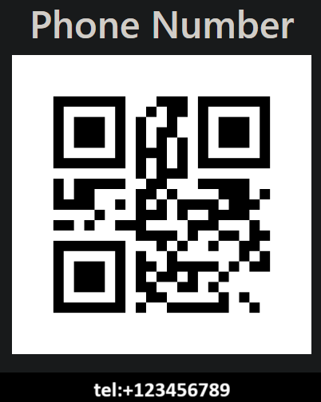
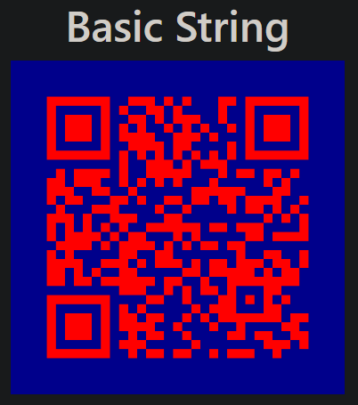

# 使用QRCoder在.NET中生成QR码

> ## 摘要
>
> 通过.NET库QRCoder，我们可以轻松生成QR码。让我们使用负载生成器生成一些基本的和自定义的QR码。

---

在这篇文章中，我们将讨论如何生成QR码，特别是通过.NET库QRCoder。我们将生成包含简单字符串的基本QR码，讨论读取和写入数据库的QR码，并尝试一些现实生活中的用例，例如拨打电话号码和打开网页。

要下载本文的源代码，您可以访问我们的[GitHub仓库](https://github.com/CodeMazeBlog/CodeMazeGuides/tree/main/dotnet-client-libraries/QRCoder)。

首先，让我们了解QR码是什么。

## 什么是QR码？

QR是“Quick-Response”的缩写，因此它是一种快速响应的二维条形码，能够存储各种类型的数据。创建QR码后，我们可以通过扫描它来访问它背后的编码数据。

由于它们的多功能性和易用性，它们在营销和广告等领域取得了巨大的成功，这些领域需要快速访问数据。

现在，我们已经涵盖了理论方面，让我们看看如何将QRCoder添加到一个.NET web应用程序，并开始生成一些快速响应码！

## 设置QR码生成器

让我们使用一个基本的web应用程序来生成和显示我们的QR码。

首先，让我们创建一个ASP.NET Core Web应用程序（Model-View-Controller），然后从包管理器控制台添加`QRCoder`库：

```bash
PM> install-package QRCoder
```

接下来，让我们在Models文件夹中添加一个新记录：

```csharp
public record HomeModel(Dictionary<string, string> QRCodes);
```

我们将使用这个记录来保存编码的QR码，我们可以在视图中显示这些码。

让我们更新`Home/Index`视图以显示我们的QR码：

```html
@model HomeModel;
<div class="text-center">
  @foreach (var qr in Model.QRCodes) {
  <hr />
  <h2>@qr.Key</h2>
  
  }
</div>
```

最后，让我们修改`HomeController`类：

```csharp
public class HomeController : Controller
{
    private readonly QRCodeGenerator qrGenerator = new();
    public IActionResult Index()
    {
        var qrCodes = new Dictionary<string, string>
        {
            { "Basic String", GenerateQRCodeString() }
        };
        var model = new HomeModel(qrCodes);

        return View(model);
    }
    private string GenerateQRCodeString()
    {
        var qrCodeData = qrGenerator.CreateQrCode("Hello CodeMaze readers", QRCodeGenerator.ECCLevel.Q);
        return GeneratePng(qrCodeData);
    }
    private static string GeneratePng(QRCodeData data)
    {
        using var qrCode = new PngByteQRCode(data);
        var qrCodeImage = qrCode.GetGraphic(20);
        return $"data:image/png;base64,{Convert.ToBase64String(qrCodeImage)}";
    }
}
```

在这里，我们正在创建包含简单字符串的QR码，并将其作为PNG图像渲染在页面上。

现在，让我们忽略`CreateQrCode()`和`GetGraphic()`方法的参数，因为我们稍后会深入探讨这些。

现在，让我们运行我们的应用程序并在页面上看到我们的第一个QR码：


太棒了！现在我们已经生成了一个基本的QR码，让我们看看使用负载生成器生成更有趣的码。

## QR码负载生成器

我们开始生成了一个包含基本字符串的QR码。让我们看看其他示例，比如提供一个允许与外部应用程序顺利交互的行动呼吁。

所有的QR码都是字符串，但一些是QR码读取器可以解码和处理的“特殊”结构化字符串。`QRCoder`库为我们提供了一些方便的类，它们都派生自`Payload`类。这个类包含构造这些sQR码的行为。让我们看看这些特殊助手中的一些。

### 生成网址的QR码

QR码最常见的用途之一是导航到网页。例如，如果我们想让我们的印刷材料的读者填写一个调查，提供一个QR码进行扫描会比提供一个需要键入的长网址更方便。

因此，让我们添加一个新方法来生成网址：

```csharp
private string GenerateQRCodeURL()
{
    var qrCodeData = qrGenerator.CreateQrCode(new Url("https://www.code-maze.com"));

    return GeneratePng(qrCodeData);
}
```

这个`Url`类派生自我们之前提到的`Payload`类，并接受一个网址作为参数。

让我们更新我们的`Index()`方法：

```csharp
public IActionResult Index()
{
    var qrCodes = new Dictionary<string, string>
    {
        { "Basic String", GenerateQRCodeString() },
        { "URL", GenerateQRCodeURL() }
    };
    var model = new HomeModel(qrCodes);
    return View(model);
}
```

最后，让我们运行我们的应用程序并扫描预期的网址QR码：


值得注意的是，虽然QR码中的网址将是“静态的”（即不可改变的），但我们总是可以在我们的web服务器上进行动态重定向。例如，我们可以生成一个指向我们web服务器上的端点的网址（例如https://mysite.com/qr-code-campaign），但配置该端点重定向到另一个资源。

现在，让我们尝试另一个负载生成器。

### 生成电话号码的QR码

电话号码是QR码的另一个典型用例，特别是针对移动设备。一个典型的例子是带有QR码的名片。消费者可以扫描该码，而不是输入电话号码，就可以拨打电话。

让我们看看我们如何实现这一点。

首先，让我们添加`GenerateQRCodePhoneNumber()`方法：

```csharp
private string GenerateQRCodePhoneNumber()
{
    var qrCodeData = qrGenerator.CreateQrCode(new PhoneNumber("+123456789"));
    return GeneratePng(qrCodeData);
}
```

我们使用`PhoneNumber`类，它派生自`Payload`类，并提供电话号码。

让我们更新我们的`Index()`方法：

```csharp
public IActionResult Index()
{
    var qrCodes = new Dictionary<string, string>
    {
        { "Basic String", GenerateQRCodeString() },
        { "URL", GenerateQRCodeURL() },
        { "Phone Number", GenerateQRCodePhoneNumber() }
    };
    var model = new HomeModel(qrCodes);
    return View(model);
}
```

让我们现在扫描码来显示嵌入的电话号码：



我们可以尝试拨打或保存该号码。这就是设置这些行动呼吁的简单方法。

但是，如果我们想要创建一个自定义生成器呢？接下来让我们看看如何做到这一点。

### 建立自定义QR码生成器

创建一个自定义负载生成器是直截了当的。我们只需要创建一个派生自`Payload`类的类：

```csharp
public class CustomPayload(string name) : Payload
{
    private readonly string _name = name;
    public override string ToString()
    {
        return $"Hello {_name}, hope you're having a great time :) ";
    }
}
```

现在，让我们创建一个方法来生成我们的自定义QR码：

```csharp
private string GenerateQRCodeCustom()
{
    var qrCodeData = qrGenerator.CreateQrCode(new CustomPayload("Reader"));
    return GeneratePng(qrCodeData);
}
```

最后，让我们将我们的`GenerateQRCodeCustom()`方法添加到`Index()`方法中：

```csharp
public IActionResult Index()
{
    var qrCodes = new Dictionary<string, string>
    {
        { "Basic String", GenerateQRCodeString() },
        { "URL", GenerateQRCodeURL() },
        { "Phone Number", GenerateQRCodePhoneNumber() },
        { "Custom", GenerateQRCodeCustom() }
    };
    var model = new HomeModel(qrCodes);
    return View(model);
}
```

现在，让我们扫描我们的码以查看嵌入的文本：


QRCoder提供了更多内置的负载生成器。我们不能在这里全部涵盖它们，所以请一定要查看[QRCoder Wiki](https://github.com/codebude/QRCoder/wiki/Advanced-usage---Payload-generators)上的广泛文档。

让我们现在继续阅读/写入QR码。

## 读取和写入QR码

到目前为止，我们已经在一个操作中生成和显示了QR码。虽然这适用于即时使用案例，但对于现实世界的场景来说，这可能是不现实的。对于一个真实的应用程序，我们可能想要预先生成一个QR码，然后稍后在页面上显示它，而不必每次都重新生成它。为了实现这一点，我们必须持久化数据，然后再读取它。

### 写入QR码

为了演示这个概念，让我们创建`QrCodesDb`类来在内存中保存QR码：

```csharp
public class QrCodesDb
{
    private readonly Dictionary<string, byte[]> _qrCodes = [];
    public void Add(string key, QRCodeData data)
    {
        if (!_qrCodes.ContainsKey(key))
        {
            _qrCodes.Add(key, data.GetRawData(QRCodeData.Compression.Uncompressed));
        }
    }
    public byte[]? Get(string key)
    {
        _qrCodes.TryGetValue(key, out var value);
        return value;
    }
}
```

`QRCodeData`类有一个独特的方法`GetRawData()`，为我们提供了对渲染之前的原始数据的访问。通过选择压缩或未压缩，我们可以调整压缩。

让我们在`Program`类中注册我们的`QRCodeData`类：

```csharp
builder.Services.AddSingleton<QrCodesDb>();
```

### 读取QR码

现在，让我们修改我们的`GenerateQRCodeCustom()`方法：

```csharp
private string GenerateQRCodeCustom()
{
    const string key = "Custom";
    var raw = db.Get(key);
    if (raw == null)
    {
        var qrCodeData = qrGenerator.CreateQrCode(new CustomPayload("Reader"));
        db.Add(key, qrCodeData);
        raw = qrCodeData.GetRawData(QRCodeData.Compression.Uncompressed);
    }
    return GeneratePng(new QRCodeData(raw, QRCodeData.Compression.Uncompressed));
}
```

在这里，我们正在使用我们的内存数据库中的数据。

通过采用这种方法而不是之前的即时代码生成方法，我们可以生成数据一次，存储它，然后根据需要进行多次渲染。

接下来，让我们看一些有关QR码的提示和技巧。

## QR码提示和技巧

有几个参数影响了快速响应码的有效性。

让我们来看看它们。

### 错误校正

从`CreateQrCode()`方法的错误校正级别参数开始：

```csharp
QRCodeGenerator.ECCLevel.Q
```

`ECCLevel.Q`是什么意思？ECC代表错误校正码。QR码的设计目的是要健壮，确保它们能够被范围广泛的设备读取，即使在存在物理损伤的情况下。这背后有一个底层算法，但我们需要知道的是，我们可以控制这种容错级别：

- 级别L：7%恢复
- 级别M：15%恢复
- 级别Q：25%恢复
- 级别H：30%恢复

每个级别对应于算法可以恢复QR码的多少。例如，“M”级意味着如果QR码损坏不超过15%，QR码仍然是可读的。因此，根据我们期望我们的码承受的损害，我们会使用更高的级别。例如，如果我们正在打印一张名片，我们会想要使用H级，因为它可以承受钱包中可能发生的损害。然而，对于我们不预期会造成重大损害的事件，我们可以选择更低的级别。

**重要的是要注意，数据恢复有一个性能成本。因此，M级（15%）是ECC级别的标准选择，因为它在减少性能和鲁棒性之间提供了良好的平衡。**

### 版本

我们还可以指定我们快速响应码的版本。大约有四十个版本，每个版本都有不同的模块配置。模块对应于组成QR码的单个黑点或白点，模块配置指定了可以存在多少模块。我们指定的版本越高，使用的模块数量越多，数据容量越大。版本包括所需的模块数量、错误校正级别和数据类型。换句话说，我们需要编码的数据越大，需要的模块就越多，因此版本就越高。

通过了解我们想要保存的数据类型、数据有多大以及需要的错误校正，可以帮助我们选择正确的版本。我们可以使用[qrcode.com](https://www.qrcode.com/en/about/version.html)上的信息来帮助我们做出这个决定。

一旦我们选择了版本，我们需要在`CreateQrCode()`方法的`requestedVersion`参数中提供它：

```csharp
var qrCodeData = qrGenerator.CreateQrCode("Hello CodeMaze readers", QRCodeGenerator.ECCLevel.Q, requestedVersion: 3);
```

### 颜色

到目前为止，我们的QR码颜色是灰度的，这是默认的，但我们可以改变颜色。假设我们的品牌颜色是红色和深蓝色。我们可以将我们的颜色作为参数传递到我们的`GeneratePng()`帮助方法中的`GetGraphic()`方法中：

```csharp
var qrCodeImage = qrCode.GetGraphic(20, [255, 0, 0], [0, 0, 139]);
```

最后，让我们运行我们的应用程序来看到颜色变化：



## 结论

在这篇文章中，我们看了如何使用.NET库QRCoder生成QR码。我们看了如何设置它，并详细讨论了如何使用负载生成器、存储码并稍后检索它们。

我们还查看了一些我们可以设置的参数，以使我们的快速响应码更加容错、扩大它们的数据存储
