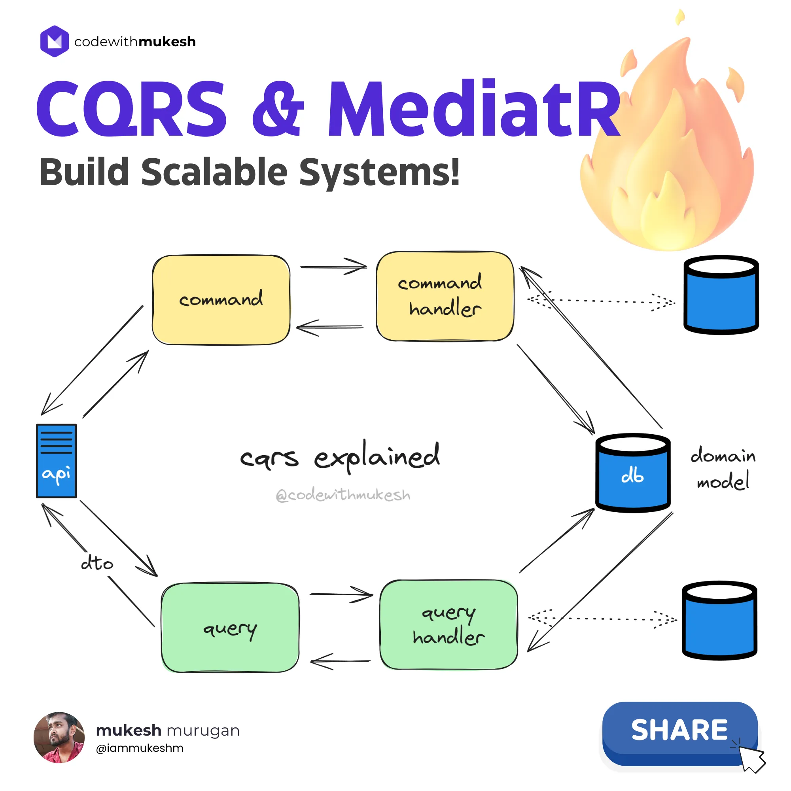
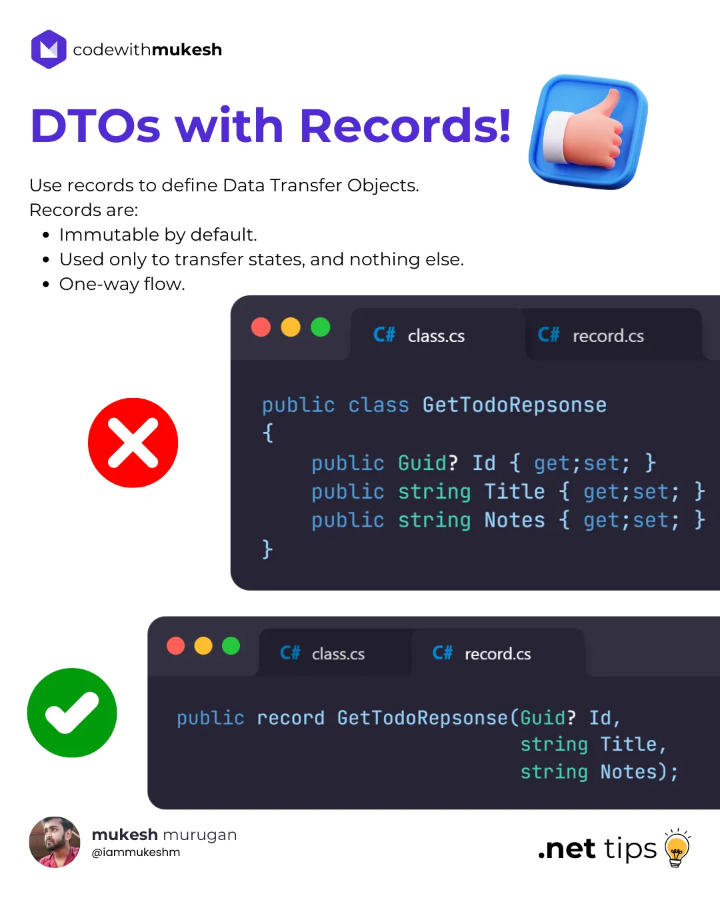
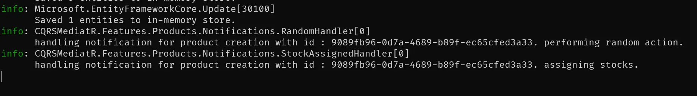

# ASP.NET Core 中的 CQRS 和 MediatR - 构建可扩展系统 - codewithmukesh

> ## 摘录
>
> CQRS，即命令查询责任分离，可以帮助您轻松构建超级清洁和可扩展的系统。在本文中，我们将探索这种模式，并在ASP.NET Core中使用 MediatR 包来实现 CQRS 模式，并构建一个简单而干净的 .NET CRUD 应用程序！我们还将研究 MediatR 通知的工作方式。
>
> 原文 [CQRS and MediatR in ASP.NET Core - Building Scalable Systems](https://codewithmukesh.com/blog/cqrs-and-mediatr-in-aspnet-core/)

---

CQRS，即命令查询责任分离，可以帮助您轻松构建超级清洁和可扩展的系统。在本文中，我们将探索这种模式，并在ASP.NET Core中使用 MediatR 包来实现 CQRS 模式，并构建一个简单而干净的 .NET CRUD 应用程序！

在本文中，我们将使用 CQRS 模式和 MediatR 库构建具有 CRUD 功能的 ASP.NET Core 8 Web API。在众多设计模式中，CQRS 是最常用的模式之一，可以帮助架构解决方案遵循干净架构原则。我将很快发表关于干净架构的更新文章，这是组织 .NET 解决方案的最干净方式。让我们开始吧！

## 什么是 CQRS？

CQRS 代表命令查询责任分离。它是一种软件架构模式，将系统的读写操作分离成两个不同的部分。在 CQRS 架构中，写操作（命令）和读操作（查询）分开处理，使用为每种操作优化的不同模型。这种分离可以带来更简单和更可扩展的架构，特别是在读写模式差异显著的复杂系统中。

这种模式源于贝特朗·迈耶提出的命令与查询分离原则。其定义如下：

> 它声明每个方法应该是一个命令执行操作或返回调用者数据的查询，但不能两者兼做。换句话说，提出问题不应该改变答案。更正式一点，如果方法是引用透明的并且因此没有副作用的，那么它应该返回值。
>
> — 维基百科

传统的架构模式通常使用相同的数据模型或 DTO（数据传输对象）来查询和写入数据源。虽然这种方法对于基本的 CRUD（创建、读取、更新、删除）操作非常有效，但在面对更复杂的需求时可能会受限。随着应用程序的发展和需求的增加，这种简单的方法可能不再足以处理系统的复杂性。

在实际应用中，用于读取和写入数据的数据结构之间通常存在差异。例如，更新数据时可能需要额外的属性，这些属性对于读取是不必要的。这种差异可能导致并行操作期间的数据丢失。因此，开发者可能会发现自己被迫在应用程序的生命周期内使用单一的数据传输对象（DTO），除非他们引入另一个 DTO，这可能会破坏现有的应用架构。

CQRS的想法是使应用程序能够使用不同的模型来处理不同的目的。从本质上，您有一个用于更新记录的模型，另一个用于插入记录的模型，还有一个用于查询记录的模型。这种方法在处理多样和复杂场景方面提供了灵活性。使用 CQRS，你不必限制在所有 CRUD 操作中使用单一的 DTO，这允许更有针对性和高效地数据处理。

下图表示了 CQRS 模式的图解表示。



例如，在 CRUD 应用程序中，我们可以将 API 操作分为两组，

- 命令
  - 写
  - 更新
  - 删除
- 查询
  - 获取
  - 列表

比方说，来了一个 CREATE 操作。它会触发用来处理 `create` 命令的处理程序。此处理程序将包含写入数据源的持久性逻辑，并将返回创建的实体 ID。传入的命令将被转换为所需的域模型，并写入数据库。

在进行查询时，查询处理程序将启动。从数据库返回的实体模型将投影到 DTO（或不同的设计模型）上，并返回给客户端。在某些属性不应该暴露给消费者的情况下，这是非常有效的方法。

使用此模式，您还可以写入不同的数据库，并从不同的数据库读取（如果需要）。但在我们的案例中，我们将保持简单，只依赖一个简单的内存数据库进行演示。

这样，我们在逻辑上分离了从数据源写入和读取的工作流。

## CQRS 的优点

使用 CQRS 模式为您的应用程序带来了不少优势。其中一些如下。

### 简化的数据传输对象

通过为每种操作使用不同的模型，CQRS 模式简化了您应用程序的数据模型，增强了灵活性并降低了复杂性。

### 可扩展性

通过分离读写操作，CQRS 使得更容易扩展。您可以独立地扩展应用程序的读写两侧，以有效地处理不同的负载。

### 性能提升

由于读操作通常超过写操作，CQRS 允许您通过实现像 Redis 或 MongoDB 这样的缓存机制来优化读取性能。这种模式天然支持这种优化，使得提升整体性能变得更容易。

### 提高并发和并行性

通过为每种操作分配专用模型，CQRS 确保并行操作是安全的，并且维护了数据完整性。在需要同时执行多个操作的场景中，这一点特别有利。

### 增强的安全性

通过分离读写操作的方法，CQRS 有助于保护数据访问。通过定义读写操作之间的清晰界限，您可以实现更细粒度的访问控制机制，从而提高整体应用程序的安全性。

## CQRS 的缺点

### 增加的复杂性和代码量

实现 CQRS 模式通常会大大增加所需的代码量。这种复杂性来自于管理读写操作的独立模型和处理程序的需要，这可能难以维护和调试。

但是，鉴于这种模式的优势，额外的代码复杂性可以得到合理化。通过分离读写操作，CQRS 使开发者能够独立地优化每一侧，从长远来看，导致更高效和可维护的系统。

让我们构建一个 ASP.NET Core 8 Web API 来展示实现并更好地理解 CQRS 模式。我会将实现的解决方案推送到 GitHub 上，添加到我们的 [.NET 8 系列仓库](https://github.com/codewithmukesh/dotnet-zero-to-hero)。如果您喜欢这个仓库，请给它一个星星。

我们将拥有一些用于 Product 实体的 Minimal API 端点，即从数据库创建/删除/更新/删除产品记录。在这里，我使用 Entity Framework Core 作为 ORM 访问数据。在本演示中，我们不会连接到实际的数据库，而是使用我们应用程序的内存数据库。

PS - 我们不会使用任何高级架构模式，但让我们尝试保持代码干净。我使用的 IDE 是 Visual Studio 2022 社区版。

### 设置项目

打开 Visual Studio 并创建一个新的 ASP.NET Core Web API 项目。

### 安装所需的包

通过包管理器控制台将以下包安装到您的 API 项目中。

```bash
Install-Package Microsoft.EntityFrameworkCore
Install-Package Microsoft.EntityFrameworkCore.InMemory
Install-Package MediatR
```

### 解决方案结构

我们不打算为了演示干净架构而创建单独的程序集，但我们将在同一程序集中以干净的方式组织我们的代码。CRUD 操作将通过文件夹分隔。这种方法几乎是最小的垂直切片架构。

### 领域

首先，让我们创建领域模型。添加一个名为 `Domain` 的新文件夹，并创建一个名为 `Product` 的 C# 类。

```csharp
public class Product
{
    public Guid Id { get; set; }
    public string Name { get; set; } = default!;
    public string Description { get; set; } = default!;
    public decimal Price { get; set; }

    // 用于 EF Core 的无参构造函数
    private Product() { }
    public Product(string name, string description, decimal price)
    {
        Id = Guid.NewGuid();
        Name = name;
        Description = description;
        Price = price;
    }
}
```

我们不会让这个领域模型过于复杂。它是一个简单的实体，具有带有名称、描述和价格的参数化构造函数。

### EFCore DBContext

转到数据部分，如前所述，我们将使用 EFCore 和内存数据库。由于我们已经安装了所需的包，让我们创建我们的 `DBContext`，以便我们可以与数据源进行交互。我们还将处理应用程序启动时向内存数据库插入一些种子数据。

创建一个名为 `Persistence` 的新文件夹，并添加一个名为 `AppDbContext` 的新类。

```csharp
public class AppDbContext : DbContext
{
    public AppDbContext(DbContextOptions<AppDbContext> options) : base(options)
    {
        Database.EnsureCreated();
    }
    public DbSet<Product> Products { get; set; }
    protected override void OnModelCreating(ModelBuilder modelBuilder)
    {
        modelBuilder.Entity<Product>().HasKey(p => p.Id);
        modelBuilder.Entity<Product>().HasData(
            new Product("iPhone 15 Pro", "Apple's latest flagship smartphone with a ProMotion display and improved cameras", 999.99m),
            new Product("Dell XPS 15", "Dell's high-performance laptop with a 4K InfinityEdge display", 1899.99m),
            new Product("Sony WH-1000XM4", "Sony's top-of-the-line wireless noise-canceling headphones", 349.99m)
        );
    }
    protected override void OnConfiguring(DbContextOptionsBuilder optionsBuilder)
    {
        optionsBuilder.UseInMemoryDatabase("codewithmukesh");
    }
}
```

在 `DbContext` 的构造函数中，我们将确保数据库已创建。这是必需的，因为它还有助于插入我们在 `OnModelCreating` 函数中定义的示例数据。

在 `OnModelCreating` 函数中，我们指定 Product 表的主键，即 ID。我们还使用 `HasData` 扩展为 Product 实体添加种子数据。

接下来，在 `OnConfiguring` 部分中，我们指定将使用哪种类型的数据库。在我们的案例中，我们将使用前面提到的内存数据库。

### 注册 Entity Framework Core 数据库 Context

让我们将 `DBContext` 注册到 DI 容器中。打开 `Program.cs` 并添加以下内容。

```
builder.Services.AddDbContext<AppDbContext>();
```

### 中介者模式

在 ASP.NET Core 应用程序中，控制器 / Minimal API 端点理想情况下应专注于处理传入请求，将它们路由到适当的服务或业务逻辑组件，并返回响应。保持控制器精简并专注有助于维护干净且易于理解的代码库。

将复杂的业务逻辑、数据验证和其他重载工作卸载到单独的服务类或库中是一个好做法。这种关注点分离提高了应用程序的可维护性、可测试性和可扩展性。

通过遵循这种方法，您还可以遵循单一责任原则 (SRP)，保持控制器的干净、专注和易于维护。

中介者模式在减少应用程序组件之间的耦合中起着至关重要的作用，通过一个中介者对象促进间接通信。这种模式通过集中通信逻辑，促进更有组织和可管理的代码库。

在 CQRS（命令查询责任分离）的背景下，中介者模式尤其有用。CQRS 将应用程序的读写操作分离，中介者模式可以通过充当命令（写）和查询（读）侧之间的桥梁来帮助协调这些操作。

通过将中介者与 CQRS 结合使用，您可以实现更清晰的架构，其中命令与查询分开处理，从而导致更可维护和可扩展的系统。

### MediatR 库

MediatR 是一个流行的库，帮助在 .NET 中无依赖地实现中介者模式。它是一个进程内消息系统，支持请求/响应、命令、查询、通知和事件。

> 每当我开始一个新的 .NET 项目时，MediatR 都是我的首选库！它是一个神奇的工具，简化了我应用程序中中介者模式的实现。MediatR 帮助我保持代码库的清晰和有组织，通过集中请求处理，促进了更松散耦合的架构。

### 注册 MediatR

由于我们已经将所需的包安装到我们的应用程序中，让我们将 MediatR 处理程序注册到应用程序的 DI 容器中。打开 `Program.cs` 文件。

```csharp
builder.Services.AddMediatR(cfg => cfg.RegisterServicesFromAssembly(Assembly.GetExecutingAssembly()));
```

这将注册当前程序集中可用的所有 MediatR 处理程序。当您将项目扩展到拥有多个程序集时，您将不得不提供您放置处理程序的程序集。在干净架构解决方案中，这些处理程序理想地位于应用程序层。

### 实现 CRUD 操作

CRUD 本质上代表创建(Create)、读取(Read)、更新(Update)和删除(Delete)。这些是 RESTful APIs 的核心组件。让我们看看如何使用我们的 CQRS 方法实现它们。在项目的根目录中创建一个名为 `Features/Products` 的文件夹，并为 `Queries`、`DTOs` 和 `Commands` 创建子文件夹。


这些文件夹将容纳所需的类和服务。

### 功能文件夹：垂直切片架构

这是 VSA（垂直切片架构）的又一个最小化示例，我们将按文件夹组织我们的功能。即，与产品创建相关的一切都将属于 `Features/Product/Commands/Create` 文件夹，以此类推。这种方法使得查找和维护与特定功能相关的代码变得更加容易，因为所有相关的功能都被分组。这可以在更大的项目中提高代码组织、可读性和可维护性。

稍后，我将撰写一篇结合 VSA、干净架构和模块化单体架构的文章。如果你希望尽快看到这篇文章，请在评论区让我知道！

### DTO

我们的查询 API，`Get` 和 `List` 将返回与以下 DTO 相关的记录。在 `Features/Product/DTOs` 下，创建一个名为 `ProductDto` 的新类。

```csharp
public record ProductDto(Guid Id, string Name, string Description, decimal Price);
```

> 快速提示：建议使用 records 来定义数据传输对象，因为它们默认是不可变的！



## 查询

首先，让我们专注于构建我们的查询和查询处理程序。如上所述，这里会有两部分，即 `Get` 和 `List` 端点。`Get` 端点将接受一个特定的 GUID 并返回预期的产品 Dto 对象，而 `List` 操作将返回产品 Dto 对象的列表。

### 列出所有产品

在 `Features/Product/Queries/List/` 文件夹下，创建两个名为 `ListProductsQuery` 和 `ListProductsQueryHandler` 的类。

```csharp
public record ListProductsQuery : IRequest<List<ProductDto>>;
```

每个查询/命令对象都将继承 MediatR 库的 `IRequest<T>` 接口，其中 T 是要返回的对象。在这种情况下，我们将返回 `List<ProductDto>`。

接下来，我们需要为我们的查询提供处理程序。这就是 `ListProductsQueryHandler` 发挥作用的地方。请注意，每当我们的 LIST 端点被触发时，这个处理程序就会被触发。

```csharp
public class ListProductsQueryHandler(AppDbContext context) : IRequestHandler<ListProductsQuery, List<ProductDto>>
{
    public async Task<List<ProductDto>> Handle(ListProductsQuery request, CancellationToken cancellationToken)
    {
        return await context.Products
            .Select(p => new ProductDto(p.Id, p.Name, p.Description, p.Price))
            .ToListAsync();
    }
}
```

我们将向此处理程序的主构造器注入 AppDbContext 实例，以便访问数据。同样，所有的处理程序将实现 `IRequestHandler<T, R>` 接口，其中 T 是传入的请求（在我们的案例中将是查询本身），R 则是响应，即产品列表。

这个接口要求我们实现 `Handle` 方法。我们只需使用 DB 上下文将产品域投影到带有 ID、名称、描述和价格的 DTO 列表中。这个列表将被返回。

> 一旦我们创建了所有的处理程序，我们将编写最小端点。

### 按 ID 获取产品

在 `Features/Product/Queries/Get/` 文件夹下，创建两个名为 `GetProductQuery` 和 `GetProductQueryHandler` 的类。

```csharp
public record GetProductQuery(Guid Id) : IRequest<ProductDto>;
```

这条记录查询将有一个 GUID 参数，由客户端传递。这个 ID 将用于在数据库中查询产品。

```csharp
public class GetProductQueryHandler(AppDbContext context)
    : IRequestHandler<GetProductQuery, ProductDto?>
{
    public async Task<ProductDto?> Handle(GetProductQuery request, CancellationToken cancellationToken)
    {
        var product = await context.Products.FindAsync(request.Id);
        if (product == null)
        {
            return null;
        }
        return new ProductDto(product.Id, product.Name, product.Description, product.Price);
    }
}
```

在 Handle 方法中，我们将使用 ID 从数据库中获取产品。如果结果为空，则返回 null，表明找不到结果。否则，我们将产品数据投影到 `ProductDto` 对象并返回。

## 命令

现在我们的查询和查询处理程序都已就位，接下来我们来构建我们的命令。

### 创建新产品

同样，在 `Features/Product/Commands/Create/` 文件夹下，创建以下两个文件。

```csharp
public record CreateProductCommand(string Name, string Description, decimal Price) : IRequest<Guid>;
```

首先是命令本身，它接受名称、描述和价格。请注意，这个命令对象预期将返回新创建的产品的 ID。

```csharp
public class CreateProductCommandHandler(AppDbContext context) : IRequestHandler<CreateProductCommand, Guid>
{
    public async Task<Guid> Handle(CreateProductCommand command, CancellationToken cancellationToken)
    {
        var product = new Product(command.Name, command.Description, command.Price);
        await context.Products.AddAsync(product);
        await context.SaveChangesAsync();
        return product.Id;
    }
}
```

接下来，处理程序简单地从传入的命令创建一个产品域模型，并将其持久化到数据库中。最后，它将返回新创建的产品的 ID。请注意，GUID 生成是作为域对象构造器的一部分处理的。

### 按 ID 删除产品

接下来，我们将有一个通过指定 ID 删除产品的功能。为此，在 `Features/Product/Command/Delete/` 下创建以下类。

```csharp
public record DeleteProductCommand(Guid Id) : IRequest;
```

删除处理程序将接收 ID，从数据库中获取记录并尝试移除它。如果未找到具有提及 ID 的产品，则简单地退出处理程序代码。

```csharp
public class DeleteProductCommandHandler(AppDbContext context) : IRequestHandler<DeleteProductCommand>
{
    public async Task Handle(DeleteProductCommand request, CancellationToken cancellationToken)
    {
        var product = await context.Products.FindAsync(request.Id);
        if (product == null) return;
        context.Products.Remove(product);
        await context.SaveChangesAsync();
    }
}
```

### 更新产品

我将留给您实现这一部分。这将是您练习的理想选择。简单地 fork 仓库，并添加更新命令及其处理程序。您还将需要为更新产品详细信息添加 API 端点。有关端点，请参考下一节。

### 最小 API 端点

现在我们有了所有必要的命令/查询和处理程序，让我们将它们与实际的 API 端点连接起来。在此演示中，我们将使用最小 API 端点。您也可以使用传统的控制器方法。

打开 `Program.cs` 并添加以下端点映射。

```csharp
app.MapGet("/products/{id:guid}", async (Guid id, ISender mediatr) =>
{
    var product = await mediatr.Send(new GetProductQuery(id));
    if (product == null) return Results.NotFound();
    return Results.Ok(product);
});

app.MapGet("/products", async (ISender mediatr) =>
{
    var products = await mediatr.Send(new ListProductsQuery());
    return Results.Ok(products);
});

app.MapPost("/products", async (CreateProductCommand command, ISender mediatr) =>
{
    var productId = await mediatr.Send(command);
    if (Guid.Empty == productId) return Results.BadRequest();
    return Results.Created($"/products/{productId}", new { id = productId });
});

app.MapDelete("/products/{id:guid}", async (Guid id, ISender mediatr) =>
{
    await mediatr.Send(new DeleteProductCommand(id));
    return Results.NoContent();
});
```

需要注意的重要一点是，我们将使用 MediatR 中的 `ISender` 接口发送命令/查询到其注册的处理程序。另外，您也可以使用 `IMediator` 接口，但 `ISender` 接口更加轻量级，您并不总是需要功能齐全的 `IMediator` 接口。如果我的服务/端点想要执行超过简单请求-响应消息的操作，如通知等，我会使用 `IMediator` 接口。

正如你从上面的代码中看到的，我们已经添加了所有必要的端点。让我们一一探索它们。

1. 首先是 Get 端点，在 `/products/{id}`，其中 `id` 参数是一个 GUID。我们创建一个带有此 ID 的查询对象并通过 MediatR 管道传递它。如果结果为空，我们返回一个 404 未找到状态给 API 使用者。否则返回有效的产品。
2. 接下来是 List 端点，在 `/products/`。这里没有参数涉及，但是你可以通过引入参数，如页面大小、数量等，来构建这个 API，以便于分页、排序和搜索。（这将在另一篇文章中详细解释）。但在这个场景中，我们将返回数据库中可用的所有产品。
3. POST 端点负责创建新产品。它接受 `CreateCommand`，通过 MediatR 管道传递给处理程序。如果返回的产品 ID 为空，则返回一个错误请求。否则，返回 201 创建响应。
4. 最后，删除端点也需要一个 ID，它将被发送到 `DeleteCommandHandler`。在这里，我们不会返回删除状态，只是简单地返回一个 `NoContent` 响应。

另外，随意在这里添加您的更新端点。

## 通过 Swagger 测试端点

我们已经完成了实现。现在让我们使用 Swagger 来测试它！构建并运行您的 ASP.NET Core 应用程序，并打开 Swagger UI。


让我们测试我们的每一个端点。首先是 LIST 端点。这可以测试以验证我们是否拥有预期的初始种子数据。

```json
[
  {
    "id": "c2537bef-235d-4a72-9aaf-f5cf1ff2d080",
    "name": "iPhone 15 Pro",
    "description": "苹果最新的旗舰智能手机，配备 ProMotion 显示屏和改进的相机",
    "price": 999.99
  },
  {
    "id": "93cfebdb-b3fb-415d-9aba-024cad28df5c",
    "name": "Dell XPS 15",
    "description": "戴尔的高性能笔记本电脑，配备 4K InfinityEdge 显示屏",
    "price": 1899.99
  },
  {
    "id": "2fde15c1-48cb-4154-b055-0a96048fa392",
    "name": "Sony WH-1000XM4",
    "description": "索尼的顶级无线降噪耳机",
    "price": 349.99
  }
]
```

接下来，让我创建一个新产品。这是产品负载。

```json
{
  "name": "Tesla Model Y",
  "description": "特斯拉 Model Y",
  "price": 45000
}
```

这里是响应。

```json
{
  "id": "4eb60a75-1dfa-401d-8f65-c4750457d19d"
}
```

让我们使用这个产品 ID 来测试 `按 ID 获取` 端点。

```json
{
  "id": "4eb60a75-1dfa-401d-8f65-c4750457d19d",
  "name": "Tesla Model Y",
  "description": "特斯拉 Model Y",
  "price": 45000
}
```

正如你所看到的，我们得到了预期的响应。同样，您也可以测试 DELETE 端点以及您新添加的 UPDATE 端点！

现在，我们将探索 MediatR 库的一些更重要的功能。

到目前为止，我们已经研究了 MediatR 的请求-响应模式，它涉及每个请求一个处理程序。但是，如果您的请求需要多个处理程序怎么办？例如，每次您创建新产品时，您需要一个逻辑来添加/设置库存，以及另一个处理程序来执行随机 X 动作。要构建一个稳定/可靠的系统，您需要确保这些处理程序是解耦的并且分别执行。

这就是通知发挥作用的地方。每当您需要多个处理程序对事件做出反应时，通知是您的最佳选择！

我们将修改我们现有的代码来演示这一点。如上所述，我们将在我们的 `CreateProductCommandHandler` 中添加一个发布通知的功能，并注册两个针对新通知的其他处理程序。

首先，创建一个名为 `Notifications` 的新文件夹，并添加以下记录。

```csharp
public record ProductCreatedNotification(Guid Id) : INotification;
```

请注意，这条记录将继承于 MediatR 库的 `INotification`。

如上所述，我们将创建两个处理程序，它们将订阅这个通知。在同一个文件夹下，添加这些文件。

```csharp
public class StockAssignedHandler(ILogger<StockAssignedHandler> logger) : INotificationHandler<ProductCreatedNotification>
{
    public Task Handle(ProductCreatedNotification notification, CancellationToken cancellationToken)
    {
        logger.LogInformation($"处理产品创建的通知，id为：{notification.Id}。分配库存。");
        return Task.CompletedTask;
    }
}
```

```csharp
public class RandomHandler(ILogger<RandomHandler> logger) : INotificationHandler<ProductCreatedNotification>
{
    public Task Handle(ProductCreatedNotification notification, CancellationToken cancellationToken)
    {
        logger.LogInformation($"处理产品创建的通知，id为：{notification.Id}。执行随机操作。");
        return Task.CompletedTask;
    }
}
```

我不打算深入每个处理程序的功能。出于演示目的，我只是添加了简单的日志信息，标明处理程序被触发。所以，想法是，每当一个新产品被创建时，一个通知将被跨域发送，这将触发我们的 `StockAssignedHandler` 和 `RandomHandler`。

为了发布通知，我将按如下方式修改我们的 POST 端点代码。

```csharp
app.MapPost("/products", async (CreateProductCommand command, IMediator mediatr) =>
{
    var productId = await mediatr.Send(command);
    if (Guid.Empty == productId) return Results.BadRequest();
    await mediatr.Publish(new ProductCreatedNotification(productId));
    return Results.Created($"/products/{productId}", new { id = productId });
});
```

在第 5 行，我们将使用 MediatR 接口创建一个类型为 `ProductCreatedNotification` 的新通知并在内存中发布它。这将依次触发针对此通知注册的处理程序。让我们看看它的作用。

如果您运行 API 并创建一个新产品，您将能够在服务器上看到以下日志消息。



如您所见，这两个处理程序都是并行触发的。这在构建解耦的基于事件的系统时非常重要。

这就是本文的全部内容。我希望您非常喜欢这些内容！

在下一篇文章中，我们将讨论 MediatR 中的管道行为，并结合 FluentValidation、IExceptionHandler 和 CQRS 来构建一个耐用的系统##

## 摘要

我们探讨了CQRS实现及其定义、中介者模式和MediatR库。我们还覆盖了Entity Framework Core的实现、垂直切片架构等内容。此外，我们还讨论了MediatR中的请求/响应模式以及通知。如果有我漏掉的东西，或者指南的任何部分不清楚，请在下面的评论中告诉我。

CQRS是您处理复杂系统的首选方法吗？分享您的想法！

## 常见问题

### CQRS代表什么？

CQRS代表命令查询责任分离。这是一种设计模式，将应用程序中的读写操作分开。

### 实现CQRS会使应用程序变慢吗？

不，实现CQRS本身不会使应用程序变慢。虽然它可能需要更多的代码，但如果正确实现，可以通过优化数据源调用来提高性能。

### CQRS是一个可扩展的设计模式吗？

是的，CQRS设计时考虑了可扩展性，使其成为需要高效扩展的应用程序的合适选择。
