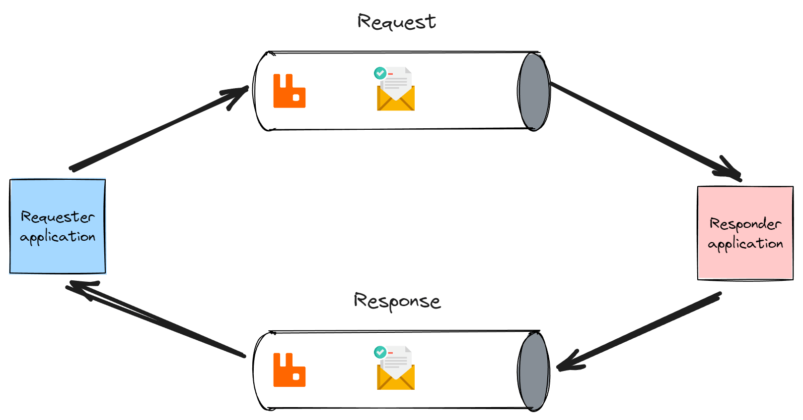

# 使用 MassTransit 的请求-响应消息模式

> ## 摘要
>
> 在使用 .NET 构建分布式系统时，服务间的直接调用会创建紧耦合。请求-响应消息模式可以让分布式服务以松耦合的方式通信。
>
> 原文 [Request-Response Messaging Pattern With MassTransit](https://www.milanjovanovic.tech/blog/request-response-messaging-pattern-with-masstransit?utm_source=Twitter&utm_medium=social&utm_campaign=13.05.2024) 由 [Milan Jovanović](https://www.milanjovanovic.tech) 撰写。

---

一开始，构建分布式应用可能看起来很简单。只是服务器相互通信而已。对吗？

然而，这会引入一系列你必须考虑的潜在问题。如果网络瞬间中断怎么办？一个服务意外崩溃呢？你尝试扩展，但一切在负载下崩溃了呢？这时，你的分布式系统的通信方式就变得至关重要。

传统的同步通信，其中服务直接相互调用，本质上是脆弱的。它创建了紧耦合，使你的整个应用容易受到单点故障的影响。

为了解决这个问题，我们可以转向分布式消息传递（引入一整套不同的问题，但那是另一个话题）。

在 .NET 世界中，实现这一目标的一个强大工具是 MassTransit。

在本周的问题中，我们将探索 MassTransit 对请求-响应模式的实现。

## 请求-响应消息模式简介

让我们首先解释请求-响应消息模式是如何工作的。

请求-响应模式就像是通过网络进行的传统函数调用。一个服务，请求者，发送一个请求消息并等待相应的响应消息。这是请求者一侧的[**同步通信方法**](https://www.milanjovanovic.tech/blog/modular-monolith-communication-patterns)。

好处有：

- **松耦合**：服务不需要彼此直接了解，只需要知道消息合约。这使得变更和扩展变得更容易。
- **位置透明**：请求者不需要知道响应者的位置，从而提高了灵活性。

坏处有：

- **延迟**：消息处理增加了额外的延迟。
- **复杂性**：引入消息系统和管理额外的基础设施可能会增加项目的复杂性。



## 使用 MassTransit 的请求-响应消息

[**MassTransit**](https://www.milanjovanovic.tech/blog/using-masstransit-with-rabbitmq-and-azure-service-bus) 开箱即支持 [request-response](https://masstransit.io/documentation/concepts/requests) 消息模式。我们可以使用**请求客户端**发送请求并等待响应。请求客户端是异步的，支持 `await` 关键字。请求默认还会有30秒的超时时间，以防止过长时间等待响应。

想象一个场景，你有一个需要获取订单最新状态的订单处理系统。我们可以从订单管理服务获取状态。使用 MassTransit，您将创建一个请求客户端来启动过程。这个客户端会发送一个 `GetOrderStatusRequest` 消息到总线上。

```csharp
public record GetOrderStatusRequest
{
    public string OrderId { get; init; }
}
```

在订单管理这一侧，一个响应者（或消费者）将监听 `GetOrderStatusRequest` 消息。它接收请求，可能查询数据库以获取状态，然后将 `GetOrderStatusResponse` 消息发送回总线。原始请求客户端将等待此响应并相应地处理。

```csharp
public class GetOrderStatusRequestConsumer : IConsumer<GetOrderStatusRequest>
{
    public async Task Consume(ConsumeContext<GetOrderStatusRequest> context)
    {
        // 从数据库获取订单状态。

        await context.ResponseAsync<GetOrderStatusResponse>(new
        {
            // 设置相应的响应属性。
        });
    }
}
```

## 在模块化单体中获取用户权限

这是一个实际场景，我的团队决定实现这个模式。我们在构建一个[**模块化单体**](https://www.milanjovanovic.tech/modular-monolith-architecture)，其中一个模块负责管理用户权限。其他模块可以调用用户模块以获取用户的权限。这在我们仍处于单体系统中时效果很好。

然而，有一刻我们需要将一个模块提取到一个单独的服务中。这意味着使用简单的方法调用与用户模块的通信将不再工作。

幸运的是，我们已经在系统内部使用 MassTransit 和 RabbitMQ 进行消息传递。

因此，我们决定使用 MassTransit 的请求-响应功能来实现这一点。

新服务将注入一个 `IRequestClient<GetUserPermissions>`。我们可以使用它发送一个 `GetUserPermissions` 消息并等待响应。

MassTransit 的一个非常强大的功能是你可以等待不止一条响应消息。在这个例子中，我们正在等待一个 `PermissionsResponse` 或一个 `Error` 响应。这很棒，因为我们还有一种处理消费者失败的方式。

```csharp
internal sealed class PermissionService(
    IRequestClient<GetUserPermissions> client)
    : IPermissionService
{
    public async Task<Result<PermissionsResponse>> GetUserPermissionsAsync(
        string identityId)
    {
        Response<PermissionsResponse, Error> response =
            await client.GetResponse<PermissionsResponse, Error>(request);

        if (response.Is(out Response<Error> errorResponse))
        {
            return Result.Failure<PermissionsResponse>(errorResponse.Message);
        }

        if (response.Is(out Response<PermissionsResponse> permissionResponse))
        {
            return permissionResponse.Message;
        }

        return Result.Failure<PermissionsResponse>(NotFound);
    }
}
```

在用户模块中，我们可以轻松实现 `GetUserPermissionsConsumer`。如果找到权限，它将以 `PermissionsResponse` 响应，如果失败，则以 `Error` 响应。

```csharp
public sealed class GetUserPermissionsConsumer(
    IPermissionService permissionService)
    : IConsumer<GetUserPermissions>
{
    public async Task Consume(ConsumeContext<GetUserPermissions> context)
    {
        Result<PermissionsResponse> result =
            await permissionService.GetUserPermissionsAsync(
                context.Message.IdentityId);

        if (result.IsSuccess)
        {
            await context.RespondAsync(result.Value);
        }
        else
        {
            await context.RespondAsync(result.Error);
        }
    }
}
```

## 结束语

通过拥抱 MassTransit 的消息模式，你正在更加坚固的基础上建立起来。你的 .NET 服务现在更加松耦合，给你带来了独立发展它们的灵活性，以及应对那些不可避免的网络故障或服务中断的能力。

[请求-响应模式](https://youtu.be/NjsoykEOkrk) 是你消息库中的一个强大工具。MassTransit 使其实现变得非常容易，确保请求和响应能够可靠地被送达。

我们可以使用请求-响应来实现[**模块化单体**](https://www.milanjovanovic.tech/modular-monolith-architecture)中模块间的通信。然而，不要过分使用，否则你的系统可能会因增加的延迟而受到影响。

从小处开始，进行实验，看看消息传递的可靠性和灵活性如何能够转变你的开发体验。
