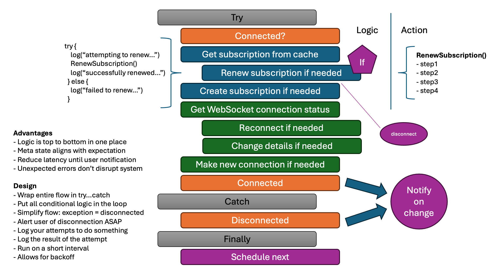

# 简化状态管理 - ISE 开发者博客

> ## 摘录
>
> 本文提倡将复杂的状态网络简化为与用户期望相关的简单状态。
>
> 原文 [Simplified State Management - ISE Developer Blog](https://devblogs.microsoft.com/ise/simplified-state-management/)

---

2024年5月17日

## 简化连接状态管理

本文介绍了一种架构模式，通过将多个复杂状态汇总为单一状态，大大降低了复杂性和错误，更准确地反映了终端用户的体验。

## 问题

我们的团队正在开发一个用React编写的接口。该应用程序需要连接到Microsoft Graph API创建订阅，然后使用该订阅的信息连接到SignalR端点接收与订阅相关的消息。听起来足够简单，但我们继承的代码分别管理这些连接（不同的超时策略、重试策略、退避策略，两者之间的状态未协调等）。我们发现，这个看似简单的过程是大多数错误的来源。

如果我们深入分析，就能看出为什么它复杂：

- 订阅只在短时间内有效。如果续订失败会发生什么？
- 如果SignalR连接失败但仍有有效订阅会怎样？
- 如果用户连续几秒钟、几分钟或几小时失去连接会怎样？
  - 这对SignalR连接有什么影响？
  - 如果断开连接的时间足够长以至于订阅已过期会怎样？
- 如果用户去吃午饭并且他们的电脑进入睡眠模式会发生什么？
- 如果一个用户登出而另一个用户登录会如何？
- 由于不同的退避策略，用户需要等待恢复连接的时间最长。

当这些连接各自独立管理时，需要考虑很多边界情况。代码中需要大量逻辑来检查不同状态并决定该做什么。代码复杂度也可能相当高。这就是意外行为的配方。

## 解决方案

如果我们从用户的角度考虑，他们只需要知道他们是“已连接”（拥有接收消息所需的一切）还是“未连接”（一个或多个条件阻止用户接收消息）。这是一个简化问题，使其更易于理解和编写代码。

Graph API和SignalR连接都有自己的SDK，以及各自的超时、重试和退避策略。我们移除了这些策略，而是将所有代码放入一个频繁运行的连接循环中，以检查连接状态并在必要时采取行动恢复连接。客户端进入循环时处于连接或断开状态，并以连接或断开状态（如上所述）退出循环。如果状态发生变化，客户端会引发或删除“连接错误”条件。

[

## 优点

- **简化**：我们将所有逻辑移至一个可以从上到下阅读的单一函数中。对于开发人员来说，确定执行该函数时会发生什么变得非常容易。例如，决定我们是否需要续订订阅的逻辑在这个函数中，即使实际续订订阅的代码位于不同的地方。
- **通知**：与多个代码块竞争通知用户问题或问题的纠正不同，我们现在在代码中有一个地方知道用户是已连接（一切正常）还是已断开（某些东西不工作）。
- **减少延迟**：只要满足导致用户断开连接的任何条件，状态立即更改为断开。这很重要，因为超时和重试可能需要很长时间才能完成。如果用户已断开连接，我们希望尽快让他们知道不应该期待消息。
- **可靠性**：我们在函数中的所有代码周围放置了try…catch。如果发生任何意外条件，我们可以捕获它们，提醒用户系统未按预期工作，并在下一个循环中再次尝试。当与连接相关的代码分散在应用程序中时，经常会有未捕获的问题。

## 设计考虑因素

在设计类似于此的状态管理解决方案时，请考虑以下因素...

- **连续性**：确保您的循环在除了您通过包装一切在try…catch中并关闭应用程序的致命错误外的所有情况下继续运行。您不希望因为代码中的错误而失去管理状态的能力。
- **集中管理**：您希望确保所有条件逻辑都在这一个函数中。这使得推理变得简单，也易于测试。如果检测条件的逻辑过于复杂，您可以考虑将其分解为仍然允许您具有条件逻辑的小函数。例如，`userIsLoggedIn() and subscriptionExists() and subscriptionExpired()` 仍然让开发人员确切知道您是如何决定运行这块代码的，而不占用太多空间来检测这些条件。
- **简化**：您希望确保函数的流程尽可能简单。您希望能够从上到下阅读函数并理解发生了什么。例如，我们编写的函数知道如果没有错误则客户端处于连接状态，如果有任何错误被抛出则处于断开状态（见上图）。与其依赖大量的分支逻辑，不如简单地依赖失败条件引发错误。
- **快速失败**：您希望尽早通知用户他们处于失败状态。您不希望等待超时或重试完成后才通知用户。通常，超时和重试可能需要几分钟才能解决，而用户将误认为他们仍在运行状态。
- **记录一切**：此架构模式的主要目的是提高应用程序的可靠性。为此，您希望记录*每一次*尝试做某事（例如`log("attempting to renew subscription...")`）和每个结果（例如`log("subscription renewed successfully.")` 或 `log("subscription failed to renew.")`）。这将帮助您在发生问题时诊断问题。
- **频繁运行**：您希望快速地通知用户任何变化。我们使用了3秒。如果检测您的状态是耗时的，您可能会考虑将检测作为一个独立的过程，然后状态管理循环只是使用这些检测来确定复合状态。
- **退避**：您必须平衡快速通知用户状态变化的需求与不要过载您的系统的要求。如果您长时间保持在失败状态，您可能会考虑安排循环以越来越长的时间间隔运行（例如，3秒、10秒、30秒、1分钟、5分钟等）。

## 总结

这种架构模式对我们非常成功。它大大减少了我们代码的复杂性和我们拥有的错误数量。它提高了透明度（易于阅读的日志）并使得推理代码变得更容易。我们希望你也发现它很有用。
