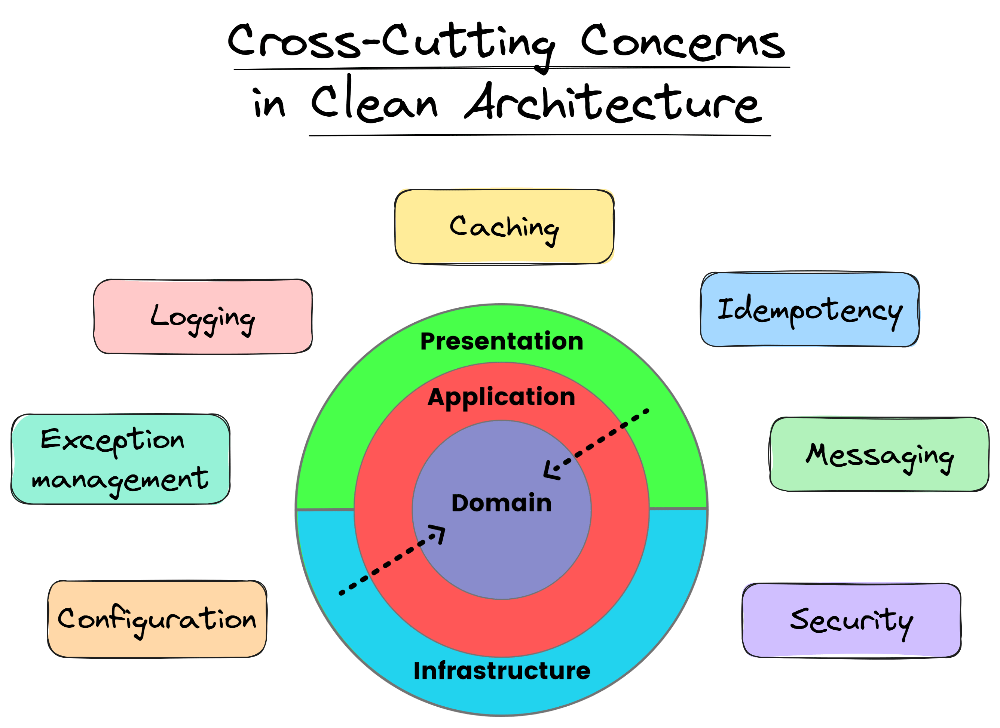

# 在Clean Architecture中平衡横切关注点

> ## 摘要
>
> 横切关注点是影响整个应用程序的软件方面。这是跨越多个层和层级的常见应用程序级功能。横切关注点应该集中在一个位置。这可以防止代码重复和组件间的紧密耦合。在今天的新闻稿中，我将向您展示如何在Clean Architecture中集成横切关注点。
>
> 原文 [Balancing Cross-Cutting Concerns in Clean Architecture](https://www.milanjovanovic.tech/blog/balancing-cross-cutting-concerns-in-clean-architecture?utm_source=Twitter&utm_medium=social&utm_campaign=13.05.2024)

---

横切关注点是影响整个应用程序的软件方面。这些是跨越几个层和层级的常见应用程序级功能。横切关注点应该集中在一个位置。这可以防止代码重复和组件间的紧密耦合。

一些横切关注点的例子包括：

- 认证与授权
- 日志记录和追踪
- 异常处理
- 验证
- 缓存

在今天的新闻稿中，我将向您展示如何在Clean Architecture中集成横切关注点。

## Clean Architecture中的横切关注点

在Clean Architecture中，[横切关注点](https://en.wikipedia.org/wiki/Cross-cutting_concern)在确保系统的可维护性和可扩展性方面发挥着重要作用。理想情况下，这些关注点应该与核心业务逻辑分开处理。这与Clean Architecture的原则相符，强调了关注点分离和模块化。您的核心业务规则保持清晰，架构保持整洁和可适应性。

理想情况下，您希望在Infrastructure层实现横切关注点。您可以使用ASP.NET Core中间件、[装饰器](https://www.milanjovanovic.tech/blog/decorator-pattern-in-asp-net-core)或MediatR管道行为。无论您决定使用哪种方法，指导思想保持不变。



让我们看看如何实现日志记录、验证和缓存作为横切关注点。

## 横切关注点#1 - 日志记录

日志记录是软件开发的基本方面，允许您查看应用程序的行为。它对于调试、监控应用程序健康状况以及跟踪用户活动和系统异常至关重要。在Clean Architecture的上下文中，日志记录必须以保持关注点分离的方式实现。

通过[MediatR's](https://www.milanjovanovic.tech/blog/cqrs-pattern-with-mediatr) `IPipelineBehavior`来实现这一点是一种优雅的方法。通过将日志记录逻辑封装在管道行为中，我们确保日志记录被视为一个与业务逻辑分开的独立关注点。这种方法使我们能够捕获关于通过应用程序流动的请求的详细信息。

有效的日志记录应该是一致的、富有上下文的且非侵入式的。使用[Serilog's](https://www.milanjovanovic.tech/blog/5-serilog-best-practices-for-better-structured-logging)结构化日志记录能力，我们可以创建不仅提供信息而且易于查询的日志。这对于随时了解应用程序的状态至关重要。

当正确完成时，[结构化日志记录](https://www.milanjovanovic.tech/blog/structured-logging-in-asp-net-core-with-serilog)为您的应用程序提供了宝贵的洞察，而不会干扰核心逻辑。这是粒度和清晰度的平衡，确保您的日志是一个有用的工具，而不是噪音来源。

```csharp
using Serilog.Context;

internal sealed class RequestLoggingPipelineBehavior<TRequest, TResponse>(
    ILogger<RequestLoggingPipelineBehavior<TRequest, TResponse>> logger)
    : IPipelineBehavior<TRequest, TResponse>
    where TRequest : class
    where TResponse : Result
{
    public async Task<TResponse> Handle(
        TRequest request,
        RequestHandlerDelegate<TResponse> next,
        CancellationToken cancellationToken)
    {
        string requestName = typeof(TRequest).Name;

        logger.LogInformation(
            "Processing request {RequestName}",
            requestName);

        TResponse result = await next();

        if (result.IsSuccess)
        {
            logger.LogInformation(
                "Completed request {RequestName}",
                requestName);
        }
        else
        {
            using (LogContext.PushProperty("Error", result.Error, true))
            {
                logger.LogError(
                    "Completed request {RequestName} with error",
                    requestName);
            }
        }

        return result;
    }
}
```

## 横切关注点#2 - 验证

验证是软件工程中的一个关键横切关注点。它充当防止错误数据进入系统的第一道防线。验证保护应用程序免于不一致的数据状态和潜在的安全漏洞。

在下面的示例中，我正在创建一个[验证管道行为](https://www.milanjovanovic.tech/blog/cqrs-validation-with-mediatr-pipeline-and-fluentvalidation)。这种设置允许将验证逻辑与业务逻辑清晰分离。管道行为确保在请求到达核心处理逻辑之前进行验证。

在处理验证时，区分两种类型至关重要：

- 输入验证
- 业务规则验证

输入验证检查数据的正确性和格式（如字符串长度、数字范围和日期格式），确保它在处理之前符合基本标准。

另一方面，业务规则验证更多地涉及确保数据符合特定于您领域的规则和逻辑。

有效的验证实践显著提高了应用程序的弹性和可靠性。通过执行验证规则，您可以维持高标准的数据质量，并确保更好的用户体验。

```csharp
internal sealed class ValidationPipelineBehavior<TRequest, TResponse>(
    IEnumerable<IValidator<TRequest>> validators)
    : IPipelineBehavior<TRequest, TResponse>
    where TRequest : class
{
    public async Task<TResponse> Handle(
        TRequest request,
        RequestHandlerDelegate<TResponse> next,
        CancellationToken cancellationToken)
    {
        ValidationFailure[] validationFailures = await ValidateAsync(request);

        if (validationFailures.Length != 0)
        {
            throw new ValidationException(validationFailures);
        }

        return await next();
    }

    private async Task<ValidationFailure[]> ValidateAsync(TRequest request)
    {
        if (!validators.Any())
        {
            return [];
        }

        var context = new ValidationContext<TRequest>(request);

        ValidationResult[] validationResults = await Task.WhenAll(
            validators.Select(validator => validator.ValidateAsync(context)));

        ValidationFailure[] validationFailures = validationResults
            .Where(validationResult => !validationResult.IsValid)
            .SelectMany(validationResult => validationResult.Errors)
            .ToArray();

        return validationFailures;
    }
}
```

## 横切关注点#3: 缓存

在软件开发中，缓存是一个基本的横切关注点。它主要旨在提高性能和可扩展性。缓存涉及将数据临时存储在快速访问层中。这减少了重复获取或计算相同信息的需求。

您在下面看到的缓存管道行为，实现了[Cache Aside模式](https://learn.microsoft.com/en-us/azure/architecture/patterns/cache-aside)。这种模式涉及在处理请求之前检查缓存，并在需要时用新数据更新缓存。由于其简单性和有效性，它是一种流行的缓存策略。如果您想看我是如何实现这一点的，请查看这个[视频教程](https://youtu.be/LOEYZRE72wE)。

在实现缓存时，至关重要的是要考虑：

- **缓存什么：** 识别计算或检索成本高且足够稳定可以被缓存的数据。
- **缓存失效：** 确定何时以及如何使缓存数据失效。
- **缓存配置：** 适当配置缓存设置，如过期时间和大小。

有效的缓存改善响应时间并减轻系统负载，使其成为构建可扩展.NET应用程序的关键策略。

```csharp
internal sealed class QueryCachingPipelineBehavior<TRequest, TResponse>(
    ICacheService cacheService,
    ILogger<QueryCachingPipelineBehavior<TRequest, TResponse>> logger)
    : IPipelineBehavior<TRequest, TResponse>
    where TRequest : ICachedQuery
    where TResponse : Result
{
    public async Task<TResponse> Handle(
        TRequest request,
        RequestHandlerDelegate<TResponse> next,
        CancellationToken cancellationToken)
    {
        TResponse? cachedResult = await cacheService.GetAsync<TResponse>(
            request.CacheKey,
            cancellationToken);

        string requestName = typeof(TRequest).Name;
        if (cachedResult is not null)
        {
            logger.LogInformation("Cache hit for {RequestName}", requestName);

            return cachedResult;
        }

        logger.LogInformation("Cache miss for {RequestName}", requestName);

        TResponse result = await next();

        if (result.IsSuccess)
        {
            await cacheService.SetAsync(
                request.CacheKey,
                result,
                request.Expiration,
                cancellationToken);
        }

        return result;
    }
}
```

## 接下来做什么

管理如日志记录、缓存、验证和异常处理等横切关注点不仅仅是关于技术实现。这是关于将这些方面与[Clean Architecture](https://www.milanjovanovic.tech/blog/clean-architecture-and-the-benefits-of-structured-software-design)的核心原则相对齐。通过采用我们讨论的解耦技术，您可以确保您的.NET项目是健壮和可维护的。

您在处理横切关注点方面的每一步都是朝向更好的软件架构迈进的一步。我鼓励您在自己的.NET项目中尝试这些策略。如果您想要一个结构化的指南，深入讨论这些方面，请查看[实用Clean Architecture](https://www.milanjovanovic.tech/pragmatic-clean-architecture)。

记住，软件开发的美在于持续的演变和不懈的追求改进。
