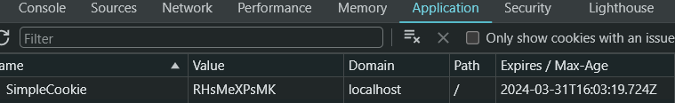
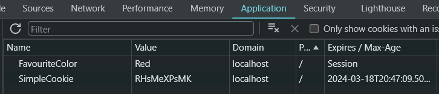

# 在ASP.NET Core中向HttpClient请求/响应添加Cookie

> ## 摘要
>
> 在本文中，我们将探讨如何在ASP.NET Core中向HttpClient请求和响应添加cookie。
>
> 原文 [Add a Cookie to an HttpClient Request/Response in ASP.NET Core](https://code-maze.com/aspnetcore-add-a-cookie-to-an-httpclient-request-response/)

---

什么是cookies？当我们访问网站时，网站会向我们的浏览器发送小块的文本，称为互联网cookies，它们帮助我们在特定网站上获得个性化体验，并记住我们下次访问时的信息。我们今天的目标是了解如何在ASP.NET Core中实现这一点。在本文中，我们将探讨如何在ASP.NET Core中向HttpClient请求和响应添加cookie。

要下载本文的源代码，你可以访问我们的[GitHub仓库](https://github.com/CodeMazeBlog/CodeMazeGuides/tree/main/aspnetcore-webapi/HttpClientCookies)。

让我们开始吧。

## Cookies的类型

由于大多数浏览器支持小尺寸的cookies，根据官方[Microsoft](<https://learn.microsoft.com/en-us/previous-versions/aspnet/ms178194(v=vs.100)>)文档，4096字节，**最好在我们的cookies中只存储标识符。** 此外，我们的站点在用户计算机上存储的cookies数量也有限制。

主要有两种类型的cookies，**会话(session)** 和 **持久(persistent)**。

### 会话Cookies

我们的设备临时存储会话cookies，并在关闭web浏览器或一段时间不活动后删除它们。它们**通常存储某些状态的短期会话。** 例如，它们有助于在电子商务网站中存储购物车中的物品或记住认证细节。

### 持久Cookies

我们也可以将这些cookies称为跟踪或永久cookies。**它们即使在web浏览器会话结束后也仍然储存在我们的设备上，通常具有过期日期。** 它们在多个会话和网站中保存用户偏好和设置，例如语言偏好。由于持久cookies在多个网站中保持活跃，它们以某种形式促进了在线活动追踪。

我们已经讨论了不同类型的cookies及其用途。现在，让我们看看它们如何集成到HTTP请求中。我们将通过使用一个ASP.NET Core Web API项目来演示这一点：

```bash
dotnet new webapi
```

为了模拟将cookie附加到请求中，我们需要创建两个端点：一个用于构造请求并包含cookie，另一个用于读取请求内容。我们将模拟一个简单的认证方案。

让我们首先创建一个API来发送请求并添加一些cookie。以下函数的范围是通过将授权密钥发送到另一个端点的cookie中来对提供的用户授权密钥进行认证：

```csharp
[HttpPost(nameof(Authenticate))]
public async Task<IActionResult> Authenticate(string input)
{
    var baseAddress = new Uri("https://localhost:7222/Cookie/");
    var cookieContainer = new CookieContainer();
    using (var handler = new HttpClientHandler() { CookieContainer = cookieContainer })
    using (var client = new HttpClient(handler) { BaseAddress = baseAddress })
    {
        cookieContainer.Add(baseAddress, new Cookie("AuthCookie", input));
        var result = await client.GetAsync("ValidateAuthenticationCookie");
        if (result.IsSuccessStatusCode)
        {
            return Ok("Cookie validated");
        }
    }
    return BadRequest("Invalid input");
}
```

首先，我们通过定义一个基地址来开始，我们将用它来配置我们的[HttpClient](https://code-maze.com/httpclient-with-asp-net-core-tutorial/)。之后，我们使用`CookieContainer`类将一个cookie添加到请求中。接下来，我们定义`HttpClientHandler`和`HttpClient`。要添加一个新的cookie，我们调用属于该类的`Add()`方法，该方法除了cookie本身外还需要请求的基本URI。我们创建并添加了一个名为`AuthCookie`的cookie，并将`input`值赋给它。

在此之后，cookie容器被传递给`HttpClientHandler`，这是一个可以配置和定制`HttpClient`行为的类。除了处理cookie外，还可以进行其他配置，例如代理支持或**SSL/TLS**配置。通过**SSL/TLS**，我们可以指定`HttpClientHandler`应该支持哪些版本的SSL/TLS协议。这是通过`SslProtocols`属性完成的。

接下来，让我们创建一个验证端点来检查我们的验证cookie。

这个材料是否对你有用？考虑订阅并免费获取**ASP.NET Core Web API最佳实践**电子书！[免费!](https://code-maze.com/free-ebook-aspnetcore-webapi-best-practices/)

### 验证端点

最后，我们尚未实现的验证端点将根据消息返回不同的HTTP响应。

让我们现在创建`ValidateAuthenticationCookie`API端点进行验证：

```csharp
[HttpGet(nameof(ValidateAuthenticationCookie))]
public IActionResult ValidateAuthenticationCookie()
{
    var authCookie = Request.Cookies.FirstOrDefault(c => c.Key.Equals("AuthCookie"));
    if (authCookie.Value.Equals("secretKey"))
    {
        return Ok("Valid cookie");
    }
    return BadRequest();
}
```

在这里，我们读取了与请求一起发送的值。接下来，我们检查一个硬编码的值，在这个例子中是‘secretKey’，如果它与cookie值匹配，我们响应一个`Ok`响应，否则我们返回一个`BadRequest`。

现在，让我们看看如何向HTTP响应中添加Cookie。

## 向HttpClient响应添加Cookie

向请求添加cookie相当简单，让我们看看如何更简单地将cookies添加到响应中。

让我们创建一个简单的控制器方法，在那里我们将把cookie添加到响应中，连同不同的属性：

```csharp
[ApiController]
[Route("[controller]")]
public class CookieController : ControllerBase
{
    [HttpGet(nameof(GetCookie))]
    public IActionResult GetCookie()
    {
        Response.Cookies.Append("SimpleCookie", "RHsMeXPsMK", new CookieOptions());
        return Ok();
    }
}
```

在这里，我们利用`Response.Cookies`集合的`Append()`方法添加cookie。我们添加了一个名为`SimpleCookie`和值为`RHsMeXPsMK`的cookie。同样，我们创建了`CookieOptions`的一个新实例来附加我们的cookie。在我们的例子中，由于我们没有指定任何选项，它将使用默认选项。

让我们调用我们本地的`/Cookie/GetCookie`端点并检查我们的cookie看起来如何：

这个材料是否对你有用？考虑订阅并免费获取**ASP.NET Core Web API最佳实践**电子书！[免费!](https://code-maze.com/free-ebook-aspnetcore-webapi-best-practices/)



我们得到了一个**200 OK**响应，如预期，但现在让我们检查我们的浏览器开发者工具。如果我们导航到应用程序标签，在Cookies部分下，我们将注意到我们之前添加的cookie键和值。

接下来，让我们看看如何向`HttpClient`添加多个cookies。

## 向HttpClient添加多个Cookies

由于`Response.Cookies`是一个集合类型，我们可以在相同的请求中添加多个cookies。例如，在登录时，我们可以添加用户偏好的cookies，如主题、语言、会话偏好等。

让我们在我们的`GetCookie()`方法中添加另一个cookie：

Response.Cookies.Append("FavouriteColor", "Red", new CookieOptions());

最后，让我们再次检查浏览器中的开发者工具：



这个材料是否对你有用？考虑订阅并免费获取**ASP.NET Core Web API最佳实践**电子书！[免费!](https://code-maze.com/free-ebook-aspnetcore-webapi-best-practices/)

这次，我们有两个cookies，并很快注意到后来添加的那个没有过期，意味着它是一个会话cookie。

## 结论

虽然cookies可能不经常成为焦点，但它们在幕后安静地工作，以促进我们的日常在线体验。在本文中，我们熟悉了不同类型的cookies及其用途。我们还学习了如何在HttpClient请求和响应中实现添加cookie。这减少了某些类型的攻击（如跨站脚本攻击（XSS））的风险。
