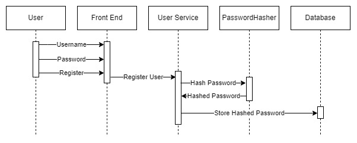
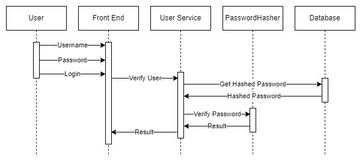

# How the Default ASP.NET Core Identity Password Hasher Works

> ## Excerpt
>
> Learn how ASP.NET Core Identity's password hasher works, including key security features and best practices for robust password protection.

---

在这篇文章中，我们将深入探讨默认的 ASP.NET Core Identity Password Hasher。

我们将重点了解它如何将明文密码转化为安全哈希，并强调其安全功能。

要下载本文的源代码，可以访问我们的[GitHub 仓库](https://github.com/CodeMazeBlog/CodeMazeGuides/tree/main/authorization-dotnet/PasswordHasher)。

## 密码哈希过程如何工作

在讨论密码哈希时，我们通常考虑两种情况。

首先，当用户在注册时设置新密码或更新现有密码时，我们必须在存储到数据库之前对其进行哈希处理。

让我们来看看这种过程通常是如何工作的：



用户将其详细信息输入到表单中，负责用户管理的服务处理注册请求。

此时，服务将密码发送到密码哈希器进行哈希处理，然后再将其存储到数据库中。

其次，为了验证用户，我们需要确保在登录时输入的密码的哈希与存储在数据库中的哈希密码相匹配：



用户将其凭据输入到表单中，用户管理服务处理登录请求。

在这种情况下，服务从数据库中检索用户的哈希密码，并使用密码哈希器将存储的哈希密码与用户输入的密码的哈希进行比较。

幸运的是，ASP.NET Core Identity 提供了一种管理用户身份验证的解决方案，其核心是密码安全。 **框架的默认密码哈希机制通过 `PasswordHasher<TUser>` 类实现，该类使用基于密码的密钥派生函数 2（PBKDF2）。**

## 使用 ASP.NET Core Identity Password Hasher 进行密码哈希

现在，让我们看看 `PasswordHasher<TUser>` 类如何在我们的应用程序中保护密码。

### IPasswordHasher<TUser> 接口

首先，来看一下 `IPasswordHasher<TUser>` 接口：

```csharp
public interface IPasswordHasher<TUser> where TUser : class
{
    string HashPassword(TUser user, string password);
    PasswordVerificationResult VerifyHashedPassword(TUser user, string hashedPassword,
        string providedPassword);
}
```

这是一个[泛型](https://code-maze.com/csharp-generics/)接口，它将代表我们系统中用户的类作为泛型 `TUser` 参数。它提供了两个方法来解决前面提到的场景。

我们使用 `HashPassword()` 方法来保护密码。它需要两个参数：类型为 `TUser` 的 `user` 参数和我们要哈希的密码。

接下来，我们有 `VerifyHashedPassword()` 方法用于密码验证。它需要三个参数：类型为 `TUser` 的 `user` 参数，以及表示哈希密码和测试密码的两个字符串。

### PasswordHasher<TUser> 构造函数

现在，让我们看看 `PasswordHasher<TUser>` 类的构造函数：

```csharp
public PasswordHasher(IOptions<PasswordHasherOptions>? optionsAccessor = null)
{
    var options = optionsAccessor?.Value ?? DefaultOptions;
    _compatibilityMode = options.CompatibilityMode;
    switch (_compatibilityMode)
    {
        case PasswordHasherCompatibilityMode.IdentityV2:
            // nothing else to do
            break;
        case PasswordHasherCompatibilityMode.IdentityV3:
            _iterCount = options.IterationCount;
            if (_iterCount < 1)
            {
                throw new InvalidOperationException(Resources.InvalidPasswordHasherIterationCount);
            }
            break;
        default:
            throw new InvalidOperationException(Resources.InvalidPasswordHasherCompatibilityMode);
    }
    _rng = options.Rng;
}
```

首先，`PasswordHasher<TUser>` 类从提供的 `PasswordHasherOptions` 实例加载配置。

然而，最有趣的部分是 `switch` 语句，它告诉我们 `PasswordHasher<TUser>` 类可以以两种模式工作。

首先是 `IdentityV2` 模式，兼容**ASP.NET Identity 版本 1 和 2。据文档，这种模式支持 PBKDF2，使用 128 位盐、256 位子键、1000 次迭代和 HMAC-SHA1。**

其次是 `IdentityV3` 模式，兼容**ASP.NET Identity 版本 3。同样，这种模式支持 PBKDF2，使用 128 位盐和 256 位子键。然而，这种模式支持 100000 次迭代和 HMAC-SHA512。**

### 使用 HashPassword 方法进行密码哈希

接下来，让我们看看 `HashPassword` 方法：

```csharp
public virtual string HashPassword(TUser user, string password)
{
    ArgumentNullThrowHelper.ThrowIfNull(password);
    if (_compatibilityMode == PasswordHasherCompatibilityMode.IdentityV2)
    {
        return Convert.ToBase64String(HashPasswordV2(password, _rng));
    }
    else
    {
        return Convert.ToBase64String(HashPasswordV3(password, _rng));
    }
}
```

`HashPassword()` 方法需要两个参数：泛型类型 `TUser` 的 `user` 和字符串类型的 `password`。

**值得注意的是，默认实现不使用 `user` 参数。** 这是因为在各种系统中用户可以有不同的表示方式。然而，在 `IPasswordHasher<TUser>` 接口的自定义实现中，用户详细信息可以被合并到哈希过程中。

此外，根据设置的兼容性模式，方法调用 `HashPasswordV2` 或 `HashPasswordV3`，并返回适当版本的结果（使用Base64编码）。

### 使用 HashPasswordV2 方法进行密码哈希

首先，我们从 `HashPasswordV2()` 方法开始：

```csharp
private static byte[] HashPasswordV2(string password, RandomNumberGenerator rng)
{
    const KeyDerivationPrf Pbkdf2Prf = KeyDerivationPrf.HMACSHA1;
    const int Pbkdf2IterCount = 1000;
    const int Pbkdf2SubkeyLength = 256 / 8;
    const int SaltSize = 128 / 8;
    byte[] salt = new byte[SaltSize];
    rng.GetBytes(salt);
    byte[] subkey = KeyDerivation.Pbkdf2(password, salt, Pbkdf2Prf,
        Pbkdf2IterCount, Pbkdf2SubkeyLength);
    var outputBytes = new byte[1 + SaltSize + Pbkdf2SubkeyLength];
    outputBytes[0] = 0x00;
    Buffer.BlockCopy(salt, 0, outputBytes, 1, SaltSize);
    Buffer.BlockCopy(subkey, 0, outputBytes, 1 + SaltSize, Pbkdf2SubkeyLength);
    return outputBytes;
}
```

`HashPasswordV2()` 方法开始时设置了在哈希过程中至关重要的常量。

它使用 HMACSHA1 伪随机函数，如 `Pbkdf2Prf` 常量所指定。

它还默认使用 1000 次迭代，如 `Pbkdf2IterCount` 常量所定义。 **简而言之，这个迭代次数代表算法应用密钥派生的次数，随着次数的增加，使暴力攻击变得越来越计算密集。**

此外，该方法使用由 `SaltSize` 常量确定的长度来初始化一个用于盐的字节数组。然后它用随机字节填充这个数组，以确保每次哈希操作的盐的唯一性。

然后，`KeyDerivation.Pbkdf2` 函数通过对密码和盐进行指定次数迭代的 HMACSHA1 函数来生成一个加密密钥。

最后，它准备一个输出字节数组来存储最终哈希。数组的第一个字节被设置为格式标记（`0x00`），以识别这是一个版本 2 哈希。然后，它将盐和子键复制到数组中。

### 使用 HashPasswordV3 方法进行密码哈希

接下来，让我们分析 `HashPasswordV3()` 方法：

```csharp
private byte[] HashPasswordV3(string password, RandomNumberGenerator rng)
{
    return HashPasswordV3(
        password, rng,
        prf: KeyDerivationPrf.HMACSHA512,
        iterCount: _iterCount,
        saltSize: 128 / 8,
        numBytesRequested: 256 / 8);
}
private static byte[] HashPasswordV3(string password, RandomNumberGenerator rng,
    KeyDerivationPrf prf, int iterCount, int saltSize, int numBytesRequested)
{
    byte[] salt = new byte[saltSize];
    rng.GetBytes(salt);
    byte[] subkey = KeyDerivation.Pbkdf2(password, salt, prf, iterCount, numBytesRequested);
    var outputBytes = new byte[13 + salt.Length + subkey.Length];
    outputBytes[0] = 0x01;
    WriteNetworkByteOrder(outputBytes, 1, (uint)prf);
    WriteNetworkByteOrder(outputBytes, 5, (uint)iterCount);
    WriteNetworkByteOrder(outputBytes, 9, (uint)saltSize);
    Buffer.BlockCopy(salt, 0, outputBytes, 13, salt.Length);
    Buffer.BlockCopy(subkey, 0, outputBytes, 13 + saltSize, subkey.Length);
    return outputBytes;
}
```

**可以看到，`HashPasswordV3()` 实现包含一组两个方法。**

第一个方法充当接口，接受一个密码和一个随机数生成器实例。它然后委派到一个更详细的实现，指定几个附加参数。

简而言之，它将伪随机函数设置为 HMACSHA512，哈希函数循环的迭代次数、以字节为单位的盐的大小，以及请求的结果哈希的字节数。

**值得指出的是，这种方法允许我们自定义哈希过程，因为诸如盐大小或密钥长度等参数不是硬编码的。**

第二个方法通过类似于 `HashPasswordV2()` 方法的方式，使用指定的 `saltSize` 生成一个盐。

接下来，`KeyDerivation.Pbkdf2` 函数通过对密码和盐进行指定次数的 HMACSHA512 函数来生成一个加密密钥。

然后，该方法准备一个输出字节数组来存储完整的哈希。它将数组的第一个字节设置为格式标记（`0x01`），以标记这是一个版本 3 哈希。

最后，它将伪随机函数、迭代次数和盐大小以网络字节顺序存储在数组中，然后是盐和子键。

## 使用 ASP.NET Core Identity Password Hasher 验证密码

现在我们已经了解了哈希过程的工作原理，让我们看看如何验证密码：

```csharp
public virtual PasswordVerificationResult VerifyHashedPassword(TUser user, string hashedPassword,
    string providedPassword)
{
    ArgumentNullThrowHelper.ThrowIfNull(hashedPassword);
    ArgumentNullThrowHelper.ThrowIfNull(providedPassword);
    byte[] decodedHashedPassword = Convert.FromBase64String(hashedPassword);
    if (decodedHashedPassword.Length == 0)
    {
        return PasswordVerificationResult.Failed;
    }
    switch (decodedHashedPassword[0])
    {
        case 0x00:
            if (VerifyHashedPasswordV2(decodedHashedPassword, providedPassword))
            {
                return (_compatibilityMode == PasswordHasherCompatibilityMode.IdentityV3)
                    ? PasswordVerificationResult.SuccessRehashNeeded
                    : PasswordVerificationResult.Success;
            }
            else
            {
                return PasswordVerificationResult.Failed;
            }
        case 0x01:
            if (VerifyHashedPasswordV3(decodedHashedPassword, providedPassword,
                out int embeddedIterCount, out KeyDerivationPrf prf))
            {
                if (embeddedIterCount < _iterCount)
                {
                    return PasswordVerificationResult.SuccessRehashNeeded;
                }
                if (prf == KeyDerivationPrf.HMACSHA1 || prf == KeyDerivationPrf.HMACSHA256)
                {
                    return PasswordVerificationResult.SuccessRehashNeeded;
                }
                return PasswordVerificationResult.Success;
            }
            else
            {
                return PasswordVerificationResult.Failed;
            }
        default:
            return PasswordVerificationResult.Failed;
    }
}
```

如我们所见，这个方法首先验证哈希密码和提供的密码都不为空。

然后，它将哈希密码从Base64字符串解码为字节数组，并检查解码后的哈希密码是否为空，如果是空的则返回 `PasswordVerificationResult.Failed`，表示无效或损坏的哈希。

接下来，它从哈希密码的开头读取格式标记，以确定哈希算法的版本。

最后，根据格式标记执行不同的流程：

- 如果密码使用 `IdentityV2` 模式进行哈希，则调用 `VerifyHashedPasswordV2()`
- 如果使用 `IdentityV3` 哈希，则调用 `VerifyHashedPasswordV3()`
- 在未知格式标记的情况下，表示无法识别或损坏的哈希格式

**一般来说，`VerifyHashedPasswordV2()` 和 `VerifyHashedPasswordV3()` 都遵循相同的原则。** 它们使用原始哈希密码的盐和哈希参数对提供的密码进行哈希，然后比较生成的字符串。

此外，如果密码正确，它还会检查系统是否处于需要重新哈希的兼容模式下。

在验证密码时，hasher 返回三种值之一：

- `PasswordVerificationResult.Success` 如果密码正确
- `PasswordVerificationResult.SuccessRehashNeeded` 如果密码正确但我们应该将哈希更新为新的算法
- `PasswordVerificationResult.Failed` 如果密码不正确

## ASP.NET Core Identity Password Hasher 的安全功能

`PasswordHasher<TUser>` 提供了一些安全功能，有助于确保我们应用程序的安全。

### Salting (加盐)

加盐涉及在每个密码进行哈希处理之前添加一个随机字符串。

这意味着即使两个用户选择相同的密码，由于使用了唯一的盐，它们的存储密码哈希也会不同。 **通过这种方式，加盐可以防止攻击者成功使用称为彩虹表的预计算哈希表。**

### Cryptographic Hash Function (加密哈希函数)

`PasswordHasher<TUser>` 的默认配置使用基于密码的密钥派生函数 2 (PBKDF2) 和 HMACSHA256。

**这种哈希函数延长了生成哈希所需的时间和计算资源，使得攻击者很难且费时破解密码。**

### Iterative Hashing (迭代哈希)

如前所述，虽然增加迭代次数可以增强对暴力破解攻击的安全性，但它也会影响哈希操作的性能。

让我们使用 [BenchmarkDotNet](https://code-maze.com/benchmarking-csharp-and-asp-net-core-projects/) 库验证这一点：

```csharp
| Method                       | IterationCount | Mean         | Error        | StdDev      | Median       |
|----------------------------- |--------------- |-------------:|-------------:|------------:|-------------:|
| PasswordHasherWithIdentityV2 | 1000           |     546.6 us |     22.54 us |    62.45 us |     514.5 us |
| PasswordHasherWithIdentityV3 | 1000           |     688.8 us |     24.06 us |    68.25 us |     654.5 us |
| PasswordHasherWithIdentityV3 | 10000          |   6,426.1 us |    140.89 us |   390.39 us |   6,417.1 us |
| PasswordHasherWithIdentityV3 | 100000         |  60,038.0 us |  1,162.89 us | 1,087.77 us |  59,638.7 us |
| PasswordHasherWithIdentityV3 | 1000000        | 598,615.3 us | 11,186.67 us | 9,916.69 us | 596,388.8 us |
```

根据我们的结果，当使用相同的迭代次数时，`PasswordHasherV2()` 的执行速度比 `PasswordHasherV3()` 快，但 `PasswordHasherV3()` 采用了更安全的加密哈希函数。

此外，增加迭代次数会按比例增加 `PasswordHasherV3()` 方法的执行时间。需要注意的是，`PasswordHasherV3()` 的默认迭代次数设置为 100,000。

## 在 ASP.NET Core 中确保密码安全的最佳实践

最后，值得指出的是，在处理密码时遵循公认的最佳实践非常重要，[其中的一些我们在另一篇文章中进行了介绍](https://code-maze.com/csharp-hashing-salting-passwords-best-practices/)。

首先，我们应该使用最新版本的 ASP.NET Core Identity，因为它包含最新的安全功能和修复。定期更新我们的框架可以确保我们能够受益于最新的改进和安全补丁。

其次，尽管 ASP.NET Core Identity 默认使用强大的密码哈希算法，如 PBKDF2 和 HMACSHA256 或 HMACSHA512，但我们不应减少用于哈希的默认迭代次数。**这些迭代使哈希过程变慢，显著增加了攻击者通过暴力方法破解密码的难度。**

此外，我们应该强制实施强密码策略。这包括要求密码结合大小写字母、数字和特殊字符，并设置密码的最小长度。**这些措施有助于防止常见的密码攻击，如字典攻击。**

引入多因素身份验证要求用户提供两个或更多验证因素才能访问，大大减少了未经授权访问的风险，即使有人破解了密码。

**最后，定期教育用户安全密码的实践，比如避免在不同站点重复使用密码和识别网络钓鱼攻击，有助于保护系统的安全。**

## 结论

总的来说，理解 ASP.NET Core Identity 默认密码 hasher 的内部工作原理对维护安全的Web应用程序非常有益。

通过详细探讨 PasswordHasherV2 和 PasswordHasherV3，我们看到了不同版本如何应用加密方法来增强密码保护。

PasswordHasherV3 使用更安全的加密函数和更高的默认迭代次数，提供了更高的安全性，尽管执行时间比其前身更长。

作为开发人员，我们必须保持信息畅通，并积极实施最安全的身份验证方法，确保我们的应用程序防御威胁，有效保护用户数据。
