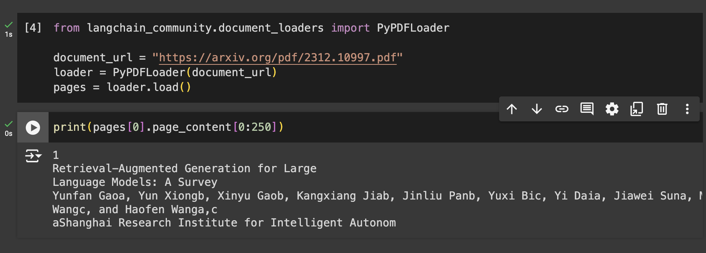

# 如何构建一个基础的RAG应用

> ## 摘要
>
> 本文将指导您如何使用大型语言模型启动检索增强生成。您将了解什么是RAG以及如何在您的应用中实现它。

---

生成式AI的兴起使我们构建的应用程序具备了新型的能力。LLMs可以出色地回答用户的问题。那么，为什么不将它们作为我们系统的一部分呢？如果用户需要帮助操作应用程序，我们可以加入一个聊天功能，让LLM回答所有用户的问题。如果我们的应用中有解释重要概念的博客文章，与其让用户阅读所有以获取所需知识，不如直接提问并即时获得答案。

## 为什么选择RAG？

我们决定将一个LLM集成到我们的应用中，为用户提供这些功能。然而，我们很快发现模型无法回答用户的问题。它对我们的应用一无所知！如果回答所需的信息不在LLM的训练数据中，它就无法回答。更糟糕的是，如果它不知道答案，它可能会幻想出完全错误的事实！这很糟糕，那我们怎么解决这个问题呢？具有Transformer架构的LLMs在上下文学习方面表现出色。因此，我们只需在提示中传递所有需要的事实以及问题！但是，把所有数据塞进每个提示中肯定会非常昂贵。所以，我们该怎么做呢？

## 什么是RAG？

RAG代表**检索增强生成**。RAG是与Transformers一同诞生的。最初，它被用来以额外事实增强LLMs的预训练数据。一旦Transformers的上下文学习能力变得明显，它在推理期间也成为了一种常见实践，以增强提示。

一个基础的RAG流水线包括三个步骤：**索引、检索和生成**。LLM需要回答的所有信息都被索引在一个vector database中。当用户提出问题时，我们可以从该vector database中检索相关信息部分。最后，仅用相关信息和用户的问题，我们可以提示LLM根据我们给出的上下文来提供答案。让我们更详细地看看如何实现这一点。

### 索引

首先，我们**提取模型所需的信息**。生成式模型使用纯文本（有些模型也可以处理图像或其他格式，这些也可以被索引，但这是另一个话题）。如果信息已经是纯文本，那我们很幸运。但它也可能在PDF文件、Word文档、Excel、Markdown等格式中。我们必须**将这些数据转换为纯文本并清理它**，以便模型可以使用。

一旦信息变成文本格式，我们可以**将其存储在一个vector database中**。这个vector database将存储文本的embedding表示，这样我们就可以搜索具有类似embedding表示的文本部分，因此它们是关于类似概念的。我们会**将整篇文本分成较小的部分或块**，计算每个部分的**embedding表示**，最后**将它们存储在vector database中**。

### 检索

当用户向我们提出问题时，我们可以**将该问题转换为vector表示**，使用与索引数据时相同的embedding模型。通过该vector表示，我们将**计算问题与存储在vector database中的每一块之间的相似度因子**。我们将选择与查询最相似的前K个块，因此它们的内容与问题是关于同一概念的（因此它们可能包含答案）。

### 生成

我们会构建一个**提示**，将**用户的问题和相关上下文**放在一起，帮助LLM回答。我们也可能包括用户与AI助手之前对话中的消息。LLM根据上下文，而不是其之前学习的预训练数据显示生成答案。

### 示例

在这个示例中，我们将导入一篇名为《针对大型语言模型的检索增强生成：一项调查》的论文。我们将使用该论文中的信息对LLM进行查询，以便它能回答用户有关其内容的问题。您可以在[本文提供的Google Colab notebook](https://colab.research.google.com/drive/1mFmPN0GBHpS-kMDMuU8EDrWu1KENy69e?usp=sharing)中跟随这个示例。

首先，我们将加载PDF文档并使用LangChain的PyPDF连接器解析它。

一旦我们从文档中提取出文本，我们需要将其分割成较小的块。我们可以使用LangChain的可用分割器，例如这种情况下的`RecursiveCharacterSplitter`：

我们将使用BGE-small，一个开源embedding模型。我们将从HuggingFace Hub下载它，并运行所有块来计算它们的vector表示。

一旦我们得到了所有块的vector表示，我们可以创建一个内存中的vector database，并将所有向量存储在其中。在这个示例中，我们将使用FAISS database。

database现在已经设置好了。现在，我们将接受用户对这些信息的查询。在这种情况下，用户询问Naive RAG的缺点是什么。我们使用之前相同的embedding模型对这个查询进行编码。然后，我们检索与该查询最相似的前5个块。

在检索到相关上下文后，我们使用这些信息和用户的原始问题构建一个提示。我们将使用Claude的Haiku作为这个示例的LLM：

## 常见问题和陷阱

正如标题所暗示，这种解决方案是一个基础或朴素的RAG实现。它将使您的应用充分利用所使用的LLM和您的数据。但这并不适用于所有情况。以下是一些RAG常见的问题：

- **检索到无关的信息：** 如果检索器从vector database中获取的数据与问题无关，它会让模型在回答问题时感到困惑。这可能导致模型要么不使用上下文回答问题，要么回答与问题无关的内容。
- **丢失重要信息：** 也许回答问题所需的信息不在database中，或检索机制未能找到相关块。我们必须找到方法辅助检索器更轻松可靠地找到所需信息。
- **生成不支持上下文的回应：** 如果上下文拥有模型需要的信息，但模型没有使用而是依赖自己的预训练数据，那么这一切努力都是白费的。预训练数据中的信息可能已经过时或错误。我们必须倾向于让模型始终使用上下文回答问题，或者如果无法从上下文中回答，则回答“我不知道”。
- **对查询无关的回应：** 尽管LLM可能会使用所有提供的信息生成回应，但这并不意味着它回答了用户的问题。重要的是模型要紧扣用户的原始问题，而不是陷入大量信息中。
- **类似上下文导致的冗余响应：** 当我们导入包含类似信息的多份文档时，检索器可能会获取多块几乎相同的信息，这可能导致LLM在回应中重复相同的信息多次。

## 如何避免这些问题

要避免这些问题，朴素的RAG流水线可能不够。我们需要设置一个更高级和复杂的RAG系统。已有经过验证的技术可以解决我们列出的问题。我们可以将它们整合到我们的RAG流水线中，以改进RAG应用的性能。

另一个需要解决的重要点是，为了改进您的RAG应用，您需要能够衡量和评估整个过程。无法衡量就无法改进。此外，在评估时您可能会发现基础的RAG设置已经足够您的使用情景，您无需复杂化它。毕竟，即使是非常基础的RAG实现也能极大地提升您的LLM驱动的应用。

在未来的文章中，我将更详细地解释高级RAG技术，这些技术将帮助我们避免常见问题，并将我们的RAG应用提升到一个新的水平。
