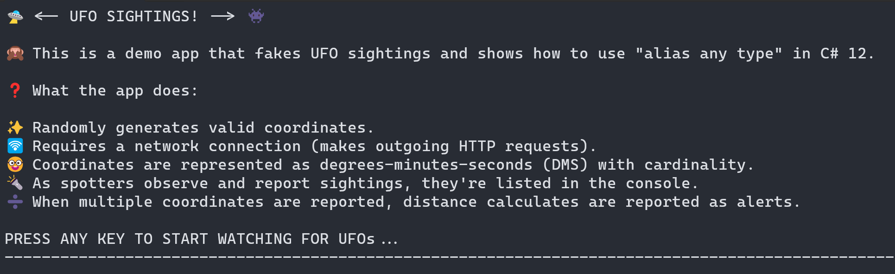
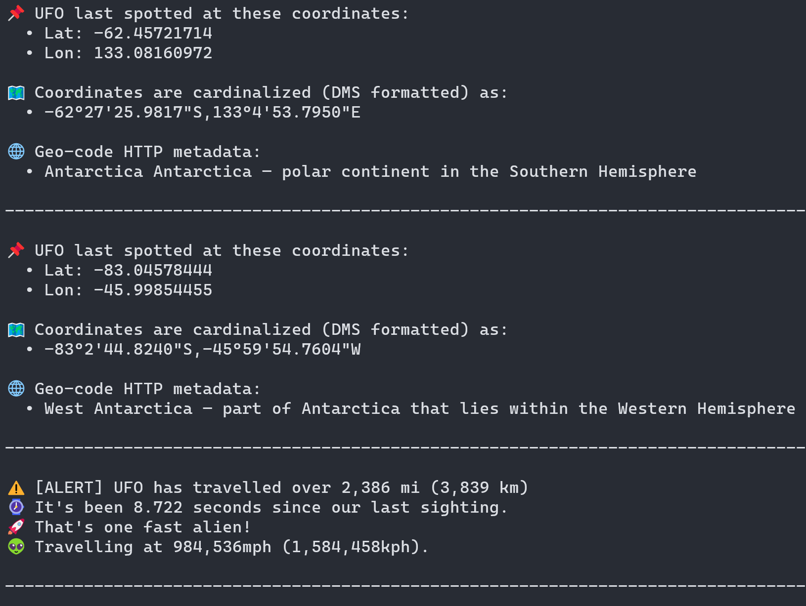
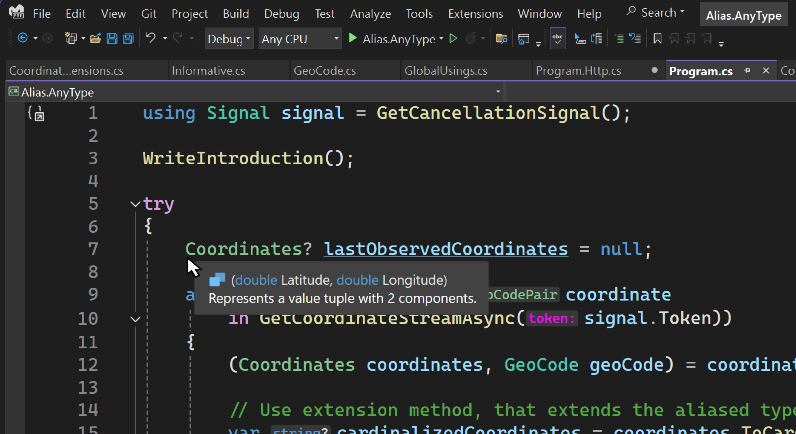

# Refactor your code using alias any type

> ## Excerpt
>
> Explore the "alias any type" C# 12 feature through a complete demo application.

---

June 3rd, 2024

这篇文章是探索C# 12新特性系列文章中的第三篇。在这篇文章中，我们将深入探讨“alias any type”特性，它允许你使用`using`指令为任何类型创建别名。这个系列正开始形成一个漂亮的形态：

1. [通过primary constructors重构你的C#代码](https://devblogs.microsoft.com/dotnet/csharp-primary-constructors-refactoring/)
2. [通过collection expressions重构你的C#代码](https://devblogs.microsoft.com/dotnet/refactor-your-code-with-collection-expressions/)
3. 通过别名化任意类型重构你的C#代码（本文）
4. 使用默认的lambda参数重构你的C#代码

所有这些特性都在我们的旅途中，使我们的代码更具可读性和可维护性，这些被认为是开发者应该了解的“Everyday C#”特性。让我们深入了解吧！

## Alias Any Type \*️⃣

C# 12 引入了使用`using`指令为 _任何类型_ 创建别名的能力。这个特性允许你指定映射到其他类型的别名。这包括tuple类型、pointer类型、array类型，甚至非开放泛型类型，所有这些都可以在你的代码中使用。这一特性尤其有用：

- 当处理冗长或复杂的类型名称时。
- 当你需要消除类型歧义并解决潜在的命名冲突时。
- 当定义你打算在一个程序集内共享的value tuple类型时。
- 当你希望通过使用更具描述性的名称来增加代码的清晰度时。

官方的C#文档提供了很多关于如何使用这个特性的例子，但为了不重复那些示例，我决定编写一个演示应用程序来展示这个特性的各个方面。

**Nullable reference types**

---

这个特性支持大多数类型，唯一的例外是nullable reference types。也就是说，你不能为*nullable reference type*创建别名，C#编译器会报告一个错误CS9132: Using alias不能为nullable reference type。以下代码片段取自特性规范以帮助澄清这一点：

```csharp
// 这是不合法的。
// 错误 CS9132: Using alias不能为nullable reference type
using X = string?;

// 这是合法的。
// 该别名指向 `List<...>`，它本身不是nullable reference type ，即使它包含了一个nullable reference type作为类型参数。
using Y = System.Collections.Generic.List<string?>;

// 这是合法的。
// 这是一个nullable *value* type，不是nullable *reference* type。
using Z = int?;
```

## 示例应用：UFO目击 🛸

演示应用已在GitHub上提供：[IEvangelist/alias-any-type](https://github.com/IEvangelist/alias-any-type)。这是一款简单的控制台应用，模拟了[不明飞行物 (UFO)](https://en.wikipedia.org/wiki/Unidentified_flying_object)目击事件。如果你想在本地跟进，可以在你选择的工作目录中使用以下任意一种方法：

**使用Git CLI：**

```bash
git clone https://github.com/IEvangelist/alias-any-type.git
```

**使用GitHub CLI：**

```bash
gh repo clone IEvangelist/alias-any-type
```

**下载zip文件：**

如果你更喜欢下载源代码，可以在以下URL下载zip文件：

- [IEvangelist/alias-any-type source zip](https://github.com/IEvangelist/alias-any-type/archive/refs/heads/main.zip)

要运行该应用，从根目录执行以下.NET CLI命令：

```bash
dotnet run --project ./src/Alias.AnyType.csproj
```

当应用启动时，它会在控制台上打印一个介绍内容——并等待用户输入后再继续。

[](https://devblogs.microsoft.com/dotnet/wp-content/uploads/sites/10/2024/05/app-start.png)

按下任意键，例如Enter键后，应用会随机生成有效的坐标（纬度和经度），然后使用这些坐标检索相关的地理编码元数据。这些坐标以度-分-秒格式显示（包括方位）。当应用运行时，会计算并报告生成坐标间的距离作为UFO目击事件。

[](https://devblogs.microsoft.com/dotnet/wp-content/uploads/sites/10/2024/05/app-run.png)

要停止该应用，按Ctrl + C键。

虽然此应用很简单，但它确实包含了一些与我们的重点无关的C#代码。在触及外围话题时，我会保持简洁，但在我认为重要的地方会进行探讨。

## 代码演练 👀

我们将使用这一部分一起浏览代码库。有几个有趣的方面我想突出，包括项目文件、_GlobalUsings.cs_、一些扩展和*Program.cs*文件。在可用的代码中，我们有一些东西不会覆盖，例如响应模型和一些实用方法。

```plaintext
└───📂 src
     ├───📂 Extensions
     │    └─── CoordinateExtensions.cs
     ├───📂 ResponseModels
     │    ├─── GeoCode.cs
     │    ├─── Informative.cs
     │    └─── LocalityInfo.cs
     ├─── Alias.AnyType.csproj
     ├─── CoordinateGeoCodePair.cs
     ├─── GlobalUsings.cs
     ├─── Program.cs
     ├─── Program.Http.cs
     └─── Program.Utils.cs
```

让我们先看看项目文件：

```xml
<Project Sdk="Microsoft.NET.Sdk">

  <PropertyGroup>
    <OutputType>Exe</OutputType>
    <TargetFramework>net8.0</TargetFramework>
    <ImplicitUsings>enable</ImplicitUsings>
    <Nullable>enable</Nullable>
  </PropertyGroup>

  <ItemGroup>
    <Using Include="System.Console" Static="true" />

    <Using Include="System.Diagnostics" />
    <Using Include="System.Net.Http.Json" />
    <Using Alias="AsyncCancelable"
           Include="System.Runtime.CompilerServices.EnumeratorCancellationAttribute" />
    <Using Include="System.Text" />
    <Using Include="System.Text.Json.Serialization" />
    <Using Include="System.Text.Json" />
  </ItemGroup>

</Project>
```

这里首先要注意的是`ImplicitUsings`属性设置为`enable`。这个特性自C# 10起就已经存在，它使目标SDK（在本例中为`Microsoft.NET.Sdk`）默认隐式包含一组命名空间。不同的SDK包括不同的默认命名空间，查看更多信息，请参阅[Implicit using directives](https://learn.microsoft.com/dotnet/core/project-sdk/overview#implicit-using-directives)文档。

### Implicit Using Directives 📜

`ImplicitUsing`元素是MS Build的一个特性，而`global`关键字是C#语言的一个特性。既然我们已经选择了[全局using功能](https://learn.microsoft.com/dotnet/csharp/language-reference/keywords/using-directive#global-modifier)，我们也可以通过添加自己的指令来利用这项特性。添加这些指令的一种方法是将[`Using`元素](https://learn.microsoft.com/dotnet/core/project-sdk/msbuild-props#using)加到一个`ItemGroup`中。某些using指令添加了`Static`属性，设置为`true`，这意味着它们的所有`static`成员都可用而不需要进行限定——关于这一点我们稍后会详细介绍。`Alias`属性用来为类型创建别名，在这个例子中，我们为`System.Runtime.CompilerServices.EnumeratorCancellationAttribute`类型指定了一个`AsyncCancelable`别名。在我们的代码中，我们现在可以用`AsyncCancelable`作为`EnumeratorCancellation`属性的类型别名。其他`Using`元素为它们对应的命名空间创建非静态和非别名的`global using`指令。

### A Emerging Pattern 🧩

我们开始看到一个常见的模式在现代.NET代码库中涌现，开发者定义一个*GlobalUsings.cs*文件来将所有（或大多数）using指令封装到一个文件中。这个演示应用遵循了这一模式，让我们来看看以下文件：

```csharp
// 确保这些命名空间中的所有类型在全局可用。
global using Alias.AnyType;
global using Alias.AnyType.Extensions;
global using Alias.AnyType.ResponseModels;

// 暴露数学中的所有静态成员。
global using static System.Math;

// 为坐标对象创建别名。
global using Coordinates = (double Latitude, double Longitude);

// 为度-分-秒（DMS）的表示创建别名。
global using DMS = (int Degree, int Minute, double Second);

// 为不同度量单位的各种距离创建别名。
global using Distance = (double Meters, double Kilometers, double Miles);

// 为表示为异步可枚举的坐标流创建别名。
global using CoordinateStream = System.Collections.Generic.IAsyncEnumerable<
    Alias.AnyType.CoordinateGeoCodePair>;

// 将CTS（CancellationTokenSource）别名为"Signal"。
global using Signal = System.Threading.CancellationTokenSource;
```

这个文件中的所有内容都是`global using`指令，使别名类型、静态成员或命名空间在整个项目中可用。前三个指令是常见的命名空间，它们在应用的多个地方使用。接下来的指令是`global using static`指令，将`System.Math`命名空间的所有静态成员暴露出来，无需限定即可使用。其余的指令是创建各种类型别名的`global using`指令，包括几个tuples、一个坐标流以及一个`CancellationTokenSource`，现在只需称为`Signal`。

需要注意的是，当你定义一个tuple别名类型时，如果以后需要添加行为或附加属性，你可以很容易地转移到一个`record`类型。例如，稍后你可能会决定希望为`Coordinates`类型添加一些功能，你可以轻松地将其更改为一个`record`类型：

```csharp
namespace Alias.AnyType;

public readonly record struct Coordinates(
    double Latitude,
    double Longitude);
```

当你定义一个别名时，你实际上并没有创建一个类型，而是创建了一个指向现有类型的名称。在定义tuple时，实际上定义了一个*value tuple*的形状。当你为一个array类型定义别名时，你并没有创建一个新的array类型，而是用一个可能更具描述性的名称定义了这个类型作为别名。例如，当我定义一个返回`IAsyncEnumerable<CoordinateGeoCodePair>`的API时，这需要写很多频繁的代码。使用别名后，我可以在代码库中参考它作为`CoordinateStream`。

### 引用别名 📚

定义了一些别名，有些在项目文件中，有些在*GlobalUsings.cs*文件中。让我们看看这些别名在代码库中的实际使用情况。首先看顶层的*Program.cs*文件：

```csharp
using Signal signal = GetCancellationSignal();

WriteIntroduction();

try
{
    Coordinates? lastObservedCoordinates = null;

    await foreach (var coordinate
        in GetCoordinateStreamAsync(signal.Token))
    {
        (Coordinates coordinates, GeoCode geoCode) = coordinate;

        // 使用扩展方法，该方法扩展了别名类型。
        var cardinalizedCoordinates = coordinates.ToCardinalizedString();

        // 将UFO坐标详情写入控制台。
        WriteUfoCoordinateDetails(coordinates, cardinalizedCoordinates, geoCode);

        // 写入包括旅行距离的警告信息。
        WriteUfoTravelAlertDetails(coordinates, lastObservedCoordinates);

        await Task.Delay(UfoSightingInterval, signal.Token);

        lastObservedCoordinates = coordinates;
    }
}
catch (Exception ex) when (Debugger.IsAttached)
{
    // https://x.com/davidpine7/status/1415877304383950848
    _ = ex;
    Debugger.Break();
}
```

上面的代码片段展示了如何使用`Signal`别名来创建`CancellationTokenSource`实例。如你所知，`CancellationTokenSource`类是`IDisposable`的一个实现，因此我们可以使用`using`语句来确保`Signal`实例在超出范围时被正确处置。你的IDE能够理解这些别名，当你将鼠标悬停在它们上面时，你会看到它们代表的实际类型。考虑以下屏幕截图：

[](https://devblogs.microsoft.com/dotnet/wp-content/uploads/sites/10/2024/05/alias-hover.png)

介绍信息通过`WriteIntroduction`调用写入控制台，然后进入一个`try / catch`块。`try`块包含一个`await foreach`循环，迭代一个`IAsyncEnumerable<CoordinateGeoCodePair>`。`GetCoordinateStreamAsync`方法定义在一个单独的文件中。我发现在编写顶层程序时，我更多地利用了`partial class`功能，因为它有助于分离关注点。所有基于HTTP的功能都定义在*Program.Http.cs*文件中，让我们关注`GetCoordinateStreamAsync`方法：

```csharp
static async CoordinateStream GetCoordinateStreamAsync(
    [AsyncCancelable] CancellationToken token)
{
    token.ThrowIfCancellationRequested();

    do
    {
        var coordinates = GetRandomCoordinates();

        if (await GetGeocodeAsync(coordinates, token) is not { } geoCode)
        {
            break;
        }

        token.ThrowIfCancellationRequested();

        yield return new CoordinateGeoCodePair(
            Coordinates: coordinates,
            GeoCode: geoCode);
    }
    while (!token.IsCancellationRequested);
}
```

你会注意到它返回`CoordinateStream`别名，即`IAsyncEnumerable<CoordinateGeoCodePair>`。它接受一个`AsyncCancelable`属性，这是一个`EnumeratorCancellationAttribute`类型的别名。这个属性用于装饰取消令牌，以便与`IAsyncEnumerable`配合使用以支持取消。在没有请求取消的情况下，该方法生成随机坐标、检索地理编码元数据，并生成一个新的`CoordinateGeoCodePair`实例。`GetGeocodeAsync`方法请求给定坐标的地理编码元数据，如果成功，它将返回`GeoCode`响应模型。例如，微软校园的坐标为：

```http
GET /data/reverse-geocode-client?latitude=47.637&longitude=-122.124 HTTP/1.1 Host: api.bigdatacloud.net Scheme: https
```

要查看JSON，打开这个[链接在浏览器中](https://api.bigdatacloud.net/data/reverse-geocode-client?latitude=47.637&longitude=-122.124)。`CoordinateGeoCodePair`类型不是别名，但它是一个包含`Coordinates`和一个`GeoCode`的`readonly record struct`：

```csharp
namespace Alias.AnyType;

internal readonly record struct CoordinateGeoCodePair(
    Coordinates Coordinates,
    GeoCode GeoCode);
```

回到`Program`类，当我们迭代每个坐标的地理编码对时，我们将tuple解析为`Coordinates`和`GeoCode`实例。`Coordinates`类型是一个由两个表示纬度和经度的`double`值组成的tuple别名。再次，在你的IDE中悬停在这个类型上可以快速查看类型，考虑以下屏幕截图：

[](https://devblogs.microsoft.com/dotnet/wp-content/uploads/sites/10/2024/05/alias-hover-tuple.png)

`GeoCode`类型是一个响应模型，包含有关地理编码元数据的信息。然后我们使用一个扩展方法将`Coordinates`转化为以方位格式显示的字符串，这是一个以度-分-秒格式表示坐标的字符串。个人而言，我非常喜欢在代码库中使用别名的简单方便。让我们看看一些扩展方法，它们扩展或返回别名类型：

```csharp
internal static string ToCardinalizedString(this Coordinates coordinates)
{
    var (latCardinalized, lonCardinalized) = (
        FormatCardinal(coordinates.Latitude, true),
        FormatCardinal(coordinates.Longitude, false)
    );

    return $"{latCardinalized},{lonCardinalized}";

    static string FormatCardinal(double degrees, bool isLat)
    {
        (int degree, int minute, double second) = degrees.ToDMS();

        var cardinal = degrees.ToCardinal(isLat);

        return $"{degree}°{minute}'{second % 60:F4}\"{cardinal}";
    }
}
```

这个扩展方法，扩展了`Coordinates`别名类型，并返回坐标的字符串表示。它使用`ToDMS`扩展方法将纬度和经度转换为度-分-秒格式。`ToDMS`扩展方法定义如下：

```csharp
internal static DMS ToDMS(this double coordinate)
{
    var ts = TimeSpan.FromHours(Abs(coordinate));

    int degrees = (int)(Sign(coordinate) * Floor(ts.TotalHours));
    int minutes = ts.Minutes;
    double seconds = ts.TotalSeconds;

    return new DMS(degrees, minutes, seconds);
}
```

如果你还记得的话，`DMS` 别名是一个包含三个值的元组，分别表示度、分和秒。`ToDMS` 扩展方法接受一个 `double` 值并返回一个 `DMS` 元组。`ToCardinal` 扩展方法用于确定坐标的基本方向，返回 `N`、`S`、`E` 或 `W`。`Abs`、`Sign` 和 `Floor` 方法都是 `System.Math` 命名空间中的静态成员，该命名空间在 _GlobalUsings.cs_ 文件中被别名引用了。

除此之外，应用会在控制台上显示 UFO 目击详情，包括坐标、地理编码元数据和目击间的距离。这会循环进行，直到用户通过 Ctrl + C 键组合停止应用。

## 接下来的步骤 🚀

一定要在你自己的代码中尝试一下！请继续关注系列的最后一篇文章，在那篇文章中我们将探索默认的 lambda 参数。要继续了解更多关于此功能的内容，请查看以下资源：

- [C# using directive: using alias](https://learn.microsoft.com/dotnet/csharp/language-reference/keywords/using-directive#using-alias)
- [Allow using alias directive to reference any kind of Type](https://learn.microsoft.com/dotnet/csharp/language-reference/proposals/csharp-12.0/using-alias-types)
- [Tuple types (C# reference)](https://learn.microsoft.com/dotnet/csharp/language-reference/builtin-types/value-tuples)
- [MSBuild reference for .NET SDK projects: Enable `ImplicitUsings`](https://learn.microsoft.com/dotnet/core/project-sdk/msbuild-props#implicitusings)
