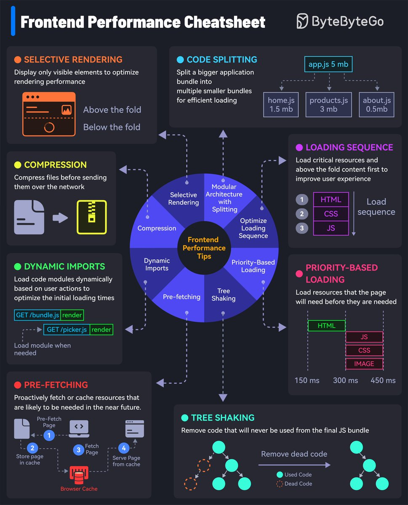

# 🚀前端性能优化秘籍：提升用户体验的关键技术

随着用户对Web应用性能的要求不断提高，前端开发者需要掌握各种优化技术来确保网站快速响应、流畅运行。本篇文章基于图像中的内容，为大家整理了一些实用的前端性能优化技巧。这些方法能够显著提升页面加载速度和用户体验。无论你是初学者还是经验丰富的开发者，都能从中找到灵感！



---

## 🎯选择性渲染（Selective Rendering）

### 什么是选择性渲染？

选择性渲染是一种优化渲染过程的技术，通过仅渲染用户当前可见的部分，减少不必要的计算和资源使用。它主要用于避免对"屏幕外"内容的浪费性渲染，从而提升性能。

### 实现方式：

- **Above the fold**：只渲染用户初始视口范围内的内容，屏幕外的内容通过延迟加载（Lazy Loading）或滚动触发加载。
- 这种技术尤其适合内容较多、页面较长的网站，比如新闻门户或电商平台。

---

## 📦压缩（Compression）

### 压缩的重要性：

在发送资源到客户端之前，对文件进行压缩可以显著减少数据传输量，从而加快加载速度。主要针对JavaScript文件、CSS文件和图片等资源。

### 常见压缩方式：

- **Gzip或Brotli压缩**：用于压缩文本文件（如HTML、CSS、JS）。
- **图片优化**：使用现代图片格式（如WebP）替代传统格式（如JPEG和PNG）。

### 示例：

- 未压缩的JS文件大小可能为1.5MB，压缩后可降至0.5MB，大幅降低网络传输时间。

---

## 🔄动态导入（Dynamic Imports）

### 动态导入是什么？

动态导入是一种按需加载模块的技术，可以避免一次性加载整个代码库，从而加快初始页面加载速度。

### 优势：

- 用户只会加载当前操作所需的模块。
- 例如，当用户点击某个按钮时，再动态加载对应的功能模块，而不是提前加载所有模块。

### 示例代码：

```javascript
import("module.js").then(module => {
  module.render();
});
```

---

## 🚀预取（Prefetching）

### 什么是预取？

预取是一种预测用户行为并提前加载资源的技术，通过缓存即将使用的内容来减少后续操作时的等待时间。

### 应用场景：

- 用户浏览网页时，提前加载下一页的资源。
- 使用`<link rel="prefetch">`标签实现静态资源预取。

### 示例：

在电商网站中，当用户浏览商品详情页时，可以预取购物车页面的相关资源。

---

## 📋加载顺序优化（Loading Sequence）

### 为什么加载顺序很重要？

优化资源加载顺序可以保证关键内容优先呈现，从而提升用户体验。例如：先加载CSS和HTML，随后再加载图片和JS。

### 优化策略：

- **Critical CSS**：优先加载页面所需的核心CSS。
- **JS延迟加载**：将非核心JS文件设置为异步加载。

### 加载时间分配：

- 核心HTML和CSS加载时间：150ms。
- 非核心资源（如图片和JS）：300ms后开始加载。

---

## 🛠️优先级加载（Priority-Based Loading）

### 优化策略：

根据资源的重要性，分配不同的加载优先级。例如：

1. HTML → 最高优先级。
2. CSS → 高优先级。
3. JS → 中优先级。
4. 图片 → 低优先级。

这种方式确保用户可以快速看到页面结构，同时不会因为其他资源加载影响体验。

---

## 🌳树摇（Tree Shaking）

### 什么是树摇？

树摇是一种通过移除未使用代码来优化最终输出文件大小的技术。它能够显著减少JavaScript文件的体积，并提高运行效率。

### 实现原理：

- 借助现代构建工具（如Webpack或Rollup），分析代码中哪些模块未被引用，并将其从打包输出中移除。

### 好处：

- 减少冗余代码，降低文件大小。
- 提高代码运行效率。

---

# 🌟总结与实践建议

前端性能优化是一项贯穿开发全周期的重要任务。通过上述技术，我们可以实现以下目标：

1. 减少页面初始加载时间。
2. 优化资源传输效率。
3. 提升用户交互体验。

在实际项目中，可以根据具体需求组合使用这些技术。例如，对于内容丰富的网站，可以结合选择性渲染和动态导入；对于对性能要求极高的应用，可以加入树摇和压缩技术。

希望这篇文章能够为你提供灵感，让你的Web项目跑得更快、表现更好！
