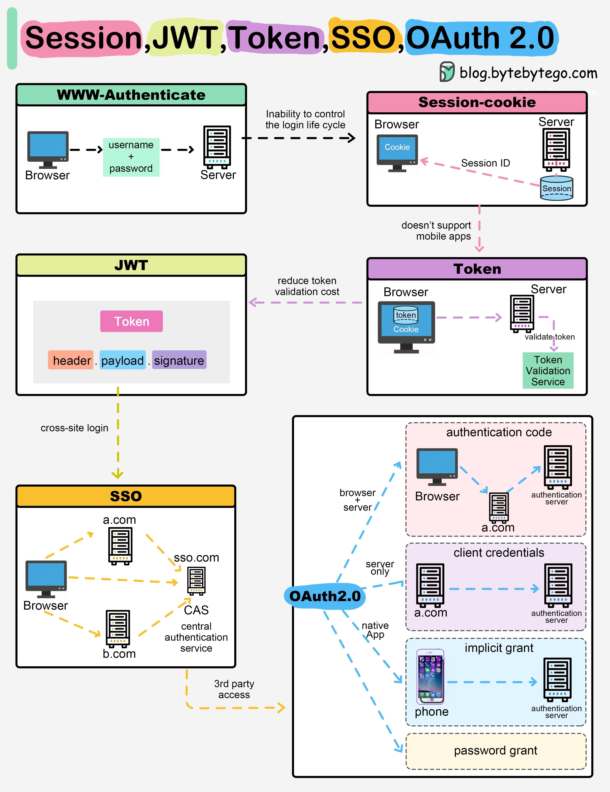

# 深入解析：Session、JWT、Token、SSO与OAuth 2.0技术详解 🛡️

在现代Web应用中，认证与授权是关键的安全机制，而Session、JWT（JSON Web Token）、Token、SSO（Single Sign-On）以及OAuth 2.0是其中最常见的几种技术。本篇文章将通过技术细节分析图解，帮助你全面了解这些概念的核心原理及应用场景。

---

## Session：基于服务器的认证管理 🗂️

### 什么是Session？

Session是一种基于服务器的认证方式，用于管理用户登录状态。每次用户登录时，服务器会为用户生成一个唯一的Session ID，并将其存储在服务器端，同时将Session ID发送到客户端（通常存储在Cookie中）。

### 工作流程：

1. 用户通过浏览器输入用户名和密码。
2. 服务器验证用户身份，生成一个唯一的`Session ID`。
3. 客户端将`Session ID`存储在Cookie中，并在后续请求中携带该ID。
4. 服务器根据`Session ID`识别用户并返回对应的资源。

### 优势与缺点：

- **优势**：
  - 服务器端控制，可以轻松实现用户强制下线功能。
- **缺点**：
  - 难以扩展到分布式环境，因为需要在所有服务器间共享Session数据。
  - 如果客户端未保存Cookie，认证过程可能无法完成。

---

## JWT：无状态认证的轻量化解决方案 🪶

### 什么是JWT？

JWT（JSON Web Token）是一种用于认证的无状态Token。它由三部分组成：`Header`（头部）、`Payload`（负载）和`Signature`（签名），以点号`.`分隔，并采用Base64编码。

### 工作流程：

1. 用户登录后，服务器生成一个JWT并返回给客户端。
2. 客户端将JWT存储在本地（如浏览器的Local Storage或Cookie中）。
3. 后续请求中，客户端携带JWT，服务器通过解码和验证签名来识别用户。

### 优势与缺点：

- **优势**：
  - 无需在服务器端存储会话信息，支持分布式架构。
  - 可以包含自定义的用户信息（如权限数据）在Payload中。
- **缺点**：
  - 一旦JWT被泄露，攻击者可以直接伪装成用户。
  - 无法主动注销用户，需要等待Token过期。

---

## Token：通用的认证凭证 🔑

### 什么是Token？

Token是一种用于身份验证的字符串，可以是随机生成的，也可以是加密后的信息。它类似于JWT，但不一定包含结构化数据。

### 工作流程：

1. 用户向认证服务提交登录请求。
2. 认证服务返回一个Token，客户端保存Token。
3. 客户端在后续请求中携带Token，服务器验证Token后允许访问资源。

### 优势与缺点：

- **优势**：
  - 灵活性高，可以用于多种场景（例如API访问）。
- **缺点**：
  - Token本身可能不包含任何有意义的信息，需要依赖服务端验证。

---

## SSO：单点登录技术 🌐

### 什么是SSO？

SSO（Single Sign-On）是一种允许用户使用一个账户登录多个系统或应用的技术。它通过中心化认证服务器实现跨站点登录功能。

### 工作流程：

1. 用户访问第一个应用（如a.com），并重定向到SSO认证服务。
2. 用户成功登录后，SSO认证服务生成一个Ticket或Token。
3. 用户访问其他应用（如b.com），并携带该Ticket进行认证。
4. 各应用通过验证Ticket来确认用户身份，无需再次登录。

### 优势与缺点：

- **优势**：
  - 提升用户体验，避免重复登录。
- **缺点**：
  - 对安全性要求高，一旦认证服务被攻破，将影响所有关联系统。

---

## OAuth 2.0：授权协议标准 🔒

### 什么是OAuth 2.0？

OAuth 2.0是一种开放授权协议，允许第三方应用代表用户访问资源，而无需暴露用户的密码。它广泛用于社交网络和API集成中。

### 工作流程：

1. 用户从客户端应用发起授权请求。
2. 授权服务器验证用户身份并返回授权码。
3. 客户端使用授权码向授权服务器请求访问令牌（Access Token）。
4. 客户端使用Access Token访问资源服务器上的受保护资源。

### 四种授权模式：

1. **Authorization Code**：最安全模式，用于服务端应用。
2. **Implicit Grant**：适用于前端应用，但安全性较低。
3. **Resource Owner Password Credentials**：直接使用用户名和密码授权，不推荐使用。
4. **Client Credentials**：用于无用户参与的场景，如机器间通信。

### 优势与缺点：

- **优势**：
  - 灵活性强，适用于多种场景。
  - 用户密码始终保存在授权服务器，第三方应用无法访问。
- **缺点**：
  - 实现复杂度高，需要仔细处理安全细节。

---

## 总结对比 📊

| 技术      | 状态存储方式   | 是否支持分布式 | 数据安全性 | 应用场景           |
| --------- | -------------- | -------------- | ---------- | ------------------ |
| Session   | 服务器端       | 不支持         | 高         | 单体应用           |
| JWT       | 客户端         | 支持           | 中等       | 分布式系统/API认证 |
| Token     | 客户端或服务端 | 支持           | 灵活       | API调用/微服务认证 |
| SSO       | 跨站点         | 支持           | 高         | 多系统统一登录     |
| OAuth 2.0 | 授权服务器     | 支持           | 高         | 第三方授权/API集成 |

---

通过对比分析，我们可以看到，每种认证技术都有其适用场景和优缺点。在实际开发中，根据系统架构和功能需求选择合适的技术方案尤为重要。希望本文能帮助你理清这些概念，并为你的项目提供参考！
