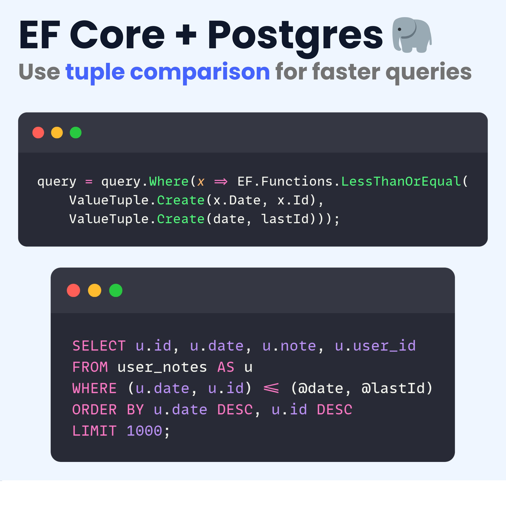

# 🚀 使用 EF Core 和 PostgreSQL 中的元组比较优化查询性能

在现代数据库开发中，优化查询性能是一个至关重要的任务。特别是在处理复杂查询或大规模数据时，任何性能改进都能显著提升系统效率。本文将重点介绍如何利用 **EF Core** 和 **PostgreSQL** 的元组比较（Tuple Comparison）功能优化数据库查询。



---

## 🌟 什么是元组比较？

元组比较是一种高级查询技术，它允许开发者基于多个字段同时进行比较，而不是逐个字段进行比较。这种方法不仅简化了查询逻辑，还能显著提高查询效率。

在 PostgreSQL 中，元组比较可以通过 `(field1, field2) <= (value1, value2)` 的形式实现。而在 EF Core 中，我们可以通过 `ValueTuple` 和 `EF.Functions.LessThanOrEqual` 来完成类似操作。

---

## 🎯 为什么使用元组比较？

传统的字段逐一比较会导致更复杂的查询逻辑，同时在性能上可能不如元组比较高效。元组比较的优势包括：

1. **简洁性**：减少代码冗余，逻辑更加直观。
2. **性能提升**：数据库引擎可以更高效地处理这种比较方式。
3. **可读性**：对于开发者来说，查询语句更容易理解和维护。

---

## 💡 技术实现

### 在 EF Core 中实现元组比较

EF Core 是一个支持高效数据库操作的 .NET ORM（对象关系映射）。下面是使用 EF Core 元组比较的示例代码：

```csharp
query = query.Where(x => EF.Functions.LessThanOrEqual(
    ValueTuple.Create(x.Date, x.Id),
    ValueTuple.Create(lastDate, lastId)));
```

#### 代码分析：

1. **`EF.Functions.LessThanOrEqual`**：
   这是 EF Core 提供的功能，可以进行高级的 SQL 比较。
2. **`ValueTuple.Create`**：
   将多个字段组合成一个元组，用于同时比较多个值。
3. **`lastDate` 和 `lastId`**：
   代表目标值，与数据库字段进行比较。

### 在 PostgreSQL 中实现元组比较

PostgreSQL 提供了直接支持元组比较的 SQL 语法，示例如下：

```sql
SELECT u.date, u.note, u.user_id
FROM user_notes AS u
WHERE (u.date, u.id) <= (@date, @lastId)
ORDER BY u.date DESC, u.id DESC
LIMIT 1000;
```

#### 代码分析：

1. **`(u.date, u.id)` 与 `(@date, @lastId)` 比较**：
   使用元组比较两个字段，同时确保条件逻辑简洁。
2. **`ORDER BY u.date DESC, u.id DESC`**：
   按日期和 ID 倒序排列结果。
3. **`LIMIT 1000`**：
   限制返回记录数量，提高查询性能。

---

## 🛠 应用场景

### 1. 分页查询

在分页查询中，元组比较可以轻松实现基于多字段的范围限制。例如，通过 `date` 和 `id` 的组合，确保从上次分页位置开始向后加载数据。

### 2. 数据排序与筛选

当需要对数据进行复杂排序并同时筛选多条件时，元组比较能够减少 SQL 复杂度并提升执行效率。

### 3. 数据范围过滤

在数据分析场景中，基于多字段范围过滤（如时间戳和唯一标识符）非常常见，元组比较提供了一种高效解决方案。

---

## 🚧 注意事项

1. **数据库兼容性**：
   元组比较是 PostgreSQL 的特性，在其他数据库（如 MySQL、SQL Server）中可能无法直接使用类似功能，需要手动改写逻辑。
2. **EF Core 支持版本**：
   确保使用最新版本的 EF Core，以获得完整的功能支持。

3. **性能测试**：
   在生产环境之前，对元组比较查询进行基准测试，确保其性能符合预期。

---

## 🚀 总结

EF Core 和 PostgreSQL 的元组比较功能为开发者提供了一种高效、简洁的查询方式，可以显著优化复杂查询的性能。在现代开发中，善用这项技术能够帮助你构建更快、更稳定的应用程序。如果你正在寻找一种方法简化多字段比较逻辑或提升数据库性能，那么元组比较绝对值得尝试！

通过本文的介绍，你应该已经掌握了如何使用元组比较来优化查询。现在，是时候将它应用到实际项目中了！🎉

---
