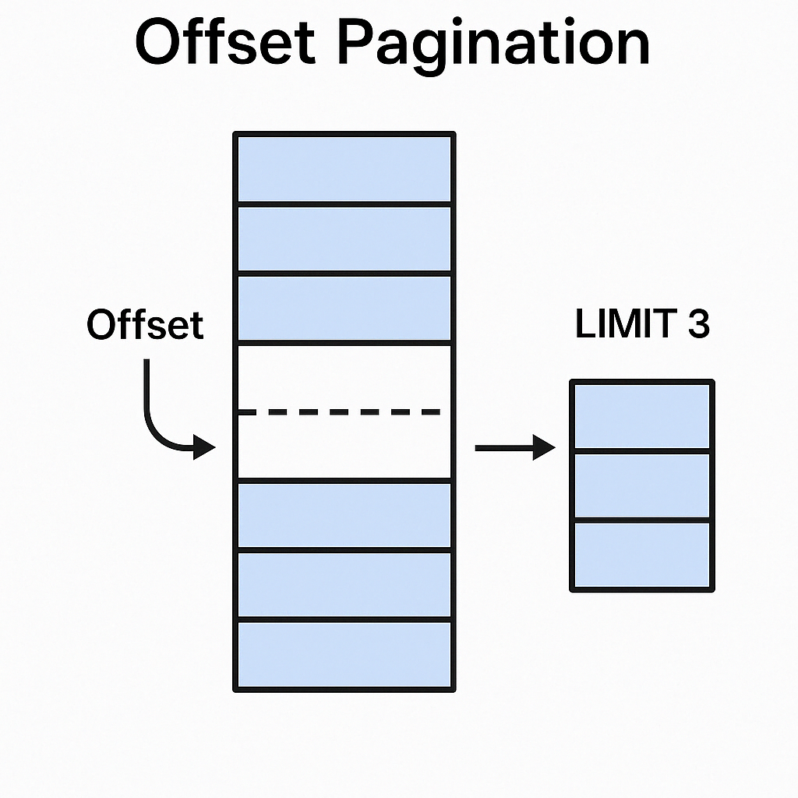
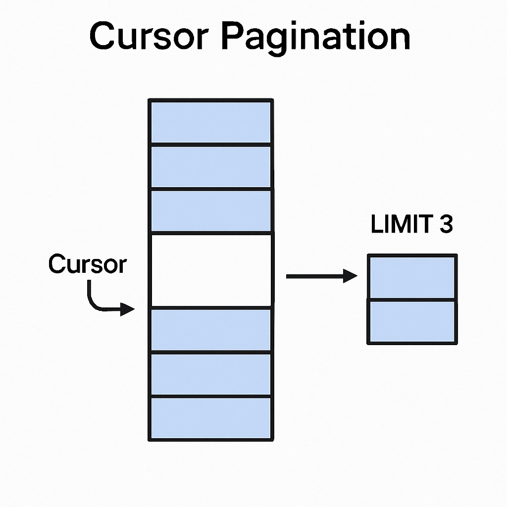
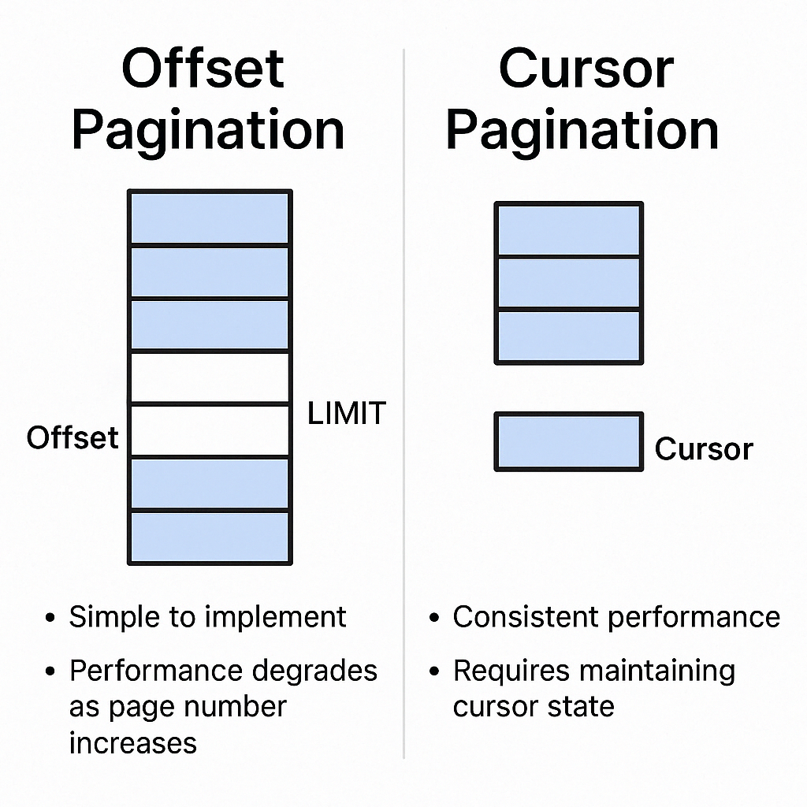

# 深入理解游标分页：PostgreSQL高性能分页的原理与实战

> **分页**是后端开发中处理大规模数据集时绕不开的话题。特别是在社交媒体、活动日志、实时Feed等需要高效数据浏览的场景下，分页的方式将直接影响到接口的性能和用户体验。那么，PostgreSQL中的游标分页（Cursor Pagination）为何如此之快？它与我们常用的偏移量分页（Offset Pagination）到底有何本质区别？本篇将为你深度剖析原理、对比实现，并结合真实SQL执行计划助你掌握高效分页的最佳实践！

---

## 引言：为什么要关注游标分页？

大多数应用在处理数据列表时，默认采用的是**Offset分页**——也就是SQL中的`OFFSET`和`LIMIT`。这种方式简单直接，易于实现，但在数据量变大或者页面翻得很深的时候，性能往往急剧下降。

而**Cursor Pagination（游标分页）**，又称为**Keyset Pagination**，近年来在大型系统、API以及前端无限滚动中越来越受青睐。根据实际测试，在PostgreSQL处理百万级数据分页时，游标分页的速度可达到传统方式的**17倍**以上！

> 下文将结合一张真实的`user_notes`表（100万条记录），以代码、SQL和执行计划为例，手把手带你理解游标分页的强悍性能背后的奥秘。

---

## 一、两种主流分页方式：Offset vs. Cursor

### 1. 偏移量分页（Offset Pagination）

Offset分页通过跳过指定数量的数据，然后取固定条数。例如：

```sql
SELECT * FROM user_notes ORDER BY date DESC, id DESC LIMIT 10 OFFSET 1000;
```

C#实现示例（ASP.NET Core）：

```csharp
var items = await dbContext.UserNotes
    .OrderByDescending(x => x.Date)
    .ThenByDescending(x => x.Id)
    .Skip((page - 1) * pageSize)
    .Take(pageSize)
    .ToListAsync();
```

#### 优点

- 实现简单，支持跳转任意页码
- 易于理解和维护

#### 缺点

- 页面越深，数据库需要扫描并丢弃更多数据，性能急剧下降
- 并发/数据变动时可能漏掉或重复数据
- 每次都需统计总数，增加额外负担



---

### 2. 游标分页（Cursor Pagination）

游标分页基于一个唯一标识字段（或联合唯一字段组），每次翻页时只需记住上次最后一条记录的排序字段值作为“游标”，下次查询直接基于该位置开始。

SQL示例：

```sql
SELECT * FROM user_notes
WHERE (date, id) <= ('2025-02-15', '019500f9-8b41-74cf-ab12-25a48d4d4ab4')
ORDER BY date DESC, id DESC
LIMIT 10;
```

C#实现简例：

```csharp
query = query.Where(x => EF.Functions.LessThanOrEqual(
    ValueTuple.Create(x.Date, x.Id),
    ValueTuple.Create(date, lastId)));
```

#### 优点

- 无论翻到第几页，性能几乎恒定！
- 更适合实时流、无限滚动、社交时间线等场景
- 数据变动时稳定性高，不易丢失或重复

#### 缺点

- 不能直接跳转到任意页，只能“顺序浏览”
- 实现略复杂，需要维护和编码游标



---

## 二、实战对比：百万级数据下的性能测试

### 数据表结构

```sql
CREATE TABLE user_notes (
    id uuid PRIMARY KEY,
    user_id uuid NOT NULL,
    note varchar(500),
    date date NOT NULL
);
-- 假设已插入100万条数据用于测试
```

### 执行计划对比

#### 1. Offset分页执行计划

假设我们请求第90万页后的第1000条数据：

```sql
EXPLAIN ANALYZE SELECT * FROM user_notes
ORDER BY date DESC, id DESC LIMIT 1000 OFFSET 900000;
```

> ⏱️ **耗时：704ms**

#### 2. 游标分页执行计划

假设已知上一页最后一条记录的date和id：

```sql
EXPLAIN ANALYZE SELECT * FROM user_notes
WHERE (date, id) <= ('2025-02-15', '019500f9-8b41-74cf-ab12-25a48d4d4ab4')
ORDER BY date DESC, id DESC LIMIT 1000;
```

> ⏱️ **耗时：0.66ms（配合复合索引后）**

**性能提升17倍！**  
原因在于游标分页能够利用索引定位到目标位置，而Offset分页需要扫描并丢弃所有“跳过”的行。

---

### 提升游标分页性能的小技巧

- **复合索引**要与排序字段和方向严格一致，如：

  ```sql
  CREATE INDEX idx_user_notes_date_id ON user_notes (date DESC, id DESC);
  ```

- 尽量用“元组比较”语法 `(date, id) <= (?, ?)` 而不是简单的多条件`OR`，这样索引才能被高效利用。

---

## 三、工程实现与游标编码

为了安全地在URL中传递游标信息，一般采用Base64编码。例如：

```csharp
public sealed record Cursor(DateOnly Date, Guid LastId)
{
    public static string Encode(DateOnly date, Guid lastId)
    {
        var cursor = new Cursor(date, lastId);
        string json = JsonSerializer.Serialize(cursor);
        return Base64UrlTextEncoder.Encode(Encoding.UTF8.GetBytes(json));
    }
    public static Cursor? Decode(string? cursorStr)
    {
        if (string.IsNullOrWhiteSpace(cursorStr)) return null;
        try
        {
            string json = Encoding.UTF8.GetString(Base64UrlTextEncoder.Decode(cursorStr));
            return JsonSerializer.Deserialize<Cursor>(json);
        }
        catch { return null; }
    }
}
```

返回给客户端只需下发一个字符串即可，不暴露内部结构，安全又简洁！

---

## 四、总结与最佳实践

**Offset分页**简单直观，适合小数据量或需要跳转页面的管理后台；但面对大数据量或深度翻页场景，性能瓶颈明显。

**Cursor/Keyset分页**则以稳定高效著称，是现代高并发、高性能API的首选。配合复合索引和元组比较语法，可以将百万级数据集的翻页操作毫秒级完成！

> **选择建议：**
>
> - 若为API、实时Feed、无限滚动等，对“深翻页”性能敏感场景，请优先选择游标分页。
> - 若为管理后台、小型列表或必须显示总页数，可继续使用Offset。



---

## 结尾互动 🌟

你在实际项目中遇到过哪些分页性能瓶颈？是否有过用游标分页带来质变体验的案例？欢迎在评论区留言讨论，或者分享给身边有相关需求的同事朋友！

如果觉得本文有帮助，别忘了点赞收藏👍，下次我们继续聊聊数据库索引优化和高并发场景下的更多实战技巧！👋
