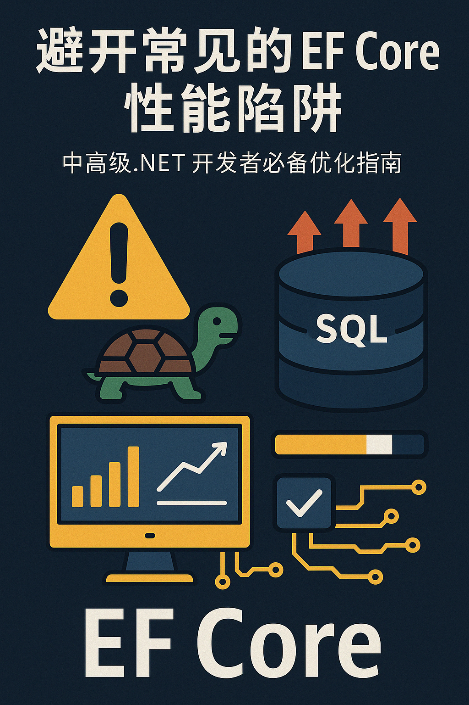

# 避开常见的EF Core性能陷阱：中高级.NET开发者必备优化指南

## 引言：EF Core很香，但你真的用对了吗？🔥

对于众多.NET开发者来说，Entity Framework Core（简称EF Core）无疑是数据库操作的利器。它用ORM的方式屏蔽了繁琐的SQL，让我们可以聚焦于业务逻辑。然而，抽象层的便利背后，也暗藏着性能陷阱。你是否遇到过应用莫名变慢、内存飙升、数据库压力激增等问题？本篇文章将结合典型案例和图示，带你避开EF Core开发中的常见性能“坑”，助力你的项目如虎添翼！



## 正文

### 1. 警惕N+1查询问题：别让懒加载拖慢你的系统 🐢

**场景再现：**

```csharp
var authors = context.Authors.ToList();
foreach (var author in authors)
{
    var books = author.Books; // 每次循环都会单独查一次Books表
}
```

如果有100位作者，这段代码会执行1+100次SQL查询！这就是著名的N+1问题。

**优化方案：**

使用`Include`方法一次性加载所有关联数据：

```csharp
var authors = context.Authors.Include(a => a.Books).ToList();
```

### 2. 用投影减少无用数据：只拿你需要的字段 📉

多数场景下，我们只需要部分字段。例如只展示作者名时，没必要把整个实体全部加载进来。

**推荐写法：**

```csharp
var authorNames = context.Authors.Select(a => a.Name).ToList();
```

这样可显著减少数据传输量，提高查询速度。

### 3. 优先选择异步API：提升系统可扩展性 🚀

同步方法（如`SaveChanges`）会阻塞线程，在高并发下尤其明显。建议全面使用异步API：

```csharp
await context.SaveChangesAsync();
```

### 4. 善用AsNoTracking：只读查询更高效 🏎️

EF Core默认跟踪每个实体的变化，这对只读场景其实是多余负担。加上`AsNoTracking()`可以显著提高只读查询性能：

```csharp
var books = context.Books.AsNoTracking().ToList();
```

### 5. 避免笛卡尔积（Cartesian Explosion）：分拆查询更健康 🧨

当你Include多个集合导航属性时，EF Core会用LEFT JOIN拼出一张超大表，导致所谓“笛卡尔积爆炸”。

**危害示意：**

- 一个部门有10个员工和10个项目，联表后会返回100行！

**解决方法：**

- 使用`AsSplitQuery()`：

```csharp
var departments = context.Departments
    .Include(d => d.Employees)
    .Include(d => d.Projects)
    .AsSplitQuery()
    .ToList();
```

### 6. 控制单次数据量：合理分页或限制数量 🔢

大批量数据全部加载到内存既慢又危险。务必使用`Take`或分页操作：

```csharp
var top10 = context.Books.Take(10).ToList();
var page3 = context.Books.Skip(20).Take(10).ToList();
```

对于高效翻页，还可以研究“Keyset Pagination”等高级技巧。

### 7. 批量更新/删除用Bulk API：效率倍增 ⚡

EF Core 7+提供了批量操作API，如：

```csharp
await context.Books.Where(b => b.IsObsolete).ExecuteDeleteAsync();
```

注意：此类操作默认**不带事务**，如有多步批量操作请手动开启事务。

### 8. 善用原生SQL与流式处理：极致性能调优 🏆

对于复杂/极大数据量场景，可考虑：

- **原生SQL**（Raw SQL）直接发SQL命令；
- **流式处理**（Streaming），避免一次性加载全部数据，比如用`IAsyncEnumerable<T>`逐条处理。

```csharp
await foreach (var book in context.Books.AsAsyncEnumerable())
{
    // 实时处理每一条记录
}
```

## 结论：EF Core不是万能钥匙，底层功夫还需扎实 🛠️

上述技巧都是围绕EF Core客户端层面的优化。如果数据库表结构或索引设计本身有缺陷，再精妙的ORM写法也难以力挽狂澜。建议持续学习关系型数据库设计原则，合理建立索引、分表分库等策略。

---

> **你的EF Core开发中遇到过哪些性能瓶颈？或者有哪些独门优化招数？欢迎在评论区留言交流！别忘了点赞、转发给有需要的小伙伴哦～**
