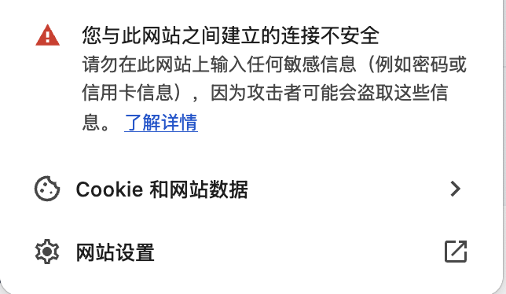
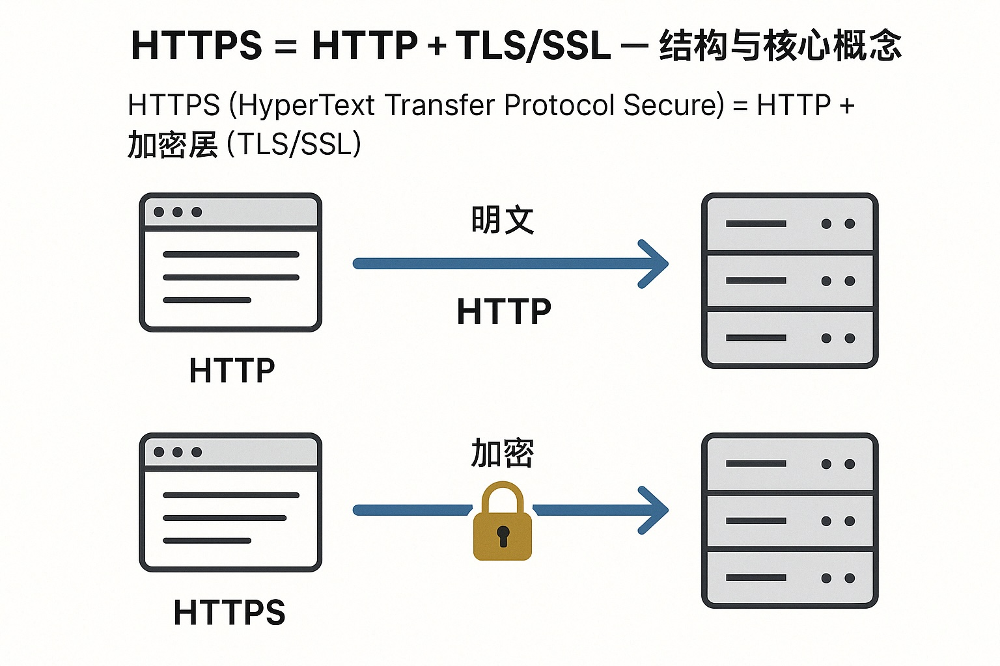
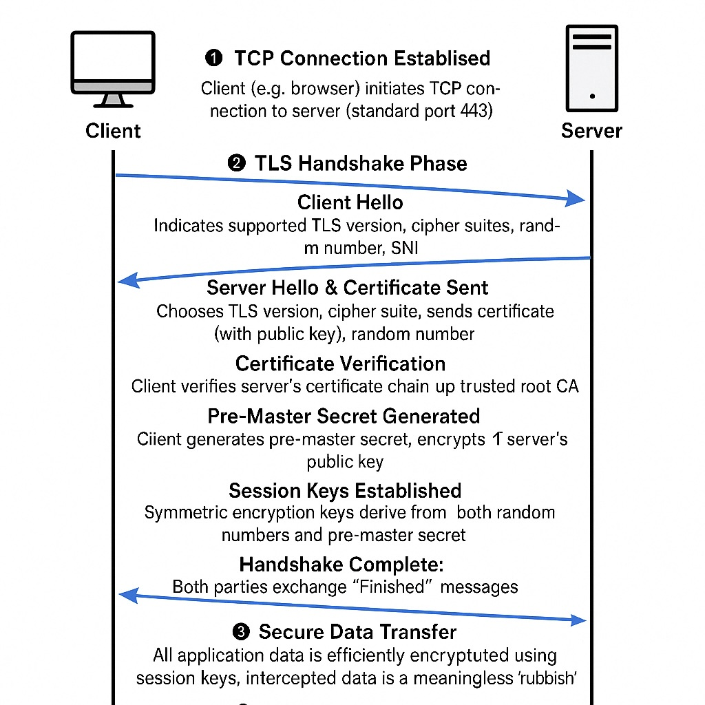

# 从HTTP到HTTPS：一文彻底搞懂TLS、SSL与加密通信原理

> 在数字化浪潮席卷的今天，安全早已不再是选项，而是每一位互联网技术从业者的必修课。HTTP、HTTPS、SSL、TLS，这些缩写你是否真正理解其背后的工作原理？本篇将用通俗且专业的方式，带你梳理清楚现代加密通信协议的核心逻辑，并通过可视化流程图助你秒懂“锁头背后”的秘密。🔐

---

## 为什么HTTP已“不安全”？——引言

还记得那个熟悉的浏览器警告吗？  

> “您的连接不是私密连接。”  
> 一旦网站没有部署HTTPS，用户的所有信息都以明文在网络中裸奔。你的登录密码、银行卡号，甚至是私密对话，统统都可能被“蹲点”的黑客捕捉到。这背后的根源，就是HTTP缺乏加密能力。

那么，HTTPS和它背后的“护法”TLS，到底是如何让数据在互联网上安全传递的？让我们逐层剖析。

---

## HTTPS = HTTP + TLS/SSL —— 结构与核心概念

### 1. HTTPS本质是什么？

**HTTPS（HyperText Transfer Protocol Secure）= HTTP + 加密层（TLS/SSL）**

- **HTTP**：负责数据的传输，但内容明文可见。
- **TLS/SSL**：为HTTP通信“加密上锁”，让数据变成只有合法收发方才能解开的“谜题”。

_图1：HTTP与HTTPS数据流对比。_

浏览器地址栏里的🔒，就是TLS/SSL守护下的数据安全标志。

### 2. TLS和SSL是什么关系？

- **SSL（Secure Sockets Layer）**：最早的加密协议，已被发现有严重漏洞。
- **TLS（Transport Layer Security）**：SSL的继任者，目前主流版本为**TLS 1.2**和更先进的**TLS 1.3**，安全性和性能均大幅提升。

如今，“SSL证书”其实都是实现TLS协议，只是命名延续。

---

## 深入TLS：HTTPS背后的加密魔法

### 1. 握手流程全解析

TLS安全通信的基础，在于建立时那场“握手舞”。下面我们拆解标准TLS握手流程：

_图2：典型的TLS握手流程示意图。_

1️⃣ **TCP连接建立**  
客户端（如浏览器）向服务器发起TCP连接（标准端口443）。

2️⃣ **TLS握手阶段**

- **Client Hello**：浏览器发送支持的TLS版本、加密套件及随机数，同时带上SNI（Server Name Indication），告诉服务器自己要访问哪个域名（实现多站点共用IP）。
- **Server Hello & 证书下发**：服务器选择合适的TLS版本和加密套件，回传自己的证书（含公钥）和随机数。
- **证书验证**：浏览器验证服务器证书链直至受信任的根CA，确保没有被伪造。
- **生成预主密钥**：浏览器生成预主密钥，用服务器公钥加密后发送给服务器。
- **双方协商会话密钥**：利用双方的随机数和预主密钥，客户端与服务器分别算出相同的对称加密会话密钥。
- **握手完成**：双方互发“Finished”消息，进入加密数据传输阶段。

3️⃣ **安全数据传输**  
全部业务数据均用协商好的会话密钥进行高效对称加密，即便中途被拦截也只是一堆“乱码”。

4️⃣ **会话复用**  
TLS支持Session Resumption，让同一个客户端再次访问时跳过繁琐握手，大幅提升性能。

#### ☝️ 小科普：为什么要先用非对称，再切换到对称？

非对称加密（如RSA）虽然安全，但运算慢；对称加密速度快但密钥分发麻烦。TLS采用“两步走”策略——先用非对称安全交换密钥，再用对称方案高效加密数据。

---

### 2. 算法演进与安全提升

#### RSA与Diffie-Hellman

- **RSA**  
  最早广泛用于TLS握手阶段，实现会话密钥安全分发。客户端生成会话密钥，用服务器公钥加密后发送，只有服务器能解开。

- **Diffie-Hellman (DH/ECDH)**  
  自**TLS 1.3**起，RSA不再用于密钥交换，全部改用更安全、支持前向保密（PFS）的DH/ECDH算法。即便私钥泄露，历史数据依旧无法被解开。

| TLS版本 | 密钥交换算法 | 安全性 |
| ------- | ------------ | ------ |
| TLS 1.2 | RSA/DH/ECDH  | 较高   |
| TLS 1.3 | 仅DH/ECDH    | 更高   |

---

## 网络从业者必须掌握的实战建议

- 优先升级为**TLS 1.3**，享受更快更安全的加密体验；
- 启用强加密套件（AES-GCM, ChaCha20等），禁用弱算法和不安全协议（如SSLv3, TLS 1.0）；
- 配置HSTS、OCSP Stapling等提升HTTPS整体防护力；
- 定期更新并审查证书链，保障信任链有效与完整。

---

## 总结与思考：你的业务真的安全吗？

从明文HTTP到全程加密的HTTPS，每一次协议升级背后都是安全需求的进化。TLS作为现代网络加密通信的基石，不断自我完善以应对日益复杂的攻击环境。

🔍 **你所在的业务系统是否已经全面启用HTTPS？你的加密配置是否符合行业最佳实践？欢迎在评论区分享你的经验和见解！**

---

> 喜欢这类技术深度解析？记得关注、点赞并转发给身边需要的小伙伴，让我们一起守护数字世界的安全边界！🛡️
