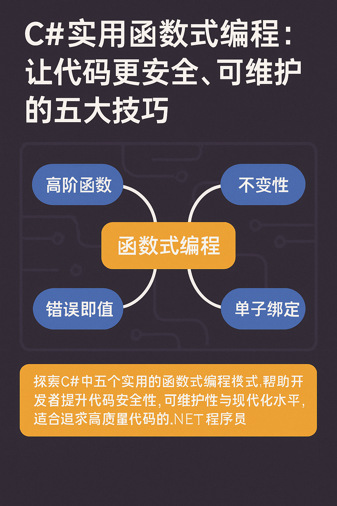

# C#实用函数式编程：让代码更安全、可维护的五大技巧 🚀

> 你是否希望自己的C#代码更健壮、更易维护？想尝试函数式编程，但又担心概念太学术、不接地气？本文将带你走进C#函数式编程最实用的一面，助你写出更安全、现代的代码！

---



## 引言：为何在C#项目中引入函数式编程？

C#自.NET Core以来，逐渐吸收了大量现代编程理念。LINQ、record类型、lambda表达式……你是不是已经在用这些“语法糖”，却还没真正领略它们背后的力量？

函数式编程（FP）听起来高大上，甚至有点吓人，但其实核心思想非常贴地气——**让代码更安全、更可维护、更易测试。**

本文将通过五个实际可落地的技巧，帮你一步步升级你的C#开发方式，让每一行代码都更值得信赖。

---

## 1️⃣ 高阶函数：让验证逻辑灵活又优雅

高阶函数就是“函数可以接收函数作为参数，或返回一个函数”。这听起来可能有点抽象，但其实你每天都在用，比如LINQ里的`Where`和`Select`。

### 场景对比

传统写法（硬编码验证）：

```csharp
public bool ValidateOrder(Order order)
{
    if (order.Items.Count == 0) return false;
    if (order.TotalAmount <= 0) return false;
    if (order.ShippingAddress == null) return false;
    return true;
}
```

如果不同国家、不同业务场景需要不同规则，怎么办？难以扩展、复用和测试。

### 函数式重构

```csharp
public static Func<Order, bool> CreateValidator(string countryCode, decimal minOrder)
{
    var baseChecks = Combine(
        o => o.Items.Count > 0,
        o => o.TotalAmount >= minOrder,
        o => o.ShippingAddress != null
    );

    return countryCode switch
    {
        "US" => Combine(baseChecks, o => IsValidUSAddress(o.ShippingAddress)),
        "EU" => Combine(baseChecks, o => IsValidVATNumber(o.VatNumber)),
        _    => baseChecks
    };
}

private static Func<Order, bool> Combine(params Func<Order, bool>[] checks)
    => order => checks.All(f => f(order));
```

> **好处**：每条验证规则都可独立复用、组合和单元测试，扩展新规则只需加一个小函数。

---

## 2️⃣ 错误即值：告别神秘异常，错误显式化

异常处理是C#开发的老大难。try-catch写一堆，不仅丑陋而且常常遗漏。更糟的是方法签名“撒谎”——看起来只返回User，实际可能随时throw。

### 函数式改造

使用[OneOf](https://github.com/mcintyre321/OneOf)库，把错误作为值返回：

```csharp
public OneOf<User, ValidationError, DuplicateEmailError> CreateUser(string email, string password)
{
    if (string.IsNullOrEmpty(email))
        return new ValidationError("Email is required");
    // ...
    if (_userRepository.EmailExists(email))
        return new DuplicateEmailError(email);
    return new User(email, password);
}
```

调用方必须显式处理各种结果：

```csharp
result.Switch(
    user           => SendWelcomeEmail(user),
    validationErr  => ShowError(validationErr),
    duplicateErr   => ShowError(duplicateErr)
);
```

> **好处**：所有可能结果一目了然，避免漏掉错误分支；性能优于异常；代码流更清晰。

---

## 3️⃣ 单子绑定：LINQ的链式魔法

很多人觉得“monad”（单子）是玄学，其实你每天都在用，比如LINQ的`Select`和`SelectMany`。

```csharp
var files = folders.SelectMany(folder => Directory.GetFiles(folder));
```

这种链式调用，把容器（比如IEnumerable）里的数据流畅地传递下去，无需自己处理嵌套结构或null判断。

> **实用场景**：比如实现Result类型的错误链式处理，可以优雅地把错误沿途传递，不会丢失上下文。

---

## 4️⃣ 纯函数：让每个方法都可预测、可测试

纯函数只依赖输入参数，不依赖任何外部状态，也不改变外部世界（比如数据库、全局变量）。这让你的方法**可测试、可并发、无副作用**。

**不纯的例子**：

```csharp
public decimal CalculatePrice(Order order) // 内部依赖私有字段
{
    // ...
}
```

**纯函数写法**：

```csharp
public static decimal CalculatePrice(Order order, decimal taxRate, IReadOnlyList<Discount> discounts)
{
    // 所有影响结果的信息都通过参数传递进来
}
```

> **好处**：单元测试变得容易，调用无隐患；多线程环境下天然安全。

---

## 5️⃣ 不变性：消灭并发Bug，从根源上杜绝状态污染

可变对象是Bug温床。多线程下状态混乱、业务层被意外篡改……痛苦！C#的`record`类型和不可变集合让我们轻松拥抱不变性。

**传统写法（易错）**：

```csharp
public void AddItem(OrderItem item)
{
    Items.Add(item);
    Total += item.Price;
}
```

**不可变设计**：

```csharp
public record Order
{
    public ImmutableList<OrderItem> Items { get; init; }
    public decimal Total => Items.Sum(x => x.Price);

    public Order AddItem(OrderItem item)
        => this with { Items = Items.Add(item) };
}
```

> **优点**：线程安全、状态一致性好，所有变更都显式且可追溯。

---

## 总结与互动 🌈

函数式编程并不是“另起炉灶”，而是对现有C#开发的一次升级。哪怕你只采用其中一两条原则，也能大幅提升代码质量和团队幸福感：

- 将错误显式化，减少线上事故；
- 优化验证、管道流程，让业务逻辑更灵活；
- 拥抱不变性，远离并发陷阱。

👉 **你最想在哪个项目或模块里尝试这些技巧？哪条模式让你印象最深？欢迎在评论区留言讨论！也欢迎分享本文给你的技术团队，一起进步！**

---

> 📚 推荐阅读：[深入C#的函数式编程实践（英文）](https://www.milanjovanovic.tech/blog/functional-programming-in-csharp-the-practical-parts)

如果觉得内容有帮助，别忘了点赞、转发哦！下期见～
