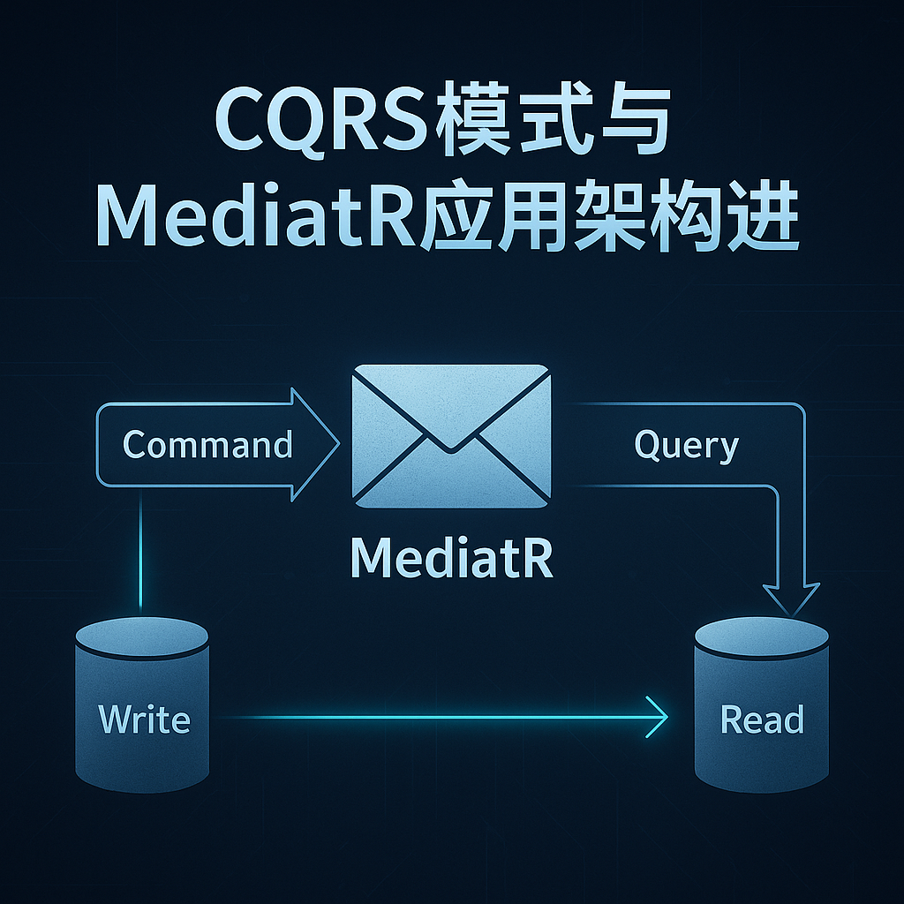

# MediatR商业化，Wolverine崛起——.NET CQRS消息中间件最佳实践对比

## 引言：当MediatR变为付费，.NET开发者该何去何从？

在.NET世界里，**MediatR**一直是实现CQRS（命令查询职责分离）、清晰架构与解耦的重要“神器”。但近期，MediatR宣布部分场景将采用商业许可（[Jimmy Bogard官方说明](https://www.jimmybogard.com/)），这在社区中引发了热烈讨论与关注。

面对新形势，开发者们都在问：**有没有更现代、免费且功能更强大的替代方案？**  
答案就是：**Wolverine**！



> _图1：CQRS模式与MediatR应用架构演进_

本文将带你深入了解Wolverine，结合实际API案例，展示它如何帮助你打造高性能、可扩展的CQRS架构。同时也会理性看待MediatR的商业化变革，以及这对.NET生态的意义。

---

## Wolverine简介：超越MediatR的现代.NET消息中间件

### Wolverine是什么？

Wolverine是一个专为.NET打造的高性能CQRS、消息驱动和后台任务处理框架。相比MediatR，它不仅支持本地消息分发，更内建分布式消息、工作流、Saga编排、持久化Outbox等现代云原生特性。  
核心亮点如下：

- 🚀 **基于Source Generator的极致性能**
- 📨 **原生消息总线**：支持本地与分布式（RabbitMQ、Kafka、Azure Service Bus等）
- ⏰ **内置调度与重试机制**
- 🗃️ **持久化Outbox模式（防止消息丢失）**
- 🔄 **Saga与工作流原生支持**
- 🦾 **无需接口和繁琐模板，极简代码风格**

---

## 实战案例：用Wolverine实现极简User CRUD API

下面通过一步步代码演示，感受Wolverine在CQRS和API解耦中的优势。

### 1. 定义领域模型

```csharp
public record User(Guid Id, string Name, string Email);

public static class InMemoryUsers
{
    public static readonly List<User> Users = new();
}
```

---

### 2. 定义命令（Command）与查询（Query）

```csharp
public record CreateUser(string Name, string Email);
public record GetUser(Guid Id);
public record UpdateUser(Guid Id, string Name, string Email);
public record DeleteUser(Guid Id);
```

每个操作一个消息对象，实现职责分离，天然符合CQRS。

---

### 3. 实现业务处理Handler

#### 创建用户

```csharp
public class CreateUserHandler
{
    public User Handle(CreateUser command)
    {
        var user = new User(Guid.NewGuid(), command.Name, command.Email);
        InMemoryUsers.Users.Add(user);
        return user;
    }
}
```

#### 查询用户

```csharp
public class GetUserHandler
{
    public User? Handle(GetUser query)
    {
        return InMemoryUsers.Users.FirstOrDefault(u => u.Id == query.Id);
    }
}
```

#### 更新用户

```csharp
public class UpdateUserHandler
{
    public User? Handle(UpdateUser command)
    {
        var user = InMemoryUsers.Users.FirstOrDefault(u => u.Id == command.Id);
        if (user is null) return null;

        var updated = user with { Name = command.Name, Email = command.Email };
        InMemoryUsers.Users.Remove(user);
        InMemoryUsers.Users.Add(updated);
        return updated;
    }
}
```

#### 删除用户

```csharp
public class DeleteUserHandler
{
    public bool Handle(DeleteUser command)
    {
        var user = InMemoryUsers.Users.FirstOrDefault(u => u.Id == command.Id);
        if (user is null) return false;

        InMemoryUsers.Users.Remove(user);
        return true;
    }
}
```

> ⚡ 注意：无需实现任何接口（如IRequestHandler），Wolverine自动按方法签名发现并注册。

---

### 4. 集成Minimal API与Wolverine

只需几行代码即可将CQRS消息分发集成到Minimal API：

```csharp
var builder = WebApplication.CreateBuilder(args);

builder.Services.AddAuthorization();
builder.Host.UseWolverine(); // 开启Wolverine

var app = builder.Build();

app.UseHttpsRedirection();
app.UseAuthorization();

// Create
app.MapPost("/users", async (CreateUser request, IMessageBus bus) =>
{
    var user = await bus.InvokeAsync<User>(request);
    return Results.Created($"/users/{user.Id}", user);
});

// Read
app.MapGet("/users/{id:guid}", async (Guid id, IMessageBus bus) =>
{
    var user = await bus.InvokeAsync<User?>(new GetUser(id));
    return user is null ? Results.NotFound() : Results.Ok(user);
});

// Update
app.MapPut("/users/{id:guid}", async (Guid id, UpdateUser command, IMessageBus bus) =>
{
    if (id != command.Id) return Results.BadRequest();

    var updated = await bus.InvokeAsync<User?>(command);
    return updated is null ? Results.NotFound() : Results.Ok(updated);
});

// Delete
app.MapDelete("/users/{id:guid}", async (Guid id, IMessageBus bus) =>
{
    var deleted = await bus.InvokeAsync<bool>(new DeleteUser(id));
    return deleted ? Results.NoContent() : Results.NotFound();
});

app.Run();
```

#### 👉 核心解读

- `bus.InvokeAsync<TResponse>(message)` 实现消息派发和结果回传，无需手动依赖注入Handler。
- 命令/查询对象、Handler及API三层彻底解耦，便于单元测试和维护。
- 不必像MediatR那样实现冗余接口，代码极简明了。

---

## Wolverine优势全景

Wolverine不仅仅是MediatR的“平替”，它是现代.NET微服务架构的基石：

- 🕸️ **分布式消息驱动**：一键切换RabbitMQ、Kafka等队列系统，助力微服务通信。
- ⏱️ **定时调度与重试**：天生适合后台任务、事件驱动场景。
- 💾 **Outbox持久化**：无需手写冗余代码即可保证消息可靠投递。
- 🔁 **Saga工作流**：应对复杂业务编排，提升架构弹性。

---

## 理性看待MediatR商业化：致敬开源精神

MediatR十余年如一日为.NET开发者提供了高质量的开源支持。此次商业化：

- 现有版本继续开源可用。
- 安全补丁依然维护。
- 收费旨在可持续发展和维护品质。

> 💡 “自己造轮子的成本远高于许可证费用。”  
> 支持开源作者，就是支持整个.NET生态。

---

## 总结&互动

现在，面对MediatR商业化，**Wolverine无疑是更现代、更强大、更适合CQRS和微服务的选择**。它让你的架构更清晰，代码更简洁，同时获得了更多企业级功能。

如果你在设计新的API服务、微服务或后台任务系统，不妨大胆尝试Wolverine！

---

### 你怎么看？

- 你会选择迁移到Wolverine吗？为什么？
- 你最看重CQRS中哪项能力？欢迎评论区交流 👇
- 欢迎转发给团队小伙伴，一起探索更优雅的.NET架构！
