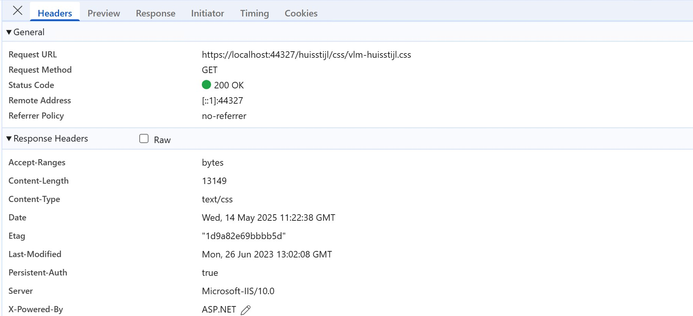
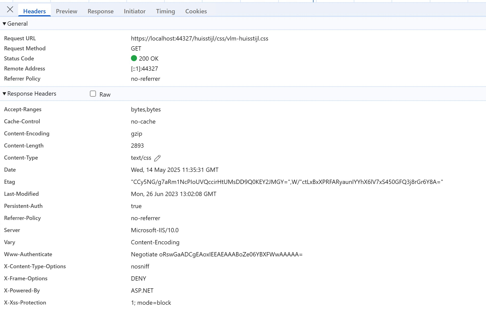

# ASP.NET Core 9.0 静态文件处理新特性全解：MapStaticAssets 与 UseStaticFiles 对比

## 引言：性能优化，从静态资源开始 🚀

在 Web 应用开发中，静态资源（如 JS、CSS、图片等）的高效分发直接影响页面加载速度和用户体验。对于 .NET Core/ASP.NET Core 的开发者来说，静态文件的处理方式每一次升级都会带来性能和易用性的提升。  
随着 .NET 9.0 的发布，[MapStaticAssets](https://learn.microsoft.com/en-us/aspnet/core/fundamentals/map-static-files?view=aspnetcore-9.0) 这一新特性应运而生，为静态文件的管理和分发带来了新思路。今天就带大家深度解读它，与传统 [UseStaticFiles](https://learn.microsoft.com/en-us/dotnet/api/microsoft.aspnetcore.builder.staticfileextensions.usestaticfiles) 中间件进行对比，并通过实测截图直观展示变化。

---

## 静态文件中间件回顾（.NET 9 之前）

在 .NET 9.0 之前，ASP.NET Core 一直通过 `UseStaticFiles` 中间件来处理静态资源。配置方式简单，应用广泛：

```csharp
var builder = WebApplication.CreateBuilder(args);

builder.Services.AddRazorPages();
builder.Services.AddControllersWithViews();

var app = builder.Build();

if (!app.Environment.IsDevelopment())
{
    app.UseExceptionHandler("/Error");
    app.UseHsts();
}

app.UseHttpsRedirection();
app.UseStaticFiles();
```

> `UseStaticFiles` 支持灵活的静态资源目录配置、HTTP 响应头定制、目录浏览、默认文档等高级特性。

不过，这套方案虽然成熟，但在构建和部署层面对“资源压缩”“缓存指纹”等现代 Web 性能优化手段支持有限。

---

## MapStaticAssets：.NET 9.0 静态资源分发新范式

### 为什么要用 MapStaticAssets？

`.NET 9.0` 推出的 `MapStaticAssets` 并非对 UseStaticFiles 的完全替代，而是在性能和现代化部署方向进行深度优化的新选择。具体亮点如下：

- **构建时压缩**
  - 开发阶段自动使用 gzip，发布阶段额外集成 brotli，全量静态资源预先压缩，无需 Web 服务器动态压缩，提高运行时性能，降低服务器负载。
- **内容指纹 ETag**
  - 每个静态资源的 ETag 为内容 SHA-256 Hash 的 Base64 编码，精准标识内容变更，浏览器可高效缓存且自动刷新。
- **无需服务端动态压缩**
  - 动态压缩配置繁琐？使用 MapStaticAssets 后可直接关掉 IIS/Nginx 等的动态压缩设置，简化运维。
- **极致瘦身**
  - 资源体积最小化，减少网络传输，提升首屏速度。

### 使用方式一览

替换配置仅需一步：

```csharp
// .NET 9 新写法
app.MapStaticAssets();
```

> 保留原有 UseStaticFiles，以兼容未被 MapStaticAssets 覆盖的高级用法。

---

## 图文对比：实战效果直观可见

### 传统 UseStaticFiles 响应头


_图1：UseStaticFiles 返回 CSS 文件的响应头_

### MapStaticAssets 响应头


_图2：MapStaticAssets 返回同一文件的响应头（gzip 编码+SHA-256 ETag）_

#### 对比要点 ✨

- `Content-Encoding: gzip` 明确由构建工具完成，无需服务端参与
- `ETag` 值由 SHA-256 指纹标识内容变更
- 响应体积更小，带宽利用更高效

---

## 注意事项 & 场景适配

虽然 MapStaticAssets 带来很多新特性，但仍有部分高级功能（如多目录映射、目录浏览、非 webroot 外部资源等）需依赖 UseStaticFiles。建议：

- **主流场景优先用 MapStaticAssets**
- **特殊需求可组合 UseStaticFiles 补充**
- **充分利用 CDN、浏览器缓存机制，进一步提升全链路性能**

更多文档参考：

- [官方文档：Map static files in ASP.NET Core](https://learn.microsoft.com/en-us/aspnet/core/fundamentals/map-static-files?view=aspnetcore-9.0)
- [What's new in ASP.NET Core 9.0](https://learn.microsoft.com/en-us/aspnet/core/release-notes/aspnetcore-9.0?view=aspnetcore-9.0#static-asset-delivery-optimization)

---

## 总结：拥抱新特性，让性能飞起来！🏆

.NET 9.0 的 `MapStaticAssets` 是静态文件管理的一次现代化升级，为后端开发者在性能优化、简化运维、提升用户体验等方面带来明显收益。在追求高性能 Web 应用的今天，不妨动手升级试试！

---

## 💬 你怎么看？

你已经升级到 .NET 9.0 并用上 MapStaticAssets 了吗？你的项目是否遇到相关兼容问题或有更深入的优化经验？欢迎留言交流你的观点和实战经验！觉得本文有帮助的话也别忘了分享给你的同事和朋友哦～
