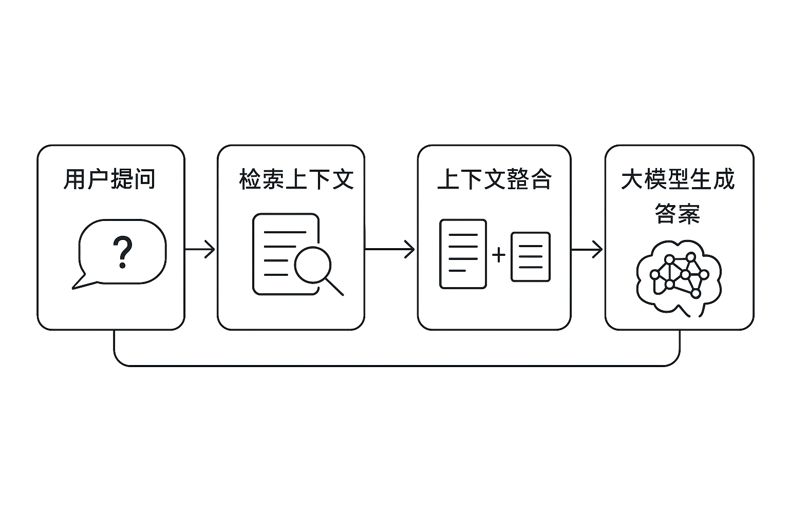

# 构建“可用”RAG系统：你想不到的那些坑与工程细节

## 引言：RAG，真没你想得那么简单！🧐

近两年，“检索增强生成”（Retrieval Augmented Generation, RAG）模型几乎成为智能问答、企业知识库和智能助手等场景的标配。理论上，把检索和生成拼在一起，一切问题都能迎刃而解。但在实际落地过程中，尤其是要达到“生产可用”（production-grade）标准，才发现坑比想象中多得多——每一个细节都可能影响最终用户体验。

本文结合一线工程实践，系统梳理打造RAG系统时需要持续调优和权衡的核心部件，尤其适合AI工程师、后端开发者、数据科学家和产品经理深入参考。⚙️

---

## 一、RAG系统的架构全貌

在深入每个模块前，先看下典型RAG系统的高层架构：

_图1：RAG系统核心流程——从用户提问、检索上下文，到大模型生成答案。_

---

## 二、检索部分：你以为只是向量搜索？No！

### 1. 数据Chunking——碎片的艺术 🎲

如何将原始知识库切分为合理的“块”，直接决定后续检索和生成的效果：

- **块大小**：小块能提升召回粒度，大块减少“文不对题”但增加噪声。怎么选？通常需要A/B实验和任务场景驱动调整。
- **切割方式**：滑动窗口（overlap）、固定窗口（non-overlap）、按结构划分（如按段落/标题）。不同策略对上下文完整性影响巨大。
- **Parent Linking**：检索时是只用命中的块，还是顺带“捞”出其父节点或相邻内容？这会影响答案连贯性。

### 2. 嵌入模型选择——别只盯着主流榜单 🤖

- **嵌入模型**：同样一份文本，不同Embedding模型（如OpenAI Ada、BGE、小样本finetune版等）的表现差异巨大。
- **上下文相关性**：考虑多模态、领域定制embedding，提升检索的相关度和鲁棒性。

### 3. 向量数据库选型——稳定性与可扩展性的平衡

- **数据库类型**：Milvus、Weaviate、Pinecone、FAISS……性能、易用性与成本各有差异。
- **部署位置**：自建 vs 云服务，涉及运维、数据安全和合规。
- **元数据设计**：除了embedding，还要存储来源、更新时间等辅助信息，为后续过滤和排序做准备。
- **索引策略**：支持高并发、高可用性的ANN（近似最近邻）索引方式选择。

### 4. 向量检索算法——多种策略融合最优？

- **相似度度量**：Cosine vs. Euclidean vs. Dot Product，不同度量适用于不同embedding。
- **查询路径**：“先元数据过滤再向量搜索” or “反之”？有时还需混合搜索（Hybrid Search）提升查准率。
- **Hybrid Search**：结合关键词+向量，兼顾精确与语义。

### 5. 检索启发式规则——业务规则必不可少 🎯

- **时间权重**：新闻、公告类数据需按时效加权。
- **重排序/去重**：防止重复上下文，提升信息多样性。
- **源头过滤**：不同数据源区分处理，保障权威性。
- **条件预处理**：如敏感词过滤、结构化拆解等。

---

## 三、生成部分：模型选择 & Prompt工程

### 1. LLM选型——主流大模型逐渐趋同

- **开源还是闭源？** 性能差距越来越小，自主可控、安全合规已成核心考量。
- **部署方式**：API直连易用但成本高，自主托管可定制但需维护硬件/模型生命周期。

### 2. Prompt工程——永远绕不开的“玄学” 🧙‍♂️

即使有了再精准的外部context，也不能忽视Prompt的设计：

- **输出格式控制**：比如要求严格返回JSON、Markdown表格等，需精心提示。
- **防止越狱（jailbreak）**：Prompt中要加入约束与校验逻辑，防止模型输出敏感/非法内容。
- **对齐业务目标**：结合示例、链式思维提示（Chain-of-thought）、角色扮演等技巧，不断微调至最佳效果。

---

## 四、结论 & 工程建议

构建一套真正“好用”的生产级RAG系统，是一次对技术细节和产品需求的极限考验。从数据切分、嵌入生成，到数据库选型、业务规则制定，再到大模型与Prompt工程，每一步都值得反复打磨。

正如本文所示，即使是“简单”的RAG Demo，做到高可用、高可靠、高性能，还有大量隐形坑等待我们填平。希望这份清单能为你的RAG系统之路提供一点借鉴和预警。

---

## 结尾互动 🎤

你在实际开发或使用RAG系统时遇到过哪些难题？是Chunking调不准？Embedding效果不理想？还是Prompt总是失控？欢迎评论区留言交流～也欢迎点赞/分享给身边同样在RAG海洋中奋战的小伙伴！

让我们一起让AI更懂业务、更懂用户！🚀
