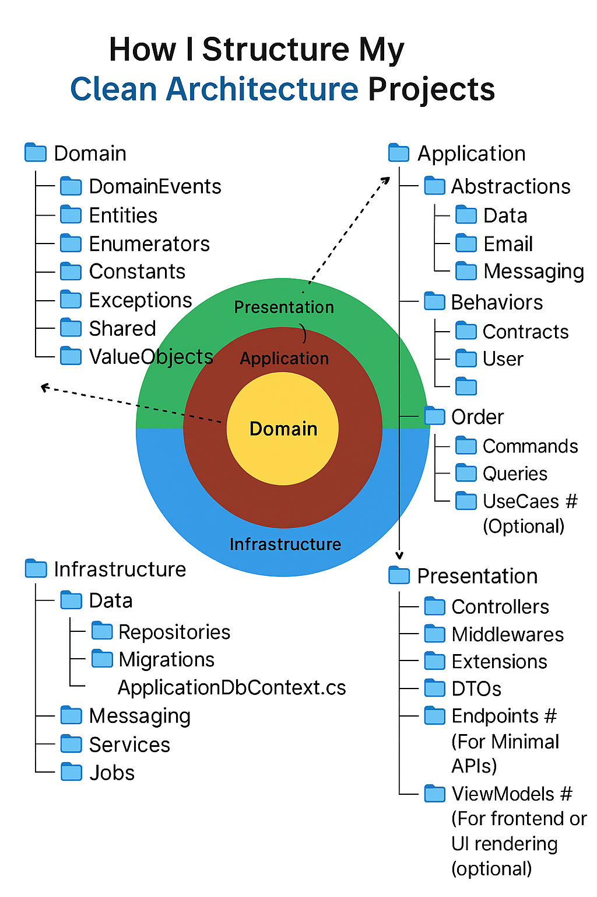

# 🚦Clean Architecture项目结构技术解析

在现代软件开发中，**Clean Architecture（整洁架构）**是一种备受推崇的架构思想。它强调代码的分层、依赖反转和关注点分离，极大提升了系统的可维护性和可扩展性。本文将通过图示，详细剖析一个典型Clean Architecture项目的结构及其技术要点，帮助开发者构建高质量的系统。

## 🏛️ Clean Architecture四层结构总览

Clean Architecture通常分为四个主要层次，从内到外分别为：

1. **Domain（领域层）**：核心业务逻辑与领域模型。
2. **Application（应用层）**：应用用例、服务和流程编排。
3. **Infrastructure（基础设施层）**：与外部资源或第三方服务交互。
4. **Presentation（表现层）**：UI、API、控制器等与用户或外部通信的部分。

层与层之间只有单向依赖：外层依赖内层，内层不依赖外层，保证了内核的独立性。

---

## 🧩 各层详细结构与技术细节

### 1️⃣ Domain（领域层）

#### 作用与原理

领域层位于架构最内圈，是整个系统的核心，负责描述业务规则和领域对象。此层完全不依赖于任何其他层，是代码中最稳定的部分。

#### 关键技术细节

- **DomainEvents**：领域事件，描述业务中发生的重要事件（如“订单已创建”）。
- **Entities**：实体，对应现实世界的业务对象，具备唯一标识和生命周期。
- **Enumerators**：枚举类型，定义业务相关的常量集合（如订单状态）。
- **Constants**：常量定义，便于统一管理不可变参数。
- **Exceptions**：自定义异常，用于捕捉领域中的特定错误。
- **Repositories**：仓储接口，抽象出数据访问行为，仅描述操作，不实现具体逻辑。
- **Shared**：共享代码，通常为通用工具或基类。
- **ValueObjects**：值对象，无唯一标识，仅以值区分，如货币金额、地址等。

---

### 2️⃣ Application（应用层）

#### 作用与原理

应用层作为中介，协调领域对象以完成具体用例，定义业务流程但不涉及实现细节。此层通过接口与基础设施交互。

#### 关键技术细节

- **Abstractions（抽象接口）**：
  - **Data**、**Email**、**Messaging**等子目录，定义数据访问、邮件、消息等服务的抽象接口。
- **Behaviors**：行为相关的通用逻辑（如管道、拦截器）。
- **Contracts**：契约/接口定义，与外部或前端交互的数据结构。
- **User/Order（命令与查询）**：
  - **Commands**：命令，用于描述对系统状态的更改（如创建用户）。
  - **Queries**：查询，只负责读取数据，不改变系统状态。
- **UseCases（用例）**：可选，将复杂流程进一步封装，提高复用性和测试性。

---

### 3️⃣ Infrastructure（基础设施层）

#### 作用与原理

基础设施层实现应用和领域层定义的接口，负责与数据库、消息队列、第三方API等外部系统打交道。此层可以随时被替换，不影响核心业务逻辑。

#### 关键技术细节

- **Data**：
  - **Repositories**：具体仓储实现，负责数据库CRUD。
  - **Migrations**：数据库迁移脚本或工具。
  - **DataContext/ApplicationDbContext.cs**：数据上下文，一般对应ORM框架的数据访问入口（如Entity Framework的DbContext）。
- **Messaging**：消息中间件适配，实现消息队列收发。
- **Services/Jobs**：各类后端服务和定时任务实现。

---

### 4️⃣ Presentation（表现层）

#### 作用与原理

表现层负责所有对外交互，无论是API接口还是用户界面。它接收请求、调用应用服务、处理响应，是用户与系统沟通的窗口。

#### 关键技术细节

- **Controllers**：控制器，处理HTTP请求路由至对应应用服务。
- **Middlewares**：中间件，用于请求预处理，如认证、日志记录等。
- **Extensions**：扩展方法，增强项目功能和可维护性。
- **DTOs（数据传输对象）**：用于跨层传递数据，避免暴露领域模型细节。
- **Endpoints**：适用于Minimal API场景，直接定义API端点函数。
- **ViewModels**：用于UI渲染的数据模型（前端/后端分离场景可选）。

---

## 🔄 层间依赖与解耦机制

各层通过“依赖反转”原则解耦：

- 内层只暴露接口和抽象类，外层通过实现这些接口来满足内核需求；
- 具体实现可灵活替换而不影响内核代码；
- 数据流自外向内流动，但依赖关系自内向外声明，实现高度可维护和可扩展。

---

## 📝 总结与实践建议

Clean Architecture通过明确分工与分层，使项目结构清晰、职责单一。建议开发者：

1. 按照上述目录严格划分代码职责；
2. 所有核心业务只写在Domain和Application中，禁止直接依赖外部系统；
3. 基础设施代码仅作“适配器”，方便后续替换或扩展；
4. 表现层仅聚焦于交互与展示，不混杂业务逻辑。

合理利用Clean Architecture，可以让你的系统具备极强的生命力，应对复杂业务和快速变化需求！
