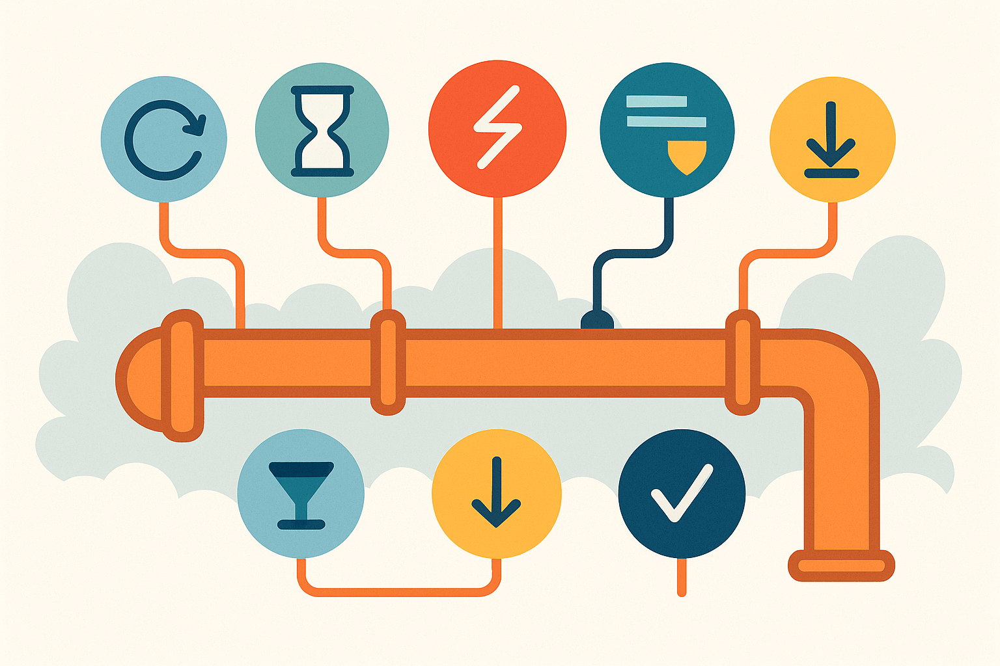

# .NET 9 原生 API 韧性策略全解析：现代微服务的高可用秘籍

> 面向：.NET开发者、微服务架构师、云原生/高可用系统从业者  
> 难度：中高级  
> 适用场景：现代分布式系统、API服务、业务稳定性保障

---

## 引言：云原生世界的“防摔衣”

在微服务和分布式系统盛行的今天，API 就像城市交通的红绿灯——一旦失灵，整个系统就乱了套！网络波动、外部依赖不可用、瞬时故障……这些都是我们日常开发里难以避免的“坑”。

👀 想象一下，如果你的接口遇到一点风吹草动就崩溃，那用户和业务损失可不是闹着玩的！所以，**“韧性”**（Resilience）就成了现代架构师们的必修课。

好消息来了！从 .NET 8 开始，微软把“韧性策略”直接做进了框架本身，推出了强大的 [Microsoft.Extensions.Resilience](https://learn.microsoft.com/en-us/dotnet/core/resilience/?tabs=dotnet-cli) 组件，.NET 9 更是原生集成。比起社区方案 Polly，官方加持、极致简洁、无缝集成，让我们构建高可用 API 变得简单又优雅。

---

## 正文

### 1. 什么是 Microsoft.Extensions.Resilience？有啥用？

这个库专为应对分布式场景下的**瞬态故障**设计，核心就是把常见的韧性策略——比如重试（Retry）、超时（Timeout）、断路器（Circuit Breaker）、限流（Rate Limiter）、备援（Hedging）、降级（Fallback）——通过**管道（Pipeline）模式**组合起来，一次配置、多处复用！


_（图源：[Microsoft Docs](https://learn.microsoft.com/en-us/dotnet/core/resilience/?tabs=dotnet-cli)）_

#### 优势一览：

- **官方支持**：微软亲儿子，升级无忧，长期维护。
- **深度集成**：与 HttpClientFactory、DI、日志、OpenTelemetry 等生态无缝协作。
- **策略组合**：支持任意顺序叠加，按需定制你的“韧性武器库”。
- **极简易用**：配置直观，代码量大减。

---

### 2. 快速上手：项目配置

先加包（.NET 8/9通用）：

```bash
dotnet add package Microsoft.Extensions.Http.Resilience
dotnet add package Microsoft.Extensions.Resilience
```

---

### 3. 核心韧性策略全景实战

#### 3.1 重试（Retry）：不抛弃、不放弃！

当你调用外部接口遇到短暂故障，比如偶发的 500 或网络抖动，自动“再来一次”就能解决大部分问题。

```csharp
builder.Services.AddResiliencePipeline("retry-pipeline", builder => {
    builder.AddRetry(new RetryStrategyOptions {
        MaxRetryAttempts = 3,
        Delay = TimeSpan.FromMilliseconds(300),
        BackoffType = DelayBackoffType.Exponential,
        ShouldHandle = new PredicateBuilder().Handle<HttpRequestException>()
    });
});
```

> 👉 三次指数退避重试：300ms → 600ms → 1200ms

---

#### 3.2 超时（Timeout）：慢吞吞？直接掐掉！

别让线程等到天荒地老。超时策略帮你快速释放资源，避免接口卡死。

```csharp
builder.Services.AddResiliencePipeline("timeout-pipeline", builder => {
    builder.AddTimeout(TimeSpan.FromSeconds(2));
});
```

> 👉 调用超2秒自动中断，触发下一步策略（如重试）

---

#### 3.3 断路器（Circuit Breaker）：坏服务“拉闸限电”

连续失败？临时“拉闸”，防止雪崩扩大，也给依赖服务自我修复的时间。

```csharp
builder.Services.AddResiliencePipeline("cb-pipeline", builder => {
    builder.AddCircuitBreaker(new CircuitBreakerStrategyOptions {
        FailureRatio = 0.5,              // 错误率50%即触发
        MinimumThroughput = 10,          // 至少10次请求统计
        SamplingDuration = TimeSpan.FromSeconds(30),
        BreakDuration = TimeSpan.FromSeconds(15)
    });
});
```


---

#### 3.4 限流（Rate Limiter）：保护自己也保护别人

服务被刷爆？限流能有效平滑请求压力，防止自身和下游依赖被拖垮。

```csharp
builder.Services.AddResiliencePipeline("ratelimiter-pipeline", builder => {
    builder.AddRateLimiter(new SlidingWindowRateLimiter(
        new SlidingWindowRateLimiterOptions {
            PermitLimit = 100,
            SegmentsPerWindow = 4,
            Window = TimeSpan.FromMinutes(1)
        }
    ));
});
```

> 👉 每分钟最多100次请求，均匀分配

---

#### 3.5 备援（Hedging）：Plan B永远在路上

主请求慢/失败？立刻触发备份请求，多路并发抢救数据成功率！

```csharp
builder.Services.AddResiliencePipeline<string, string>("hedging-pipeline", builder => {
    builder.AddHedging(new HedgingStrategyOptions<string> {
        MaxHedgedAttempts = 3,
        DelayGenerator = args => new ValueTask<TimeSpan>(
            args.AttemptNumber <= 1 ? TimeSpan.Zero : TimeSpan.FromSeconds(-1)
        )
    });
});
```

---

#### 3.6 降级（Fallback）：优雅兜底不掉链子

哪怕所有策略都失败了，也能返回兜底数据或友好提示，不让用户空手而归。

```csharp
builder.Services.AddResiliencePipeline<string, string?>("fallback-pipeline", builder => {
    builder.AddFallback(new FallbackStrategyOptions<string?> {
        FallbackAction = _ => Outcome.FromResultAsValueTask<string?>(string.Empty)
    });
});
```

---

### 4. DI + 自动应用韧性管道：全局高可用so easy！

你不需要每次都手动拼装这些策略！只需注册好“命名管道”，用 DI 自动注入 `ResiliencePipelineProvider` 即可动态选择和复用：

```csharp
app.MapGet("/subscribers", async (
    HttpClient httpClient,
    ResiliencePipelineProvider<string> pipelineProvider,
    CancellationToken cancellationToken) =>
{
    var pipeline = pipelineProvider.GetPipeline<Subscriber?>("fallback-pipeline");
    return await pipeline.ExecuteAsync(
        async token => await httpClient.GetFromJsonAsync<Subscriber>("api/subscribers", token),
        cancellationToken);
});
```

---

## 结论：官方韧性组件，让高可用不再烧脑！

.NET 的 Resilience 新体系真正实现了**“策略即管道”**，“配置一次，全局受益”，极大降低了系统容错与高可用的门槛。

🎯 **建议**：

- _所有外部依赖调用，建议最少叠加 “重试+超时+断路器”_
- 按需组合限流、备援、降级，让每条链路都更稳健
- 善用 DI 与命名管道，让代码既优雅又易维护

🚀 **未来方向**：

- 配合 OpenTelemetry 打通全链路观测
- 集成到 CI/CD，实现自动化健康检测与回滚

---

## 🔥 互动讨论区

你在实际项目中遇到过哪些 API 不稳定导致的“踩坑”经历？或者你有自己的韧性设计经验想和大家分享？欢迎留言讨论👇  
如果觉得这篇文章对你有帮助，也欢迎点赞、收藏并转发给更多.NET同仁！

---

📚 **延伸阅读与资源**

- [Microsoft 官方 Resilience 文档](https://learn.microsoft.com/en-us/dotnet/core/extensions/resilience)
